Massachusetts Crimes Master List
================

[Citizens for Juvenile Justice](https://www.cfjj.org) (CFJJ) have
partnered [Code for Boston](https://www.codeforboston.org) (CfB) to
develop a tool to streamline the expungement process for folks who have
a criminal record before the age of 21 in Massachusetts.

This project is exploratory data analysis on the We have a file of all
crimes from the State of Massachuestts that we need to do an initial
analysis on for the Clean Slate project sponsored by [Citizens for
Juvenile Justice](https://www.cfjj.org). We will be running summary
statistics on it to see the break out of the categories versus FBI
categories. Are there ways to neatly, easily, remove entire categories
of crimes from further analysis?

packages for analysis

``` r
library(tidyverse)
library(janitor)
library(DataExplorer)
library(funModeling)
library(Hmisc)
library(psych)
library(stringr)
```

# Data Source

The data for this project was provided by MA Youth Services and coded at

So thus far, we’ve read in the data, converted the headers to snake
case, and replaced the `#N/A`s with proper `NA`. I may return to this
decision and find another way to replace those values.

But we’re probably going to need to change more things. Perhaps
consider:

  - replace “\#N/A” with `NA`  
  - adust binary fields to either `TRUE`/`FALSE` or logit `1`/`0`.
      - `expungible` \<= *as an aside, the variations in syntax are
        forcing different values. D:*
      - `police_notification`
      - `sorb`
      - `sdp`
      - `now_legal`  
  - should all these variables remain as factors? idk, seems like not a
    good idea.

With that said, I have some concerns / wishlists.

  - proper, tidy data:
      - section and chapter columns  
      - uniform descriptions  
      - confirming the categories that were used. Heard they weren’t the
        correct ones?
  - double check indent

preview

``` r
summary(ma_crimes)
```

    ##  untruncated_offense fbi_category       most_ser_rank     
    ##  Length:1037         Length:1037        Length:1037       
    ##  Class :character    Class :character   Class :character  
    ##  Mode  :character    Mode  :character   Mode  :character  
    ##  offense_type           grid           penalty_type      
    ##  Length:1037        Length:1037        Length:1037       
    ##  Class :character   Class :character   Class :character  
    ##  Mode  :character   Mode  :character   Mode  :character  
    ##  mandatory_gun      police_notification     sorb          
    ##  Length:1037        Length:1037         Length:1037       
    ##  Class :character   Class :character    Class :character  
    ##  Mode  :character   Mode  :character    Mode  :character  
    ##      sdp            now_legal      expungeable        if_no_why_not     
    ##  Length:1037        Mode:logical   Length:1037        Length:1037       
    ##  Class :character   NA's:1037      Class :character   Class :character  
    ##  Mode  :character                  Mode  :character   Mode  :character

``` r
glimpse(ma_crimes) 
```

    ## Observations: 1,037
    ## Variables: 13
    ## $ untruncated_offense <chr> "A&b", "A&B  Ch. 265 S 13A(a)", "A&b on a co…
    ## $ fbi_category        <chr> "Other Assaults", "Other Assaults", "Other A…
    ## $ most_ser_rank       <chr> "24", "24", "18", "18", "18", "18", "12", "7…
    ## $ offense_type        <chr> "Person", "Person", "Person", "Person", "Per…
    ## $ grid                <chr> "2", "2", "3", "3", "3", "3", "4", "5", "3",…
    ## $ penalty_type        <chr> "Misdemeanor", "Misdemeanor", "Felony", "Mis…
    ## $ mandatory_gun       <chr> "", "", "", "", "", "", "", "", "", "", "", …
    ## $ police_notification <chr> "", "", "", "", "", "", "", "", "", "", "", …
    ## $ sorb                <chr> "", "", "", "", "", "", "", "", "", "", "", …
    ## $ sdp                 <chr> "", "", "", "", "", "", "", "", "", "", "", …
    ## $ now_legal           <lgl> NA, NA, NA, NA, NA, NA, NA, NA, NA, NA, NA, …
    ## $ expungeable         <chr> "Yes", "Yes", "No", "Yes", "No", "No", "No",…
    ## $ if_no_why_not       <chr> "", "", "Ch 265 Felony", "", "Ch 265 Felony"…

# understand data properties

### basic structure and metrics

``` r
class(ma_crimes)
```

    ## [1] "data.frame"

``` r
names(ma_crimes)
```

    ##  [1] "untruncated_offense" "fbi_category"        "most_ser_rank"      
    ##  [4] "offense_type"        "grid"                "penalty_type"       
    ##  [7] "mandatory_gun"       "police_notification" "sorb"               
    ## [10] "sdp"                 "now_legal"           "expungeable"        
    ## [13] "if_no_why_not"

``` r
# plot_str(ma_crimes)
introduce(ma_crimes)
```

    ##   rows columns discrete_columns continuous_columns all_missing_columns
    ## 1 1037      13               12                  0                   1
    ##   total_missing_values complete_rows total_observations memory_usage
    ## 1                 1048             0              13481       232864

``` r
glimpse(ma_crimes) # or str(data) # tells you the structure of the obj.
```

    ## Observations: 1,037
    ## Variables: 13
    ## $ untruncated_offense <chr> "A&b", "A&B  Ch. 265 S 13A(a)", "A&b on a co…
    ## $ fbi_category        <chr> "Other Assaults", "Other Assaults", "Other A…
    ## $ most_ser_rank       <chr> "24", "24", "18", "18", "18", "18", "12", "7…
    ## $ offense_type        <chr> "Person", "Person", "Person", "Person", "Per…
    ## $ grid                <chr> "2", "2", "3", "3", "3", "3", "4", "5", "3",…
    ## $ penalty_type        <chr> "Misdemeanor", "Misdemeanor", "Felony", "Mis…
    ## $ mandatory_gun       <chr> "", "", "", "", "", "", "", "", "", "", "", …
    ## $ police_notification <chr> "", "", "", "", "", "", "", "", "", "", "", …
    ## $ sorb                <chr> "", "", "", "", "", "", "", "", "", "", "", …
    ## $ sdp                 <chr> "", "", "", "", "", "", "", "", "", "", "", …
    ## $ now_legal           <lgl> NA, NA, NA, NA, NA, NA, NA, NA, NA, NA, NA, …
    ## $ expungeable         <chr> "Yes", "Yes", "No", "Yes", "No", "No", "No",…
    ## $ if_no_why_not       <chr> "", "", "Ch 265 Felony", "", "Ch 265 Felony"…

``` r
summary(ma_crimes)
```

    ##  untruncated_offense fbi_category       most_ser_rank     
    ##  Length:1037         Length:1037        Length:1037       
    ##  Class :character    Class :character   Class :character  
    ##  Mode  :character    Mode  :character   Mode  :character  
    ##  offense_type           grid           penalty_type      
    ##  Length:1037        Length:1037        Length:1037       
    ##  Class :character   Class :character   Class :character  
    ##  Mode  :character   Mode  :character   Mode  :character  
    ##  mandatory_gun      police_notification     sorb          
    ##  Length:1037        Length:1037         Length:1037       
    ##  Class :character   Class :character    Class :character  
    ##  Mode  :character   Mode  :character    Mode  :character  
    ##      sdp            now_legal      expungeable        if_no_why_not     
    ##  Length:1037        Mode:logical   Length:1037        Length:1037       
    ##  Class :character   NA's:1037      Class :character   Class :character  
    ##  Mode  :character                  Mode  :character   Mode  :character

``` r
# describe(ma_crimes)
profiling_num(ma_crimes)
```

    ##    variable mean std_dev variation_coef p_01 p_05 p_25 p_50 p_75 p_95 p_99
    ## 1 now_legal  NaN      NA             NA   NA   NA   NA   NA   NA   NA   NA
    ##   skewness kurtosis iqr range_98 range_80
    ## 1      NaN      NaN  NA [NA, NA] [NA, NA]

# univariate analysis

### analyze numerical variables - distibution

``` r
# plot_histogram(ma_crimes)     # no continuous features
# plot_density(ma_crimes)         # no continuous features
plot_bar(ma_crimes, 
         maxcat = 50,
         title = "categorical features",
         theme = theme_minimal(),
         ncol = 1,
         nrow = 1)
```

    ## 1 columns ignored with more than 50 categories.
    ## untruncated_offense: 1037 categories

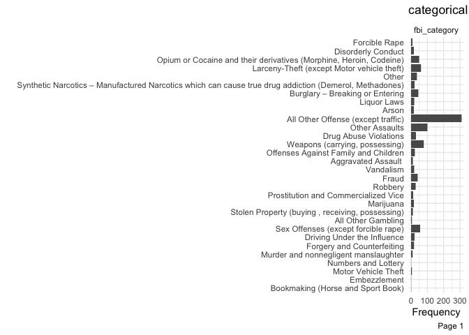<!-- -->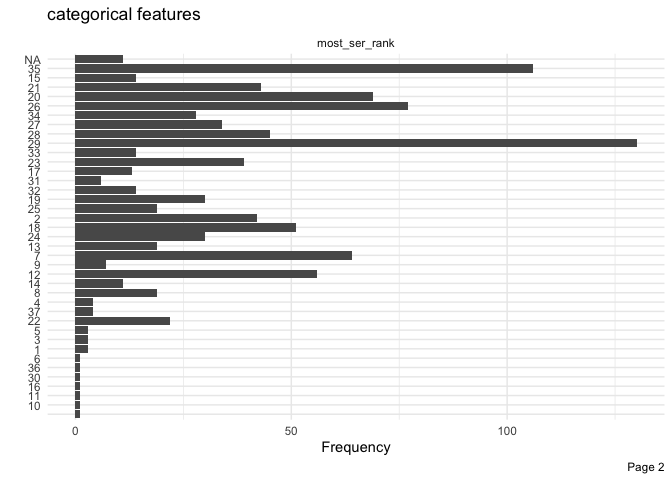<!-- -->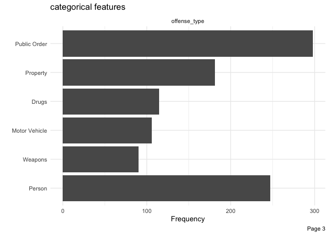<!-- -->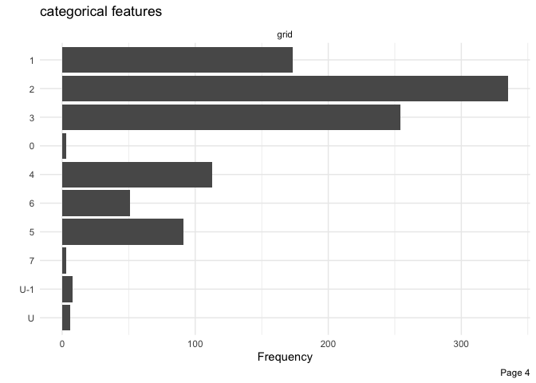<!-- -->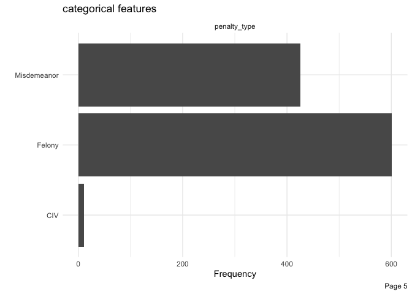<!-- -->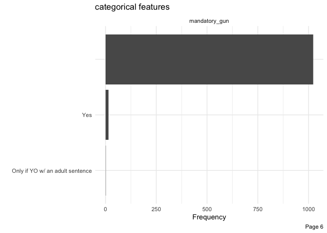<!-- -->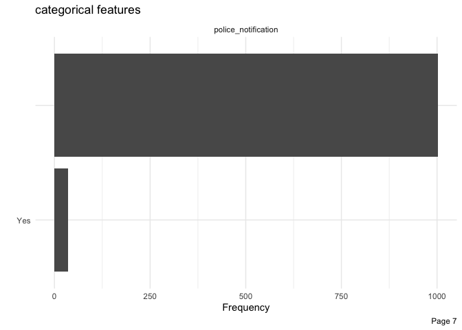<!-- -->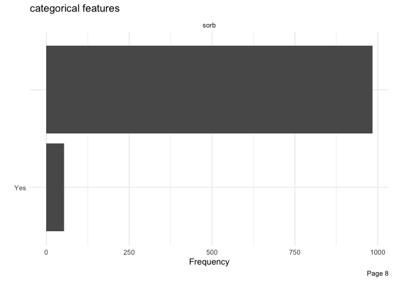<!-- --><!-- -->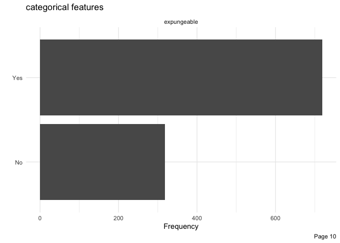<!-- -->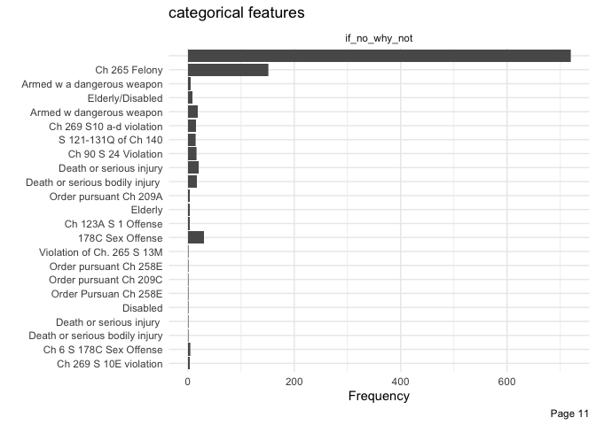<!-- -->

``` r
# plot_qq(ma_crimes)    # no continuous features
```

two-way table

``` r
fbi_exp <- ma_crimes %>% 
  tabyl(fbi_category, expungeable) %>% 
  adorn_totals(c("row", "col"))

str(fbi_exp)
```

    ## Classes 'tabyl' and 'data.frame':    31 obs. of  4 variables:
    ##  $ fbi_category: chr  "Aggravated Assault " "All Other Gambling" "All Other Offense (except traffic)" "Arson" ...
    ##  $ No          : num  9 0 70 1 0 7 0 14 0 0 ...
    ##  $ Yes         : num  1 4 239 14 1 37 15 6 28 1 ...
    ##  $ Total       : num  10 4 309 15 1 44 15 20 28 1 ...
    ##  - attr(*, "core")='data.frame': 30 obs. of  3 variables:
    ##   ..$ fbi_category: chr  "Aggravated Assault " "All Other Gambling" "All Other Offense (except traffic)" "Arson" ...
    ##   ..$ No          : num  9 0 70 1 0 7 0 14 0 0 ...
    ##   ..$ Yes         : num  1 4 239 14 1 37 15 6 28 1 ...
    ##  - attr(*, "tabyl_type")= chr "two_way"
    ##  - attr(*, "var_names")=List of 2
    ##   ..$ row: chr "fbi_category"
    ##   ..$ col: chr "expungeable"
    ##  - attr(*, "totals")= chr  "row" "col"

visualize `expungeable` by `penalty_type`

``` r
ma_crimes %>% 
    count(penalty_type, expungeable, name = "count") %>% 
    ggplot(aes(x = penalty_type, y = count, fill = expungeable)) +
        geom_col(position = "dodge") +
    ggtitle("Most misdemeanors are expungeable\nfelonies are Split") 
```

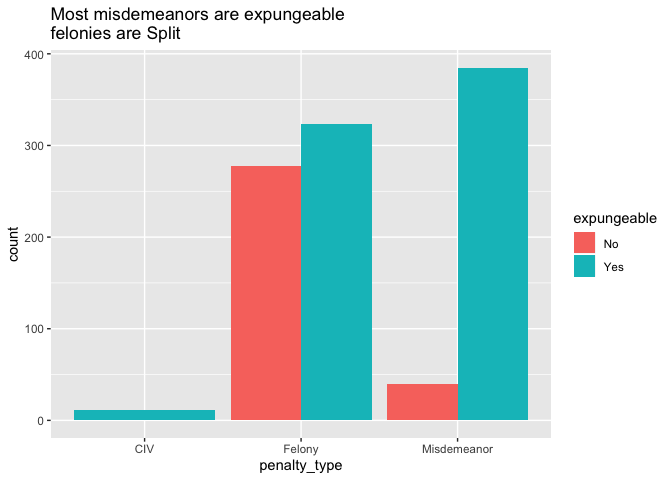<!-- -->

``` r
ma_crimes %>% 
    count(fbi_category, expungeable, name = "count") %>% 
    ggplot(aes(x = str_wrap(fbi_category, width = 50), y = count, fill = expungeable)) +
        geom_col(position = "dodge") +
            xlab("FBI Category") +
    theme(axis.text.y = element_text(hjust = 1, size = 4),
              legend.text = element_text(size = 7),
              legend.position = "bottom") +     
        # ggtitle("")  +
        # xlab("") +
        coord_flip() +
    facet_wrap(~expungeable)
```

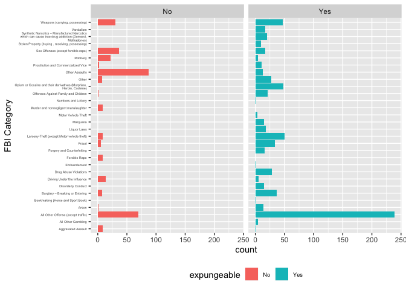<!-- -->

``` r
ma_crimes %>% 
    count(fbi_category, expungeable, name = "count") %>% 
    ggplot(aes(x = str_wrap(fbi_category, width = 50), y = count, fill = expungeable)) +
        geom_col(position = "dodge") +
            xlab("FBI Category") +
    theme(axis.text.y = element_text(hjust = 1, size = 4),
              legend.text = element_text(size = 7),
              legend.position = "bottom") +     
        # ggtitle("")  +
        # xlab("") +
        coord_flip() +
    facet_wrap(~expungeable)
```

<!-- -->

All Expungeable

``` r
#expungeability look ups
fbi_exp_n <-ma_crimes %>% filter(expungeable != "Yes") %>% distinct(fbi_category)
fbi_exp_y <-  ma_crimes %>% filter(expungeable == "Yes") %>% distinct(fbi_category)


# all expungeable categories
ma_crimes %>% filter(fbi_category %in% fbi_exp_y[[1]])
```

    ##                                                                                         untruncated_offense
    ## 1                                                                                                       A&b
    ## 2                                                                                     A&B  Ch. 265 S 13A(a)
    ## 3                                                                              A&b on a corrections officer
    ## 4                                                                                   A&b on a public servant
    ## 5                                                  A&B on child to coerce criminal conspiracy  Ch. 265 S 44
    ## 6                                     A&B on child to coerce criminal conspiracy, subsq. off.  Ch. 265 S 44
    ## 7                                                       A&B on child under 14, bodily injury  Ch. 265 S 13J
    ## 8                                           A&B on child under 14, substantial bodily injury  Ch. 265 S 13J
    ## 9                                                                                  A&b on child with injury
    ## 10                                                                     A&b on child with substantial injury
    ## 11                                                                 A&B on correction officer  Ch. 127 S 38B
    ## 12                                                        A&b on elder (+60)/disabled person; bodily injury
    ## 13                                                A&b on elder (+60)/disabled person; serious bodily injury
    ## 14                                           A&B on elder 60 or over/disabled person  Ch. 265 S 13K(a cent)
    ## 15                                 A&B on elder 60 or over/disabled person, bodily injury  Ch. 265 S 13K(b)
    ## 16                         A&B on elder 60 or over/disabled person, serious bodily injury  Ch. 265 S 13K(c)
    ## 17                                                                       A&B on family member Ch. 265 S 13M
    ## 18                                                              A&B on family member, subsq.  Ch. 265 S 13M
    ## 19                                                                    A&B on public employee  Ch. 265 S 13D
    ## 20                                                                                   A&b on retarded person
    ## 21                                                                    A&B on retarded person  Ch. 265 S 13F
    ## 22                                                       A&B on retarded person, subsq. off.  Ch. 265 S 13F
    ## 23                                                   A&b or property damage to intimidate for race/religion
    ## 24                                  A&B or property damage to intimidate for race/religion  Ch. 265 S 39(a)
    ## 25                   A&B or property damage to intimidate for race/religion, bodily injury  Ch. 265 S 39(b)
    ## 26                              A&b or property damage to intimidate for race/religion, bodily injury level
    ## 27            A&B or property damage to intimidate for race/religion, bodily injury, armed  Ch. 265 S 39(b)
    ## 28                                                                       A&B to collect loan  Ch. 265 S 13C
    ## 29                                                          A&B to collect loan, subsq. off.  Ch. 265 S 13C
    ## 30                                                              A&b with dangerous weapon (Moderate injury)
    ## 31                                                              A&b with dangerous weapon (No/minor injury)
    ## 32                                                           A&b with dangerous weapon (Significant injury)
    ## 33                                                          A&b with dangerous weapon +60 (Moderate injury)
    ## 34                                                          A&b with dangerous weapon +60 (No/minor injury)
    ## 35                                                       A&b with dangerous weapon +60 (Significant injury)
    ## 36                                                                           A&B with firearm Ch. 265 S 15E
    ## 37                                                                A&B with firearm, attempted Ch. 265 S 15F
    ## 38                                                   A&B, aggravated, pregnant victim  Ch. 265 S 13A(b)(ii)
    ## 39                                                A&B, aggravated, restraining order  Ch. 265 S 13A(b)(iii)
    ## 40                                              A&B, aggravated, serious bodily injury  Ch. 265 S 13A(b)(i)
    ## 41                                                        A&B/Assault on ambulance personnel  Ch. 265 S 13I
    ## 42                                                                                              Abandonment
    ## 43                                                                              Abandonment-child under ten
    ## 44                                                                      Abducting females to be prostitutes
    ## 45                                              ABDW on elder 60 or over, moderate injury  Ch. 265 S 15A(a)
    ## 46                                 ABDW on elder 60 or over, moderate injury, subsq. off.  Ch. 265 S 15A(a)
    ## 47                                              ABDW on elder 60 or over, no/minor injury  Ch. 265 S 15A(a)
    ## 48                                 ABDW on elder 60 or over, no/minor injury, subsq. off.  Ch. 265 S 15A(a)
    ## 49                                           ABDW on elder 60 or over, significant injury  Ch. 265 S 15A(a)
    ## 50                              ABDW on elder 60 or over, significant injury, subsq. off.  Ch. 265 S 15A(a)
    ## 51                        ABDW, aggravated, no serious bodily injury, pregnant victim  Ch. 265 S 15A(c)(ii)
    ## 52                     ABDW, aggravated, no serious bodily injury, restraining order  Ch. 265 S 15A(c)(iii)
    ## 53                        ABDW, aggravated, no serious bodily injury, victim under 14  Ch. 265 S 15A(c)(iv)
    ## 54                                             ABDW, aggravated, serious bodily injury  Ch. 265 S 15A(c)(i)
    ## 55                                                                  ABDW, moderate injury  Ch. 265 S 15A(b)
    ## 56                                                                  ABDW, no/minor injury  Ch. 265 S 15A(b)
    ## 57                                                               ABDW, significant injury  Ch. 265 S 15A(b)
    ## 58                                                                                  Abuse of a female child
    ## 59                                                           Abuse prevention order violation  Ch. 209A S 7
    ## 60                           Abuse prevention order violation, failure to surrender firearms  Ch. 209A S 3B
    ## 61                                             Abuse prevention order violation, probate act  Ch. 208 S 34C
    ## 62                                             Abuse prevention order violation, retaliation   Ch. 209A S 7
    ## 63                                                   Abuse prevevention act (violating a restraining order)
    ## 64                                                                                 Accessory after the fact
    ## 65                                                                                Accessory before the fact
    ## 66                                                          Accessory to felony after the fact  Ch. 274 S 4
    ## 67                                                         Accessory to felony before the fact  Ch. 274 S 2
    ## 68                                                                         Accessory to murder - after fact
    ## 69                                                                        Accessory to murder - before fact
    ## 70                                                        Accost/annoy person of opposite sex  Ch. 272 S 53
    ## 71                                                                                                Accosting
    ## 72                                                                                                 Adultery
    ## 73                                                                                                   Affray
    ## 74                                                                           Affray, Common Law [Grid 2012]
    ## 75                                                                                         Aiding an escape
    ## 76                                                                Alcohol, possess in school  Ch. 272 S 40A
    ## 77                                                              Alcohol, possession by minor  Ch. 138 S 34C
    ## 78                                                   Alcohol, sell/deliver to person under 21  Ch. 138 S 34
    ## 79                                                         Alcohol, sell/make/store unlawfully  Ch. 138 S 2
    ## 80                                                              Alcohol, transport unlawfully  Ch. 138 S 22
    ## 81                                                          Alcohol, transportation by minor  Ch. 138 S 34C
    ## 82                                         All other offenses violating, state, town, city, or mdc ordances
    ## 83                                                           Altering driver's license or registration-114m
    ## 84                                                           Ammunition, unlicensed sale of  Ch. 140 S 122B
    ## 85                                                                            An alien possessing a firearm
    ## 86                                                                 Animal fight, keep/promote  Ch. 272 S 94
    ## 87                                                                  Animal fight, presence at  Ch. 272 S 95
    ## 88                                                                         Animal, cruelty to  Ch. 272 S 77
    ## 89                                                                                     Annoying phone calls
    ## 90                                                                                  Armed assault & robbery
    ## 91                                                                                Armed assault in dwelling
    ## 92                                                                           Armed robbery (Display of gun)
    ## 93                                                                        Armed robbery (No display of gun)
    ## 94                                                              Armed robbery while masked (Display of gun)
    ## 95                                                           Armed robbery while masked (No display of gun)
    ## 96                                                                                                  Assault
    ## 97                                                                                Assault  Ch. 265 S 13A(a)
    ## 98                                                                Assault in dwelling, armed  Ch. 265 S 18A
    ## 99                                                  Assault in dwelling, armed, with firearm  Ch. 265 S 18A
    ## 100                                                                                   Assault of an officer
    ## 101                                                                  Assault on family member Ch. 265 S 13M
    ## 102                                                         Assault on family member, subsq.  Ch. 265 S 13M
    ## 103                                                                  Assault to commit felony  Ch. 265 S 29
    ## 104                                              Assault to murder elder 60 or over, armed  Ch. 265 S 18(a)
    ## 105                                 Assault to murder elder 60 or over, armed, subsq. off.  Ch. 265 S 18(a)
    ## 106                                Assault to murder elder 60 or over, armed, with firearm  Ch. 265 S 18(a)
    ## 107                        Assault to murder elder 60 or over, armed, with firearm, subsq.  Ch. 265 S 18(a)
    ## 108                                                                 Assault to murder or maim  Ch. 265 S 15
    ## 109                                                                                Assault to murder, armed
    ## 110                                                               Assault to murder, armed  Ch. 265 S 18(b)
    ## 111                                                 Assault to murder, armed, with firearm  Ch. 265 S 18(b)
    ## 112                                                                           Assault to rape  Ch. 265 S 24
    ## 113                                                           Assault to rape child under 16  Ch. 265 S 24B
    ## 114                                      Assault to rape child under 16, armed, with firearm  Ch. 265 S 24B
    ## 115                              Assault to rape child under 16, armed, with firearm, subsq.  Ch. 265 S 24B
    ## 116                                              Assault to rape child under 16, subsq. off.  Ch. 265 S 24B
    ## 117                                                      Assault to rape, armed, with firearm  Ch. 265 S 24
    ## 118                                         Assault to rape, armed, with firearm, subsq. off.  Ch. 265 S 24
    ## 119                                                              Assault to rape, subsq. off.  Ch. 265 S 24
    ## 120                                                 Assault to rob elder 60 or over, armed  Ch. 265 S 18(a)
    ## 121                                    Assault to rob elder 60 or over, armed, subsq. off.  Ch. 265 S 18(a)
    ## 122                                   Assault to rob elder 60 or over, armed, with firearm  Ch. 265 S 18(a)
    ## 123                           Assault to rob elder 60 or over, armed, with firearm, subsq.  Ch. 265 S 18(a)
    ## 124                                                                  Assault to rob, armed  Ch. 265 S 18(b)
    ## 125                                                    Assault to rob, armed, with firearm  Ch. 265 S 18(b)
    ## 126                                                                   Assault to rob, unarmed  Ch. 265 S 20
    ## 127                                                                Assault w/dangerous weapon w/i to murder
    ## 128                                                                              Assault w/intent to murder
    ## 129                                                                                Assault w/intent to rape
    ## 130                                                                 Assault w/intent to rape child under 14
    ## 131                                                                     Assault w/intent to rob while armed
    ## 132                                                            Assault weapon, sell/possess  Ch. 140 S 131M
    ## 133                                                    Assault weapon, sell/possess, subsq.  Ch. 140 S 131M
    ## 134                                                                           Assault with dangerous weapon
    ## 135                                                         Assault with dangerous weapon  Ch. 265 S 15B(b)
    ## 136                                     Assault with dangerous weapon on elder 60 or over  Ch. 265 S 15B(a)
    ## 137                        Assault with dangerous weapon on elder 60 or over, subsq. off.  Ch. 265 S 15B(a)
    ## 138                                                                   Assault, aggravated  Ch. 265 S 13A(b)
    ## 139                                                                               Assuming to be an officer
    ## 140                                                                       Attaching wrong plates-124p, 124b
    ## 141                                                                               Attempt to commit a crime
    ## 142                                                               Attempt to commit any b&e daytime offense
    ## 143                                          Attempt to commit crime, 5-year felony or greater  Ch. 274 S 6
    ## 144                                                           Attempt to commit crime, Larceny  Ch. 274 S 6
    ## 145                                               Attempt to commit crime, punishable by death  Ch. 274 S 6
    ## 146                                Attempt to commit crime, under 5-year felony or misdemeanor  Ch. 274 S 6
    ## 147                                                                 Attempt to commit larceny less offenses
    ## 148                                                                 Attempt to commit larceny more offenses
    ## 149                                                                                       Attempt to kidnap
    ## 150                                                                                 Attempted armed robbery
    ## 151                                                                                         Attempted arson
    ## 152                                                                                   Attempted b&e daytime
    ## 153                                                                                     Attempted b&e night
    ## 154                                                                                          Attempted rape
    ## 155                                                                Attempted threats, bribery or conspiracy
    ## 156                                                                               Attempted unarmed robbery
    ## 157                                                                                                     B&e
    ## 158                                                                                 B&e (felony) (Dwelling)
    ## 159                                                                             B&e (felony) (Non-dwelling)
    ## 160                                                                       B&e & larceny at night (Dwelling)
    ## 161                                                  B&e at night with intent to commit a felony (Dwelling)
    ## 162                             B&E building, ship, or vehicle at night, for felony, dwelling  Ch. 266 S 16
    ## 163                         B&E building, ship, or vehicle at night, for felony, non-dwelling  Ch. 266 S 16
    ## 164                                          B&E building, ship, or vehicle, for misdemeanor  Ch. 266 S 16A
    ## 165                                                          B&e d/t w/intent to commit a felony (Dwelling)
    ## 166                       B&E daytime or enter at night, for felony, person in fear, dwelling  Ch. 266 S 17
    ## 167                   B&E daytime or enter at night, for felony, person in fear, non-dwelling  Ch. 266 S 17
    ## 168         B&E daytime or enter at night, for felony, with firearm, person in fear, dwelling  Ch. 266 S 17
    ## 169     B&E daytime or enter at night, for felony, with firearm, person in fear, non-dwelling  Ch. 266 S 17
    ## 170                                                              B&e daytime w/intent to commit misdemeanor
    ## 171                                                         B&E daytime, for felony, dwelling  Ch. 266 S 18
    ## 172                                                     B&E daytime, for felony, non-dwelling  Ch. 266 S 18
    ## 173                                           B&E daytime, for felony, with firearm, dwelling  Ch. 266 S 18
    ## 174                                       B&E daytime, for felony, with firearm, non-dwelling  Ch. 266 S 18
    ## 175               B&E dwelling at night (burglary), for felony, armed or assault on occupants  Ch. 266 S 14
    ## 176       B&E dwelling at night (burglary), for felony, armed or assault on occupants, subsq.  Ch. 266 S 14
    ## 177            B&E dwelling at night (burglary), for felony, unarmed, no assault on occupants  Ch. 266 S 15
    ## 178    B&E dwelling at night (burglary), for felony, unarmed, no assault on occupants, subsq.  Ch. 266 S 15
    ## 179                                B&E dwelling at night (burglary), for felony, with firearm  Ch. 266 S 14
    ## 180                        B&E dwelling at night (burglary), for felony, with firearm, subsq.  Ch. 266 S 14
    ## 181                                                                                       B&e motor vehicle
    ## 182                                                                                B&e nighttime (Dwelling)
    ## 183                                                                            B&e nighttime (Non-dwelling)
    ## 184                                                         B&e nighttime a building or ship (Non-dwelling)
    ## 185                                            B&E or enter at night railroad car, for felony  Ch. 266 S 19
    ## 186                            B&E or enter truck, trailer, or freight container, for felony  Ch. 266 S 20A
    ## 187                                                                                        B&e railroad car
    ## 188                                                                      B&e with intent to commit a felony
    ## 189                                                                     B&e with intent to commit a larceny
    ## 190                                                                                                   B&e&l
    ## 191                                       BB gun/air rifle, possess or shoot in public place  Ch. 269 S 12B
    ## 192                                                     BB gun/air rifle, sell/give to minor  Ch. 269 S 12A
    ## 193                                                          Being present where an illegal firearm is kept
    ## 194                                                                                      Bigamy or polygamy
    ## 195                                               Boat, operate negligently, causing death  Ch. 90B S 8B(2)
    ## 196                                                Boat, operate recklessly, causing death  Ch. 90B S 8B(2)
    ## 197                                                 Boat, operate recklessly/negligently  Ch. 90B S 8(e)(1)
    ## 198                                                         Boat, OUI liquor or drugs  Ch. 90B S 8(a)(1)(A)
    ## 199                                               Boat, OUI liquor or drugs, 2nd off.  Ch. 90B S 8(a)(1)(A)
    ## 200                                               Boat, OUI liquor or drugs, 3rd off.  Ch. 90B S 8(a)(1)(A)
    ## 201                                               Boat, OUI liquor or drugs, 4th off.  Ch. 90B S 8(a)(1)(A)
    ## 202                                               Boat, OUI liquor or drugs, causing death  Ch. 90B S 8B(2)
    ## 203                                      Boat, OUI liquor or drugs, causing serious injury  Ch. 90B S 8A(2)
    ## 204                 Boat, OUI liquor or drugs, reckless/negligent operation, causing death  Ch. 90B S 8B(1)
    ## 205        Boat, OUI liquor or drugs, reckless/negligent operation, causing serious injury  Ch. 90B S 8A(1)
    ## 206                                                               Boat, use without authority  Ch. 266 S 63
    ## 207                                                Boat, use without authority, 1st off.  Ch. 90B S 8(e)(1)
    ## 208                                                Boat, use without authority, 2nd off.  Ch. 90B S 8(e)(1)
    ## 209                                     Boat, use without authority, 3rd and subsq. off.  Ch. 90B S 8(e)(1)
    ## 210                                                                Body armor, use in felony  Ch. 269 S 10D
    ## 211                                                                                             Bomb threat
    ## 212                                                                     Bomb threat, false  Ch. 269 S 14(b)
    ## 213                                                     Bomb/explosives, possess in violation  Ch. 148 S 35
    ## 214                                           Bomb/hijack threat with serious public alarm  Ch. 269 S 14(c)
    ## 215                                                                                          Boxing matches
    ## 216                          Break safe or vault, for larceny or felony, or attempt, dwelling  Ch. 266 S 16
    ## 217                      Break safe or vault, for larceny or felony, or attempt, non-dwelling  Ch. 266 S 16
    ## 218                                                                                          Breaking glass
    ## 219                                                                                                   Bribe
    ## 220                                                                        Bribe, business  Ch. 271 S 39(a)
    ## 221                                                    Bribe, offer or accept/solicit sports  Ch. 271 S 39A
    ## 222                                                                                      Bribery of witness
    ## 223                                                                      Building, damage to  Ch. 266 S 104
    ## 224                                     Burglarious instrument/MV master key, make or possess  Ch. 266 S 49
    ## 225                                                Burglary while being armed or making an assault (felony)
    ## 226                                                                                       Burglary, unarmed
    ## 227                                                                                    Burn a meeting house
    ## 228                                                                    Burn boat/MV/personalty  Ch. 266 S 5
    ## 229                                                       Burn boat/MV/personalty, attempt to  Ch. 266 S 5A
    ## 230                                                                     Burn building/contents  Ch. 266 S 2
    ## 231                       Burn building/MV/personalty to defraud insurer, or attempt to do so  Ch. 266 S 10
    ## 232                                                                Burn dwelling house (arson)  Ch. 266 S 1
    ## 233                                                   Burn dwelling house (arson), attempt to  Ch. 266 S 5A
    ## 234                                                          Burn public building, attempt to  Ch. 266 S 5A
    ## 235                                                                                 Burn woods  Ch. 266 S 7
    ## 236                                                                                      Burning a dwelling
    ## 237                                                                                         Burning an auto
    ## 238                                                                                        Burning building
    ## 239                                                                                Burning insured property
    ## 240                                                                 Burning insured property w/i to defraud
    ## 241                                                               Bus/driver, interfere with  Ch. 159A S 31
    ## 242                                         Bus/railroad car, throwing missile or assaulting  Ch. 159 S 104
    ## 243                                                  Buying and receiving and/or concealing stolen property
    ## 244                   Cable TV/telephone service, obtain by fraud, or attempt, under $5,000   Ch. 166 S 42A
    ## 245                                 Caretaker permits abuse on elder/disabled person  Ch. 265 S 13K(d cent)
    ## 246                                                                                              Carjacking
    ## 247                                                                               Carjacking  Ch. 265 S 21A
    ## 248                                                                                       Carjacking, armed
    ## 249                                                                        Carjacking, armed  Ch. 265 S 21A
    ## 250                                                          Carjacking, armed, with firearm  Ch. 265 S 21A
    ## 251                                                                                Carnal abuse of a female
    ## 252                                                                   Carrying a dangerous weapon in school
    ## 253                                                                   Carrying a firearm in a motor vehicle
    ## 254                                                                               Carrying dangerous weapon
    ## 255                                                                 Check cashing violation Ch. 169A S 2-13
    ## 256                                                                          Check, forgery of  Ch. 267 S 1
    ## 257                 Child in nude, disseminate visual material of, with lascivious intent  Ch. 272 S 29B(a)
    ## 258               Child in nude, pose/exhibit for visual material, with lascivious intent  Ch. 272 S 29A(a)
    ## 259           Child in sexual act, disseminate visual material of, with lascivious intent  Ch. 272 S 29B(b)
    ## 260         Child in sexual act, pose/exhibit for visual material, with lascivious intent  Ch. 272 S 29A(b)
    ## 261                                                         Child pornography, possession of  Ch. 272 S 29C
    ## 262                                                                   Child under 10, abandon  Ch. 119 S 39
    ## 263                                                                  Child, permit injury to  Ch. 265 S 13J
    ## 264                                                                                Church or school, damage
    ## 265                                                                  Church or school, damage  Ch. 266 S 98
    ## 266                                                                Church, threat to injure  Ch. 266 S 127A
    ## 267                                                 Church/synagogue, injury to, over $5000  Ch. 266 S 127A
    ## 268                                                Church/synagogue, injury to, under $5000  Ch. 266 S 127A
    ## 269                                                                            Civil rights order violation
    ## 270                                                              Civil rights order violation  Ch. 12 S 11J
    ## 271                                                                Civil rights order violation with injury
    ## 272                                                  Civil rights order violation with injury  Ch. 12 S 11J
    ## 273                                                         Civil rights violation or attempt  Ch. 265 S 37
    ## 274                                      Civil rights violation with bodily injury or attempt  Ch. 265 S 37
    ## 275                                            Cocaine, distribute or possess with intent  Ch. 94C S 32A(c)
    ## 276                               Cocaine, distribute or possess with intent, subsq. off.  Ch. 94C S 32A(d)
    ## 277                                  Cocaine, distribute or possess with intent, to minor  Ch. 94C S 32F(d)
    ## 278                                              Cocaine, trafficking in, 100 to 200 g  Ch. 94C S 32E(b)(3)
    ## 279                                                Cocaine, trafficking in, 14 to 28 g  Ch. 94C S 32E(b)(1)
    ## 280                                             Cocaine, trafficking in, 200 g or more  Ch. 94C S 32E(b)(4)
    ## 281                                               Cocaine, trafficking in, 28 to 100 g  Ch. 94C S 32E(b)(2)
    ## 282                                                                                 Coercion to join a gang
    ## 283                                                                           Compulsory insurance law-118a
    ## 284                                                 Computer system, unauthorized access to  Ch. 266 S 120F
    ## 285                                                                               Concealing death of issue
    ## 286                                                                              Concealing leased property
    ## 287                               Conspiracy for felony, death penalty or life imprisonment  Ch. 274 S 7(1)
    ## 288                                               Conspiracy for felony, more than 10 years  Ch. 274 S 7(2)
    ## 289                                           Conspiracy for felony, not more than 10 years  Ch. 274 S 7(3)
    ## 290                                                              Conspiracy for misdemeanor  Ch. 274 S 7(4)
    ## 291                                                            Conspiracy to violate drug law  Ch. 94C S 40
    ## 292                                                                         Conspiracy to violate drug laws
    ## 293                                                                                  Conspiracy-other crime
    ## 294                                                 Constitutional law violation with intimidation or force
    ## 295                                                                       Consuming alcohol in a public way
    ## 296                                                                     Contempt of court (chins violation)
    ## 297                                                                     Contempt of court (court violation)
    ## 298                                                              Contempt, criminal, Common Law [Grid 2012]
    ## 299                                                        Contribute to delinquency of child  Ch. 119 S 63
    ## 300                                                              Contributing to the delenquincy of a minor
    ## 301                                                                            Conveying mortgaged property
    ## 302                                                 CORI, disseminate/seek unlawfully, falsify  Ch. 6 S 178
    ## 303                                                      Counterfeit drug,distribute or possess with intent
    ## 304                             Counterfeit drug; create, distribute, or possess with intent  Ch. 94C S 32G
    ## 305                                                                                       Counterfeit money
    ## 306                                               Counterfeit note or traveler's check, utter, Ch. 267 S 10
    ## 307                                            Counterfeit note or traveller's check, possess  Ch. 267 S 12
    ## 308                                                                 Counterfeit notes, possess  Ch. 267 S 9
    ## 309                                                                        Counterfeit sticker/license-114n
    ## 310                                                                              Court proceedings, disrupt
    ## 311                                                               Court proceedings, disrupt  Ch. 268 S 13C
    ## 312                                          Credit card fraud over $250, $10,000 to $50,000  Ch. 266 S 37C
    ## 313                                            Credit card fraud over $250, $50,000 and over  Ch. 266 S 37C
    ## 314                                               Credit card fraud over $250, under $10,000  Ch. 266 S 37C
    ## 315                                                                   Credit card violations  Ch. 266 S 37B
    ## 316                                                             Crime against nature (sodomy)  Ch. 272 S 34
    ## 317                                                                      Crime report, false  Ch. 269 S 13A
    ## 318                                                                                      Cruelty to animals
    ## 319                                                                           Curfew, violate  Ch. 40 S 37A
    ## 320                                     Dangerous weapon, carry on school grounds, firearm  Ch. 269 S 10(j)
    ## 321                                 Dangerous weapon, carry on school grounds, non-firearm  Ch. 269 S 10(j)
    ## 322                                                      Dangerous weapon, carry, 2nd off.  Ch. 269 S 10(d)
    ## 323                                                      Dangerous weapon, carry, 3rd off.  Ch. 269 S 10(d)
    ## 324                                                      Dangerous weapon, carry, 4th off.  Ch. 269 S 10(d)
    ## 325                                             Dangerous weapon, carry, no prior felonies  Ch. 269 S 10(b)
    ## 326                                           Dangerous weapon, carry, with prior felonies  Ch. 269 S 10(b)
    ## 327                                                Dangerous weapon, manufacture/sell certain  Ch. 269 S 12
    ## 328                                                 Defacement of real or personal property  Ch. 266 S 126A
    ## 329                                                                Deriving support from a child prostitute
    ## 330                                                                      Deriving support from a prostitute
    ## 331                                                                                               Desertion
    ## 332                      Destruction of property held by the MA Water Resource Authority  Ch. 92 App. S 1-8
    ## 333                                             Destruction of property over $250, malicious  Ch. 266 S 127
    ## 334                                                Destruction of property over $250, wanton  Ch. 266 S 127
    ## 335                                  Destruction of property under $250, wanton or malicious  Ch. 266 S 127
    ## 336                                                        Detainers, escape or attempt  Ch. 276 App. S 1-5
    ## 337                                                     Discharging a firearm within 500 feet of a building
    ## 338                                                              Disguise to obstruct justice  Ch. 268 S 34
    ## 339                                                                                      Disorderly conduct
    ## 340                                                                        Disorderly conduct  Ch. 272 S 53
    ## 341                                                                 Disorderly conduct at poll  Ch. 56 S 46
    ## 342                                                   Disorderly conduct on public conveyance  Ch. 272 S 43
    ## 343                              Disorderly conduct on public conveyance, 3rd and subsq. off.  Ch. 272 S 43
    ## 344                                                                    Disorderly house, keep  Ch. 272 S 53
    ## 345                                                                                       Disorderly person
    ## 346                                                                          Disseminating obscene material
    ## 347                                                               Disseminating obscene material to a minor
    ## 348                                                                                    Distribute (class a)
    ## 349                                                                                    Distribute (class b)
    ## 350                                                                            Distribute (class b)-cocaine
    ## 351                                                                                    Distribute (class c)
    ## 352                                                                                    Distribute (class d)
    ## 353                                                                                    Distribute (class e)
    ## 354                                                                           Distribute to minor (class a)
    ## 355                                                                           Distribute to minor (class b)
    ## 356                                                                           Distribute to minor (class c)
    ## 357                                                                           Distributing in a school zone
    ## 358                                                                            Disturbing a public assembly
    ## 359                                                                            Disturbing a school assembly
    ## 360                                                                                    Disturbing the peace
    ## 361                                                                      Disturbing the peace  Ch. 272 S 53
    ## 362                                                             DNA sample, refuse to provide  Ch. 22E S 11
    ## 363                                                                                      Drinking in public
    ## 364                                                   Drug paraphernalia, distribute or possess with intent
    ## 365                                 Drug paraphernalia, distribute or possess with intent  Ch. 94C S 32I(a)
    ## 366                                                                       Drug paraphernalia, sell to minor
    ## 367                                           Drug paraphernalia, sell to person under 18  Ch. 94C S 32I(b)
    ## 368                                        Drug violation within 100 feet of park/playground  Ch. 94C S 32J
    ## 369                                           Drug violation within 1000 feet of school zone  Ch. 94C S 32J
    ## 370                                                    Drug, dispense without prescription  Ch. 94C S 25(1)
    ## 371                                       Drug, dispense without prescription, subsq. off.  Ch. 94C S 25(1)
    ## 372                                       Drug, distribute or possess with intent, class A  Ch. 94C S 32(a)
    ## 373                          Drug, distribute or possess with intent, class A, subsq. off.  Ch. 94C S 32(b)
    ## 374                                      Drug, distribute or possess with intent, class B  Ch. 94C S 32A(a)
    ## 375                         Drug, distribute or possess with intent, class B, subsq. off.  Ch. 94C S 32A(b)
    ## 376                                      Drug, distribute or possess with intent, class C  Ch. 94C S 32B(a)
    ## 377                         Drug, distribute or possess with intent, class C, subsq. off.  Ch. 94C S 32B(b)
    ## 378                                      Drug, distribute or possess with intent, class D  Ch. 94C S 32C(a)
    ## 379                         Drug, distribute or possess with intent, class D, subsq. off.  Ch. 94C S 32C(b)
    ## 380                                      Drug, distribute or possess with intent, class E  Ch. 94C S 32D(a)
    ## 381                         Drug, distribute or possess with intent, class E, subsq. off.  Ch. 94C S 32D(b)
    ## 382                            Drug, distribute or possess with intent, to minor, class A  Ch. 94C S 32F(a)
    ## 383                            Drug, distribute or possess with intent, to minor, class B  Ch. 94C S 32F(b)
    ## 384                            Drug, distribute or possess with intent, to minor, class C  Ch. 94C S 32F(c)
    ## 385                                                    Drug, false registration number for  Ch. 94C S 33(a)
    ## 386                                                         Drug, induce minor to distribute  Ch. 94C S 32K
    ## 387                                                   Drug, induce minor to possess funds of  Ch. 94C S 32K
    ## 388                                                                          Drug, larceny of  Ch. 94C S 37
    ## 389                                                                  Drug, obtain by fraud  Ch. 94C S 33(b)
    ## 390                                                                    Drug, possess, class A  Ch. 94C S 34
    ## 391                                                       Drug, possess, class A, subsq. off.  Ch. 94C S 34
    ## 392                                                                    Drug, possess, class B  Ch. 94C S 34
    ## 393                                                       Drug, possess, class B, subsq. off.  Ch. 94C S 34
    ## 394                                                                    Drug, possess, class C  Ch. 94C S 34
    ## 395                                                       Drug, possess, class C, subsq. off.  Ch. 94C S 34
    ## 396                                                                    Drug, possess, class D  Ch. 94C S 34
    ## 397                                                       Drug, possess, class D, subsq. off.  Ch. 94C S 34
    ## 398                                                                    Drug, possess, class E  Ch. 94C S 34
    ## 399                                                       Drug, practitioner fail to label  Ch. 94C S 22(b)
    ## 400                                          Drug, practitioner fail to label, subsq. off.  Ch. 94C S 22(b)
    ## 401                                     Drug, registrant distribute without order, class I  Ch. 94C S 26(1)
    ## 402                                    Drug, registrant distribute without order, class II  Ch. 94C S 26(1)
    ## 403                                                         Electric stun gun, sell/possess  Ch. 140 S 131J
    ## 404                                                                            Embezzlement (Under $10,000)
    ## 405                                                       Enter dwelling at night, for felony  Ch. 266 S 18
    ## 406                                         Enter dwelling at night, for felony, with firearm  Ch. 266 S 18
    ## 407                                     Enter dwelling house at night w/out breaking w/i to commit a felony
    ## 408       Entering dwelling by false pretense, for felony or with larceny, no person in fear  Ch. 266 S 18A
    ## 409                                                         Enticement of child under age 16  Ch. 265 S 26C
    ## 410                                                                                                Enticing
    ## 411                                                          Enticing to commit unlawful sexual intercourse
    ## 412                                                                                                  Escape
    ## 413                                                                                         Escape from dys
    ## 414                                                Escape from DYS, or aiding child to escape  Ch. 120 S 26
    ## 415                                                             Escape from municipal lockup  Ch. 268 S 15A
    ## 416                                                                                     Escape from officer
    ## 417                                                                  Escape from officer, aid  Ch. 268 S 17
    ## 418                                                     Escape from penal institution, permit  Ch. 268 S 19
    ## 419                                Escape from penal institution/court/SDP center, or attempt  Ch. 268 S 16
    ## 420                                                      Escape from police officer, Common Law [Grid 2012]
    ## 421                              Escape, aid accused felon or convicted state prison felon to  Ch. 268 S 15
    ## 422                                                       Escape, aid accused misdemeanant to  Ch. 268 S 15
    ## 423                              Escape, aid convicted misdemeanant or convicted HOC felon to  Ch. 268 S 15
    ## 424                                                                     Explosion, malicious  Ch. 266 S 101
    ## 425                                                     Explosive, throw/place/explode or possess to injure
    ## 426                                      Explosive/destructive/incendiary device, possess  Ch. 266 S 102(c)
    ## 427                          Explosive/destructive/incendiary device, possess ingredients  Ch. 266 S 102(a)
    ## 428                                            Explosive/destructive/incendiary device, use  Ch. 266 S 102A
    ## 429                          Explosive/destructive/incendiary hoax device, possess or use  Ch. 266 S 102(b)
    ## 430                                              Explosives/flammables, improperly make/store  Ch. 148 S 16
    ## 431                                                                                               Extortion
    ## 432                                                                      Extortion or attempt  Ch. 265 S 25
    ## 433                                                                                               F/a theft
    ## 434                                                              Failure to appear on personal recognizance
    ## 435                                          Failure to appear, recognizance or bail, felony  Ch. 276 S 82A
    ## 436                                     Failure to appear, recognizance or bail, misdemeanor  Ch. 276 S 82A
    ## 437                                                                        Failure to obey a police officer
    ## 438                     Failure to register or verify registration info by sex offender  Ch. 6 S 178H(a)(1)
    ## 439             Failure to register or verify registration info by sex offender, subsq.  Ch. 6 S 178H(a)(2)
    ## 440                                                                      Failure to send children to school
    ## 441                                                                    Failure to stop for a police officer
    ## 442                      False alarm from police call box or tamper with police/fire call box  Ch. 268 S 32
    ## 443                                                                                        False fire alarm
    ## 444                                                                                         False liquor id
    ## 445                                      False lottery tickets: creation, sale, or possession  Ch. 271 S 12
    ## 446                                  False name or Social Security number, furnish to police  Ch. 268 S 34A
    ## 447                False pretense in commercial transaction, over $250, $10,000 to $50,000  Ch. 266 S 33(1)
    ## 448                  False pretense in commercial transaction, over $250, $50,000 and over  Ch. 266 S 33(1)
    ## 449                     False pretense in commercial transaction, over $250, under $10,000  Ch. 266 S 33(1)
    ## 450                                   False pretense in commercial transaction, under $250  Ch. 266 S 33(1)
    ## 451                                                  False pretense of trade, obtain goods by  Ch. 266 S 73
    ## 452                                                                        False reports to police officers
    ## 453                                                                     False statement on application-114g
    ## 454                                                                    False/silent 911 call  Ch. 269 S 14B
    ## 455                                                                          Felony for hire  Ch. 265 S 13G
    ## 456                                         Fentanyl, trafficking in, more than 10 g  Ch. 94C S 32E(c half)
    ## 457                                                 Fetal death out of wedlock, conceal cause  Ch. 272 S 22
    ## 458                                                                       Fight by arrangement  Ch. 265 S 9
    ## 459                                                         Fight by arrangement, aid/promote  Ch. 265 S 10
    ## 460                                                        Fight by arrangement, out-of-state  Ch. 265 S 11
    ## 461                                                                       Fire alarm, disable  Ch. 266 S 11
    ## 462                                                                         Fire alarm, false  Ch. 269 S 13
    ## 463                                                                          Fire in open, set  Ch. 48 S 13
    ## 464                                                   Fire on land, fail to extinguish/control  Ch. 266 S 9
    ## 465                                                                          Fire on land, set  Ch. 266 S 8
    ## 466                                                  Firearm application, false statement on  Ch. 140 S 129
    ## 467                                     Firearm application, false statement on, subsq. off.  Ch. 140 S 129
    ## 468                           Firearm license violation, false information on application  Ch. 140 S 131(h)
    ## 469                                            Firearm license/FID card, fail to surrender  Ch. 269 S 10(i)
    ## 470                                                         Firearm license/FID card, false  Ch. 140 S 131I
    ## 471                                     Firearm or ammunition without FID card, possess  Ch. 269 S 10(h)(1)
    ## 472                        Firearm or ammunition without FID card, possess, subsq. off.  Ch. 269 S 10(h)(1)
    ## 473                                                              Firearm sale to minor/alien  Ch. 140 S 130
    ## 474                                                                  Firearm sale, violation  Ch. 140 S 128
    ## 475                             Firearm serial number, deface or receive with defaced number  Ch. 269 S 11C
    ## 476                                            Firearm, carry improperly in a motor vehicle  Ch. 140 S 131C
    ## 477                                       Firearm, carry on way, unloaded, large capacity  Ch. 269 S 12D(b)
    ## 478                                                         Firearm, carry without license  Ch. 269 S 10(a)
    ## 479                             Firearm, carry without license, 1 prior violent/drug crime  Ch. 269 S 10(a)
    ## 480                                               Firearm, carry without license, 2nd off.  Ch. 269 S 10(d)
    ## 481                                               Firearm, carry without license, 3rd off.  Ch. 269 S 10(d)
    ## 482                                               Firearm, carry without license, 4th off.  Ch. 269 S 10(d)
    ## 483                                                 Firearm, carry without license, loaded  Ch. 269 S 10(n)
    ## 484                                           Firearm, discharge within 500 feet of building  Ch. 269 S 12E
    ## 485                                    Firearm, discharge within 500 feet of dwelling/highway  Ch. 131 S 58
    ## 486                        Firearm, leave unattended with intent to transfer possession  Ch. 269 S 10(h)(2)
    ## 487                    Firearm, non-resident of Commonwealth owns/possesses without license  Ch. 140 S 131H
    ## 488                                                               Firearm, possess in felony  Ch. 265 S 18B
    ## 489                                               Firearm, possess in felony, large capacity  Ch. 265 S 18B
    ## 490                                                  Firearm, possess in felony, subsq. off.  Ch. 265 S 18B
    ## 491                                   Firearm, possess in felony, with defaced serial number  Ch. 269 S 11B
    ## 492                                                        Firearm, possess large capacity  Ch. 269 S 10(m)
    ## 493                                        Firearm, possess large capacity, with valid FID  Ch. 269 S 10(m)
    ## 494                                                           Firearm, purchase for another  Ch. 140 S 131E
    ## 495                                               Firearm, store improper, large capacity Ch. 140 S 131L(a)
    ## 496                                               Firearm, store improper, small capacity Ch. 140 S 131L(a)
    ## 497                                     Firearms, trafficking in, 10-19 weapons, 8-12 months  Ch. 269 S 10E
    ## 498                              Firearms, trafficking in, 20 or more weapons, 12 month min.  Ch. 269 S 10E
    ## 499                                        Firearms, trafficking in, 3-9 weapons, 6-8 months  Ch. 269 S 10E
    ## 500                                                Firefighter, injure by setting fires  Ch. 265 S 13D cent
    ## 501                                                              Firefighter, interfere with  Ch. 268 S 32A
    ## 502                                                   Firefighter,injuries resulting from criminal offenses
    ## 503                                                       Fireworks, sell or possess unlawful  Ch. 148 S 39
    ## 504                                                         Forgery and or uttering-false or forged records
    ## 505                                         Forgery and or uttering-forgery of bank note or travelers check
    ## 506                                                                     Forgery on check or promissory note
    ## 507                                            Forgery, check forgery, promissory note forgery  Ch. 267 S 1
    ## 508                                 Forging a prescription or fraudulently obtaining a controlled substance
    ## 509                                                                               Fornication  Ch. 272 S 18
    ## 510                                                                                                   Fraud
    ## 511                                                                        Fraud/cheat, gross  Ch. 266 S 76
    ## 512                                                                                       Fraudulent checks
    ## 513                                                      Fraudulent use of credit card ($10,000 to $50,000)
    ## 514                                                        Fraudulent use of credit card ($50,000 and over)
    ## 515                                                           Fraudulent use of credit card (Under $10,000)
    ## 516                                                                      Fraudulent use of gambling devices
    ## 517                                                                                   Fugitive from justice
    ## 518                                                         Fugitive, fail bring before court  Ch. 276 S 19
    ## 519                                                                                   Furnishing false name
    ## 520                                                                                                Gambling
    ## 521                                                                                Gambling in public place
    ## 522                                                                                                  Gaming
    ## 523                                                           Grand jury transcript, abuse Ch. 268 S 13D(a)
    ## 524                                                                 Gun law-carring a firearm - 2nd offense
    ## 525                                                                              Gun law-carrying a firearm
    ## 526                                                                  Harassment, criminal  Ch. 265 S 43A(a)
    ## 527                                          Harassment, criminal, prevention order violation  Ch. 258E S 9
    ## 528                                                          Harassment, criminal, subsq.  Ch. 265 S 43A(b)
    ## 529                                                                           Having a firearm w/o a permit
    ## 530                                                            Having dangerous explosives without a permit
    ## 531                                                                                    Hazing  Ch. 269 S 17
    ## 532                                                          Heroin, being present where kept  Ch. 94C S 35
    ## 533                                                                           Heroin, possess  Ch. 94C S 34
    ## 534                                                              Heroin, possess, subsq. off.  Ch. 94C S 34
    ## 535                                Heroin/morphine/opium, trafficking in, 100 to 200 g  Ch. 94C S 32E(c)(3)
    ## 536                                  Heroin/morphine/opium, trafficking in, 14 to 28 g  Ch. 94C S 32E(c)(1)
    ## 537                               Heroin/morphine/opium, trafficking in, 200 g or more  Ch. 94C S 32E(c)(4)
    ## 538                                 Heroin/morphine/opium, trafficking in, 28 to 100 g  Ch. 94C S 32E(c)(2)
    ## 539                                                                                           Home invasion
    ## 540                                                                            Home invasion  Ch. 265 S 18C
    ## 541                                                               Home invasion, subsq. off.  Ch. 265 S 18C
    ## 542                                                       Hypodermic for drugs, sell to minor  Ch. 94C S 27
    ## 543                                          Hypodermic for drugs, sell to minor, subsq. off.  Ch. 94C S 27
    ## 544                                                  Hypodermic for drugs, unlicensed sale of  Ch. 94C S 27
    ## 545                                     Hypodermic for drugs, unlicensed sale of, subsq. off.  Ch. 94C S 27
    ## 546                                                        Identity fraud, intent to pose  Ch. 266 S 37E(c)
    ## 547                                                                  Identity fraud, pose  Ch. 266 S 37E(b)
    ## 548                                                                                     Idle and disorderly
    ## 549                                                                         Illegal possession of fireworks
    ## 550                                                                        Illegal sale of alcohol to minor
    ## 551                                                                                      Immoral soliciting
    ## 552                                                                                                  Incest
    ## 553                                                                                    Incest  Ch. 272 S 17
    ## 554                                                               Incest with person under 21  Ch. 272 S 17
    ## 555                                                                                            Indecent a&b
    ## 556                                                           Indecent A&B on child under 14  Ch. 265 S 13B
    ## 557                                                                    Indecent a&b on child under 14 years
    ## 558                                      Indecent A&B on child under 14, aggravated  Ch. 265 S 13B cent 1/2
    ## 559                                          Indecent A&B on child under 14, subsq. off.  Ch. 265 S 13B 3/4
    ## 560                                                Indecent A&B on elder 60 or over/disabled  Ch. 265 S 13H
    ## 561                                                        Indecent A&B on person 14 or over  Ch. 265 S 13H
    ## 562                                                                         Indecent a&b on retarded person
    ## 563                                                          Indecent A&B on retarded person  Ch. 265 S 13F
    ## 564                                             Indecent A&B on retarded person, subsq. off.  Ch. 265 S 13F
    ## 565                                                                            Indecent a&b, 2nd conviction
    ## 566                                                                                        Indecent assault
    ## 567                                                                                       Indecent exposure
    ## 568                                                                         Indecent Exposure  Ch. 272 S 53
    ## 569                                                                               Infernal machine, possess
    ## 570                                        Inhale toxic fumes for stupefaction, glue or other  Ch. 270 S 18
    ## 571                                                                                   Inhaling toxic vapors
    ## 572                                                                          Interfering with a firefighter
    ## 573                                                                             Interfering with an officer
    ## 574                                                             Interstate compact  (Use for icja runaways)
    ## 575                                                Interstate Compact for Juveniles (ICJ) - IN  Ch. 119 S 1
    ## 576                                             Interstate Compact for Juveniles (ICJ) - OTHER  Ch. 119 S 1
    ## 577                                               Interstate Compact for Juveniles (ICJ) - OUT  Ch. 119 S 1
    ## 578                                                          intimidate juror/witness, or retaliate against
    ## 579                                        Intimidate juror/witness, or retaliate against  Ch. 268 S 13B(1)
    ## 580                                 Intimidate or confine to steal from depository, or attempt Ch. 265 S 21
    ## 581                                                                       Intimidating a government witness
    ## 582                                                                                              Jaywalking
    ## 583                                                                              Keep house of prostitution
    ## 584                                                                                  Kidnapping Ch 265 S 25
    ## 585                                                                                Kidnapping  Ch. 265 S 26
    ## 586                                Kidnapping & endangering incompetent or child by relative  Ch. 265 S 26A
    ## 587                                                             Kidnapping child under age 16  Ch. 265 S 26
    ## 588                                                                  Kidnapping for extortion  Ch. 265 S 26
    ## 589                                              Kidnapping for extortion, armed with firearm  Ch. 265 S 26
    ## 590                                              Kidnapping incompetent or child by relative  Ch. 265 S 26A
    ## 591                                                                                   Kidnapping of a child
    ## 592                                                            Kidnapping, armed with firearm  Ch. 265 S 26
    ## 593                       Kidnapping, with serious bodily injury, armed with dangerous weapon  Ch. 265 S 26
    ## 594                              Kidnapping, with sexual assault, armed with dangerous weapon  Ch. 265 S 26
    ## 595                                                                                   Larceny (misdemeanor)
    ## 596                                                           Larceny <$100 by false pretense (misdemeanor)
    ## 597                                                       Larceny at fire, $10,000 to $50,000  Ch. 266 S 23
    ## 598                                                         Larceny at fire, $50,000 and over  Ch. 266 S 23
    ## 599                                                            Larceny at fire, under $10,000  Ch. 266 S 23
    ## 600                                           Larceny by check, over $250, $10,000 to $50,000  Ch. 266 S 37
    ## 601                                             Larceny by check, over $250, $50,000 and over  Ch. 266 S 37
    ## 602                                                Larceny by check, over $250, under $10,000  Ch. 266 S 37
    ## 603                                                              Larceny by check, under $250  Ch. 266 S 37
    ## 604                                                          Larceny by false pretense ($10,000 to $50,000)
    ## 605                                                            Larceny by false pretense ($50,000 and over)
    ## 606                                                               Larceny by false pretense (Under $10,000)
    ## 607                                  Larceny by false pretense, over $250, $10,000 to $50,000  Ch. 266 S 34
    ## 608                                    Larceny by false pretense, over $250, $50,000 and over  Ch. 266 S 34
    ## 609                                       Larceny by false pretense, over $250, under $10,000  Ch. 266 S 34
    ## 610                                                     Larceny by false pretense, under $250  Ch. 266 S 34
    ## 611                                                   Larceny by single scheme, under $250  Ch. 266 S 30(1)
    ## 612                                                                                   Larceny from a person
    ## 613                                                                               Larceny from a person +65
    ## 614                                                               Larceny from boat, building, railroad car
    ## 615                             Larceny from boat, building, railroad car, $10,000 to $50,000  Ch. 266 S 20
    ## 616                               Larceny from boat, building, railroad car, $50,000 and over  Ch. 266 S 20
    ## 617                                  Larceny from boat, building, railroad car, under $10,000  Ch. 266 S 20
    ## 618                                                            Larceny from common carrier  Ch. 266 S 30(1)
    ## 619                                                 Larceny from elder/disabled person ($10,000 to $50,000)
    ## 620                                                   Larceny from elder/disabled person ($50,000 and over)
    ## 621                                                      Larceny from elder/disabled person (Under $10,000)
    ## 622                                      Larceny from elder/disabled person, $250 or under  Ch. 266 S 30(5)
    ## 623                      Larceny from elder/disabled person, over $250, $10,000 to $50,000  Ch. 266 S 30(5)
    ## 624                        Larceny from elder/disabled person, over $250, $50,000 and over  Ch. 266 S 30(5)
    ## 625                           Larceny from elder/disabled person, over $250, under $10,000  Ch. 266 S 30(5)
    ## 626                                                                       Larceny from person  Ch. 266 S 25
    ## 627                                                           Larceny from person 65 or older  Ch. 266 S 25
    ## 628                                              Larceny from person 65 or older, subsq. off.  Ch. 266 S 25
    ## 629                    Larceny from truck, trailer, or freight container, $10,000 to $50,000  Ch. 266 S 20B
    ## 630                      Larceny from truck, trailer, or freight container, $50,000 and over  Ch. 266 S 20B
    ## 631                         Larceny from truck, trailer, or freight container, under $10,000  Ch. 266 S 20B
    ## 632                                                              Larceny in a building ($10,000 to $50,000)
    ## 633                                                                Larceny in a building ($50,000 and over)
    ## 634                                                                   Larceny in a building (Under $10,000)
    ## 635                                                                                            Larceny less
    ## 636                                                              Larceny more (felony) ($10,000 to $50,000)
    ## 637                                                                Larceny more (felony) ($50,000 and over)
    ## 638                                                                   Larceny more (felony) (Under $10,000)
    ## 639                                                                       Larceny of a controlled substance
    ## 640                                                                              Larceny of a motor vehicle
    ## 641                                                             Larceny of construction tools  Ch. 266 S 27
    ## 642                                                     Larceny of construction tools, subsq.  Ch. 266 S 27
    ## 643                                                                     Larceny of firearm  Ch. 266 S 30(1)
    ## 644                                                                          Larceny of property under $100
    ## 645                                                    Larceny of property valued over $100 (Under $10,000)
    ## 646                                                  Larceny over $250, $10,000 to $50,000  Ch. 266 S 30(1)
    ## 647                                                    Larceny over $250, $50,000 and over  Ch. 266 S 30(1)
    ## 648                                                       Larceny over $250, under $10,000  Ch. 266 S 30(1)
    ## 649                                                                     Larceny under $250  Ch. 266 S 30(1)
    ## 650                                                                        Lascivious and lewd cohabitation
    ## 651                                                    Leaving scene of accident after injuring person-113b
    ## 652                                                  Leaving scene of accident after injuring property-113a
    ## 653                                                         Lewd, wanton & lascivious conduct  Ch. 272 S 53
    ## 654                                                     Liquor ID card/license, false/misuse  Ch. 138 S 34B
    ## 655                                                                                    Liquor in possession
    ## 656                                                                                  Loaning a license-114i
    ## 657                                           Machine gun/sawed-off shotgun, carry, loaded  Ch. 269 S 10(n)
    ## 658                                                 Machine gun/sawed-off shotgun, possess  Ch. 269 S 10(c)
    ## 659                                       Machine gun/sawed-off shotgun, possess, 2nd off.  Ch. 269 S 10(d)
    ## 660                                       Machine gun/sawed-off shotgun, possess, 3rd off.  Ch. 269 S 10(d)
    ## 661                Machine gun/sawed-off shotgun, possess, with 1 prior violent/drug crime  Ch. 269 S 10(c)
    ## 662                                                                          Maintain house of prostitution
    ## 663                                                             Malicious destruction of property-over $250
    ## 664                                                            Malicious destruction of property-under $250
    ## 665                                                                                      Malicious mischief
    ## 666                                                           Manslaughter (Involuntary; special placement)
    ## 667                                                                 Manslaughter, involuntary  Ch. 265 S 13
    ## 668                                                                       Manufacture/counterfeit (class a)
    ## 669                                                                       Manufacture/counterfeit (class b)
    ## 670                                                                       Manufacture/counterfeit (class c)
    ## 671                                                                       Manufacture/counterfeit (class d)
    ## 672                                                                       Manufacture/counterfeit (class e)
    ## 673                                                                                Manufacturing of alcohol
    ## 674                                                              Marijuana over 1 oz, possess  Ch. 94C S 34
    ## 675                                                 Marijuana over 1 oz, possess, subsq. off.  Ch. 94C S 34
    ## 676                                      Marijuana, trafficking in, 10,000 lbs or more  Ch. 94C S 32E(a)(4)
    ## 677                                        Marijuana, trafficking in, 100 to 2000 lbs.  Ch. 94C S 32E(a)(2)
    ## 678                                     Marijuana, trafficking in, 2000 to 10,000 lbs.  Ch. 94C S 32E(a)(3)
    ## 679                                          Marijuana, trafficking in, 50 to 100 lbs.  Ch. 94C S 32E(a)(1)
    ## 680                                                                                                  Mayhem
    ## 681                                                                                    Mayhem  Ch. 265 S 14
    ## 682                                    Methamphetamine, distribute or possess with intent  Ch. 94C S 32A(c)
    ## 683                       Methamphetamine, distribute or possess with intent, subsq. off.  Ch. 94C S 32A(d)
    ## 684                                                                               Minor possessiong alcohol
    ## 685                                                                              Minor transporting alcohol
    ## 686                                                                      Misprision of treason  Ch. 264 S 3
    ## 687                                                                                         Missle throwing
    ## 688                                                                          Molotov cocktail in possession
    ## 689                                                 Molotov cocktail, make/sell/use/possess  Ch. 266 S 102B
    ## 690                                  Motor vehicle citation, attempt to falsify or dispose of  Ch. 90C S 10
    ## 691                                          Motor vehicle homicide by negligent operation  Ch. 90 S 24G(b)
    ## 692                                           Motor vehicle homicide by reckless operation  Ch. 90 S 24G(b)
    ## 693                                             Motor vehicle homicide OUI liquor or drugs  Ch. 90 S 24G(b)
    ## 694                   Motor vehicle homicide OUI liquor or drugs, with negligent operation  Ch. 90 S 24G(a)
    ## 695                    Motor vehicle homicide OUI liquor or drugs, with reckless operation  Ch. 90 S 24G(a)
    ## 696                                Motor vehicle ignition interlock, bypass for another  Ch. 90 S 24U(a)(1)
    ## 697                        Motor vehicle ignition interlock, bypass for another, subsq.  Ch. 90 S 24U(a)(1)
    ## 698                                          Motor vehicle license, allow another to use  Ch. 90 S 24(2)(a)
    ## 699                                                   Motor vehicle license, exhibit another's  Ch. 90 S 23
    ## 700                                      Motor vehicle license, exhibit another's, subsq. off.  Ch. 90 S 23
    ## 701                                              Motor vehicle license, false application for  Ch. 90 S 24B
    ## 702                            Motor vehicle license, false statement in application for  Ch. 90 S 24(2)(a)
    ## 703                                         Motor vehicle number plate violation to conceal ID  Ch. 90 S 23
    ## 704                       Motor vehicle registration, false statement in application for  Ch. 90 S 24(2)(a)
    ## 705                                                       Motor vehicle VIN, remove/alter  Ch. 266 S 139(a)
    ## 706      Motor vehicle, alter, forge, or counterfeit certificate of title or salvage title  Ch. 90D S 32(a)
    ## 707                                                        Motor vehicle, conceal thief of  Ch. 266 S 28(b)
    ## 708                                             Motor vehicle, equipment violation miscellaneous Ch. 90 S 7
    ## 709                               Motor vehicle, improper removal of abandoned/stolen/crushed  Ch. 90 S 24H
    ## 710                     Motor vehicle, larceny/malicious damage/receive stolen/steal parts  Ch. 266 S 28(a)
    ## 711             Motor vehicle, larceny/malicious damage/receive stolen/steal parts, subsq.  Ch. 266 S 28(a)
    ## 712                     Motor vehicle, leave scene after causing personal injury  Ch. 90 S 24(2)(a cent)(1)
    ## 713  Motor vehicle, leave scene after causing personal injury resulting in death  Ch. 90 S 24(2)(a cent)(2)
    ## 714                             Motor vehicle, leave scene after causing property damage  Ch. 90 S 24(2)(a)
    ## 715                                                Motor vehicle, negligent operation of  Ch. 90 S 24(2)(a)
    ## 716                                            Motor vehicle, operate offensively or illegally  Ch. 90 S 16
    ## 717                                                Motor vehicle, operate with excessive speed  Ch. 90 S 17
    ## 718                                         Motor vehicle, operate with license revoked as HTO  Ch. 90 S 23
    ## 719                                              Motor vehicle, operate with license suspended  Ch. 90 S 23
    ## 720                                      Motor vehicle, operate with license suspended for OUI  Ch. 90 S 23
    ## 721                                 Motor vehicle, operate with license suspended, subsq. off.  Ch. 90 S 23
    ## 722                                         Motor vehicle, operate with registration suspended  Ch. 90 S 23
    ## 723                            Motor vehicle, operate with registration suspended, subsq. off.  Ch. 90 S 23
    ## 724                                                  Motor vehicle, operate without insurance  Ch. 90 S 34J
    ## 725                                                     Motor vehicle, operate without license  Ch. 90 S 10
    ## 726                                                 Motor vehicle, operate without registration  Ch. 90 S 9
    ## 727                                                Motor vehicle, OUI liquor or drugs  Ch. 90 S 24(1)(a)(1)
    ## 728                                      Motor vehicle, OUI liquor or drugs, 2nd off.  Ch. 90 S 24(1)(a)(1)
    ## 729                                      Motor vehicle, OUI liquor or drugs, 3rd off.  Ch. 90 S 24(1)(a)(1)
    ## 730                                      Motor vehicle, OUI liquor or drugs, 4th off.  Ch. 90 S 24(1)(a)(1)
    ## 731                             Motor vehicle, OUI liquor or drugs, causing serious injury  Ch. 90 S 24L(2)
    ## 732   Motor vehicle, OUI liquor or drugs, with negligent operation, causing serious injury  Ch. 90 S 24L(1)
    ## 733    Motor vehicle, OUI liquor or drugs, with reckless operation, causing serious injury  Ch. 90 S 24L(1)
    ## 734                                         Motor vehicle, OUI while license suspended for OUI  Ch. 90 S 23
    ## 735                               Motor vehicle, permit operation with suspended/no license  Ch. 90 S 12(b)
    ## 736                       Motor vehicle, permit operation with suspended/no license, subsq.  Ch. 90 S 12(b)
    ## 737                                             Motor vehicle, possess alcohol open container  Ch. 90 S 24I
    ## 738                                    Motor vehicle, possess or receive with defaced VIN  Ch. 266 S 139(c)
    ## 739                                                                Motor vehicle, racing  Ch. 90 S 24(2)(a)
    ## 740                                                Motor vehicle, racing by licensed operator  Ch. 90 S 17B
    ## 741                                                 Motor vehicle, reckless operation of  Ch. 90 S 24(2)(a)
    ## 742                                        Motor vehicle, refuse to comply with police officer  Ch. 90 S 25
    ## 743                                    Motor vehicle, registration without liability insurance  Ch. 90 S 1A
    ## 744                                      Motor vehicle, sell with defaced VIN, or attempt  Ch. 266 S 139(b)
    ## 745                                               Motor vehicle, speeding to make record  Ch. 90 S 24(2)(a)
    ## 746                                                 Motor vehicle, use without authority  Ch. 90 S 24(2)(a)
    ## 747                                       Motor vehicle, use without authority, 2nd off.  Ch. 90 S 24(2)(a)
    ## 748                            Motor vehicle, use without authority, 3rd and subsq. off.  Ch. 90 S 24(2)(a)
    ## 749                                                  Motor vehicle, violate safety precautions  Ch. 90 S 13
    ## 750                                                                           Municipal ordinance violation
    ## 751               Municipal ordinance violation: loitering, tresspassing, drinking, accosting  Ch. 272 S 59
    ## 752                                                     National Guard encampment, trespass on  Ch. 33 S 65
    ## 753                                                                                     Neglect of children
    ## 754                                                                         Neglect of family-enter without
    ## 755                                                                         Neglect of family-leave without
    ## 756                                                                       Nightwalker, common  Ch. 272 S 53
    ## 757                                                                                            Nightwalking
    ## 758                                                                                    No auto registration
    ## 759                                                                                             Non-support
    ## 760                                               Non-support of illigitimate child-out of wedlock, disobey
    ## 761                                             Non-support of illigitimate child-out of wedlock, enter w/o
    ## 762                                                  Non-support of illigitimate child-out of wedlock, fail
    ## 763                                             Non-support of illigitimate child-out of wedlock, leave w/o
    ## 764                                                                                  Non-support of parents
    ## 765                                                                Obscene matter, distribute  Ch. 272 S 29
    ## 766                                                       Obscene matter, distribute to minor  Ch. 272 S 28
    ## 767                                  Obscene matter, distribute to minor, 2nd and subsq. off.  Ch. 272 S 28
    ## 768                                           Obscene matter, distribute, 2nd and subsq. off.  Ch. 272 S 29
    ## 769                                                                                     Obstructing justice
    ## 770                                                                              Obstructing state buisness
    ## 771                                                               Obstruction/interfering with firefighting
    ## 772                                                                                 Open and gross lewdness
    ## 773                                                                   Open and gross lewdness  Ch. 272 S 16
    ## 774                                                                 Open and gross lewdness, 2nd conviction
    ## 775                                        Open and gross lewdness, with previous sex offense  Ch. 272 S 16
    ## 776                                                                                     Operating a lottery
    ## 777                                                               Operating aircraft without a license-125a
    ## 778                                                          Operating as to endanger lives and safety-112a
    ## 779                                                                               Operating recklessly-110a
    ## 780                                         Operating snow/recreational vehicle on public way  Ch. 90B S 25
    ## 781                     Operating under the influence of liquor or drugs & serious injury & negligence-111a
    ## 782                   Operating under the influence of liquor or drugs & serious injury & recklessness-111a
    ## 783                                  Operating under the influence of liquor or drugs & serious injury-111a
    ## 784                                                            Operating under the influence of liquor-111a
    ## 785                                                                    Operating unregistered aircraft-125b
    ## 786                                                                        Operating without a license-114f
    ## 787                                                     Organized retail crime, aggravated Ch. 266 S 30D(c)
    ## 788                                                                Organized retail crime, Ch. 266 S 30D(b)
    ## 789                                                         Organized retail crime, leader Ch. 266 S 30D(d)
    ## 790                                                                                     Other motor vehicle
    ## 791                                                                                   Overweight truck-124r
    ## 792        Penalty for violation of rules and regulations made under authority of this chapter  Ch. 45 S 24
    ## 793                                                                                                 Perjury
    ## 794                                                                                    Perjury  Ch. 268 S 1
    ## 795                                                                               Perjury in a capital case
    ## 796                                                           Perjury in trial of capital case  Ch. 268 S 1
    ## 797                                                                 Perjury, attempt to suborn  Ch. 268 S 3
    ## 798                                                                            Perjury, suborn  Ch. 268 S 2
    ## 799                                                 Permitting, keeping or presence in a place for gambling
    ## 800                                      Phencyclidine, distribute or possess with intent  Ch. 94C S 32A(c)
    ## 801                         Phencyclidine, distribute or possess with intent, subsq. off.  Ch. 94C S 32A(d)
    ## 802                                        Phenmetrazine, trafficking in, 100 to 200 g  Ch. 94C S 32E(b)(3)
    ## 803                                          Phenmetrazine, trafficking in, 14 to 28 g  Ch. 94C S 32E(b)(1)
    ## 804                                       Phenmetrazine, trafficking in, 200 g or more  Ch. 94C S 32E(b)(4)
    ## 805                                         Phenmetrazine, trafficking in, 28 to 100 g  Ch. 94C S 32E(b)(2)
    ## 806                                   Photograph of unsuspecting nude person, disseminate  Ch. 272 S 105(c)
    ## 807                                                   Photograph unsuspecting nude person  Ch. 272 S 105(b)
    ## 808                                                                        Poison mammal/bird  Ch. 131 S 43
    ## 809                                                         Poison/kill/maim domestic animal  Ch. 266 S 112
    ## 810                                            Poisoning with intent to kill or injure person  Ch. 265 S 28
    ## 811                                                Police horse/dog, mistreat/interfere with  Ch. 272 S 77A
    ## 812                                            Police officer or public official, impersonate  Ch. 268 S 33
    ## 813                                                            Police officer, fail to assist  Ch. 268 S 24
    ## 814                                                  Police officer, interfere with, Common Law [Grid 2012]
    ## 815                                                                             Possessing master keys-124q
    ## 816                                                                                    Possession (class a)
    ## 817                                                                                    Possession (class b)
    ## 818                                                                                    Possession (class c)
    ## 819                                                                                    Possession (class d)
    ## 820                                                                                    Possession (class e)
    ## 821                                                                        Possession of a dangerous weapon
    ## 822                                                           Possession of a sawed-off shotgun/machine gun
    ## 823                                                                 Possession of alcohol in a public place
    ## 824                                                               Possession of ammunition without a permit
    ## 825                                                              Possession of an open container of alcohol
    ## 826                                                                          Possession of bb gun/air rifle
    ## 827                                                                         Possession of burgularous tools
    ## 828                                                                       Possession of drugs (unspecified)
    ## 829                                                                     Possession of false lottery tickets
    ## 830                                                                              Possession of hypo/syringe
    ## 831                                                                       Possession of stolen credit cards
    ## 832                                                            Possession with intent to dispense (class a)
    ## 833                                                            Possession with intent to dispense (class b)
    ## 834                                                    Possession with intent to dispense (class b)-cocaine
    ## 835                                                            Possession with intent to dispense (class c)
    ## 836                                                            Possession with intent to dispense (class d)
    ## 837                                                            Possession with intent to dispense (class e)
    ## 838                                                   Possession with intent to dispense to minor (class a)
    ## 839                                                   Possession with intent to dispense to minor (class b)
    ## 840                                                   Possession with intent to dispense to minor (class c)
    ## 841                                                                          Possession-marijuana (class d)
    ## 842                                                              Prescription, utter false  Ch. 94C S 33(b)
    ## 843                                                                           Present where found (class a)
    ## 844                                                     Prisoner, deliver drugs or article to  Ch. 268 S 28
    ## 845                                                                                          Prize fighting
    ## 846                                                                           Procuring alcohol for a minor
    ## 847                                                                                      Procuring false id
    ## 848                                                                    Prostitute, solicit for  Ch. 272 S 8
    ## 849                                                                                            Prostitution
    ## 850                                                       Prostitution (common night walkers)  Ch. 272 S 53
    ## 851                                                          Prostitution, derive support from  Ch. 272 S 7
    ## 852                                                   Prostitution, derive support from child  Ch. 272 S 4B
    ## 853                                                             Prostitution, induce minor to  Ch. 272 S 4A
    ## 854                                                  Prostitution, procure person to practice  Ch. 272 S 12
    ## 855                                     Prostitution/unlawful sex, abduct or entice person for  Ch. 272 S 2
    ## 856                                                                    Public Assistance fraud  Ch. 18 S 5B
    ## 857                                                               Public way, throw object on  Ch. 265 S 35
    ## 858                                                                                      Railer and brawler
    ## 859                                                              Railers and brawlers, common  Ch. 272 S 53
    ## 860                                                                     Railroad fare, evade  Ch. 160 S 220
    ## 861                                                                            Railroad law violation -ride
    ## 862                                         Railroad track (electric), walking or standing on  Ch. 162 S 18
    ## 863                                                                                       Rape  Ch 265 S 22
    ## 864                                                                                   Rape  Ch. 265 S 22(b)
    ## 865                                                                                 Rape and abuse of child
    ## 866                                                        Rape of a child under 16 years of age with force
    ## 867                                                                                           Rape of child
    ## 868                                                         Rape of child under 16, statutory  Ch. 265 S 23
    ## 869                            Rape of child under 16, statutory, after certain sex offenses  Ch. 265 S 23B
    ## 870                                            Rape of child under 16, statutory, aggravated  Ch. 265 S 23A
    ## 871                                            Rape of child under 16, statutory, subsq. off.  Ch. 265 S 23
    ## 872                                                              Rape, armed, with firearm  Ch. 265 S 22(b)
    ## 873                                                                      Rape, subsq. off.  Ch. 265 S 22(b)
    ## 874                  Receive stolen or falsely traded property, over $250, $10,000 to $50,000  Ch. 266 S 60
    ## 875                    Receive stolen or falsely traded property, over $250, $50,000 and over  Ch. 266 S 60
    ## 876                       Receive stolen or falsely traded property, over $250, under $10,000  Ch. 266 S 60
    ## 877                                     Receive stolen or falsely traded property, under $250  Ch. 266 S 60
    ## 878                        Receive stolen or falsely traded property, under $250, subsq. off.  Ch. 266 S 60
    ## 879                                                             Receiving and/or concealing stolen property
    ## 880                                        Receiving and/or concealing stolen property ($10,000 to $50,000)
    ## 881                                          Receiving and/or concealing stolen property ($50,000 and over)
    ## 882                                             Receiving and/or concealing stolen property (Under $10,000)
    ## 883                                                        Reckless endangerment to children  Ch. 265 S 13L
    ## 884                                                  Refusing entry or inspection on administrative warrant
    ## 885                                                                              Refusing to aid an officer
    ## 886                                                                                        Registering bets
    ## 887                                                                       Removal of serial id from firearm
    ## 888                                                   Removing, defacing, etc. serial or engine number-122a
    ## 889                                                                                     Rescuing a prisoner
    ## 890                                                                            Resist arrest  Ch. 268 S 32B
    ## 891                                                                                        Resisting arrest
    ## 892                                                                        Restricted license and area-125c
    ## 893                                Rifle/revolver/pistol of unlawful caliber, use or possess   Ch. 131 S 67
    ## 894                                                   Rifle/shotgun on way, carry loaded   Ch. 269 S 12D(a)
    ## 895                                    Rifle/shotgun on way, carry loaded, large capacity  Ch. 269 S 12D(a)
    ## 896                                              Rifle/shotgun without serial number, sell  Ch. 269 S 10(g)
    ## 897                                                                                                    Riot
    ## 898                                                             Riot, destroy building/boat in  Ch. 269 S 7
    ## 899                                     Riot, fail to disperse or fail to assist in dispersing  Ch. 269 S 2
    ## 900                                                                              Riot, incite  Ch. 264 S 11
    ## 901                             RMV document or signature, possess false/stolen, misuse/forge  Ch. 90 S 24B
    ## 902                                                   Robbery of elder 60 or over, unarmed  Ch. 265 S 19(a)
    ## 903                                      Robbery of elder 60 or over, unarmed, subsq. off.  Ch. 265 S 19(a)
    ## 904                                                   Robbery, armed & masked, display of gun  Ch. 265 S 17
    ## 905                                      Robbery, armed & masked, display of gun, subsq. off.  Ch. 265 S 17
    ## 906                                                Robbery, armed & masked, no display of gun  Ch. 265 S 17
    ## 907                                   Robbery, armed & masked, no display of gun, subsq. off.  Ch. 265 S 17
    ## 908                                                     Robbery, armed & masked, with firearm  Ch. 265 S 17
    ## 909                                             Robbery, armed & masked, with firearm, subsq.  Ch. 265 S 17
    ## 910                                                            Robbery, armed, display of gun  Ch. 265 S 17
    ## 911                                                         Robbery, armed, no display of gun  Ch. 265 S 17
    ## 912                                                              Robbery, armed, with firearm  Ch. 265 S 17
    ## 913                                                      Robbery, armed, with firearm, subsq.  Ch. 265 S 17
    ## 914                                                                       Robbery, unarmed  Ch. 265 S 19(b)
    ## 915                                                               Safety violations for vehicles and busses
    ## 916                                                        School or public assembly, disturb  Ch. 272 S 40
    ## 917                                   School or public assembly, disturb, 3rd and subsq. off.  Ch. 272 S 40
    ## 918                                                                              Selling alcohol to a minor
    ## 919                                                                             Selling firearms to a minor
    ## 920                                                                      Selling firearms without a license
    ## 921                                                                                            Setting fire
    ## 922                                                                                  Setting open air fires
    ## 923                                          Sex Offender engaging in ice cream truck vending  Ch. 265 S 48
    ## 924                                         Sex Offender Registry information, illegal use of  Ch. 6 S 178N
    ## 925                                                    Sexual conduct, pay for or for fee  Ch. 272 S 53A(a)
    ## 926                               Sexual conduct, pay for or for fee, with child under 14  Ch. 272 S 53A(b)
    ## 927                                                               Sexual intercourse, drug for  Ch. 272 S 3
    ## 928                                                    Sexual intercourse, induce chaste minor  Ch. 272 S 4
    ## 929                                                                                             Shoplifting
    ## 930                                                                              Shoplifting  Ch. 266 S 30A
    ## 931                                                         Shoplifting, 3rd and subsq. off.  Ch. 266 S 30A
    ## 932                                                           Shotgun shells in closed season  Ch. 131 S 66
    ## 933                                                                          Smoking on MBTA  Ch. 272 S 43A
    ## 934                                                                                Snow/rec veh, public way
    ## 935                                        Snow/recreation vehicle, death by negligent op  Ch. 90B S 26B(e)
    ## 936                                         Snow/recreation vehicle, death by reckless op  Ch. 90B S 26B(e)
    ## 937                                   Snow/recreation vehicle, leave scene, bodily injury  Ch. 90B S 26B(c)
    ## 938                                Snow/recreation vehicle, leave scene, damage over $500  Ch. 90B S 26B(b)
    ## 939                                        Snow/recreation vehicle, negligent/reckless op  Ch. 90B S 26B(a)
    ## 940               Snow/recreation vehicle, serious bodily injury by negligent/reckless op  Ch. 90B S 26B(d)
    ## 941                                                                           Sodomy or unnatural act (f/m)
    ## 942                                                      Sodomy or unnatural act (f/m)-crime against nature
    ## 943                                                                Sodomy or unnatural act with child (f/m)
    ## 944                                                                            Speeding to make record-116c
    ## 945                                                                                           Speeding-116a
    ## 946                                                                                                Stalking
    ## 947                                                                               Stalking  Ch. 265 S 43(a)
    ## 948                                             Stalking in violation of restraining order  Ch. 265 S 43(b)
    ## 949                                                                  Stalking, subsq. off.  Ch. 265 S 43(c)
    ## 950                                                                                          Statutory rape
    ## 951                                                                Stealing by confining or putting in fear
    ## 952                                                           Strangulation or suffocation Ch. 265 S 15D(b)
    ## 953                                          Strangulation or suffocation, pregnant victim Ch. 265 S 15D(c)
    ## 954                                    Strangulation or suffocation, serious bodily injury Ch. 265 S 15D(c)
    ## 955                                               Strangulation or suffocation, subsequent Ch. 265 S 15D(c)
    ## 956                                 Strangulation or suffocation, violation of court order Ch. 265 S 15D(c)
    ## 957                                                                      Streetwalker, common  Ch. 272 S 53
    ## 958                                  Support child out of wedlock, enter Commonwealth without  Ch. 273 S 15
    ## 959                                                     Support child out of wedlock, fail to  Ch. 273 S 15
    ## 960                                                                                        Tagging property
    ## 961                                                                        Tagging property  Ch. 266 S 126B
    ## 962                                                                              Tampering with a gas meter
    ## 963                                                                               Tampering with fire alarm
    ## 964                                                                            Tampering with police alarms
    ## 965                                                                                 Tattooing  Ch. 265 S 34
    ## 966                                                                             Tattooing without a license
    ## 967                                                                         Taxi fare, evade, Ch. 159A S 16
    ## 968                                                                                Telecommunications fraud
    ## 969                                                     Telephone calls, annoying or obscene  Ch. 269 S 14A
    ## 970                                                                     Threat to commit crime  Ch. 275 S 2
    ## 971                                                                                             Threatening
    ## 972                                                                          Throwing of a molotov cocktail
    ## 973                                                                                           Track walking
    ## 974                                        Trafficking in marijuana, cocaine, heroin, morphine, opium, etc.
    ## 975                                               Trafficking of person for forced services Ch. 265 S 51(a)
    ## 976                                              Trafficking of person for sexual servitude Ch. 265 S 50(a)
    ## 977       Trafficking of person for sexual servitude or forced services, subsequent offense Ch. 265 s 52(a)
    ## 978                                      Trafficking of person under 18 for forced services Ch. 265 S 51(b)
    ## 979                                     Trafficking of person under 18 for sexual servitude Ch. 265 S 50(b)
    ## 980                                                                                 Transporting of alcohol
    ## 981                                                                                    Treason  Ch. 264 S 2
    ## 982                                                       Trees and fences, malicious injury  Ch. 266 S 114
    ## 983                                                                                 Trespass  Ch. 266 S 120
    ## 984                                                            Trespass for tree/plant/fruit  Ch. 266 S 117
    ## 985                                Trespass for tree/plant/fruit, Sunday/disguised/nighttime  Ch. 266 S 117
    ## 986                                                        Trespass on state/county property  Ch. 266 S 123
    ## 987                                                                    Trespass with firearm  Ch. 266 S 121
    ## 988                                                                                               Tresspass
    ## 989                                                                               Unarmed assault & robbery
    ## 990                                                                                         Unarmed robbery
    ## 991                                                                              Unarmed robbery-on elderly
    ## 992                                                         Unauthorized use of credit cards  Ch. 140D S 27
    ## 993                                                                                       Unlawful assembly
    ## 994                                                                                           Unlicened dog
    ## 995                                                                Unnatural & lascivious act  Ch. 272 S 35
    ## 996                                           Unnatural & lascivious act with child under 16  Ch. 272 S 35A
    ## 997                              Unnatural & lascivious act with child under 16, subsq. off.  Ch. 272 S 35A
    ## 998                                                                      Upon bet or wager to win race-115s
    ## 999                                                                  Use of telephone for gambling purposes
    ## 1000                             Use without authority after suspension or revocation of license-114b, 114c
    ## 1001                                                                             Use without authority-114a
    ## 1002                                                                 Using a firearm in committing a felony
    ## 1003                                                                                 Usury  Ch. 271 S 49(a)
    ## 1004                                         Utter false check, instrument, or promissory note  Ch. 267 S 5
    ## 1005                                                                                 Vagabond  Ch. 272 S 68
    ## 1006                                                                                 Vagrancy  Ch. 272 S 66
    ## 1007                                                              Vehicular homicide by negligent operation
    ## 1008                                                               Vehicular homicide by reckless operation
    ## 1009                                                                 Vehicular homicide-oui liquor or drugs
    ## 1010                                                    Vehicular homicide-oui liquor or drugs & negligence
    ## 1011                                                  Vehicular homicide-oui liquor or drugs & recklessness
    ## 1012                                                                          Violation of laws of the road
    ## 1013                                                                                Violation of park rules
    ## 1014               Violation of state, town, city, or MDC ordinance, non-criminal disposition  Ch. 40 S 21D
    ## 1015                                                                              Violation of welfare laws
    ## 1016                                                                          Violation of welfare property
    ## 1017                                                               Wanton destruction of property-over $250
    ## 1018                                                              Wanton destruction of property-under $250
    ## 1019                                                   Witness fail to appear in criminal case  Ch. 233 S 5
    ## 1020                                                      Witness fail to testify, immunized  Ch. 233 S 20H
    ##                                                                                                fbi_category
    ## 1                                                                                            Other Assaults
    ## 2                                                                                            Other Assaults
    ## 3                                                                                            Other Assaults
    ## 4                                                                                            Other Assaults
    ## 5                                                                                            Other Assaults
    ## 6                                                                                            Other Assaults
    ## 7                                                                                            Other Assaults
    ## 8                                                                                            Other Assaults
    ## 9                                                                                            Other Assaults
    ## 10                                                                                           Other Assaults
    ## 11                                                                                           Other Assaults
    ## 12                                                                                           Other Assaults
    ## 13                                                                                           Other Assaults
    ## 14                                                                                           Other Assaults
    ## 15                                                                                           Other Assaults
    ## 16                                                                                           Other Assaults
    ## 17                                                                                           Other Assaults
    ## 18                                                                                           Other Assaults
    ## 19                                                                                           Other Assaults
    ## 20                                                                                           Other Assaults
    ## 21                                                                                           Other Assaults
    ## 22                                                                                           Other Assaults
    ## 23                                                                                           Other Assaults
    ## 24                                                                                           Other Assaults
    ## 25                                                                                           Other Assaults
    ## 26                                                                                           Other Assaults
    ## 27                                                                                           Other Assaults
    ## 28                                                                                           Other Assaults
    ## 29                                                                                           Other Assaults
    ## 30                                                                                           Other Assaults
    ## 31                                                                                           Other Assaults
    ## 32                                                                                           Other Assaults
    ## 33                                                                                           Other Assaults
    ## 34                                                                                           Other Assaults
    ## 35                                                                                           Other Assaults
    ## 36                                                                                           Other Assaults
    ## 37                                                                                           Other Assaults
    ## 38                                                                                      Aggravated Assault 
    ## 39                                                                                      Aggravated Assault 
    ## 40                                                                                      Aggravated Assault 
    ## 41                                                                                           Other Assaults
    ## 42                                                                       All Other Offense (except traffic)
    ## 43                                                                       All Other Offense (except traffic)
    ## 44                                                                     Prostitution and Commercialized Vice
    ## 45                                                                                           Other Assaults
    ## 46                                                                                           Other Assaults
    ## 47                                                                                           Other Assaults
    ## 48                                                                                           Other Assaults
    ## 49                                                                                           Other Assaults
    ## 50                                                                                           Other Assaults
    ## 51                                                                                      Aggravated Assault 
    ## 52                                                                                      Aggravated Assault 
    ## 53                                                                                      Aggravated Assault 
    ## 54                                                                                      Aggravated Assault 
    ## 55                                                                                           Other Assaults
    ## 56                                                                                           Other Assaults
    ## 57                                                                                           Other Assaults
    ## 58                                                                     Offenses Against Family and Children
    ## 59                                                                       All Other Offense (except traffic)
    ## 60                                                                       All Other Offense (except traffic)
    ## 61                                                                       All Other Offense (except traffic)
    ## 62                                                                       All Other Offense (except traffic)
    ## 63                                                                       All Other Offense (except traffic)
    ## 64                                                                       All Other Offense (except traffic)
    ## 65                                                                       All Other Offense (except traffic)
    ## 66                                                                       All Other Offense (except traffic)
    ## 67                                                                       All Other Offense (except traffic)
    ## 68                                                                       All Other Offense (except traffic)
    ## 69                                                                       All Other Offense (except traffic)
    ## 70                                                                       All Other Offense (except traffic)
    ## 71                                                                       All Other Offense (except traffic)
    ## 72                                                                       All Other Offense (except traffic)
    ## 73                                                                       All Other Offense (except traffic)
    ## 74                                                                       All Other Offense (except traffic)
    ## 75                                                                       All Other Offense (except traffic)
    ## 76                                                                                              Liquor Laws
    ## 77                                                                                              Liquor Laws
    ## 78                                                                                              Liquor Laws
    ## 79                                                                                              Liquor Laws
    ## 80                                                                                              Liquor Laws
    ## 81                                                                                              Liquor Laws
    ## 82                                                                       All Other Offense (except traffic)
    ## 83                                                                               Forgery and Counterfeiting
    ## 84                                                                           Weapons (carrying, possessing)
    ## 85                                                                           Weapons (carrying, possessing)
    ## 86                                                                       All Other Offense (except traffic)
    ## 87                                                                       All Other Offense (except traffic)
    ## 88                                                                       All Other Offense (except traffic)
    ## 89                                                                       All Other Offense (except traffic)
    ## 90                                                                                           Other Assaults
    ## 91                                                                                           Other Assaults
    ## 92                                                                                                  Robbery
    ## 93                                                                                                  Robbery
    ## 94                                                                                                  Robbery
    ## 95                                                                                                  Robbery
    ## 96                                                                                           Other Assaults
    ## 97                                                                                           Other Assaults
    ## 98                                                                                           Other Assaults
    ## 99                                                                                           Other Assaults
    ## 100                                                                                          Other Assaults
    ## 101                                                                                          Other Assaults
    ## 102                                                                                          Other Assaults
    ## 103                                                                                          Other Assaults
    ## 104                                                                                          Other Assaults
    ## 105                                                                                          Other Assaults
    ## 106                                                                                          Other Assaults
    ## 107                                                                                          Other Assaults
    ## 108                                                                                          Other Assaults
    ## 109                                                                                          Other Assaults
    ## 110                                                                                          Other Assaults
    ## 111                                                                                          Other Assaults
    ## 112                                                                                          Other Assaults
    ## 113                                                                                          Other Assaults
    ## 114                                                                                          Other Assaults
    ## 115                                                                                          Other Assaults
    ## 116                                                                                          Other Assaults
    ## 117                                                                                          Other Assaults
    ## 118                                                                                          Other Assaults
    ## 119                                                                                          Other Assaults
    ## 120                                                                                          Other Assaults
    ## 121                                                                                          Other Assaults
    ## 122                                                                                          Other Assaults
    ## 123                                                                                          Other Assaults
    ## 124                                                                                          Other Assaults
    ## 125                                                                                          Other Assaults
    ## 126                                                                                          Other Assaults
    ## 127                                                                                          Other Assaults
    ## 128                                                                                          Other Assaults
    ## 129                                                                                          Other Assaults
    ## 130                                                                                          Other Assaults
    ## 131                                                                                          Other Assaults
    ## 132                                                                                          Other Assaults
    ## 133                                                                                          Other Assaults
    ## 134                                                                                          Other Assaults
    ## 135                                                                                          Other Assaults
    ## 136                                                                                          Other Assaults
    ## 137                                                                                          Other Assaults
    ## 138                                                                                     Aggravated Assault 
    ## 139                                                                      All Other Offense (except traffic)
    ## 140                                                                      All Other Offense (except traffic)
    ## 141                                                                      All Other Offense (except traffic)
    ## 142                                                                      All Other Offense (except traffic)
    ## 143                                                                      All Other Offense (except traffic)
    ## 144                                                                      All Other Offense (except traffic)
    ## 145                                                                      All Other Offense (except traffic)
    ## 146                                                                      All Other Offense (except traffic)
    ## 147                                                              Larceny-Theft (except Motor vehicle theft)
    ## 148                                                              Larceny-Theft (except Motor vehicle theft)
    ## 149                                                                      All Other Offense (except traffic)
    ## 150                                                                                                 Robbery
    ## 151                                                                                                   Arson
    ## 152                                                                         Burglary – Breaking or Entering
    ## 153                                                                         Burglary – Breaking or Entering
    ## 154                                                                     Sex Offenses (except forcible rape)
    ## 155                                                                      All Other Offense (except traffic)
    ## 156                                                                                                 Robbery
    ## 157                                                                         Burglary – Breaking or Entering
    ## 158                                                                         Burglary – Breaking or Entering
    ## 159                                                                         Burglary – Breaking or Entering
    ## 160                                                                         Burglary – Breaking or Entering
    ## 161                                                                         Burglary – Breaking or Entering
    ## 162                                                                         Burglary – Breaking or Entering
    ## 163                                                                         Burglary – Breaking or Entering
    ## 164                                                                         Burglary – Breaking or Entering
    ## 165                                                                         Burglary – Breaking or Entering
    ## 166                                                                         Burglary – Breaking or Entering
    ## 167                                                                         Burglary – Breaking or Entering
    ## 168                                                                         Burglary – Breaking or Entering
    ## 169                                                                         Burglary – Breaking or Entering
    ## 170                                                                         Burglary – Breaking or Entering
    ## 171                                                                         Burglary – Breaking or Entering
    ## 172                                                                         Burglary – Breaking or Entering
    ## 173                                                                         Burglary – Breaking or Entering
    ## 174                                                                         Burglary – Breaking or Entering
    ## 175                                                                         Burglary – Breaking or Entering
    ## 176                                                                         Burglary – Breaking or Entering
    ## 177                                                                         Burglary – Breaking or Entering
    ## 178                                                                         Burglary – Breaking or Entering
    ## 179                                                                         Burglary – Breaking or Entering
    ## 180                                                                         Burglary – Breaking or Entering
    ## 181                                                                         Burglary – Breaking or Entering
    ## 182                                                                         Burglary – Breaking or Entering
    ## 183                                                                         Burglary – Breaking or Entering
    ## 184                                                                         Burglary – Breaking or Entering
    ## 185                                                                         Burglary – Breaking or Entering
    ## 186                                                                         Burglary – Breaking or Entering
    ## 187                                                                         Burglary – Breaking or Entering
    ## 188                                                                         Burglary – Breaking or Entering
    ## 189                                                                         Burglary – Breaking or Entering
    ## 190                                                                         Burglary – Breaking or Entering
    ## 191                                                                          Weapons (carrying, possessing)
    ## 192                                                                          Weapons (carrying, possessing)
    ## 193                                                                          Weapons (carrying, possessing)
    ## 194                                                                      All Other Offense (except traffic)
    ## 195                                                                      All Other Offense (except traffic)
    ## 196                                                                      All Other Offense (except traffic)
    ## 197                                                                      All Other Offense (except traffic)
    ## 198                                                                             Driving Under the Influence
    ## 199                                                                             Driving Under the Influence
    ## 200                                                                             Driving Under the Influence
    ## 201                                                                             Driving Under the Influence
    ## 202                                                                             Driving Under the Influence
    ## 203                                                                             Driving Under the Influence
    ## 204                                                                             Driving Under the Influence
    ## 205                                                                             Driving Under the Influence
    ## 206                                                                      All Other Offense (except traffic)
    ## 207                                                                      All Other Offense (except traffic)
    ## 208                                                                      All Other Offense (except traffic)
    ## 209                                                                      All Other Offense (except traffic)
    ## 210                                                                      All Other Offense (except traffic)
    ## 211                                                                      All Other Offense (except traffic)
    ## 212                                                                      All Other Offense (except traffic)
    ## 213                                                                          Weapons (carrying, possessing)
    ## 214                                                                      All Other Offense (except traffic)
    ## 215                                                                      All Other Offense (except traffic)
    ## 216                                                              Larceny-Theft (except Motor vehicle theft)
    ## 217                                                              Larceny-Theft (except Motor vehicle theft)
    ## 218                                                                                               Vandalism
    ## 219                                                                      All Other Offense (except traffic)
    ## 220                                                                      All Other Offense (except traffic)
    ## 221                                                                      All Other Offense (except traffic)
    ## 222                                                                      All Other Offense (except traffic)
    ## 223                                                                                               Vandalism
    ## 224                                                                         Burglary – Breaking or Entering
    ## 225                                                                         Burglary – Breaking or Entering
    ## 226                                                                         Burglary – Breaking or Entering
    ## 227                                                                                                   Arson
    ## 228                                                                                                   Arson
    ## 229                                                                                                   Arson
    ## 230                                                                                                   Arson
    ## 231                                                                                                   Arson
    ## 232                                                                                                   Arson
    ## 233                                                                                                   Arson
    ## 234                                                                                                   Arson
    ## 235                                                                                               Vandalism
    ## 236                                                                                                   Arson
    ## 237                                                                                                   Arson
    ## 238                                                                                                   Arson
    ## 239                                                                                                   Arson
    ## 240                                                                                                   Arson
    ## 241                                                                      All Other Offense (except traffic)
    ## 242                                                                                          Other Assaults
    ## 243                                                        Stolen Property (buying , receiving, possessing)
    ## 244                                                                                                   Fraud
    ## 245                                                                      All Other Offense (except traffic)
    ## 246                                                                                                 Robbery
    ## 247                                                                                                 Robbery
    ## 248                                                                                                 Robbery
    ## 249                                                                                                 Robbery
    ## 250                                                                                                 Robbery
    ## 251                                                                     Sex Offenses (except forcible rape)
    ## 252                                                                          Weapons (carrying, possessing)
    ## 253                                                                          Weapons (carrying, possessing)
    ## 254                                                                          Weapons (carrying, possessing)
    ## 255                                                                              Forgery and Counterfeiting
    ## 256                                                                              Forgery and Counterfeiting
    ## 257                                                                     Sex Offenses (except forcible rape)
    ## 258                                                                     Sex Offenses (except forcible rape)
    ## 259                                                                     Sex Offenses (except forcible rape)
    ## 260                                                                     Sex Offenses (except forcible rape)
    ## 261                                                                     Sex Offenses (except forcible rape)
    ## 262                                                                    Offenses Against Family and Children
    ## 263                                                                    Offenses Against Family and Children
    ## 264                                                                                               Vandalism
    ## 265                                                                                               Vandalism
    ## 266                                                                                               Vandalism
    ## 267                                                                                               Vandalism
    ## 268                                                                                               Vandalism
    ## 269                                                                      All Other Offense (except traffic)
    ## 270                                                                      All Other Offense (except traffic)
    ## 271                                                                      All Other Offense (except traffic)
    ## 272                                                                      All Other Offense (except traffic)
    ## 273                                                                      All Other Offense (except traffic)
    ## 274                                                                      All Other Offense (except traffic)
    ## 275                                      Opium or Cocaine and their derivatives (Morphine, Heroin, Codeine)
    ## 276                                      Opium or Cocaine and their derivatives (Morphine, Heroin, Codeine)
    ## 277                                      Opium or Cocaine and their derivatives (Morphine, Heroin, Codeine)
    ## 278                                      Opium or Cocaine and their derivatives (Morphine, Heroin, Codeine)
    ## 279                                      Opium or Cocaine and their derivatives (Morphine, Heroin, Codeine)
    ## 280                                      Opium or Cocaine and their derivatives (Morphine, Heroin, Codeine)
    ## 281                                      Opium or Cocaine and their derivatives (Morphine, Heroin, Codeine)
    ## 282                                                                      All Other Offense (except traffic)
    ## 283                                                                      All Other Offense (except traffic)
    ## 284                                                                      All Other Offense (except traffic)
    ## 285                                                                      All Other Offense (except traffic)
    ## 286                                                                      All Other Offense (except traffic)
    ## 287                                                                      All Other Offense (except traffic)
    ## 288                                                                      All Other Offense (except traffic)
    ## 289                                                                      All Other Offense (except traffic)
    ## 290                                                                      All Other Offense (except traffic)
    ## 291                                                                                   Drug Abuse Violations
    ## 292                                                                                   Drug Abuse Violations
    ## 293                                                                      All Other Offense (except traffic)
    ## 294                                                                      All Other Offense (except traffic)
    ## 295                                                                                             Liquor Laws
    ## 296                                                                      All Other Offense (except traffic)
    ## 297                                                                      All Other Offense (except traffic)
    ## 298                                                                      All Other Offense (except traffic)
    ## 299                                                                    Offenses Against Family and Children
    ## 300                                                                    Offenses Against Family and Children
    ## 301                                                                      All Other Offense (except traffic)
    ## 302                                                                                                   Fraud
    ## 303  Synthetic Narcotics – Manufactured Narcotics which can cause true drug addiction (Demerol, Methadones)
    ## 304  Synthetic Narcotics – Manufactured Narcotics which can cause true drug addiction (Demerol, Methadones)
    ## 305                                                                              Forgery and Counterfeiting
    ## 306                                                                              Forgery and Counterfeiting
    ## 307                                                                              Forgery and Counterfeiting
    ## 308                                                                              Forgery and Counterfeiting
    ## 309                                                                              Forgery and Counterfeiting
    ## 310                                                                                      Disorderly Conduct
    ## 311                                                                                      Disorderly Conduct
    ## 312                                                                                                   Fraud
    ## 313                                                                                                   Fraud
    ## 314                                                                                                   Fraud
    ## 315                                                                                                   Fraud
    ## 316                                                                     Sex Offenses (except forcible rape)
    ## 317                                                                                                   Fraud
    ## 318                                                                      All Other Offense (except traffic)
    ## 319                                                                      All Other Offense (except traffic)
    ## 320                                                                          Weapons (carrying, possessing)
    ## 321                                                                          Weapons (carrying, possessing)
    ## 322                                                                          Weapons (carrying, possessing)
    ## 323                                                                          Weapons (carrying, possessing)
    ## 324                                                                          Weapons (carrying, possessing)
    ## 325                                                                          Weapons (carrying, possessing)
    ## 326                                                                          Weapons (carrying, possessing)
    ## 327                                                                          Weapons (carrying, possessing)
    ## 328                                                                                               Vandalism
    ## 329                                                                    Prostitution and Commercialized Vice
    ## 330                                                                    Prostitution and Commercialized Vice
    ## 331                                                                    Offenses Against Family and Children
    ## 332                                                                                               Vandalism
    ## 333                                                                                               Vandalism
    ## 334                                                                                               Vandalism
    ## 335                                                                                               Vandalism
    ## 336                                                                      All Other Offense (except traffic)
    ## 337                                                                      All Other Offense (except traffic)
    ## 338                                                                      All Other Offense (except traffic)
    ## 339                                                                                      Disorderly Conduct
    ## 340                                                                                      Disorderly Conduct
    ## 341                                                                                      Disorderly Conduct
    ## 342                                                                                      Disorderly Conduct
    ## 343                                                                                      Disorderly Conduct
    ## 344                                                                      All Other Offense (except traffic)
    ## 345                                                                                      Disorderly Conduct
    ## 346                                                                      All Other Offense (except traffic)
    ## 347                                                                      All Other Offense (except traffic)
    ## 348                                      Opium or Cocaine and their derivatives (Morphine, Heroin, Codeine)
    ## 349                                      Opium or Cocaine and their derivatives (Morphine, Heroin, Codeine)
    ## 350                                      Opium or Cocaine and their derivatives (Morphine, Heroin, Codeine)
    ## 351  Synthetic Narcotics – Manufactured Narcotics which can cause true drug addiction (Demerol, Methadones)
    ## 352                                                                                               Marijuana
    ## 353  Synthetic Narcotics – Manufactured Narcotics which can cause true drug addiction (Demerol, Methadones)
    ## 354                                      Opium or Cocaine and their derivatives (Morphine, Heroin, Codeine)
    ## 355                                      Opium or Cocaine and their derivatives (Morphine, Heroin, Codeine)
    ## 356  Synthetic Narcotics – Manufactured Narcotics which can cause true drug addiction (Demerol, Methadones)
    ## 357                                                                                   Drug Abuse Violations
    ## 358                                                                                      Disorderly Conduct
    ## 359                                                                                      Disorderly Conduct
    ## 360                                                                                      Disorderly Conduct
    ## 361                                                                                      Disorderly Conduct
    ## 362                                                                      All Other Offense (except traffic)
    ## 363                                                                                             Liquor Laws
    ## 364                                                                                   Drug Abuse Violations
    ## 365                                                                                   Drug Abuse Violations
    ## 366                                                                                   Drug Abuse Violations
    ## 367                                                                                   Drug Abuse Violations
    ## 368                                                                                   Drug Abuse Violations
    ## 369                                                                                   Drug Abuse Violations
    ## 370                                                                                   Drug Abuse Violations
    ## 371                                                                                   Drug Abuse Violations
    ## 372                                      Opium or Cocaine and their derivatives (Morphine, Heroin, Codeine)
    ## 373                                      Opium or Cocaine and their derivatives (Morphine, Heroin, Codeine)
    ## 374                                      Opium or Cocaine and their derivatives (Morphine, Heroin, Codeine)
    ## 375                                      Opium or Cocaine and their derivatives (Morphine, Heroin, Codeine)
    ## 376  Synthetic Narcotics – Manufactured Narcotics which can cause true drug addiction (Demerol, Methadones)
    ## 377  Synthetic Narcotics – Manufactured Narcotics which can cause true drug addiction (Demerol, Methadones)
    ## 378                                                                                               Marijuana
    ## 379                                                                                               Marijuana
    ## 380  Synthetic Narcotics – Manufactured Narcotics which can cause true drug addiction (Demerol, Methadones)
    ## 381  Synthetic Narcotics – Manufactured Narcotics which can cause true drug addiction (Demerol, Methadones)
    ## 382                                      Opium or Cocaine and their derivatives (Morphine, Heroin, Codeine)
    ## 383                                      Opium or Cocaine and their derivatives (Morphine, Heroin, Codeine)
    ## 384  Synthetic Narcotics – Manufactured Narcotics which can cause true drug addiction (Demerol, Methadones)
    ## 385                                                                                                   Fraud
    ## 386                                                                                   Drug Abuse Violations
    ## 387                                                                                   Drug Abuse Violations
    ## 388                                                                                   Drug Abuse Violations
    ## 389                                                                                   Drug Abuse Violations
    ## 390                                      Opium or Cocaine and their derivatives (Morphine, Heroin, Codeine)
    ## 391                                      Opium or Cocaine and their derivatives (Morphine, Heroin, Codeine)
    ## 392                                      Opium or Cocaine and their derivatives (Morphine, Heroin, Codeine)
    ## 393                                      Opium or Cocaine and their derivatives (Morphine, Heroin, Codeine)
    ## 394  Synthetic Narcotics – Manufactured Narcotics which can cause true drug addiction (Demerol, Methadones)
    ## 395  Synthetic Narcotics – Manufactured Narcotics which can cause true drug addiction (Demerol, Methadones)
    ## 396                                                                                               Marijuana
    ## 397                                                                                               Marijuana
    ## 398  Synthetic Narcotics – Manufactured Narcotics which can cause true drug addiction (Demerol, Methadones)
    ## 399                                                                                   Drug Abuse Violations
    ## 400                                                                                   Drug Abuse Violations
    ## 401                                                                                   Drug Abuse Violations
    ## 402                                                                                   Drug Abuse Violations
    ## 403                                                                          Weapons (carrying, possessing)
    ## 404                                                                                            Embezzlement
    ## 405                                                                         Burglary – Breaking or Entering
    ## 406                                                                         Burglary – Breaking or Entering
    ## 407                                                                         Burglary – Breaking or Entering
    ## 408                                                                         Burglary – Breaking or Entering
    ## 409                                                                     Sex Offenses (except forcible rape)
    ## 410                                                                     Sex Offenses (except forcible rape)
    ## 411                                                                     Sex Offenses (except forcible rape)
    ## 412                                                                      All Other Offense (except traffic)
    ## 413                                                                      All Other Offense (except traffic)
    ## 414                                                                      All Other Offense (except traffic)
    ## 415                                                                      All Other Offense (except traffic)
    ## 416                                                                      All Other Offense (except traffic)
    ## 417                                                                      All Other Offense (except traffic)
    ## 418                                                                      All Other Offense (except traffic)
    ## 419                                                                      All Other Offense (except traffic)
    ## 420                                                                      All Other Offense (except traffic)
    ## 421                                                                      All Other Offense (except traffic)
    ## 422                                                                      All Other Offense (except traffic)
    ## 423                                                                      All Other Offense (except traffic)
    ## 424                                                                                               Vandalism
    ## 425                                                                      All Other Offense (except traffic)
    ## 426                                                                          Weapons (carrying, possessing)
    ## 427                                                                          Weapons (carrying, possessing)
    ## 428                                                                          Weapons (carrying, possessing)
    ## 429                                                                          Weapons (carrying, possessing)
    ## 430                                                                          Weapons (carrying, possessing)
    ## 431                                                                      All Other Offense (except traffic)
    ## 432                                                                      All Other Offense (except traffic)
    ## 433                                                              Larceny-Theft (except Motor vehicle theft)
    ## 434                                                                      All Other Offense (except traffic)
    ## 435                                                                      All Other Offense (except traffic)
    ## 436                                                                      All Other Offense (except traffic)
    ## 437                                                                      All Other Offense (except traffic)
    ## 438                                                                      All Other Offense (except traffic)
    ## 439                                                                      All Other Offense (except traffic)
    ## 440                                                                    Offenses Against Family and Children
    ## 441                                                                      All Other Offense (except traffic)
    ## 442                                                                      All Other Offense (except traffic)
    ## 443                                                                      All Other Offense (except traffic)
    ## 444                                                                                                   Fraud
    ## 445                                                                                                   Fraud
    ## 446                                                                                                   Fraud
    ## 447                                                                                                   Fraud
    ## 448                                                                                                   Fraud
    ## 449                                                                                                   Fraud
    ## 450                                                                                                   Fraud
    ## 451                                                                                                   Fraud
    ## 452                                                                      All Other Offense (except traffic)
    ## 453                                                                      All Other Offense (except traffic)
    ## 454                                                                      All Other Offense (except traffic)
    ## 455                                                                      All Other Offense (except traffic)
    ## 456                                      Opium or Cocaine and their derivatives (Morphine, Heroin, Codeine)
    ## 457                                                                      All Other Offense (except traffic)
    ## 458                                                                      All Other Offense (except traffic)
    ## 459                                                                      All Other Offense (except traffic)
    ## 460                                                                      All Other Offense (except traffic)
    ## 461                                                                      All Other Offense (except traffic)
    ## 462                                                                      All Other Offense (except traffic)
    ## 463                                                                                               Vandalism
    ## 464                                                                                               Vandalism
    ## 465                                                                                               Vandalism
    ## 466                                                                                                   Fraud
    ## 467                                                                                                   Fraud
    ## 468                                                                                                   Fraud
    ## 469                                                                                                   Fraud
    ## 470                                                                                                   Fraud
    ## 471                                                                          Weapons (carrying, possessing)
    ## 472                                                                          Weapons (carrying, possessing)
    ## 473                                                                          Weapons (carrying, possessing)
    ## 474                                                                          Weapons (carrying, possessing)
    ## 475                                                                          Weapons (carrying, possessing)
    ## 476                                                                          Weapons (carrying, possessing)
    ## 477                                                                          Weapons (carrying, possessing)
    ## 478                                                                          Weapons (carrying, possessing)
    ## 479                                                                          Weapons (carrying, possessing)
    ## 480                                                                          Weapons (carrying, possessing)
    ## 481                                                                          Weapons (carrying, possessing)
    ## 482                                                                          Weapons (carrying, possessing)
    ## 483                                                                          Weapons (carrying, possessing)
    ## 484                                                                      All Other Offense (except traffic)
    ## 485                                                                      All Other Offense (except traffic)
    ## 486                                                                          Weapons (carrying, possessing)
    ## 487                                                                          Weapons (carrying, possessing)
    ## 488                                                                          Weapons (carrying, possessing)
    ## 489                                                                          Weapons (carrying, possessing)
    ## 490                                                                          Weapons (carrying, possessing)
    ## 491                                                                          Weapons (carrying, possessing)
    ## 492                                                                          Weapons (carrying, possessing)
    ## 493                                                                          Weapons (carrying, possessing)
    ## 494                                                                          Weapons (carrying, possessing)
    ## 495                                                                          Weapons (carrying, possessing)
    ## 496                                                                          Weapons (carrying, possessing)
    ## 497                                                                          Weapons (carrying, possessing)
    ## 498                                                                          Weapons (carrying, possessing)
    ## 499                                                                          Weapons (carrying, possessing)
    ## 500                                                                                                   Arson
    ## 501                                                                      All Other Offense (except traffic)
    ## 502                                                                      All Other Offense (except traffic)
    ## 503                                                                          Weapons (carrying, possessing)
    ## 504                                                                              Forgery and Counterfeiting
    ## 505                                                                              Forgery and Counterfeiting
    ## 506                                                                              Forgery and Counterfeiting
    ## 507                                                                              Forgery and Counterfeiting
    ## 508                                                                              Forgery and Counterfeiting
    ## 509                                                                     Sex Offenses (except forcible rape)
    ## 510                                                                                                   Fraud
    ## 511                                                                                                   Fraud
    ## 512                                                                                                   Fraud
    ## 513                                                                                                   Fraud
    ## 514                                                                                                   Fraud
    ## 515                                                                                                   Fraud
    ## 516                                                                                                   Fraud
    ## 517                                                                      All Other Offense (except traffic)
    ## 518                                                                      All Other Offense (except traffic)
    ## 519                                                                      All Other Offense (except traffic)
    ## 520                                                                                      All Other Gambling
    ## 521                                                                                      All Other Gambling
    ## 522                                                                                      All Other Gambling
    ## 523                                                                      All Other Offense (except traffic)
    ## 524                                                                          Weapons (carrying, possessing)
    ## 525                                                                          Weapons (carrying, possessing)
    ## 526                                                                      All Other Offense (except traffic)
    ## 527                                                                      All Other Offense (except traffic)
    ## 528                                                                      All Other Offense (except traffic)
    ## 529                                                                          Weapons (carrying, possessing)
    ## 530                                                                          Weapons (carrying, possessing)
    ## 531                                                                      All Other Offense (except traffic)
    ## 532                                      Opium or Cocaine and their derivatives (Morphine, Heroin, Codeine)
    ## 533                                      Opium or Cocaine and their derivatives (Morphine, Heroin, Codeine)
    ## 534                                      Opium or Cocaine and their derivatives (Morphine, Heroin, Codeine)
    ## 535                                      Opium or Cocaine and their derivatives (Morphine, Heroin, Codeine)
    ## 536                                      Opium or Cocaine and their derivatives (Morphine, Heroin, Codeine)
    ## 537                                      Opium or Cocaine and their derivatives (Morphine, Heroin, Codeine)
    ## 538                                      Opium or Cocaine and their derivatives (Morphine, Heroin, Codeine)
    ## 539                                                                                          Other Assaults
    ## 540                                                                                          Other Assaults
    ## 541                                                                                          Other Assaults
    ## 542                                                                                   Drug Abuse Violations
    ## 543                                                                                   Drug Abuse Violations
    ## 544                                                                                   Drug Abuse Violations
    ## 545                                                                                   Drug Abuse Violations
    ## 546                                                                                                   Fraud
    ## 547                                                                                                   Fraud
    ## 548                                                                                      Disorderly Conduct
    ## 549                                                                          Weapons (carrying, possessing)
    ## 550                                                                                             Liquor Laws
    ## 551                                                                    Prostitution and Commercialized Vice
    ## 552                                                                     Sex Offenses (except forcible rape)
    ## 553                                                                     Sex Offenses (except forcible rape)
    ## 554                                                                     Sex Offenses (except forcible rape)
    ## 555                                                                     Sex Offenses (except forcible rape)
    ## 556                                                                     Sex Offenses (except forcible rape)
    ## 557                                                                     Sex Offenses (except forcible rape)
    ## 558                                                                     Sex Offenses (except forcible rape)
    ## 559                                                                     Sex Offenses (except forcible rape)
    ## 560                                                                     Sex Offenses (except forcible rape)
    ## 561                                                                     Sex Offenses (except forcible rape)
    ## 562                                                                     Sex Offenses (except forcible rape)
    ## 563                                                                     Sex Offenses (except forcible rape)
    ## 564                                                                     Sex Offenses (except forcible rape)
    ## 565                                                                     Sex Offenses (except forcible rape)
    ## 566                                                                     Sex Offenses (except forcible rape)
    ## 567                                                                      All Other Offense (except traffic)
    ## 568                                                                      All Other Offense (except traffic)
    ## 569                                                                      All Other Offense (except traffic)
    ## 570                                                                                   Drug Abuse Violations
    ## 571                                                                                   Drug Abuse Violations
    ## 572                                                                      All Other Offense (except traffic)
    ## 573                                                                      All Other Offense (except traffic)
    ## 574                                                                      All Other Offense (except traffic)
    ## 575                                                                      All Other Offense (except traffic)
    ## 576                                                                      All Other Offense (except traffic)
    ## 577                                                                      All Other Offense (except traffic)
    ## 578                                                                      All Other Offense (except traffic)
    ## 579                                                                      All Other Offense (except traffic)
    ## 580                                                                      All Other Offense (except traffic)
    ## 581                                                                      All Other Offense (except traffic)
    ## 582                                                                      All Other Offense (except traffic)
    ## 583                                                                    Prostitution and Commercialized Vice
    ## 584                                                                      All Other Offense (except traffic)
    ## 585                                                                      All Other Offense (except traffic)
    ## 586                                                                      All Other Offense (except traffic)
    ## 587                                                                      All Other Offense (except traffic)
    ## 588                                                                      All Other Offense (except traffic)
    ## 589                                                                      All Other Offense (except traffic)
    ## 590                                                                      All Other Offense (except traffic)
    ## 591                                                                      All Other Offense (except traffic)
    ## 592                                                                      All Other Offense (except traffic)
    ## 593                                                                      All Other Offense (except traffic)
    ## 594                                                                      All Other Offense (except traffic)
    ## 595                                                              Larceny-Theft (except Motor vehicle theft)
    ## 596                                                              Larceny-Theft (except Motor vehicle theft)
    ## 597                                                              Larceny-Theft (except Motor vehicle theft)
    ## 598                                                              Larceny-Theft (except Motor vehicle theft)
    ## 599                                                              Larceny-Theft (except Motor vehicle theft)
    ## 600                                                              Larceny-Theft (except Motor vehicle theft)
    ## 601                                                              Larceny-Theft (except Motor vehicle theft)
    ## 602                                                              Larceny-Theft (except Motor vehicle theft)
    ## 603                                                              Larceny-Theft (except Motor vehicle theft)
    ## 604                                                              Larceny-Theft (except Motor vehicle theft)
    ## 605                                                              Larceny-Theft (except Motor vehicle theft)
    ## 606                                                              Larceny-Theft (except Motor vehicle theft)
    ## 607                                                              Larceny-Theft (except Motor vehicle theft)
    ## 608                                                              Larceny-Theft (except Motor vehicle theft)
    ## 609                                                              Larceny-Theft (except Motor vehicle theft)
    ## 610                                                              Larceny-Theft (except Motor vehicle theft)
    ## 611                                                              Larceny-Theft (except Motor vehicle theft)
    ## 612                                                              Larceny-Theft (except Motor vehicle theft)
    ## 613                                                              Larceny-Theft (except Motor vehicle theft)
    ## 614                                                              Larceny-Theft (except Motor vehicle theft)
    ## 615                                                              Larceny-Theft (except Motor vehicle theft)
    ## 616                                                              Larceny-Theft (except Motor vehicle theft)
    ## 617                                                              Larceny-Theft (except Motor vehicle theft)
    ## 618                                                              Larceny-Theft (except Motor vehicle theft)
    ## 619                                                              Larceny-Theft (except Motor vehicle theft)
    ## 620                                                              Larceny-Theft (except Motor vehicle theft)
    ## 621                                                              Larceny-Theft (except Motor vehicle theft)
    ## 622                                                              Larceny-Theft (except Motor vehicle theft)
    ## 623                                                              Larceny-Theft (except Motor vehicle theft)
    ## 624                                                              Larceny-Theft (except Motor vehicle theft)
    ## 625                                                              Larceny-Theft (except Motor vehicle theft)
    ## 626                                                              Larceny-Theft (except Motor vehicle theft)
    ## 627                                                              Larceny-Theft (except Motor vehicle theft)
    ## 628                                                              Larceny-Theft (except Motor vehicle theft)
    ## 629                                                              Larceny-Theft (except Motor vehicle theft)
    ## 630                                                              Larceny-Theft (except Motor vehicle theft)
    ## 631                                                              Larceny-Theft (except Motor vehicle theft)
    ## 632                                                              Larceny-Theft (except Motor vehicle theft)
    ## 633                                                              Larceny-Theft (except Motor vehicle theft)
    ## 634                                                              Larceny-Theft (except Motor vehicle theft)
    ## 635                                                              Larceny-Theft (except Motor vehicle theft)
    ## 636                                                              Larceny-Theft (except Motor vehicle theft)
    ## 637                                                              Larceny-Theft (except Motor vehicle theft)
    ## 638                                                              Larceny-Theft (except Motor vehicle theft)
    ## 639                                                              Larceny-Theft (except Motor vehicle theft)
    ## 640                                                                                     Motor Vehicle Theft
    ## 641                                                              Larceny-Theft (except Motor vehicle theft)
    ## 642                                                              Larceny-Theft (except Motor vehicle theft)
    ## 643                                                              Larceny-Theft (except Motor vehicle theft)
    ## 644                                                              Larceny-Theft (except Motor vehicle theft)
    ## 645                                                              Larceny-Theft (except Motor vehicle theft)
    ## 646                                                              Larceny-Theft (except Motor vehicle theft)
    ## 647                                                              Larceny-Theft (except Motor vehicle theft)
    ## 648                                                              Larceny-Theft (except Motor vehicle theft)
    ## 649                                                              Larceny-Theft (except Motor vehicle theft)
    ## 650                                                                      All Other Offense (except traffic)
    ## 651                                                                      All Other Offense (except traffic)
    ## 652                                                                      All Other Offense (except traffic)
    ## 653                                                                      All Other Offense (except traffic)
    ## 654                                                                                                   Fraud
    ## 655                                                                                             Liquor Laws
    ## 656                                                                      All Other Offense (except traffic)
    ## 657                                                                          Weapons (carrying, possessing)
    ## 658                                                                          Weapons (carrying, possessing)
    ## 659                                                                          Weapons (carrying, possessing)
    ## 660                                                                          Weapons (carrying, possessing)
    ## 661                                                                          Weapons (carrying, possessing)
    ## 662                                                                    Prostitution and Commercialized Vice
    ## 663                                                                      All Other Offense (except traffic)
    ## 664                                                                      All Other Offense (except traffic)
    ## 665                                                                      All Other Offense (except traffic)
    ## 666                                                                      All Other Offense (except traffic)
    ## 667                                                                      All Other Offense (except traffic)
    ## 668                                      Opium or Cocaine and their derivatives (Morphine, Heroin, Codeine)
    ## 669                                      Opium or Cocaine and their derivatives (Morphine, Heroin, Codeine)
    ## 670  Synthetic Narcotics – Manufactured Narcotics which can cause true drug addiction (Demerol, Methadones)
    ## 671                                                                                               Marijuana
    ## 672  Synthetic Narcotics – Manufactured Narcotics which can cause true drug addiction (Demerol, Methadones)
    ## 673                                                                                             Liquor Laws
    ## 674                                                                                               Marijuana
    ## 675                                                                                               Marijuana
    ## 676                                                                                               Marijuana
    ## 677                                                                                               Marijuana
    ## 678                                                                                               Marijuana
    ## 679                                                                                               Marijuana
    ## 680                                                                                     Aggravated Assault 
    ## 681                                                                                     Aggravated Assault 
    ## 682                                      Opium or Cocaine and their derivatives (Morphine, Heroin, Codeine)
    ## 683                                      Opium or Cocaine and their derivatives (Morphine, Heroin, Codeine)
    ## 684                                                                                             Liquor Laws
    ## 685                                                                                             Liquor Laws
    ## 686                                                                      All Other Offense (except traffic)
    ## 687                                                                          Weapons (carrying, possessing)
    ## 688                                                                          Weapons (carrying, possessing)
    ## 689                                                                          Weapons (carrying, possessing)
    ## 690                                                                      All Other Offense (except traffic)
    ## 691                                                                      All Other Offense (except traffic)
    ## 692                                                                      All Other Offense (except traffic)
    ## 693                                                                      All Other Offense (except traffic)
    ## 694                                                                      All Other Offense (except traffic)
    ## 695                                                                      All Other Offense (except traffic)
    ## 696                                                                      All Other Offense (except traffic)
    ## 697                                                                      All Other Offense (except traffic)
    ## 698                                                                      All Other Offense (except traffic)
    ## 699                                                                                                   Fraud
    ## 700                                                                                                   Fraud
    ## 701                                                                                                   Fraud
    ## 702                                                                                                   Fraud
    ## 703                                                                                                   Fraud
    ## 704                                                                                                   Fraud
    ## 705                                                                      All Other Offense (except traffic)
    ## 706                                                                                                   Fraud
    ## 707                                                                      All Other Offense (except traffic)
    ## 708                                                                      All Other Offense (except traffic)
    ## 709                                                                      All Other Offense (except traffic)
    ## 710                                                                                     Motor Vehicle Theft
    ## 711                                                                                     Motor Vehicle Theft
    ## 712                                                                      All Other Offense (except traffic)
    ## 713                                                                      All Other Offense (except traffic)
    ## 714                                                                      All Other Offense (except traffic)
    ## 715                                                                                                   Other
    ## 716                                                                                                   Other
    ## 717                                                                                                   Other
    ## 718                                                                                                   Other
    ## 719                                                                                                   Other
    ## 720                                                                                                   Other
    ## 721                                                                                                   Other
    ## 722                                                                                                   Other
    ## 723                                                                                                   Other
    ## 724                                                                                                   Other
    ## 725                                                                                                   Other
    ## 726                                                                                                   Other
    ## 727                                                                             Driving Under the Influence
    ## 728                                                                             Driving Under the Influence
    ## 729                                                                             Driving Under the Influence
    ## 730                                                                             Driving Under the Influence
    ## 731                                                                             Driving Under the Influence
    ## 732                                                                             Driving Under the Influence
    ## 733                                                                             Driving Under the Influence
    ## 734                                                                             Driving Under the Influence
    ## 735                                                                                                   Other
    ## 736                                                                                                   Other
    ## 737                                                                                             Liquor Laws
    ## 738                                                                      All Other Offense (except traffic)
    ## 739                                                                                                   Other
    ## 740                                                                                                   Other
    ## 741                                                                                                   Other
    ## 742                                                                      All Other Offense (except traffic)
    ## 743                                                                                                   Other
    ## 744                                                                      All Other Offense (except traffic)
    ## 745                                                                                                   Other
    ## 746                                                                                                   Other
    ## 747                                                                                                   Other
    ## 748                                                                                                   Other
    ## 749                                                                                                   Other
    ## 750                                                                      All Other Offense (except traffic)
    ## 751                                                                      All Other Offense (except traffic)
    ## 752                                                                      All Other Offense (except traffic)
    ## 753                                                                    Offenses Against Family and Children
    ## 754                                                                    Offenses Against Family and Children
    ## 755                                                                    Offenses Against Family and Children
    ## 756                                                                    Prostitution and Commercialized Vice
    ## 757                                                                    Prostitution and Commercialized Vice
    ## 758                                                                                                   Other
    ## 759                                                                    Offenses Against Family and Children
    ## 760                                                                    Offenses Against Family and Children
    ## 761                                                                    Offenses Against Family and Children
    ## 762                                                                    Offenses Against Family and Children
    ## 763                                                                    Offenses Against Family and Children
    ## 764                                                                    Offenses Against Family and Children
    ## 765                                                                      All Other Offense (except traffic)
    ## 766                                                                      All Other Offense (except traffic)
    ## 767                                                                      All Other Offense (except traffic)
    ## 768                                                                      All Other Offense (except traffic)
    ## 769                                                                      All Other Offense (except traffic)
    ## 770                                                                      All Other Offense (except traffic)
    ## 771                                                                      All Other Offense (except traffic)
    ## 772                                                                      All Other Offense (except traffic)
    ## 773                                                                      All Other Offense (except traffic)
    ## 774                                                                      All Other Offense (except traffic)
    ## 775                                                                      All Other Offense (except traffic)
    ## 776                                                                                     Numbers and Lottery
    ## 777                                                                                                   Other
    ## 778                                                                                                   Other
    ## 779                                                                                                   Other
    ## 780                                                                                                   Other
    ## 781                                                                             Driving Under the Influence
    ## 782                                                                             Driving Under the Influence
    ## 783                                                                             Driving Under the Influence
    ## 784                                                                             Driving Under the Influence
    ## 785                                                                      All Other Offense (except traffic)
    ## 786                                                                                                   Other
    ## 787                                                                      All Other Offense (except traffic)
    ## 788                                                                      All Other Offense (except traffic)
    ## 789                                                                      All Other Offense (except traffic)
    ## 790                                                                      All Other Offense (except traffic)
    ## 791                                                                      All Other Offense (except traffic)
    ## 792                                                                      All Other Offense (except traffic)
    ## 793                                                                      All Other Offense (except traffic)
    ## 794                                                                      All Other Offense (except traffic)
    ## 795                                                                      All Other Offense (except traffic)
    ## 796                                                                      All Other Offense (except traffic)
    ## 797                                                                      All Other Offense (except traffic)
    ## 798                                                                      All Other Offense (except traffic)
    ## 799                                                                      All Other Offense (except traffic)
    ## 800                                      Opium or Cocaine and their derivatives (Morphine, Heroin, Codeine)
    ## 801                                      Opium or Cocaine and their derivatives (Morphine, Heroin, Codeine)
    ## 802                                      Opium or Cocaine and their derivatives (Morphine, Heroin, Codeine)
    ## 803                                      Opium or Cocaine and their derivatives (Morphine, Heroin, Codeine)
    ## 804                                      Opium or Cocaine and their derivatives (Morphine, Heroin, Codeine)
    ## 805                                      Opium or Cocaine and their derivatives (Morphine, Heroin, Codeine)
    ## 806                                                                      All Other Offense (except traffic)
    ## 807                                                                      All Other Offense (except traffic)
    ## 808                                                                      All Other Offense (except traffic)
    ## 809                                                                      All Other Offense (except traffic)
    ## 810                                                                      All Other Offense (except traffic)
    ## 811                                                                      All Other Offense (except traffic)
    ## 812                                                                      All Other Offense (except traffic)
    ## 813                                                                      All Other Offense (except traffic)
    ## 814                                                                      All Other Offense (except traffic)
    ## 815                                                                      All Other Offense (except traffic)
    ## 816                                      Opium or Cocaine and their derivatives (Morphine, Heroin, Codeine)
    ## 817                                      Opium or Cocaine and their derivatives (Morphine, Heroin, Codeine)
    ## 818  Synthetic Narcotics – Manufactured Narcotics which can cause true drug addiction (Demerol, Methadones)
    ## 819                                                                                               Marijuana
    ## 820  Synthetic Narcotics – Manufactured Narcotics which can cause true drug addiction (Demerol, Methadones)
    ## 821                                                                          Weapons (carrying, possessing)
    ## 822                                                                          Weapons (carrying, possessing)
    ## 823                                                                                             Liquor Laws
    ## 824                                                                          Weapons (carrying, possessing)
    ## 825                                                                                             Liquor Laws
    ## 826                                                                          Weapons (carrying, possessing)
    ## 827                                                                         Burglary – Breaking or Entering
    ## 828                                                                                   Drug Abuse Violations
    ## 829                                                                      All Other Offense (except traffic)
    ## 830                                                                      All Other Offense (except traffic)
    ## 831                                                                      All Other Offense (except traffic)
    ## 832                                      Opium or Cocaine and their derivatives (Morphine, Heroin, Codeine)
    ## 833                                      Opium or Cocaine and their derivatives (Morphine, Heroin, Codeine)
    ## 834                                      Opium or Cocaine and their derivatives (Morphine, Heroin, Codeine)
    ## 835  Synthetic Narcotics – Manufactured Narcotics which can cause true drug addiction (Demerol, Methadones)
    ## 836                                                                                               Marijuana
    ## 837  Synthetic Narcotics – Manufactured Narcotics which can cause true drug addiction (Demerol, Methadones)
    ## 838                                      Opium or Cocaine and their derivatives (Morphine, Heroin, Codeine)
    ## 839                                      Opium or Cocaine and their derivatives (Morphine, Heroin, Codeine)
    ## 840  Synthetic Narcotics – Manufactured Narcotics which can cause true drug addiction (Demerol, Methadones)
    ## 841                                                                                               Marijuana
    ## 842                                                                      All Other Offense (except traffic)
    ## 843                                      Opium or Cocaine and their derivatives (Morphine, Heroin, Codeine)
    ## 844                                                                                   Drug Abuse Violations
    ## 845                                                                      All Other Offense (except traffic)
    ## 846                                                                                             Liquor Laws
    ## 847                                                                      All Other Offense (except traffic)
    ## 848                                                                    Prostitution and Commercialized Vice
    ## 849                                                                    Prostitution and Commercialized Vice
    ## 850                                                                    Prostitution and Commercialized Vice
    ## 851                                                                    Prostitution and Commercialized Vice
    ## 852                                                                     Sex Offenses (except forcible rape)
    ## 853                                                                     Sex Offenses (except forcible rape)
    ## 854                                                                     Sex Offenses (except forcible rape)
    ## 855                                                                     Sex Offenses (except forcible rape)
    ## 856                                                                                                   Fraud
    ## 857                                                                      All Other Offense (except traffic)
    ## 858                                                                      All Other Offense (except traffic)
    ## 859                                                                      All Other Offense (except traffic)
    ## 860                                                                      All Other Offense (except traffic)
    ## 861                                                                      All Other Offense (except traffic)
    ## 862                                                                      All Other Offense (except traffic)
    ## 863                                                                     Sex Offenses (except forcible rape)
    ## 864                                                                     Sex Offenses (except forcible rape)
    ## 865                                                                     Sex Offenses (except forcible rape)
    ## 866                                                                     Sex Offenses (except forcible rape)
    ## 867                                                                     Sex Offenses (except forcible rape)
    ## 868                                                                     Sex Offenses (except forcible rape)
    ## 869                                                                     Sex Offenses (except forcible rape)
    ## 870                                                                     Sex Offenses (except forcible rape)
    ## 871                                                                     Sex Offenses (except forcible rape)
    ## 872                                                                     Sex Offenses (except forcible rape)
    ## 873                                                                     Sex Offenses (except forcible rape)
    ## 874                                                        Stolen Property (buying , receiving, possessing)
    ## 875                                                        Stolen Property (buying , receiving, possessing)
    ## 876                                                        Stolen Property (buying , receiving, possessing)
    ## 877                                                        Stolen Property (buying , receiving, possessing)
    ## 878                                                        Stolen Property (buying , receiving, possessing)
    ## 879                                                        Stolen Property (buying , receiving, possessing)
    ## 880                                                        Stolen Property (buying , receiving, possessing)
    ## 881                                                        Stolen Property (buying , receiving, possessing)
    ## 882                                                        Stolen Property (buying , receiving, possessing)
    ## 883                                                                    Offenses Against Family and Children
    ## 884                                                                      All Other Offense (except traffic)
    ## 885                                                                      All Other Offense (except traffic)
    ## 886                                                                      All Other Offense (except traffic)
    ## 887                                                                          Weapons (carrying, possessing)
    ## 888                                                                      All Other Offense (except traffic)
    ## 889                                                                      All Other Offense (except traffic)
    ## 890                                                                      All Other Offense (except traffic)
    ## 891                                                                      All Other Offense (except traffic)
    ## 892                                                                      All Other Offense (except traffic)
    ## 893                                                                          Weapons (carrying, possessing)
    ## 894                                                                          Weapons (carrying, possessing)
    ## 895                                                                          Weapons (carrying, possessing)
    ## 896                                                                          Weapons (carrying, possessing)
    ## 897                                                                      All Other Offense (except traffic)
    ## 898                                                                      All Other Offense (except traffic)
    ## 899                                                                      All Other Offense (except traffic)
    ## 900                                                                      All Other Offense (except traffic)
    ## 901                                                                              Forgery and Counterfeiting
    ## 902                                                                                                 Robbery
    ## 903                                                                                                 Robbery
    ## 904                                                                                                 Robbery
    ## 905                                                                                                 Robbery
    ## 906                                                                                                 Robbery
    ## 907                                                                                                 Robbery
    ## 908                                                                                                 Robbery
    ## 909                                                                                                 Robbery
    ## 910                                                                                                 Robbery
    ## 911                                                                                                 Robbery
    ## 912                                                                                                 Robbery
    ## 913                                                                                                 Robbery
    ## 914                                                                                                 Robbery
    ## 915                                                                      All Other Offense (except traffic)
    ## 916                                                                                      Disorderly Conduct
    ## 917                                                                                      Disorderly Conduct
    ## 918                                                                    Offenses Against Family and Children
    ## 919                                                                    Offenses Against Family and Children
    ## 920                                                                          Weapons (carrying, possessing)
    ## 921                                                                      All Other Offense (except traffic)
    ## 922                                                                      All Other Offense (except traffic)
    ## 923                                                                     Sex Offenses (except forcible rape)
    ## 924                                                                     Sex Offenses (except forcible rape)
    ## 925                                                                     Sex Offenses (except forcible rape)
    ## 926                                                                     Sex Offenses (except forcible rape)
    ## 927                                                                     Sex Offenses (except forcible rape)
    ## 928                                                                    Offenses Against Family and Children
    ## 929                                                                      All Other Offense (except traffic)
    ## 930                                                                      All Other Offense (except traffic)
    ## 931                                                                      All Other Offense (except traffic)
    ## 932                                                                          Weapons (carrying, possessing)
    ## 933                                                                      All Other Offense (except traffic)
    ## 934                                                                      All Other Offense (except traffic)
    ## 935                                                                      All Other Offense (except traffic)
    ## 936                                                                      All Other Offense (except traffic)
    ## 937                                                                      All Other Offense (except traffic)
    ## 938                                                                      All Other Offense (except traffic)
    ## 939                                                                      All Other Offense (except traffic)
    ## 940                                                                      All Other Offense (except traffic)
    ## 941                                                                     Sex Offenses (except forcible rape)
    ## 942                                                                     Sex Offenses (except forcible rape)
    ## 943                                                                     Sex Offenses (except forcible rape)
    ## 944                                                                                                   Other
    ## 945                                                                                                   Other
    ## 946                                                                      All Other Offense (except traffic)
    ## 947                                                                      All Other Offense (except traffic)
    ## 948                                                                      All Other Offense (except traffic)
    ## 949                                                                      All Other Offense (except traffic)
    ## 950                                                                     Sex Offenses (except forcible rape)
    ## 951                                                                      All Other Offense (except traffic)
    ## 952                                                                                          Other Assaults
    ## 953                                                                                          Other Assaults
    ## 954                                                                                          Other Assaults
    ## 955                                                                                          Other Assaults
    ## 956                                                                                          Other Assaults
    ## 957                                                                    Prostitution and Commercialized Vice
    ## 958                                                                    Offenses Against Family and Children
    ## 959                                                                    Offenses Against Family and Children
    ## 960                                                                      All Other Offense (except traffic)
    ## 961                                                                      All Other Offense (except traffic)
    ## 962                                                                      All Other Offense (except traffic)
    ## 963                                                                      All Other Offense (except traffic)
    ## 964                                                                      All Other Offense (except traffic)
    ## 965                                                                      All Other Offense (except traffic)
    ## 966                                                                      All Other Offense (except traffic)
    ## 967                                                                      All Other Offense (except traffic)
    ## 968                                                                      All Other Offense (except traffic)
    ## 969                                                                      All Other Offense (except traffic)
    ## 970                                                                      All Other Offense (except traffic)
    ## 971                                                                      All Other Offense (except traffic)
    ## 972                                                                          Weapons (carrying, possessing)
    ## 973                                                                      All Other Offense (except traffic)
    ## 974                                                                                   Drug Abuse Violations
    ## 975                                                                      All Other Offense (except traffic)
    ## 976                                                                      All Other Offense (except traffic)
    ## 977                                                                      All Other Offense (except traffic)
    ## 978                                                                      All Other Offense (except traffic)
    ## 979                                                                      All Other Offense (except traffic)
    ## 980                                                                                             Liquor Laws
    ## 981                                                                      All Other Offense (except traffic)
    ## 982                                                                      All Other Offense (except traffic)
    ## 983                                                                      All Other Offense (except traffic)
    ## 984                                                                      All Other Offense (except traffic)
    ## 985                                                                      All Other Offense (except traffic)
    ## 986                                                                      All Other Offense (except traffic)
    ## 987                                                                      All Other Offense (except traffic)
    ## 988                                                                      All Other Offense (except traffic)
    ## 989                                                                                                 Robbery
    ## 990                                                                                                 Robbery
    ## 991                                                                                                 Robbery
    ## 992                                                                              Forgery and Counterfeiting
    ## 993                                                                      All Other Offense (except traffic)
    ## 994                                                                      All Other Offense (except traffic)
    ## 995                                                                     Sex Offenses (except forcible rape)
    ## 996                                                                     Sex Offenses (except forcible rape)
    ## 997                                                                     Sex Offenses (except forcible rape)
    ## 998                                                                       Bookmaking (Horse and Sport Book)
    ## 999                                                                                      All Other Gambling
    ## 1000                                                                                                  Other
    ## 1001                                                                                                  Other
    ## 1002                                                                         Weapons (carrying, possessing)
    ## 1003                                                                     All Other Offense (except traffic)
    ## 1004                                                                             Forgery and Counterfeiting
    ## 1005                                                                     All Other Offense (except traffic)
    ## 1006                                                                     All Other Offense (except traffic)
    ## 1007                                                                     All Other Offense (except traffic)
    ## 1008                                                                     All Other Offense (except traffic)
    ## 1009                                                                     All Other Offense (except traffic)
    ## 1010                                                                     All Other Offense (except traffic)
    ## 1011                                                                     All Other Offense (except traffic)
    ## 1012                                                                                                  Other
    ## 1013                                                                     All Other Offense (except traffic)
    ## 1014                                                                     All Other Offense (except traffic)
    ## 1015                                                                     All Other Offense (except traffic)
    ## 1016                                                                     All Other Offense (except traffic)
    ## 1017                                                                     All Other Offense (except traffic)
    ## 1018                                                                     All Other Offense (except traffic)
    ## 1019                                                                     All Other Offense (except traffic)
    ## 1020                                                                     All Other Offense (except traffic)
    ##      most_ser_rank  offense_type grid penalty_type
    ## 1               24        Person    2  Misdemeanor
    ## 2               24        Person    2  Misdemeanor
    ## 3               18        Person    3       Felony
    ## 4               18        Person    3  Misdemeanor
    ## 5               18        Person    3       Felony
    ## 6               18        Person    3       Felony
    ## 7               12        Person    4       Felony
    ## 8                7        Person    5       Felony
    ## 9               18        Person    3       Felony
    ## 10               7        Person    5       Felony
    ## 11              18        Person    3       Felony
    ## 12              18        Person    3       Felony
    ## 13              12        Person    4       Felony
    ## 14              24        Person    2       Felony
    ## 15              18        Person    3       Felony
    ## 16              12        Person    4       Felony
    ## 17              24        Person    2       Felony
    ## 18              18        Person    3       Felony
    ## 19              24        Person    2  Misdemeanor
    ## 20              18        Person    3       Felony
    ## 21              18        Person    3       Felony
    ## 22              18        Person    3       Felony
    ## 23              24        Person    2  Misdemeanor
    ## 24              24        Person    2  Misdemeanor
    ## 25              18        Person    3       Felony
    ## 26              18        Person    3       Felony
    ## 27              12        Person    4       Felony
    ## 28              18        Person    3       Felony
    ## 29              18        Person    3       Felony
    ## 30              18        Person    3       Felony
    ## 31              24        Person    2       Felony
    ## 32              12        Person    4       Felony
    ## 33              18        Person    3       Felony
    ## 34              24        Person    2       Felony
    ## 35              12        Person    4       Felony
    ## 36               7        Person    4       Felony
    ## 37              12        Person    4       Felony
    ## 38              18        Person    3       Felony
    ## 39              18        Person    3       Felony
    ## 40              18        Person    3       Felony
    ## 41              24        Person    2  Misdemeanor
    ## 42              29  Public Order    2  Misdemeanor
    ## 43              29  Public Order    2  Misdemeanor
    ## 44              29  Public Order    2       Felony
    ## 45              18        Person    3       Felony
    ## 46              18        Person    3       Felony
    ## 47              24        Person    2       Felony
    ## 48              18        Person    3       Felony
    ## 49              12        Person    4       Felony
    ## 50               7        Person    5       Felony
    ## 51              12        Person    4       Felony
    ## 52              12        Person    4       Felony
    ## 53              12        Person    4       Felony
    ## 54               7        Person    5       Felony
    ## 55              18        Person    3       Felony
    ## 56              24        Person    2       Felony
    ## 57              12        Person    4       Felony
    ## 58               7        Person    5       Felony
    ## 59              29  Public Order    2  Misdemeanor
    ## 60              29  Public Order    2  Misdemeanor
    ## 61              29  Public Order    2  Misdemeanor
    ## 62              23  Public Order    3  Misdemeanor
    ## 63              23  Public Order    3  Misdemeanor
    ## 64            <NA>  Public Order  U-1  Misdemeanor
    ## 65            <NA>  Public Order  U-1  Misdemeanor
    ## 66              29  Public Order  U-1       Felony
    ## 67              17  Public Order    U       Felony
    ## 68               7        Person    5       Felony
    ## 69               7        Person    5       Felony
    ## 70              35  Public Order    1  Misdemeanor
    ## 71              29  Public Order    2  Misdemeanor
    ## 72              35  Public Order    1       Felony
    ## 73              35  Public Order    1  Misdemeanor
    ## 74              35  Public Order    1          CIV
    ## 75              29  Public Order    2       Felony
    ## 76              35  Public Order    1  Misdemeanor
    ## 77              35  Public Order    1  Misdemeanor
    ## 78              35  Public Order    1  Misdemeanor
    ## 79              35  Public Order    1  Misdemeanor
    ## 80              33         Drugs    1  Misdemeanor
    ## 81              35  Public Order    1  Misdemeanor
    ## 82              35  Public Order    1  Misdemeanor
    ## 83              28 Motor Vehicle    2  Misdemeanor
    ## 84              25       Weapons    2  Misdemeanor
    ## 85              31       Weapons    1  Misdemeanor
    ## 86              29  Public Order    2       Felony
    ## 87              35  Public Order    1       Felony
    ## 88              29  Public Order    2       Felony
    ## 89              35  Public Order    1  Misdemeanor
    ## 90               7        Person    5       Felony
    ## 91               7        Person    5       Felony
    ## 92              12        Person    4       Felony
    ## 93              12        Person    4       Felony
    ## 94              12        Person    4       Felony
    ## 95              12        Person    4       Felony
    ## 96              24        Person    2  Misdemeanor
    ## 97              24        Person    2  Misdemeanor
    ## 98               2        Person    6       Felony
    ## 99               2        Person    6       Felony
    ## 100             18        Person    3  Misdemeanor
    ## 101             24        Person    2  Misdemeanor
    ## 102             18        Person    3       Felony
    ## 103             18        Person    3       Felony
    ## 104              7        Person    5       Felony
    ## 105              7        Person    5       Felony
    ## 106              7        Person    5       Felony
    ## 107              2        Person    6       Felony
    ## 108             12        Person    4       Felony
    ## 109              7        Person    5       Felony
    ## 110              7        Person    5       Felony
    ## 111              7        Person    5       Felony
    ## 112             12        Person    4       Felony
    ## 113              7        Person    5       Felony
    ## 114              2        Person    6       Felony
    ## 115              2        Person    6       Felony
    ## 116              2        Person    6       Felony
    ## 117             12        Person    4       Felony
    ## 118              2        Person    6       Felony
    ## 119              7        Person    5       Felony
    ## 120             12        Person    4       Felony
    ## 121              7        Person    5       Felony
    ## 122             12        Person    4       Felony
    ## 123              2        Person    6       Felony
    ## 124             12        Person    4       Felony
    ## 125             12        Person    4       Felony
    ## 126             18        Person    3       Felony
    ## 127              7        Person    5       Felony
    ## 128             12        Person    4       Felony
    ## 129             12        Person    4       Felony
    ## 130              7        Person    5       Felony
    ## 131             12        Person    4       Felony
    ## 132             13       Weapons    4       Felony
    ## 133             13       Weapons    4       Felony
    ## 134             24        Person    2       Felony
    ## 135             24        Person    2       Felony
    ## 136             24        Person    2       Felony
    ## 137             18        Person    3       Felony
    ## 138             18        Person    3       Felony
    ## 139             29  Public Order    2  Misdemeanor
    ## 140             34 Motor Vehicle    1  Misdemeanor
    ## 141           <NA>  Public Order  U-1  Misdemeanor
    ## 142             26      Property    2  Misdemeanor
    ## 143             17  Public Order  U-1       Felony
    ## 144             35  Public Order  U-1  Misdemeanor
    ## 145              2        Person  U-1       Felony
    ## 146             23  Public Order  U-1  Misdemeanor
    ## 147             32      Property    1  Misdemeanor
    ## 148             32      Property    1  Misdemeanor
    ## 149             18        Person    3       Felony
    ## 150             18        Person    3       Felony
    ## 151             20      Property    3       Felony
    ## 152             26      Property    2  Misdemeanor
    ## 153             26      Property    2       Felony
    ## 154             12        Person    4       Felony
    ## 155             35  Public Order    1  Misdemeanor
    ## 156             24        Person    2       Felony
    ## 157             26      Property    2  Misdemeanor
    ## 158             20      Property    3       Felony
    ## 159             26      Property    2       Felony
    ## 160             26      Property    2       Felony
    ## 161             26      Property    2       Felony
    ## 162             20      Property    3       Felony
    ## 163             26      Property    2       Felony
    ## 164             26      Property    2  Misdemeanor
    ## 165             20      Property    3       Felony
    ## 166             14      Property    4       Felony
    ## 167             14      Property    4       Felony
    ## 168              8      Property    5       Felony
    ## 169              8      Property    5       Felony
    ## 170             26      Property    2  Misdemeanor
    ## 171             20      Property    3       Felony
    ## 172             26      Property    2       Felony
    ## 173              8      Property    5       Felony
    ## 174              8      Property    5       Felony
    ## 175              4      Property    6       Felony
    ## 176              4      Property    6       Felony
    ## 177             20      Property    3       Felony
    ## 178             14      Property    4       Felony
    ## 179              4      Property    6       Felony
    ## 180              4      Property    6       Felony
    ## 181             26      Property    2  Misdemeanor
    ## 182             20      Property    3       Felony
    ## 183             26      Property    2       Felony
    ## 184             26      Property    2       Felony
    ## 185             20      Property    3       Felony
    ## 186             26      Property    2  Misdemeanor
    ## 187             26      Property    2       Felony
    ## 188             26      Property    2       Felony
    ## 189             26      Property    2       Felony
    ## 190             26      Property    2       Felony
    ## 191             25       Weapons    2  Misdemeanor
    ## 192             31       Weapons    1  Misdemeanor
    ## 193             31       Weapons    1  Misdemeanor
    ## 194             29  Public Order    2       Felony
    ## 195             18        Person    3  Misdemeanor
    ## 196             12        Person    4  Misdemeanor
    ## 197             28 Motor Vehicle    2  Misdemeanor
    ## 198             27         Drugs    2  Misdemeanor
    ## 199             27         Drugs    2  Misdemeanor
    ## 200             22 Motor Vehicle    3  Misdemeanor
    ## 201             22 Motor Vehicle    3       Felony
    ## 202             12        Person    4  Misdemeanor
    ## 203             22 Motor Vehicle    3  Misdemeanor
    ## 204              7        Person    5       Felony
    ## 205             22 Motor Vehicle    3       Felony
    ## 206             34 Motor Vehicle    1       Felony
    ## 207             28 Motor Vehicle    2  Misdemeanor
    ## 208             28 Motor Vehicle    2       Felony
    ## 209             22 Motor Vehicle    3       Felony
    ## 210             29  Public Order    2       Felony
    ## 211             19       Weapons    3       Felony
    ## 212             23  Public Order    3       Felony
    ## 213             19       Weapons    3  Misdemeanor
    ## 214             17  Public Order    4       Felony
    ## 215             35  Public Order    1  Misdemeanor
    ## 216             20      Property    3       Felony
    ## 217             26      Property    2       Felony
    ## 218             32      Property    1  Misdemeanor
    ## 219             29  Public Order    2       Felony
    ## 220             23  Public Order    3       Felony
    ## 221             29  Public Order    2       Felony
    ## 222             29  Public Order    2       Felony
    ## 223             32      Property    1  Misdemeanor
    ## 224             29  Public Order    2       Felony
    ## 225              8      Property    5       Felony
    ## 226             26      Property    2       Felony
    ## 227             14      Property    4       Felony
    ## 228             20      Property    3       Felony
    ## 229             26      Property    2       Felony
    ## 230             20      Property    3       Felony
    ## 231             20      Property    3       Felony
    ## 232             14      Property    4       Felony
    ## 233             20      Property    3       Felony
    ## 234             20      Property    3       Felony
    ## 235             26      Property    2  Misdemeanor
    ## 236             14      Property    4       Felony
    ## 237             20      Property    3       Felony
    ## 238             20      Property    3       Felony
    ## 239             20      Property    3       Felony
    ## 240             20      Property    3       Felony
    ## 241             17  Public Order    4       Felony
    ## 242             29  Public Order    2  Misdemeanor
    ## 243             32      Property    1  Misdemeanor
    ## 244             29  Public Order    2       Felony
    ## 245             24        Person    2       Felony
    ## 246             10 Motor Vehicle    5       Felony
    ## 247             16 Motor Vehicle    4       Felony
    ## 248              8       Weapons    5       Felony
    ## 249              7        Person    5       Felony
    ## 250              2        Person    6       Felony
    ## 251              7        Person    5       Felony
    ## 252             19       Weapons    3  Misdemeanor
    ## 253             25       Weapons    2  Misdemeanor
    ## 254             25       Weapons    2       Felony
    ## 255             26      Property    2  Misdemeanor
    ## 256             29  Public Order    2       Felony
    ## 257             12        Person    4       Felony
    ## 258             12        Person    4       Felony
    ## 259             12        Person    4       Felony
    ## 260             12        Person    4       Felony
    ## 261             23  Public Order    3       Felony
    ## 262             24        Person    2  Misdemeanor
    ## 263             18        Person    3  Misdemeanor
    ## 264             26      Property    2  Misdemeanor
    ## 265             26      Property    2  Misdemeanor
    ## 266             29  Public Order    2  Misdemeanor
    ## 267             20      Property    3       Felony
    ## 268             26      Property    2  Misdemeanor
    ## 269             23  Public Order    3  Misdemeanor
    ## 270             29  Public Order    2  Misdemeanor
    ## 271             17  Public Order    4       Felony
    ## 272             17  Public Order    4       Felony
    ## 273             29  Public Order    2  Misdemeanor
    ## 274             12        Person    4       Felony
    ## 275             21         Drugs    3       Felony
    ## 276             15         Drugs    4       Felony
    ## 277             15         Drugs    4       Felony
    ## 278              9         Drugs    5       Felony
    ## 279             21         Drugs    3       Felony
    ## 280              9         Drugs    5       Felony
    ## 281             15         Drugs    4       Felony
    ## 282             23  Public Order    3       Felony
    ## 283             28 Motor Vehicle    2  Misdemeanor
    ## 284             35  Public Order    1  Misdemeanor
    ## 285             29  Public Order    2  Misdemeanor
    ## 286             26      Property    2  Misdemeanor
    ## 287              2        Person    U       Felony
    ## 288             37  Public Order    U  Misdemeanor
    ## 289             17  Public Order    U       Felony
    ## 290             23  Public Order    U  Misdemeanor
    ## 291             36         Drugs    U  Misdemeanor
    ## 292           <NA>         Drugs    1  Misdemeanor
    ## 293           <NA>  Public Order    1  Misdemeanor
    ## 294             17  Public Order    4       Felony
    ## 295             35  Public Order    1  Misdemeanor
    ## 296             35  Public Order    1  Misdemeanor
    ## 297             35  Public Order    1  Misdemeanor
    ## 298             29  Public Order    2          CIV
    ## 299             24        Person    2  Misdemeanor
    ## 300             29  Public Order    2  Misdemeanor
    ## 301             26      Property    2  Misdemeanor
    ## 302             29  Public Order    2  Misdemeanor
    ## 303             29  Public Order    2  Misdemeanor
    ## 304             33         Drugs    1  Misdemeanor
    ## 305             20      Property    3       Felony
    ## 306             26      Property    2       Felony
    ## 307             29  Public Order    2       Felony
    ## 308             23  Public Order    3       Felony
    ## 309             28 Motor Vehicle    2  Misdemeanor
    ## 310             29  Public Order    2  Misdemeanor
    ## 311             35  Public Order    1  Misdemeanor
    ## 312             23  Public Order    3       Felony
    ## 313             23  Public Order    3       Felony
    ## 314             29  Public Order    2       Felony
    ## 315             35  Public Order    1  Misdemeanor
    ## 316             18        Person    3       Felony
    ## 317             29  Public Order    2  Misdemeanor
    ## 318             29  Public Order    2  Misdemeanor
    ## 319             35  Public Order    1  Misdemeanor
    ## 320             13       Weapons    4  Misdemeanor
    ## 321             25       Weapons    2  Misdemeanor
    ## 322             13       Weapons    4       Felony
    ## 323             13       Weapons    4       Felony
    ## 324              8       Weapons    5       Felony
    ## 325             25       Weapons    2  Misdemeanor
    ## 326             19       Weapons    3       Felony
    ## 327             31       Weapons    1  Misdemeanor
    ## 328             26      Property    2       Felony
    ## 329             17  Public Order    4       Felony
    ## 330             23  Public Order    3       Felony
    ## 331             29  Public Order    2       Felony
    ## 332             26      Property    2  Misdemeanor
    ## 333             26      Property    2       Felony
    ## 334             26      Property    2  Misdemeanor
    ## 335             32      Property    1  Misdemeanor
    ## 336             29  Public Order    2       Felony
    ## 337             31       Weapons    1  Misdemeanor
    ## 338             35  Public Order    1  Misdemeanor
    ## 339             35  Public Order    1  Misdemeanor
    ## 340             35  Public Order    1  Misdemeanor
    ## 341             35  Public Order    1  Misdemeanor
    ## 342             35  Public Order    1  Misdemeanor
    ## 343             29  Public Order    2  Misdemeanor
    ## 344             35  Public Order    1  Misdemeanor
    ## 345             35  Public Order    1  Misdemeanor
    ## 346             35  Public Order    1  Misdemeanor
    ## 347             29  Public Order    2       Felony
    ## 348             21         Drugs    3       Felony
    ## 349             21         Drugs    3       Felony
    ## 350             15         Drugs    4       Felony
    ## 351             21         Drugs    3       Felony
    ## 352             27         Drugs    2  Misdemeanor
    ## 353             27         Drugs    2  Misdemeanor
    ## 354             15         Drugs    4       Felony
    ## 355             21         Drugs    3       Felony
    ## 356             21         Drugs    3       Felony
    ## 357             21         Drugs    3       Felony
    ## 358             35  Public Order    1  Misdemeanor
    ## 359             35  Public Order    1  Misdemeanor
    ## 360             35  Public Order    1  Misdemeanor
    ## 361             35  Public Order    1  Misdemeanor
    ## 362             35  Public Order    1  Misdemeanor
    ## 363             35  Public Order    1  Misdemeanor
    ## 364             27         Drugs    2  Misdemeanor
    ## 365             27         Drugs    2  Misdemeanor
    ## 366             21         Drugs    3       Felony
    ## 367             21         Drugs    3       Felony
    ## 368             21         Drugs    3       Felony
    ## 369             21         Drugs    3       Felony
    ## 370             27         Drugs    2  Misdemeanor
    ## 371             21         Drugs    3       Felony
    ## 372             21         Drugs    3       Felony
    ## 373             15         Drugs    4       Felony
    ## 374             21         Drugs    3       Felony
    ## 375             21         Drugs    3       Felony
    ## 376             21         Drugs    3       Felony
    ## 377             21         Drugs    3       Felony
    ## 378             27         Drugs    2  Misdemeanor
    ## 379             21         Drugs    3  Misdemeanor
    ## 380             27         Drugs    2  Misdemeanor
    ## 381             21         Drugs    3       Felony
    ## 382             15         Drugs    4       Felony
    ## 383             21         Drugs    3       Felony
    ## 384             21         Drugs    3       Felony
    ## 385             21         Drugs    3       Felony
    ## 386              9         Drugs    5       Felony
    ## 387              7        Person    5       Felony
    ## 388             20      Property    3       Felony
    ## 389             21         Drugs    3       Felony
    ## 390             27         Drugs    2  Misdemeanor
    ## 391             27         Drugs    2  Misdemeanor
    ## 392             27         Drugs    2  Misdemeanor
    ## 393             27         Drugs    2  Misdemeanor
    ## 394             27         Drugs    2  Misdemeanor
    ## 395             27         Drugs    2  Misdemeanor
    ## 396             33         Drugs    1  Misdemeanor
    ## 397             27         Drugs    2  Misdemeanor
    ## 398             33         Drugs    1  Misdemeanor
    ## 399             33         Drugs    1  Misdemeanor
    ## 400             27         Drugs    2  Misdemeanor
    ## 401             27         Drugs    2  Misdemeanor
    ## 402             21         Drugs    3  Misdemeanor
    ## 403             25       Weapons    2  Misdemeanor
    ## 404             20      Property    3       Felony
    ## 405             14      Property    4       Felony
    ## 406              8      Property    5       Felony
    ## 407             20      Property    3       Felony
    ## 408             20      Property    3       Felony
    ## 409             18        Person    3       Felony
    ## 410             29  Public Order    2       Felony
    ## 411             29  Public Order    2       Felony
    ## 412             23  Public Order    3       Felony
    ## 413             23  Public Order    3       Felony
    ## 414             29  Public Order    2  Misdemeanor
    ## 415             29  Public Order    2  Misdemeanor
    ## 416             29  Public Order    2  Misdemeanor
    ## 417             29  Public Order    2  Misdemeanor
    ## 418             23  Public Order    3       Felony
    ## 419             17  Public Order    4       Felony
    ## 420             29  Public Order    2          CIV
    ## 421             23  Public Order    3       Felony
    ## 422             29  Public Order    2       Felony
    ## 423             23  Public Order    3       Felony
    ## 424              8       Weapons    5       Felony
    ## 425              8       Weapons    5       Felony
    ## 426             13       Weapons    4       Felony
    ## 427             13       Weapons    4       Felony
    ## 428              8       Weapons    5       Felony
    ## 429             19       Weapons    3       Felony
    ## 430             35  Public Order    1  Misdemeanor
    ## 431             23  Public Order    3       Felony
    ## 432             20      Property    3       Felony
    ## 433             26      Property    2       Felony
    ## 434             29  Public Order    2       Felony
    ## 435             29  Public Order    2       Felony
    ## 436             29  Public Order    2  Misdemeanor
    ## 437             35  Public Order    1  Misdemeanor
    ## 438             23  Public Order    3       Felony
    ## 439             17  Public Order    4       Felony
    ## 440             35  Public Order    1  Misdemeanor
    ## 441             28 Motor Vehicle    2  Misdemeanor
    ## 442             29  Public Order    2  Misdemeanor
    ## 443             29  Public Order    2  Misdemeanor
    ## 444             35  Public Order    1  Misdemeanor
    ## 445             29  Public Order    2       Felony
    ## 446             35  Public Order    1       Felony
    ## 447             20      Property    3       Felony
    ## 448             20      Property    3       Felony
    ## 449             29  Public Order    2       Felony
    ## 450             29  Public Order    2       Felony
    ## 451             26      Property    2       Felony
    ## 452             29  Public Order    2  Misdemeanor
    ## 453             28 Motor Vehicle    2  Misdemeanor
    ## 454             29  Public Order    2  Misdemeanor
    ## 455             23  Public Order    3       Felony
    ## 456                        Drugs    4       Felony
    ## 457             29  Public Order    2  Misdemeanor
    ## 458             29  Public Order    2       Felony
    ## 459             29  Public Order    2       Felony
    ## 460             29  Public Order    2       Felony
    ## 461             29  Public Order    2  Misdemeanor
    ## 462             29  Public Order    2  Misdemeanor
    ## 463             35  Public Order    1  Misdemeanor
    ## 464             35  Public Order    1  Misdemeanor
    ## 465             29  Public Order    2  Misdemeanor
    ## 466             25       Weapons    2  Misdemeanor
    ## 467             19       Weapons    3       Felony
    ## 468             25       Weapons    2       Felony
    ## 469             25       Weapons    2  Misdemeanor
    ## 470             19       Weapons    3       Felony
    ## 471             19       Weapons    3  Misdemeanor
    ## 472             25       Weapons    2  Misdemeanor
    ## 473             19       Weapons    3       Felony
    ## 474             19       Weapons    3       Felony
    ## 475             19       Weapons    3  Misdemeanor
    ## 476             25       Weapons    2  Misdemeanor
    ## 477             13       Weapons    4       Felony
    ## 478             13       Weapons    4       Felony
    ## 479             13       Weapons    4       Felony
    ## 480              8       Weapons    5       Felony
    ## 481              8       Weapons    5       Felony
    ## 482              3       Weapons    6       Felony
    ## 483             19       Weapons    3  Misdemeanor
    ## 484             19       Weapons    3  Misdemeanor
    ## 485             19       Weapons    3  Misdemeanor
    ## 486             19       Weapons    3       Felony
    ## 487             25       Weapons    2  Misdemeanor
    ## 488             13       Weapons    4       Felony
    ## 489              8       Weapons    5       Felony
    ## 490              8       Weapons    5       Felony
    ## 491             13       Weapons    4       Felony
    ## 492             13       Weapons    4       Felony
    ## 493             19       Weapons    3       Felony
    ## 494             19       Weapons    3       Felony
    ## 495             13       Weapons    4       Felony
    ## 496             19       Weapons    3  Misdemeanor
    ## 497              8       Weapons    5       Felony
    ## 498              3       Weapons    6       Felony
    ## 499             13       Weapons    4       Felony
    ## 500             12        Person    4       Felony
    ## 501             29  Public Order    2       Felony
    ## 502             18        Person    3       Felony
    ## 503             29  Public Order    2  Misdemeanor
    ## 504             26      Property    2       Felony
    ## 505             20      Property    3       Felony
    ## 506             26      Property    2       Felony
    ## 507             20      Property    3       Felony
    ## 508             27         Drugs    2  Misdemeanor
    ## 509             30        Person    1  Misdemeanor
    ## 510             26      Property    2  Misdemeanor
    ## 511             20      Property    3       Felony
    ## 512             26      Property    2       Felony
    ## 513             20      Property    3       Felony
    ## 514             20      Property    3       Felony
    ## 515             26      Property    2       Felony
    ## 516             29  Public Order    2       Felony
    ## 517             35  Public Order    1  Misdemeanor
    ## 518             35  Public Order    1  Misdemeanor
    ## 519             35  Public Order    1  Misdemeanor
    ## 520             35  Public Order    1  Misdemeanor
    ## 521             35  Public Order    1  Misdemeanor
    ## 522             35  Public Order    1  Misdemeanor
    ## 523             23  Public Order    3       Felony
    ## 524             13       Weapons    4       Felony
    ## 525             19       Weapons    3       Felony
    ## 526             29  Public Order    2       Felony
    ## 527             29  Public Order    2  Misdemeanor
    ## 528             23  Public Order    3       Felony
    ## 529             25       Weapons    2  Misdemeanor
    ## 530             13       Weapons    4       Felony
    ## 531             29  Public Order    2  Misdemeanor
    ## 532             27         Drugs    2  Misdemeanor
    ## 533             27         Drugs    2  Misdemeanor
    ## 534             27         Drugs    2       Felony
    ## 535              9         Drugs    5       Felony
    ## 536             21         Drugs    3       Felony
    ## 537              5 Motor Vehicle    6       Felony
    ## 538             15         Drugs    4       Felony
    ## 539              2        Person    6       Felony
    ## 540              2        Person    6       Felony
    ## 541              2        Person    6       Felony
    ## 542             33         Drugs    1  Misdemeanor
    ## 543             27         Drugs    2  Misdemeanor
    ## 544             33         Drugs    1  Misdemeanor
    ## 545             27         Drugs    2  Misdemeanor
    ## 546             29  Public Order    2  Misdemeanor
    ## 547             29  Public Order    2  Misdemeanor
    ## 548             35  Public Order    1  Misdemeanor
    ## 549             25       Weapons    2  Misdemeanor
    ## 550             35  Public Order    1  Misdemeanor
    ## 551             29  Public Order    2  Misdemeanor
    ## 552              7        Person    5       Felony
    ## 553              7        Person    5       Felony
    ## 554              7        Person    5       Felony
    ## 555             18        Person    3       Felony
    ## 556             12        Person    4       Felony
    ## 557             12        Person    4       Felony
    ## 558              2        Person    6       Felony
    ## 559              7        Person    5       Felony
    ## 560             12        Person    4       Felony
    ## 561             18        Person    3       Felony
    ## 562             12        Person    4       Felony
    ## 563             12        Person    4       Felony
    ## 564              7        Person    5       Felony
    ## 565             18        Person    3       Felony
    ## 566             18        Person    3       Felony
    ## 567             35  Public Order    1  Misdemeanor
    ## 568             35  Public Order    1  Misdemeanor
    ## 569             17  Public Order    4       Felony
    ## 570             33         Drugs    1  Misdemeanor
    ## 571             33         Drugs    1  Misdemeanor
    ## 572             29  Public Order    2       Felony
    ## 573             29  Public Order    2       Felony
    ## 574             29  Public Order    2  Misdemeanor
    ## 575             37  Public Order    0  Misdemeanor
    ## 576             37  Public Order    0  Misdemeanor
    ## 577             37  Public Order    0  Misdemeanor
    ## 578             23  Public Order    3       Felony
    ## 579             17  Public Order    4       Felony
    ## 580              7        Person    5       Felony
    ## 581             23  Public Order    3       Felony
    ## 582             35  Public Order    1  Misdemeanor
    ## 583             29  Public Order    2       Felony
    ## 584             12        Person    4       Felony
    ## 585             12        Person    4       Felony
    ## 586             18        Person    3       Felony
    ## 587              7        Person    5       Felony
    ## 588              2        Person    6       Felony
    ## 589              2        Person    6       Felony
    ## 590             24        Person    2  Misdemeanor
    ## 591             12        Person    4       Felony
    ## 592              2        Person    6       Felony
    ## 593              2        Person    6       Felony
    ## 594              2        Person    6       Felony
    ## 595             26      Property    2  Misdemeanor
    ## 596             26      Property    2  Misdemeanor
    ## 597             20      Property    3       Felony
    ## 598             20      Property    3       Felony
    ## 599             26      Property    2       Felony
    ## 600             20      Property    3       Felony
    ## 601             20      Property    3       Felony
    ## 602             26      Property    2       Felony
    ## 603             26      Property    2  Misdemeanor
    ## 604             20      Property    3       Felony
    ## 605             20      Property    3       Felony
    ## 606             26      Property    2       Felony
    ## 607             20      Property    3       Felony
    ## 608             20      Property    3       Felony
    ## 609             26      Property    2       Felony
    ## 610             32      Property    1  Misdemeanor
    ## 611             32      Property    1  Misdemeanor
    ## 612             20      Property    3       Felony
    ## 613             20      Property    3       Felony
    ## 614             20      Property    3  Misdemeanor
    ## 615             20      Property    3       Felony
    ## 616             20      Property    3       Felony
    ## 617             26      Property    2       Felony
    ## 618             20      Property    3  Misdemeanor
    ## 619             20      Property    3       Felony
    ## 620             20      Property    3       Felony
    ## 621             26      Property    2  Misdemeanor
    ## 622             26      Property    2  Misdemeanor
    ## 623             20      Property    3       Felony
    ## 624             20      Property    3       Felony
    ## 625             20      Property    3       Felony
    ## 626             26      Property    2       Felony
    ## 627             20      Property    3       Felony
    ## 628             20      Property    3       Felony
    ## 629             20      Property    3       Felony
    ## 630             20      Property    3       Felony
    ## 631             26      Property    2       Felony
    ## 632             20      Property    3       Felony
    ## 633             20      Property    3       Felony
    ## 634             26      Property    2       Felony
    ## 635             32      Property    1  Misdemeanor
    ## 636             20      Property    3       Felony
    ## 637             14      Property    4       Felony
    ## 638             26      Property    2       Felony
    ## 639             21         Drugs    3       Felony
    ## 640             26      Property    2       Felony
    ## 641             32      Property    1  Misdemeanor
    ## 642             32      Property    1  Misdemeanor
    ## 643             14      Property    4       Felony
    ## 644             26      Property    2  Misdemeanor
    ## 645             26      Property    2       Felony
    ## 646             20      Property    3       Felony
    ## 647             20      Property    3       Felony
    ## 648             20      Property    3       Felony
    ## 649             26      Property    2  Misdemeanor
    ## 650             35  Public Order    1  Misdemeanor
    ## 651             22 Motor Vehicle    3  Misdemeanor
    ## 652             22 Motor Vehicle    3  Misdemeanor
    ## 653             35  Public Order    1       Felony
    ## 654             35  Public Order    1  Misdemeanor
    ## 655             35  Public Order    1  Misdemeanor
    ## 656             28 Motor Vehicle    2  Misdemeanor
    ## 657             19       Weapons    3  Misdemeanor
    ## 658              8       Weapons    5       Felony
    ## 659              8       Weapons    5       Felony
    ## 660              3       Weapons    6       Felony
    ## 661              8       Weapons    5       Felony
    ## 662             23  Public Order    3       Felony
    ## 663             26      Property    2       Felony
    ## 664             32      Property    1  Misdemeanor
    ## 665             35  Public Order    1  Misdemeanor
    ## 666              7        Person    5       Felony
    ## 667              7        Person    5       Felony
    ## 668             21         Drugs    3       Felony
    ## 669             21         Drugs    3       Felony
    ## 670             21         Drugs    3       Felony
    ## 671             27         Drugs    2       Felony
    ## 672             27         Drugs    2  Misdemeanor
    ## 673             29  Public Order    2  Misdemeanor
    ## 674             33         Drugs    1  Misdemeanor
    ## 675             27         Drugs    2  Misdemeanor
    ## 676              9         Drugs    5       Felony
    ## 677             21         Drugs    3       Felony
    ## 678             15         Drugs    4       Felony
    ## 679             21         Drugs    3       Felony
    ## 680              7        Person    5       Felony
    ## 681              7        Person    5       Felony
    ## 682             21         Drugs    3       Felony
    ## 683             15         Drugs    4       Felony
    ## 684             35  Public Order    1  Misdemeanor
    ## 685             35  Public Order    1  Misdemeanor
    ## 686             23  Public Order    3       Felony
    ## 687             29  Public Order    2  Misdemeanor
    ## 688             19       Weapons    3       Felony
    ## 689             19       Weapons    3       Felony
    ## 690             34 Motor Vehicle    1  Misdemeanor
    ## 691             12        Person    4  Misdemeanor
    ## 692              7        Person    5  Misdemeanor
    ## 693              7        Person    5  Misdemeanor
    ## 694              7        Person    5       Felony
    ## 695              5 Motor Vehicle    6       Felony
    ## 696             28 Motor Vehicle    2  Misdemeanor
    ## 697             22 Motor Vehicle    3       Felony
    ## 698             28 Motor Vehicle    2  Misdemeanor
    ## 699             34 Motor Vehicle    1  Misdemeanor
    ## 700             28 Motor Vehicle    2  Misdemeanor
    ## 701             22 Motor Vehicle    3       Felony
    ## 702             28 Motor Vehicle    2  Misdemeanor
    ## 703             34 Motor Vehicle    1  Misdemeanor
    ## 704             28 Motor Vehicle    2  Misdemeanor
    ## 705             28 Motor Vehicle    2       Felony
    ## 706             22 Motor Vehicle    3       Felony
    ## 707             20      Property    3       Felony
    ## 708             34 Motor Vehicle    1          CIV
    ## 709             28 Motor Vehicle    2  Misdemeanor
    ## 710             28 Motor Vehicle    2       Felony
    ## 711             20      Property    3       Felony
    ## 712             22 Motor Vehicle    3  Misdemeanor
    ## 713             22 Motor Vehicle    3       Felony
    ## 714             28 Motor Vehicle    2  Misdemeanor
    ## 715             28 Motor Vehicle    2  Misdemeanor
    ## 716             34 Motor Vehicle    1  Misdemeanor
    ## 717             34 Motor Vehicle    1  Misdemeanor
    ## 718             28 Motor Vehicle    2  Misdemeanor
    ## 719             34 Motor Vehicle    1  Misdemeanor
    ## 720             28 Motor Vehicle    2  Misdemeanor
    ## 721             28 Motor Vehicle    2  Misdemeanor
    ## 722             34 Motor Vehicle    1  Misdemeanor
    ## 723             28 Motor Vehicle    2  Misdemeanor
    ## 724             34 Motor Vehicle    1  Misdemeanor
    ## 725             34 Motor Vehicle    1  Misdemeanor
    ## 726             28 Motor Vehicle    2  Misdemeanor
    ## 727             28 Motor Vehicle    2  Misdemeanor
    ## 728             28 Motor Vehicle    2  Misdemeanor
    ## 729             22 Motor Vehicle    3       Felony
    ## 730             22 Motor Vehicle    3       Felony
    ## 731             22 Motor Vehicle    3  Misdemeanor
    ## 732             22 Motor Vehicle    3       Felony
    ## 733             12        Person    4       Felony
    ## 734             28 Motor Vehicle    2  Misdemeanor
    ## 735             34 Motor Vehicle    1  Misdemeanor
    ## 736             28 Motor Vehicle    2  Misdemeanor
    ## 737             34 Motor Vehicle    1  Misdemeanor
    ## 738             28 Motor Vehicle    2  Misdemeanor
    ## 739             28 Motor Vehicle    2  Misdemeanor
    ## 740             28 Motor Vehicle    2  Misdemeanor
    ## 741             28 Motor Vehicle    2  Misdemeanor
    ## 742             34 Motor Vehicle    1  Misdemeanor
    ## 743             34 Motor Vehicle    1          CIV
    ## 744             28 Motor Vehicle    2       Felony
    ## 745             28 Motor Vehicle    2  Misdemeanor
    ## 746             28 Motor Vehicle    2  Misdemeanor
    ## 747             28 Motor Vehicle    2       Felony
    ## 748             22 Motor Vehicle    3       Felony
    ## 749             34 Motor Vehicle    1          CIV
    ## 750             35  Public Order    1  Misdemeanor
    ## 751             35  Public Order    1  Misdemeanor
    ## 752             35  Public Order    1  Misdemeanor
    ## 753             29  Public Order    2  Misdemeanor
    ## 754             29  Public Order    2  Misdemeanor
    ## 755             29  Public Order    2  Misdemeanor
    ## 756             35  Public Order    1  Misdemeanor
    ## 757             35  Public Order    1  Misdemeanor
    ## 758             28 Motor Vehicle    2  Misdemeanor
    ## 759             29  Public Order    2  Misdemeanor
    ## 760             29  Public Order    2  Misdemeanor
    ## 761             29  Public Order    2  Misdemeanor
    ## 762             29  Public Order    2  Misdemeanor
    ## 763             29  Public Order    2  Misdemeanor
    ## 764             29  Public Order    2  Misdemeanor
    ## 765             29  Public Order    2       Felony
    ## 766             29  Public Order    2       Felony
    ## 767             23  Public Order    3       Felony
    ## 768             23  Public Order    3       Felony
    ## 769             35  Public Order    1  Misdemeanor
    ## 770             29  Public Order    2  Misdemeanor
    ## 771             29  Public Order    2       Felony
    ## 772             29  Public Order    2       Felony
    ## 773             29  Public Order    2       Felony
    ## 774             29  Public Order    2       Felony
    ## 775             23  Public Order    3       Felony
    ## 776             29  Public Order    2  Misdemeanor
    ## 777             34 Motor Vehicle    1  Misdemeanor
    ## 778             28 Motor Vehicle    2  Misdemeanor
    ## 779             28 Motor Vehicle    2  Misdemeanor
    ## 780             34 Motor Vehicle    1  Misdemeanor
    ## 781             22 Motor Vehicle    3       Felony
    ## 782             22 Motor Vehicle    3       Felony
    ## 783             22 Motor Vehicle    3       Felony
    ## 784             28 Motor Vehicle    2  Misdemeanor
    ## 785             34 Motor Vehicle    1  Misdemeanor
    ## 786             28 Motor Vehicle    2  Misdemeanor
    ## 787             20      Property    3       Felony
    ## 788             20      Property    3       Felony
    ## 789             14      Property    4       Felony
    ## 790             34 Motor Vehicle    1  Misdemeanor
    ## 791             34 Motor Vehicle    1  Misdemeanor
    ## 792             35  Public Order    1  Misdemeanor
    ## 793             23  Public Order    3       Felony
    ## 794             23  Public Order    3       Felony
    ## 795              6  Public Order    6       Felony
    ## 796             11  Public Order    5       Felony
    ## 797             29  Public Order    2       Felony
    ## 798             23  Public Order    3       Felony
    ## 799             29  Public Order    2  Misdemeanor
    ## 800             21         Drugs    3       Felony
    ## 801             15         Drugs    4       Felony
    ## 802              9         Drugs    5       Felony
    ## 803             21         Drugs    3       Felony
    ## 804              5 Motor Vehicle    6       Felony
    ## 805             15         Drugs    4       Felony
    ## 806             29  Public Order    2  Misdemeanor
    ## 807             24        Person    2  Misdemeanor
    ## 808             29  Public Order    2  Misdemeanor
    ## 809             29  Public Order    2       Felony
    ## 810              7        Person    5       Felony
    ## 811             29  Public Order    2  Misdemeanor
    ## 812             29  Public Order    2  Misdemeanor
    ## 813             35  Public Order    1  Misdemeanor
    ## 814             29  Public Order    2          CIV
    ## 815             22 Motor Vehicle    3       Felony
    ## 816             27         Drugs    2  Misdemeanor
    ## 817             27         Drugs    2  Misdemeanor
    ## 818             33         Drugs    1  Misdemeanor
    ## 819             33         Drugs    1  Misdemeanor
    ## 820             33         Drugs    1  Misdemeanor
    ## 821             25       Weapons    2  Misdemeanor
    ## 822             19       Weapons    3       Felony
    ## 823             35  Public Order    1  Misdemeanor
    ## 824             25       Weapons    2  Misdemeanor
    ## 825             35  Public Order    1  Misdemeanor
    ## 826             31       Weapons    1  Misdemeanor
    ## 827             26      Property    2       Felony
    ## 828             21         Drugs    3  Misdemeanor
    ## 829             29  Public Order    2       Felony
    ## 830             27         Drugs    2  Misdemeanor
    ## 831             26      Property    2  Misdemeanor
    ## 832             21         Drugs    3       Felony
    ## 833             21         Drugs    3       Felony
    ## 834             15         Drugs    4       Felony
    ## 835             21         Drugs    3       Felony
    ## 836             27         Drugs    2  Misdemeanor
    ## 837             27         Drugs    2  Misdemeanor
    ## 838             15         Drugs    4       Felony
    ## 839             21         Drugs    3       Felony
    ## 840             21         Drugs    3       Felony
    ## 841             33         Drugs    1  Misdemeanor
    ## 842             21         Drugs    3       Felony
    ## 843             27         Drugs    2  Misdemeanor
    ## 844             21         Drugs    3       Felony
    ## 845             35  Public Order    1  Misdemeanor
    ## 846             35  Public Order    1  Misdemeanor
    ## 847             28 Motor Vehicle    2  Misdemeanor
    ## 848             35  Public Order    1  Misdemeanor
    ## 849             29  Public Order    2  Misdemeanor
    ## 850             29  Public Order    2  Misdemeanor
    ## 851             23  Public Order    3       Felony
    ## 852             12        Person    4       Felony
    ## 853             18        Person    3       Felony
    ## 854             24        Person    2  Misdemeanor
    ## 855             29  Public Order    2       Felony
    ## 856             29  Public Order    2  Misdemeanor
    ## 857             35  Public Order    1  Misdemeanor
    ## 858             35  Public Order    1  Misdemeanor
    ## 859             35  Public Order    1  Misdemeanor
    ## 860             35  Public Order    1  Misdemeanor
    ## 861             35  Public Order    1  Misdemeanor
    ## 862             35  Public Order    1  Misdemeanor
    ## 863              7        Person    5       Felony
    ## 864              7        Person    5       Felony
    ## 865              7        Person    5       Felony
    ## 866              2        Person    6       Felony
    ## 867              7        Person    5       Felony
    ## 868             12        Person    4       Felony
    ## 869              2        Person    6       Felony
    ## 870              2        Person    6       Felony
    ## 871              7        Person    5       Felony
    ## 872              7        Person    5       Felony
    ## 873              2        Person    6       Felony
    ## 874             20      Property    3       Felony
    ## 875             20      Property    3       Felony
    ## 876             26      Property    2       Felony
    ## 877             26      Property    2  Misdemeanor
    ## 878             26      Property    2       Felony
    ## 879             26      Property    2  Misdemeanor
    ## 880             20      Property    3       Felony
    ## 881             14      Property    4       Felony
    ## 882             26      Property    2       Felony
    ## 883             24        Person    2  Misdemeanor
    ## 884             27         Drugs    2  Misdemeanor
    ## 885             35  Public Order    1  Misdemeanor
    ## 886             29  Public Order    2  Misdemeanor
    ## 887             19       Weapons    3  Misdemeanor
    ## 888             28 Motor Vehicle    2       Felony
    ## 889             29  Public Order    2  Misdemeanor
    ## 890             29  Public Order    2  Misdemeanor
    ## 891             29  Public Order    2  Misdemeanor
    ## 892             34 Motor Vehicle    1  Misdemeanor
    ## 893             25       Weapons    2  Misdemeanor
    ## 894             13       Weapons    4       Felony
    ## 895             13       Weapons    4  Misdemeanor
    ## 896             19       Weapons    3  Misdemeanor
    ## 897             29  Public Order    2       Felony
    ## 898             26      Property    2       Felony
    ## 899             29  Public Order    2  Misdemeanor
    ## 900             29  Public Order    2       Felony
    ## 901             22 Motor Vehicle    3       Felony
    ## 902             12        Person    4       Felony
    ## 903              7        Person    5       Felony
    ## 904              2        Person    6       Felony
    ## 905              2        Person    6       Felony
    ## 906              7        Person    5       Felony
    ## 907              7        Person    5       Felony
    ## 908              7        Person    5       Felony
    ## 909              2        Person    6       Felony
    ## 910              7        Person    5       Felony
    ## 911             12        Person    4       Felony
    ## 912              7        Person    5       Felony
    ## 913              2        Person    6       Felony
    ## 914             18        Person    3       Felony
    ## 915             34 Motor Vehicle    1  Misdemeanor
    ## 916             35  Public Order    1  Misdemeanor
    ## 917             29  Public Order    2  Misdemeanor
    ## 918             35  Public Order    1  Misdemeanor
    ## 919             19       Weapons    3       Felony
    ## 920             19       Weapons    3       Felony
    ## 921             26      Property    2  Misdemeanor
    ## 922             26      Property    2  Misdemeanor
    ## 923             29  Public Order    2  Misdemeanor
    ## 924             29  Public Order    2  Misdemeanor
    ## 925             29  Public Order    2  Misdemeanor
    ## 926             12        Person    4       Felony
    ## 927             18        Person    3       Felony
    ## 928             24        Person    2       Felony
    ## 929             35  Public Order    1  Misdemeanor
    ## 930             32      Property    1  Misdemeanor
    ## 931             26      Property    2  Misdemeanor
    ## 932             25       Weapons    2  Misdemeanor
    ## 933             35  Public Order    1  Misdemeanor
    ## 934             34 Motor Vehicle    1  Misdemeanor
    ## 935           <NA> Motor Vehicle    3       Felony
    ## 936           <NA> Motor Vehicle    3       Felony
    ## 937           <NA> Motor Vehicle    1          CIV
    ## 938           <NA> Motor Vehicle    1          CIV
    ## 939           <NA> Motor Vehicle    1          CIV
    ## 940           <NA> Motor Vehicle    2  Misdemeanor
    ## 941             24        Person    2       Felony
    ## 942             24        Person    2       Felony
    ## 943             18        Person    3       Felony
    ## 944             28 Motor Vehicle    2  Misdemeanor
    ## 945             34 Motor Vehicle    1  Misdemeanor
    ## 946             23  Public Order    3       Felony
    ## 947             23  Public Order    3       Felony
    ## 948             23  Public Order    3       Felony
    ## 949             23  Public Order    3       Felony
    ## 950              7        Person    5       Felony
    ## 951              7        Person    5       Felony
    ## 952             18        Person    3       Felony
    ## 953             12        Person    4       Felony
    ## 954             12        Person    4       Felony
    ## 955             12        Person    4       Felony
    ## 956             12        Person    4       Felony
    ## 957             35  Public Order    1  Misdemeanor
    ## 958             29  Public Order    2       Felony
    ## 959             29  Public Order    2       Felony
    ## 960             26      Property    2  Misdemeanor
    ## 961             26      Property    2  Misdemeanor
    ## 962             29  Public Order    2  Misdemeanor
    ## 963             29  Public Order    2  Misdemeanor
    ## 964             29  Public Order    2  Misdemeanor
    ## 965             35  Public Order    1  Misdemeanor
    ## 966             35  Public Order    1  Misdemeanor
    ## 967             32      Property    1          CIV
    ## 968             26      Property    2  Misdemeanor
    ## 969             35  Public Order    1  Misdemeanor
    ## 970             35  Public Order    1  Misdemeanor
    ## 971             35  Public Order    1  Misdemeanor
    ## 972             19       Weapons    3       Felony
    ## 973             35  Public Order    1  Misdemeanor
    ## 974              9         Drugs    5       Felony
    ## 975              7        Person    5       Felony
    ## 976              7        Person    5       Felony
    ## 977              2        Person    6       Felony
    ## 978              7        Person    5       Felony
    ## 979              7        Person    5       Felony
    ## 980             35  Public Order    1  Misdemeanor
    ## 981              2        Person    6       Felony
    ## 982             35  Public Order    1  Misdemeanor
    ## 983             35  Public Order    1  Misdemeanor
    ## 984             35  Public Order    1  Misdemeanor
    ## 985             35  Public Order    1  Misdemeanor
    ## 986             35  Public Order    1  Misdemeanor
    ## 987             19       Weapons    3  Misdemeanor
    ## 988             35  Public Order    1  Misdemeanor
    ## 989             18        Person    3       Felony
    ## 990             18        Person    3       Felony
    ## 991             24        Person    2       Felony
    ## 992             29  Public Order    2  Misdemeanor
    ## 993             35  Public Order    1  Misdemeanor
    ## 994             35  Public Order    1  Misdemeanor
    ## 995             29  Public Order    2       Felony
    ## 996             18        Person    3       Felony
    ## 997             12        Person    4       Felony
    ## 998             29  Public Order    2  Misdemeanor
    ## 999             29  Public Order    2  Misdemeanor
    ## 1000            28 Motor Vehicle    2  Misdemeanor
    ## 1001            34 Motor Vehicle    1  Misdemeanor
    ## 1002            19       Weapons    3       Felony
    ## 1003            23  Public Order    3       Felony
    ## 1004            20      Property    3       Felony
    ## 1005            35  Public Order    1  Misdemeanor
    ## 1006            35  Public Order    1  Misdemeanor
    ## 1007             7        Person    5       Felony
    ## 1008            12        Person    4       Felony
    ## 1009             7        Person    5       Felony
    ## 1010             7        Person    5       Felony
    ## 1011             7        Person    5       Felony
    ## 1012            34 Motor Vehicle    1  Misdemeanor
    ## 1013            35  Public Order    1  Misdemeanor
    ## 1014            35  Public Order    1  Misdemeanor
    ## 1015            29  Public Order    2  Misdemeanor
    ## 1016            26      Property    2  Misdemeanor
    ## 1017            26      Property    2  Misdemeanor
    ## 1018            26      Property    2  Misdemeanor
    ## 1019            35  Public Order    1  Misdemeanor
    ## 1020            29  Public Order    2  Misdemeanor
    ##                        mandatory_gun police_notification sorb sdp
    ## 1                                                                
    ## 2                                                                
    ## 3                                                                
    ## 4                                                                
    ## 5                                                                
    ## 6                                                                
    ## 7                                                                
    ## 8                                                                
    ## 9                                                                
    ## 10                                                               
    ## 11                                                               
    ## 12                                                               
    ## 13                                                               
    ## 14                                                               
    ## 15                                                               
    ## 16                                                               
    ## 17                                                               
    ## 18                                                               
    ## 19                                                               
    ## 20                                                               
    ## 21                                                               
    ## 22                                                               
    ## 23                                                               
    ## 24                                                               
    ## 25                                                               
    ## 26                                                               
    ## 27                                                               
    ## 28                                                               
    ## 29                                                               
    ## 30                                                               
    ## 31                                                               
    ## 32                                                               
    ## 33                                                               
    ## 34                                                               
    ## 35                                                               
    ## 36                                                               
    ## 37                                                               
    ## 38                                                               
    ## 39                                                               
    ## 40                                                               
    ## 41                                                               
    ## 42                                                               
    ## 43                                                               
    ## 44                                                               
    ## 45                                                               
    ## 46                                                               
    ## 47                                                               
    ## 48                                                               
    ## 49                                                               
    ## 50                                                               
    ## 51                                                               
    ## 52                                                               
    ## 53                                                               
    ## 54                                                               
    ## 55                                                               
    ## 56                                                               
    ## 57                                                               
    ## 58                                                               
    ## 59                                                               
    ## 60                                                               
    ## 61                                                               
    ## 62                                                               
    ## 63                                                               
    ## 64                                                               
    ## 65                                                               
    ## 66                                                               
    ## 67                                                               
    ## 68                                                               
    ## 69                                                               
    ## 70                                                               
    ## 71                                                               
    ## 72                                                               
    ## 73                                                               
    ## 74                                                               
    ## 75                                                               
    ## 76                                                               
    ## 77                                                               
    ## 78                                                               
    ## 79                                                               
    ## 80                                                               
    ## 81                                                               
    ## 82                                                               
    ## 83                                                               
    ## 84                                                               
    ## 85                                                               
    ## 86                                                               
    ## 87                                                               
    ## 88                                                               
    ## 89                                                               
    ## 90                                                               
    ## 91                                                               
    ## 92                                                               
    ## 93                                                               
    ## 94                                                               
    ## 95                                                               
    ## 96                                                               
    ## 97                                                               
    ## 98                                                               
    ## 99                                                               
    ## 100                                                              
    ## 101                                                              
    ## 102                                                              
    ## 103                                                              
    ## 104                                                              
    ## 105                                                              
    ## 106                                                              
    ## 107                                                              
    ## 108                                                              
    ## 109                                                              
    ## 110                                                              
    ## 111                                                              
    ## 112                                                       Yes Yes
    ## 113                                                  Yes  Yes Yes
    ## 114                                                  Yes  Yes Yes
    ## 115                                                  Yes  Yes Yes
    ## 116                                                  Yes  Yes Yes
    ## 117                                                       Yes Yes
    ## 118                                                       Yes Yes
    ## 119                                                       Yes Yes
    ## 120                                                              
    ## 121                                                              
    ## 122                                                              
    ## 123                                                              
    ## 124                                                              
    ## 125                                                              
    ## 126                                                              
    ## 127                                                              
    ## 128                                                              
    ## 129                                                              
    ## 130                                                              
    ## 131                                                              
    ## 132                                                              
    ## 133                                                              
    ## 134                                                              
    ## 135                                                              
    ## 136                                                              
    ## 137                                                              
    ## 138                                                              
    ## 139                                                              
    ## 140                                                              
    ## 141                                                              
    ## 142                                                              
    ## 143                                                              
    ## 144                                                              
    ## 145                                                              
    ## 146                                                              
    ## 147                                                              
    ## 148                                                              
    ## 149                                                              
    ## 150                                                              
    ## 151                                                              
    ## 152                                                              
    ## 153                                                              
    ## 154                                                              
    ## 155                                                              
    ## 156                                                              
    ## 157                                                              
    ## 158                                                              
    ## 159                                                              
    ## 160                                                              
    ## 161                                                              
    ## 162                                                              
    ## 163                                                              
    ## 164                                                              
    ## 165                                                              
    ## 166                                                              
    ## 167                                                              
    ## 168                                                              
    ## 169                                                              
    ## 170                                                              
    ## 171                                                              
    ## 172                                                              
    ## 173                                                              
    ## 174                                                              
    ## 175                                                              
    ## 176                                                              
    ## 177                                                              
    ## 178                                                              
    ## 179                                                              
    ## 180                                                              
    ## 181                                                              
    ## 182                                                              
    ## 183                                                              
    ## 184                                                              
    ## 185                                                              
    ## 186                                                              
    ## 187                                                              
    ## 188                                                              
    ## 189                                                              
    ## 190                                                              
    ## 191                                                              
    ## 192                                                              
    ## 193                                                              
    ## 194                                                              
    ## 195                                                              
    ## 196                                                              
    ## 197                                                              
    ## 198                                                              
    ## 199                                                              
    ## 200                                                              
    ## 201                                                              
    ## 202                                                              
    ## 203                                                              
    ## 204                                                              
    ## 205                                                              
    ## 206                                                              
    ## 207                                                              
    ## 208                                                              
    ## 209                                                              
    ## 210                                                              
    ## 211                                                              
    ## 212                                                              
    ## 213                                                              
    ## 214                                                              
    ## 215                                                              
    ## 216                                                              
    ## 217                                                              
    ## 218                                                              
    ## 219                                                              
    ## 220                                                              
    ## 221                                                              
    ## 222                                                              
    ## 223                                                              
    ## 224                                                              
    ## 225                                                              
    ## 226                                                              
    ## 227                                                              
    ## 228                                                              
    ## 229                                                              
    ## 230                                                              
    ## 231                                                              
    ## 232                                                              
    ## 233                                                              
    ## 234                                                              
    ## 235                                                              
    ## 236                                                              
    ## 237                                                              
    ## 238                                                              
    ## 239                                                              
    ## 240                                                              
    ## 241                                                              
    ## 242                                                              
    ## 243                                                              
    ## 244                                                              
    ## 245                                                              
    ## 246                                                              
    ## 247                                                              
    ## 248                                                              
    ## 249                                                              
    ## 250                                                              
    ## 251                                                              
    ## 252                                                              
    ## 253                                                              
    ## 254                                                              
    ## 255                                                              
    ## 256                                                              
    ## 257                                                       Yes Yes
    ## 258                                                       Yes Yes
    ## 259                                                       Yes Yes
    ## 260                                                       Yes Yes
    ## 261                                                       Yes Yes
    ## 262                                                              
    ## 263                                                              
    ## 264                                                              
    ## 265                                                              
    ## 266                                                              
    ## 267                                                              
    ## 268                                                              
    ## 269                                                              
    ## 270                                                              
    ## 271                                                              
    ## 272                                                              
    ## 273                                                              
    ## 274                                                              
    ## 275                                                              
    ## 276                                                              
    ## 277                                                              
    ## 278                                                              
    ## 279                                                              
    ## 280                                                              
    ## 281                                                              
    ## 282                                                              
    ## 283                                                              
    ## 284                                                              
    ## 285                                                              
    ## 286                                                              
    ## 287                                                              
    ## 288                                                              
    ## 289                                                              
    ## 290                                                              
    ## 291                                                              
    ## 292                                                              
    ## 293                                                              
    ## 294                                                              
    ## 295                                                              
    ## 296                                                              
    ## 297                                                              
    ## 298                                                              
    ## 299                                                              
    ## 300                                                              
    ## 301                                                              
    ## 302                                                              
    ## 303                                                              
    ## 304                                                              
    ## 305                                                              
    ## 306                                                              
    ## 307                                                              
    ## 308                                                              
    ## 309                                                              
    ## 310                                                              
    ## 311                                                              
    ## 312                                                              
    ## 313                                                              
    ## 314                                                              
    ## 315                                                              
    ## 316                                                              
    ## 317                                                              
    ## 318                                                              
    ## 319                                                              
    ## 320                                                              
    ## 321                                                              
    ## 322                              Yes                             
    ## 323                              Yes                             
    ## 324                              Yes                             
    ## 325                                                              
    ## 326                                                              
    ## 327                                                              
    ## 328                                                              
    ## 329                                                              
    ## 330                                                              
    ## 331                                                              
    ## 332                                                              
    ## 333                                                              
    ## 334                                                              
    ## 335                                                              
    ## 336                                                              
    ## 337                                                              
    ## 338                                                              
    ## 339                                                              
    ## 340                                                              
    ## 341                                                              
    ## 342                                                              
    ## 343                                                              
    ## 344                                                              
    ## 345                                                              
    ## 346                                                              
    ## 347                                                              
    ## 348                                                              
    ## 349                                                              
    ## 350                                                              
    ## 351                                                              
    ## 352                                                              
    ## 353                                                              
    ## 354                                                              
    ## 355                                                              
    ## 356                                                              
    ## 357                                                              
    ## 358                                                              
    ## 359                                                              
    ## 360                                                              
    ## 361                                                              
    ## 362                                                              
    ## 363                                                              
    ## 364                                                              
    ## 365                                                              
    ## 366                                                              
    ## 367                                                              
    ## 368                                                              
    ## 369                                                              
    ## 370                                                              
    ## 371                                                              
    ## 372                                                              
    ## 373                                                              
    ## 374                                                              
    ## 375                                                              
    ## 376                                                              
    ## 377                                                              
    ## 378                                                              
    ## 379                                                              
    ## 380                                                              
    ## 381                                                              
    ## 382                                                              
    ## 383                                                              
    ## 384                                                              
    ## 385                                                              
    ## 386                                                              
    ## 387                                                              
    ## 388                                                              
    ## 389                                                              
    ## 390                                                              
    ## 391                                                              
    ## 392                                                              
    ## 393                                                              
    ## 394                                                              
    ## 395                                                              
    ## 396                                                              
    ## 397                                                              
    ## 398                                                              
    ## 399                                                              
    ## 400                                                              
    ## 401                                                              
    ## 402                                                              
    ## 403                                                              
    ## 404                                                              
    ## 405                                                              
    ## 406                                                              
    ## 407                                                              
    ## 408                                                              
    ## 409                                                           Yes
    ## 410                                                              
    ## 411                                                       Yes    
    ## 412                                                              
    ## 413                                                              
    ## 414                                                              
    ## 415                                                              
    ## 416                                                              
    ## 417                                                              
    ## 418                                                              
    ## 419                                                              
    ## 420                                                              
    ## 421                                                              
    ## 422                                                              
    ## 423                                                              
    ## 424                                                              
    ## 425                                                              
    ## 426                                                              
    ## 427                                                              
    ## 428                                                              
    ## 429                                                              
    ## 430                                                              
    ## 431                                                              
    ## 432                                                              
    ## 433                                                              
    ## 434                                                              
    ## 435                                                              
    ## 436                                                              
    ## 437                                                              
    ## 438                                                              
    ## 439                                                              
    ## 440                                                              
    ## 441                                                              
    ## 442                                                              
    ## 443                                                              
    ## 444                                                              
    ## 445                                                              
    ## 446                                                              
    ## 447                                                              
    ## 448                                                              
    ## 449                                                              
    ## 450                                                              
    ## 451                                                              
    ## 452                                                              
    ## 453                                                              
    ## 454                                                              
    ## 455                                                              
    ## 456                                                              
    ## 457                                                              
    ## 458                                                              
    ## 459                                                              
    ## 460                                                              
    ## 461                                                              
    ## 462                                                              
    ## 463                                                              
    ## 464                                                              
    ## 465                                                              
    ## 466                                                              
    ## 467                                                              
    ## 468                                                              
    ## 469                                                              
    ## 470                                                              
    ## 471                                                              
    ## 472                                                              
    ## 473                                                              
    ## 474                                                              
    ## 475                                                              
    ## 476                                                              
    ## 477                                                              
    ## 478                              Yes                             
    ## 479                                                              
    ## 480                              Yes                             
    ## 481                              Yes                             
    ## 482                              Yes                             
    ## 483  Only if YO w/ an adult sentence                             
    ## 484                                                              
    ## 485                                                              
    ## 486                                                              
    ## 487                                                              
    ## 488                                                              
    ## 489                                                              
    ## 490                                                              
    ## 491                                                              
    ## 492                                                              
    ## 493                                                              
    ## 494                                                              
    ## 495                                                              
    ## 496                                                              
    ## 497                              Yes                             
    ## 498                              Yes                             
    ## 499                              Yes                             
    ## 500                                                              
    ## 501                                                              
    ## 502                                                              
    ## 503                                                              
    ## 504                                                              
    ## 505                                                              
    ## 506                                                              
    ## 507                                                              
    ## 508                                                              
    ## 509                                                              
    ## 510                                                              
    ## 511                                                              
    ## 512                                                              
    ## 513                                                              
    ## 514                                                              
    ## 515                                                              
    ## 516                                                              
    ## 517                                                              
    ## 518                                                              
    ## 519                                                              
    ## 520                                                              
    ## 521                                                              
    ## 522                                                              
    ## 523                                                              
    ## 524                                                              
    ## 525                                                              
    ## 526                                                              
    ## 527                                                              
    ## 528                                                              
    ## 529                                                              
    ## 530                                                              
    ## 531                                                              
    ## 532                                                              
    ## 533                                                              
    ## 534                                                              
    ## 535                                                              
    ## 536                                                              
    ## 537                                                              
    ## 538                                                              
    ## 539                                                              
    ## 540                                                              
    ## 541                                                              
    ## 542                                                              
    ## 543                                                              
    ## 544                                                              
    ## 545                                                              
    ## 546                                                              
    ## 547                                                              
    ## 548                                                              
    ## 549                                                              
    ## 550                                                              
    ## 551                                                              
    ## 552                                                              
    ## 553                                                       Yes Yes
    ## 554                                                       Yes Yes
    ## 555                                                              
    ## 556                                                  Yes  Yes Yes
    ## 557                                                       Yes Yes
    ## 558                                                  Yes  Yes Yes
    ## 559                                                  Yes  Yes Yes
    ## 560                                                       Yes Yes
    ## 561                                                       Yes Yes
    ## 562                                                       Yes Yes
    ## 563                                                       Yes Yes
    ## 564                                                       Yes Yes
    ## 565                                                              
    ## 566                                                              
    ## 567                                                              
    ## 568                                                              
    ## 569                                                              
    ## 570                                                              
    ## 571                                                              
    ## 572                                                              
    ## 573                                                              
    ## 574                                                              
    ## 575                                                              
    ## 576                                                              
    ## 577                                                              
    ## 578                                                              
    ## 579                                                              
    ## 580                                                              
    ## 581                                                              
    ## 582                                                              
    ## 583                                                              
    ## 584                                                  Yes         
    ## 585                                                  Yes         
    ## 586                                                              
    ## 587                                                              
    ## 588                                                              
    ## 589                                                              
    ## 590                                                              
    ## 591                                                              
    ## 592                                                              
    ## 593                                                              
    ## 594                                                              
    ## 595                                                              
    ## 596                                                              
    ## 597                                                              
    ## 598                                                              
    ## 599                                                              
    ## 600                                                              
    ## 601                                                              
    ## 602                                                              
    ## 603                                                              
    ## 604                                                              
    ## 605                                                              
    ## 606                                                              
    ## 607                                                              
    ## 608                                                              
    ## 609                                                              
    ## 610                                                              
    ## 611                                                              
    ## 612                                                              
    ## 613                                                              
    ## 614                                                              
    ## 615                                                              
    ## 616                                                              
    ## 617                                                              
    ## 618                                                              
    ## 619                                                              
    ## 620                                                              
    ## 621                                                              
    ## 622                                                              
    ## 623                                                              
    ## 624                                                              
    ## 625                                                              
    ## 626                                                              
    ## 627                                                              
    ## 628                                                              
    ## 629                                                              
    ## 630                                                              
    ## 631                                                              
    ## 632                                                              
    ## 633                                                              
    ## 634                                                              
    ## 635                                                              
    ## 636                                                              
    ## 637                                                              
    ## 638                                                              
    ## 639                                                              
    ## 640                                                              
    ## 641                                                              
    ## 642                                                              
    ## 643                                                              
    ## 644                                                              
    ## 645                                                              
    ## 646                                                              
    ## 647                                                              
    ## 648                                                              
    ## 649                                                              
    ## 650                                                              
    ## 651                                                              
    ## 652                                                              
    ## 653                                                              
    ## 654                                                              
    ## 655                                                              
    ## 656                                                              
    ## 657                                                              
    ## 658                              Yes                             
    ## 659                              Yes                             
    ## 660                              Yes                             
    ## 661                              Yes                             
    ## 662                                                              
    ## 663                                                              
    ## 664                                                              
    ## 665                                                              
    ## 666                                                  Yes         
    ## 667                                                  Yes         
    ## 668                                                              
    ## 669                                                              
    ## 670                                                              
    ## 671                                                              
    ## 672                                                              
    ## 673                                                              
    ## 674                                                              
    ## 675                                                              
    ## 676                                                              
    ## 677                                                              
    ## 678                                                              
    ## 679                                                              
    ## 680                                                              
    ## 681                                                              
    ## 682                                                              
    ## 683                                                              
    ## 684                                                              
    ## 685                                                              
    ## 686                                                              
    ## 687                                                              
    ## 688                                                              
    ## 689                                                              
    ## 690                                                              
    ## 691                                                              
    ## 692                                                              
    ## 693                                                              
    ## 694                                                              
    ## 695                                                              
    ## 696                                                              
    ## 697                                                              
    ## 698                                                              
    ## 699                                                              
    ## 700                                                              
    ## 701                                                              
    ## 702                                                              
    ## 703                                                              
    ## 704                                                              
    ## 705                                                              
    ## 706                                                              
    ## 707                                                              
    ## 708                                                              
    ## 709                                                              
    ## 710                                                              
    ## 711                                                              
    ## 712                                                              
    ## 713                                                              
    ## 714                                                              
    ## 715                                                              
    ## 716                                                              
    ## 717                                                              
    ## 718                                                              
    ## 719                                                              
    ## 720                                                              
    ## 721                                                              
    ## 722                                                              
    ## 723                                                              
    ## 724                                                              
    ## 725                                                              
    ## 726                                                              
    ## 727                                                              
    ## 728                                                              
    ## 729                                                              
    ## 730                                                              
    ## 731                                                              
    ## 732                                                              
    ## 733                                                              
    ## 734                                                              
    ## 735                                                              
    ## 736                                                              
    ## 737                                                              
    ## 738                                                              
    ## 739                                                              
    ## 740                                                              
    ## 741                                                              
    ## 742                                                              
    ## 743                                                              
    ## 744                                                              
    ## 745                                                              
    ## 746                                                              
    ## 747                                                              
    ## 748                                                              
    ## 749                                                              
    ## 750                                                              
    ## 751                                                              
    ## 752                                                              
    ## 753                                                              
    ## 754                                                              
    ## 755                                                              
    ## 756                                                              
    ## 757                                                              
    ## 758                                                              
    ## 759                                                              
    ## 760                                                              
    ## 761                                                              
    ## 762                                                              
    ## 763                                                              
    ## 764                                                              
    ## 765                                                              
    ## 766                                                       Yes Yes
    ## 767                                                       Yes Yes
    ## 768                                                              
    ## 769                                                              
    ## 770                                                              
    ## 771                                                              
    ## 772                                                              
    ## 773                                                       Yes Yes
    ## 774                                                              
    ## 775                                                       Yes Yes
    ## 776                                                              
    ## 777                                                              
    ## 778                                                              
    ## 779                                                              
    ## 780                                                              
    ## 781                                                              
    ## 782                                                              
    ## 783                                                              
    ## 784                                                              
    ## 785                                                              
    ## 786                                                              
    ## 787                                                              
    ## 788                                                              
    ## 789                                                              
    ## 790                                                              
    ## 791                                                              
    ## 792                                                              
    ## 793                                                              
    ## 794                                                              
    ## 795                                                              
    ## 796                                                              
    ## 797                                                              
    ## 798                                                              
    ## 799                                                              
    ## 800                                                              
    ## 801                                                              
    ## 802                                                              
    ## 803                                                              
    ## 804                                                              
    ## 805                                                              
    ## 806                                                              
    ## 807                                                              
    ## 808                                                              
    ## 809                                                              
    ## 810                                                              
    ## 811                                                              
    ## 812                                                              
    ## 813                                                              
    ## 814                                                              
    ## 815                                                              
    ## 816                                                              
    ## 817                                                              
    ## 818                                                              
    ## 819                                                              
    ## 820                                                              
    ## 821                                                              
    ## 822                                                              
    ## 823                                                              
    ## 824                                                              
    ## 825                                                              
    ## 826                                                              
    ## 827                                                              
    ## 828                                                              
    ## 829                                                              
    ## 830                                                              
    ## 831                                                              
    ## 832                                                              
    ## 833                                                              
    ## 834                                                              
    ## 835                                                              
    ## 836                                                              
    ## 837                                                              
    ## 838                                                              
    ## 839                                                              
    ## 840                                                              
    ## 841                                                              
    ## 842                                                              
    ## 843                                                              
    ## 844                                                              
    ## 845                                                              
    ## 846                                                              
    ## 847                                                              
    ## 848                                                              
    ## 849                                                              
    ## 850                                                              
    ## 851                                                              
    ## 852                                                       Yes Yes
    ## 853                                                       Yes Yes
    ## 854                                                              
    ## 855                                                       Yes Yes
    ## 856                                                              
    ## 857                                                              
    ## 858                                                              
    ## 859                                                              
    ## 860                                                              
    ## 861                                                              
    ## 862                                                              
    ## 863                                                  Yes  Yes Yes
    ## 864                                                  Yes  Yes Yes
    ## 865                                                  Yes         
    ## 866                                                       Yes Yes
    ## 867                                                       Yes Yes
    ## 868                                                  Yes  Yes Yes
    ## 869                                                  Yes         
    ## 870                                                  Yes  Yes Yes
    ## 871                                                       Yes Yes
    ## 872                                                  Yes  Yes Yes
    ## 873                                                  Yes  Yes Yes
    ## 874                                                              
    ## 875                                                              
    ## 876                                                              
    ## 877                                                              
    ## 878                                                              
    ## 879                                                              
    ## 880                                                              
    ## 881                                                              
    ## 882                                                              
    ## 883                                                              
    ## 884                                                              
    ## 885                                                              
    ## 886                                                              
    ## 887                                                              
    ## 888                                                              
    ## 889                                                              
    ## 890                                                              
    ## 891                                                              
    ## 892                                                              
    ## 893                                                              
    ## 894                                                              
    ## 895                                                              
    ## 896                                                              
    ## 897                                                              
    ## 898                                                              
    ## 899                                                              
    ## 900                                                              
    ## 901                                                              
    ## 902                                                              
    ## 903                                                              
    ## 904                                                              
    ## 905                                                              
    ## 906                                                              
    ## 907                                                              
    ## 908                                                              
    ## 909                                                              
    ## 910                                                              
    ## 911                                                              
    ## 912                                                              
    ## 913                                                              
    ## 914                                                              
    ## 915                                                              
    ## 916                                                              
    ## 917                                                              
    ## 918                                                              
    ## 919                                                              
    ## 920                                                              
    ## 921                                                              
    ## 922                                                              
    ## 923                                                              
    ## 924                                                              
    ## 925                                                              
    ## 926                                                              
    ## 927                                                       Yes Yes
    ## 928                                                              
    ## 929                                                              
    ## 930                                                              
    ## 931                                                              
    ## 932                                                              
    ## 933                                                              
    ## 934                                                              
    ## 935                                                              
    ## 936                                                              
    ## 937                                                              
    ## 938                                                              
    ## 939                                                              
    ## 940                                                              
    ## 941                                                              
    ## 942                                                              
    ## 943                                                              
    ## 944                                                              
    ## 945                                                              
    ## 946                                                              
    ## 947                                                              
    ## 948                                                              
    ## 949                                                              
    ## 950                                                              
    ## 951                                                              
    ## 952                                                              
    ## 953                                                              
    ## 954                                                              
    ## 955                                                              
    ## 956                                                              
    ## 957                                                              
    ## 958                                                              
    ## 959                                                              
    ## 960                                                              
    ## 961                                                              
    ## 962                                                              
    ## 963                                                              
    ## 964                                                              
    ## 965                                                              
    ## 966                                                              
    ## 967                                                              
    ## 968                                                              
    ## 969                                                              
    ## 970                                                              
    ## 971                                                              
    ## 972                                                              
    ## 973                                                              
    ## 974                                                              
    ## 975                                                              
    ## 976                                                              
    ## 977                                                              
    ## 978                                                              
    ## 979                                                              
    ## 980                                                              
    ## 981                                                              
    ## 982                                                              
    ## 983                                                              
    ## 984                                                              
    ## 985                                                              
    ## 986                                                              
    ## 987                                                              
    ## 988                                                              
    ## 989                                                              
    ## 990                                                              
    ## 991                                                              
    ## 992                                                              
    ## 993                                                              
    ## 994                                                              
    ## 995                                                       Yes Yes
    ## 996                                                  Yes  Yes Yes
    ## 997                                                  Yes  Yes Yes
    ## 998                                                              
    ## 999                                                              
    ## 1000                                                             
    ## 1001                                                             
    ## 1002                                                             
    ## 1003                                                             
    ## 1004                                                             
    ## 1005                                                             
    ## 1006                                                             
    ## 1007                                                             
    ## 1008                                                             
    ## 1009                                                             
    ## 1010                                                             
    ## 1011                                                             
    ## 1012                                                             
    ## 1013                                                             
    ## 1014                                                             
    ## 1015                                                             
    ## 1016                                                             
    ## 1017                                                             
    ## 1018                                                             
    ## 1019                                                             
    ## 1020                                                             
    ##      now_legal expungeable                   if_no_why_not
    ## 1           NA         Yes                                
    ## 2           NA         Yes                                
    ## 3           NA          No                   Ch 265 Felony
    ## 4           NA         Yes                                
    ## 5           NA          No                   Ch 265 Felony
    ## 6           NA          No                   Ch 265 Felony
    ## 7           NA          No                   Ch 265 Felony
    ## 8           NA          No                   Ch 265 Felony
    ## 9           NA          No                   Ch 265 Felony
    ## 10          NA          No                   Ch 265 Felony
    ## 11          NA         Yes                                
    ## 12          NA          No                Elderly/Disabled
    ## 13          NA          No Death or serious bodily injury 
    ## 14          NA          No                   Ch 265 Felony
    ## 15          NA          No                   Ch 265 Felony
    ## 16          NA          No                   Ch 265 Felony
    ## 17          NA          No                   Ch 265 Felony
    ## 18          NA          No                   Ch 265 Felony
    ## 19          NA         Yes                                
    ## 20          NA          No                        Disabled
    ## 21          NA          No                   Ch 265 Felony
    ## 22          NA          No                   Ch 265 Felony
    ## 23          NA         Yes                                
    ## 24          NA         Yes                                
    ## 25          NA          No                   Ch 265 Felony
    ## 26          NA          No                   Ch 265 Felony
    ## 27          NA          No                   Ch 265 Felony
    ## 28          NA          No                   Ch 265 Felony
    ## 29          NA          No                   Ch 265 Felony
    ## 30          NA          No        Armed w dangerous weapon
    ## 31          NA          No        Armed w dangerous weapon
    ## 32          NA          No        Armed w dangerous weapon
    ## 33          NA          No        Armed w dangerous weapon
    ## 34          NA          No        Armed w dangerous weapon
    ## 35          NA          No        Armed w dangerous weapon
    ## 36          NA          No                   Ch 265 Felony
    ## 37          NA          No                   Ch 265 Felony
    ## 38          NA          No                   Ch 265 Felony
    ## 39          NA          No                   Ch 265 Felony
    ## 40          NA          No                   Ch 265 Felony
    ## 41          NA         Yes                                
    ## 42          NA         Yes                                
    ## 43          NA         Yes                                
    ## 44          NA          No                178C Sex Offense
    ## 45          NA          No                   Ch 265 Felony
    ## 46          NA          No                   Ch 265 Felony
    ## 47          NA          No                   Ch 265 Felony
    ## 48          NA          No                   Ch 265 Felony
    ## 49          NA          No                   Ch 265 Felony
    ## 50          NA          No                   Ch 265 Felony
    ## 51          NA          No                   Ch 265 Felony
    ## 52          NA          No                   Ch 265 Felony
    ## 53          NA          No                   Ch 265 Felony
    ## 54          NA          No                   Ch 265 Felony
    ## 55          NA          No                   Ch 265 Felony
    ## 56          NA          No                   Ch 265 Felony
    ## 57          NA          No                   Ch 265 Felony
    ## 58          NA         Yes                                
    ## 59          NA          No          Order pursuant Ch 209A
    ## 60          NA          No          Order pursuant Ch 209A
    ## 61          NA          No           Order Pursuan Ch 258E
    ## 62          NA          No          Order pursuant Ch 209A
    ## 63          NA          No          Order pursuant Ch 209C
    ## 64          NA         Yes                                
    ## 65          NA         Yes                                
    ## 66          NA         Yes                                
    ## 67          NA         Yes                                
    ## 68          NA          No         Death or serious injury
    ## 69          NA          No         Death or serious injury
    ## 70          NA          No             Ch 123A S 1 Offense
    ## 71          NA         Yes                                
    ## 72          NA         Yes                                
    ## 73          NA         Yes                                
    ## 74          NA         Yes                                
    ## 75          NA         Yes                                
    ## 76          NA         Yes                                
    ## 77          NA         Yes                                
    ## 78          NA         Yes                                
    ## 79          NA         Yes                                
    ## 80          NA         Yes                                
    ## 81          NA         Yes                                
    ## 82          NA         Yes                                
    ## 83          NA         Yes                                
    ## 84          NA          No            S 121-131Q of Ch 140
    ## 85          NA         Yes                                
    ## 86          NA         Yes                                
    ## 87          NA         Yes                                
    ## 88          NA         Yes                                
    ## 89          NA         Yes                                
    ## 90          NA          No      Armed w a dangerous weapon
    ## 91          NA          No      Armed w a dangerous weapon
    ## 92          NA          No      Armed w a dangerous weapon
    ## 93          NA          No      Armed w a dangerous weapon
    ## 94          NA          No      Armed w a dangerous weapon
    ## 95          NA          No      Armed w a dangerous weapon
    ## 96          NA         Yes                                
    ## 97          NA         Yes                                
    ## 98          NA          No                   Ch 265 Felony
    ## 99          NA          No                   Ch 265 Felony
    ## 100         NA         Yes                                
    ## 101         NA          No      Violation of Ch. 265 S 13M
    ## 102         NA          No                   Ch 265 Felony
    ## 103         NA          No                   Ch 265 Felony
    ## 104         NA          No                   Ch 265 Felony
    ## 105         NA          No                   Ch 265 Felony
    ## 106         NA          No                   Ch 265 Felony
    ## 107         NA          No                   Ch 265 Felony
    ## 108         NA          No                   Ch 265 Felony
    ## 109         NA          No         Death or serious injury
    ## 110         NA          No                   Ch 265 Felony
    ## 111         NA          No                   Ch 265 Felony
    ## 112         NA          No                   Ch 265 Felony
    ## 113         NA          No                   Ch 265 Felony
    ## 114         NA          No                   Ch 265 Felony
    ## 115         NA          No                   Ch 265 Felony
    ## 116         NA          No                   Ch 265 Felony
    ## 117         NA          No                   Ch 265 Felony
    ## 118         NA          No                   Ch 265 Felony
    ## 119         NA          No                   Ch 265 Felony
    ## 120         NA          No                   Ch 265 Felony
    ## 121         NA          No                   Ch 265 Felony
    ## 122         NA          No                   Ch 265 Felony
    ## 123         NA          No                   Ch 265 Felony
    ## 124         NA          No                   Ch 265 Felony
    ## 125         NA          No                   Ch 265 Felony
    ## 126         NA          No                   Ch 265 Felony
    ## 127         NA          No        Armed w dangerous weapon
    ## 128         NA          No         Death or serious injury
    ## 129         NA          No                178C Sex Offense
    ## 130         NA          No                178C Sex Offense
    ## 131         NA          No        Armed w dangerous weapon
    ## 132         NA          No            S 121-131Q of Ch 140
    ## 133         NA          No            S 121-131Q of Ch 140
    ## 134         NA          No        Armed w dangerous weapon
    ## 135         NA          No                   Ch 265 Felony
    ## 136         NA          No                   Ch 265 Felony
    ## 137         NA          No                   Ch 265 Felony
    ## 138         NA          No                   Ch 265 Felony
    ## 139         NA         Yes                                
    ## 140         NA         Yes                                
    ## 141         NA         Yes                                
    ## 142         NA         Yes                                
    ## 143         NA          No                178C Sex Offense
    ## 144         NA         Yes                                
    ## 145         NA          No                178C Sex Offense
    ## 146         NA          No                178C Sex Offense
    ## 147         NA         Yes                                
    ## 148         NA         Yes                                
    ## 149         NA         Yes                                
    ## 150         NA          No        Armed w dangerous weapon
    ## 151         NA         Yes                                
    ## 152         NA         Yes                                
    ## 153         NA         Yes                                
    ## 154         NA          No         Death or serious injury
    ## 155         NA         Yes                                
    ## 156         NA         Yes                                
    ## 157         NA         Yes                                
    ## 158         NA         Yes                                
    ## 159         NA         Yes                                
    ## 160         NA         Yes                                
    ## 161         NA         Yes                                
    ## 162         NA         Yes                                
    ## 163         NA         Yes                                
    ## 164         NA         Yes                                
    ## 165         NA         Yes                                
    ## 166         NA         Yes                                
    ## 167         NA         Yes                                
    ## 168         NA          No        Armed w dangerous weapon
    ## 169         NA          No        Armed w dangerous weapon
    ## 170         NA         Yes                                
    ## 171         NA         Yes                                
    ## 172         NA         Yes                                
    ## 173         NA          No        Armed w dangerous weapon
    ## 174         NA          No        Armed w dangerous weapon
    ## 175         NA         Yes                                
    ## 176         NA         Yes                                
    ## 177         NA         Yes                                
    ## 178         NA         Yes                                
    ## 179         NA          No        Armed w dangerous weapon
    ## 180         NA          No        Armed w dangerous weapon
    ## 181         NA         Yes                                
    ## 182         NA         Yes                                
    ## 183         NA         Yes                                
    ## 184         NA         Yes                                
    ## 185         NA         Yes                                
    ## 186         NA         Yes                                
    ## 187         NA         Yes                                
    ## 188         NA         Yes                                
    ## 189         NA         Yes                                
    ## 190         NA         Yes                                
    ## 191         NA         Yes                                
    ## 192         NA         Yes                                
    ## 193         NA         Yes                                
    ## 194         NA         Yes                                
    ## 195         NA          No Death or serious bodily injury 
    ## 196         NA          No Death or serious bodily injury 
    ## 197         NA         Yes                                
    ## 198         NA         Yes                                
    ## 199         NA         Yes                                
    ## 200         NA         Yes                                
    ## 201         NA         Yes                                
    ## 202         NA          No Death or serious bodily injury 
    ## 203         NA          No Death or serious bodily injury 
    ## 204         NA          No Death or serious bodily injury 
    ## 205         NA          No Death or serious bodily injury 
    ## 206         NA         Yes                                
    ## 207         NA         Yes                                
    ## 208         NA         Yes                                
    ## 209         NA         Yes                                
    ## 210         NA          No        Ch 269 S10 a-d violation
    ## 211         NA         Yes                                
    ## 212         NA         Yes                                
    ## 213         NA         Yes                                
    ## 214         NA         Yes                                
    ## 215         NA         Yes                                
    ## 216         NA         Yes                                
    ## 217         NA         Yes                                
    ## 218         NA         Yes                                
    ## 219         NA         Yes                                
    ## 220         NA         Yes                                
    ## 221         NA         Yes                                
    ## 222         NA         Yes                                
    ## 223         NA         Yes                                
    ## 224         NA         Yes                                
    ## 225         NA         Yes                                
    ## 226         NA         Yes                                
    ## 227         NA         Yes                                
    ## 228         NA         Yes                                
    ## 229         NA         Yes                                
    ## 230         NA         Yes                                
    ## 231         NA         Yes                                
    ## 232         NA         Yes                                
    ## 233         NA         Yes                                
    ## 234         NA         Yes                                
    ## 235         NA         Yes                                
    ## 236         NA         Yes                                
    ## 237         NA         Yes                                
    ## 238         NA         Yes                                
    ## 239         NA         Yes                                
    ## 240         NA         Yes                                
    ## 241         NA         Yes                                
    ## 242         NA         Yes                                
    ## 243         NA         Yes                                
    ## 244         NA         Yes                                
    ## 245         NA          No                   Ch 265 Felony
    ## 246         NA         Yes                                
    ## 247         NA          No                   Ch 265 Felony
    ## 248         NA         Yes                                
    ## 249         NA          No                   Ch 265 Felony
    ## 250         NA          No                   Ch 265 Felony
    ## 251         NA         Yes                                
    ## 252         NA         Yes                                
    ## 253         NA         Yes                                
    ## 254         NA         Yes                                
    ## 255         NA         Yes                                
    ## 256         NA         Yes                                
    ## 257         NA          No                178C Sex Offense
    ## 258         NA          No                178C Sex Offense
    ## 259         NA          No                178C Sex Offense
    ## 260         NA          No                178C Sex Offense
    ## 261         NA          No                178C Sex Offense
    ## 262         NA         Yes                                
    ## 263         NA         Yes                                
    ## 264         NA         Yes                                
    ## 265         NA         Yes                                
    ## 266         NA         Yes                                
    ## 267         NA         Yes                                
    ## 268         NA         Yes                                
    ## 269         NA         Yes                                
    ## 270         NA         Yes                                
    ## 271         NA         Yes                                
    ## 272         NA         Yes                                
    ## 273         NA         Yes                                
    ## 274         NA          No                   Ch 265 Felony
    ## 275         NA         Yes                                
    ## 276         NA         Yes                                
    ## 277         NA         Yes                                
    ## 278         NA         Yes                                
    ## 279         NA         Yes                                
    ## 280         NA         Yes                                
    ## 281         NA         Yes                                
    ## 282         NA         Yes                                
    ## 283         NA         Yes                                
    ## 284         NA         Yes                                
    ## 285         NA         Yes                                
    ## 286         NA         Yes                                
    ## 287         NA         Yes                                
    ## 288         NA         Yes                                
    ## 289         NA         Yes                                
    ## 290         NA         Yes                                
    ## 291         NA         Yes                                
    ## 292         NA         Yes                                
    ## 293         NA         Yes                                
    ## 294         NA         Yes                                
    ## 295         NA         Yes                                
    ## 296         NA         Yes                                
    ## 297         NA         Yes                                
    ## 298         NA         Yes                                
    ## 299         NA         Yes                                
    ## 300         NA         Yes                                
    ## 301         NA         Yes                                
    ## 302         NA         Yes                                
    ## 303         NA         Yes                                
    ## 304         NA         Yes                                
    ## 305         NA         Yes                                
    ## 306         NA         Yes                                
    ## 307         NA         Yes                                
    ## 308         NA         Yes                                
    ## 309         NA         Yes                                
    ## 310         NA         Yes                                
    ## 311         NA         Yes                                
    ## 312         NA         Yes                                
    ## 313         NA         Yes                                
    ## 314         NA         Yes                                
    ## 315         NA         Yes                                
    ## 316         NA         Yes                                
    ## 317         NA         Yes                                
    ## 318         NA         Yes                                
    ## 319         NA         Yes                                
    ## 320         NA         Yes                                
    ## 321         NA         Yes                                
    ## 322         NA          No        Ch 269 S10 a-d violation
    ## 323         NA          No        Ch 269 S10 a-d violation
    ## 324         NA          No        Ch 269 S10 a-d violation
    ## 325         NA          No        Ch 269 S10 a-d violation
    ## 326         NA          No        Ch 269 S10 a-d violation
    ## 327         NA         Yes                                
    ## 328         NA         Yes                                
    ## 329         NA          No         Ch 6 S 178C Sex Offense
    ## 330         NA         Yes                                
    ## 331         NA         Yes                                
    ## 332         NA         Yes                                
    ## 333         NA         Yes                                
    ## 334         NA         Yes                                
    ## 335         NA         Yes                                
    ## 336         NA         Yes                                
    ## 337         NA         Yes                                
    ## 338         NA         Yes                                
    ## 339         NA         Yes                                
    ## 340         NA         Yes                                
    ## 341         NA         Yes                                
    ## 342         NA         Yes                                
    ## 343         NA         Yes                                
    ## 344         NA         Yes                                
    ## 345         NA         Yes                                
    ## 346         NA         Yes                                
    ## 347         NA          No         Ch 6 S 178C Sex Offense
    ## 348         NA         Yes                                
    ## 349         NA         Yes                                
    ## 350         NA         Yes                                
    ## 351         NA         Yes                                
    ## 352         NA         Yes                                
    ## 353         NA         Yes                                
    ## 354         NA         Yes                                
    ## 355         NA         Yes                                
    ## 356         NA         Yes                                
    ## 357         NA         Yes                                
    ## 358         NA         Yes                                
    ## 359         NA         Yes                                
    ## 360         NA         Yes                                
    ## 361         NA         Yes                                
    ## 362         NA         Yes                                
    ## 363         NA         Yes                                
    ## 364         NA         Yes                                
    ## 365         NA         Yes                                
    ## 366         NA         Yes                                
    ## 367         NA         Yes                                
    ## 368         NA         Yes                                
    ## 369         NA         Yes                                
    ## 370         NA         Yes                                
    ## 371         NA         Yes                                
    ## 372         NA         Yes                                
    ## 373         NA         Yes                                
    ## 374         NA         Yes                                
    ## 375         NA         Yes                                
    ## 376         NA         Yes                                
    ## 377         NA         Yes                                
    ## 378         NA         Yes                                
    ## 379         NA         Yes                                
    ## 380         NA         Yes                                
    ## 381         NA         Yes                                
    ## 382         NA         Yes                                
    ## 383         NA         Yes                                
    ## 384         NA         Yes                                
    ## 385         NA         Yes                                
    ## 386         NA         Yes                                
    ## 387         NA         Yes                                
    ## 388         NA         Yes                                
    ## 389         NA         Yes                                
    ## 390         NA         Yes                                
    ## 391         NA         Yes                                
    ## 392         NA         Yes                                
    ## 393         NA         Yes                                
    ## 394         NA         Yes                                
    ## 395         NA         Yes                                
    ## 396         NA         Yes                                
    ## 397         NA         Yes                                
    ## 398         NA         Yes                                
    ## 399         NA         Yes                                
    ## 400         NA         Yes                                
    ## 401         NA         Yes                                
    ## 402         NA         Yes                                
    ## 403         NA          No            S 121-131Q of Ch 140
    ## 404         NA         Yes                                
    ## 405         NA         Yes                                
    ## 406         NA          No        Armed w dangerous weapon
    ## 407         NA         Yes                                
    ## 408         NA         Yes                                
    ## 409         NA          No                   Ch 265 Felony
    ## 410         NA         Yes                                
    ## 411         NA          No         Ch 6 S 178C Sex Offense
    ## 412         NA         Yes                                
    ## 413         NA         Yes                                
    ## 414         NA         Yes                                
    ## 415         NA         Yes                                
    ## 416         NA         Yes                                
    ## 417         NA         Yes                                
    ## 418         NA         Yes                                
    ## 419         NA         Yes                                
    ## 420         NA         Yes                                
    ## 421         NA         Yes                                
    ## 422         NA         Yes                                
    ## 423         NA         Yes                                
    ## 424         NA         Yes                                
    ## 425         NA         Yes                                
    ## 426         NA         Yes                                
    ## 427         NA         Yes                                
    ## 428         NA         Yes                                
    ## 429         NA         Yes                                
    ## 430         NA         Yes                                
    ## 431         NA         Yes                                
    ## 432         NA          No                   Ch 265 Felony
    ## 433         NA         Yes                                
    ## 434         NA         Yes                                
    ## 435         NA         Yes                                
    ## 436         NA         Yes                                
    ## 437         NA         Yes                                
    ## 438         NA         Yes                                
    ## 439         NA         Yes                                
    ## 440         NA         Yes                                
    ## 441         NA         Yes                                
    ## 442         NA         Yes                                
    ## 443         NA         Yes                                
    ## 444         NA         Yes                                
    ## 445         NA         Yes                                
    ## 446         NA         Yes                                
    ## 447         NA         Yes                                
    ## 448         NA         Yes                                
    ## 449         NA         Yes                                
    ## 450         NA         Yes                                
    ## 451         NA         Yes                                
    ## 452         NA         Yes                                
    ## 453         NA         Yes                                
    ## 454         NA         Yes                                
    ## 455         NA          No                   Ch 265 Felony
    ## 456         NA         Yes                                
    ## 457         NA         Yes                                
    ## 458         NA          No                   Ch 265 Felony
    ## 459         NA          No                   Ch 265 Felony
    ## 460         NA          No                   Ch 265 Felony
    ## 461         NA         Yes                                
    ## 462         NA         Yes                                
    ## 463         NA         Yes                                
    ## 464         NA         Yes                                
    ## 465         NA         Yes                                
    ## 466         NA          No            S 121-131Q of Ch 140
    ## 467         NA          No            S 121-131Q of Ch 140
    ## 468         NA         Yes                                
    ## 469         NA         Yes                                
    ## 470         NA          No            S 121-131Q of Ch 140
    ## 471         NA         Yes                                
    ## 472         NA         Yes                                
    ## 473         NA          No            S 121-131Q of Ch 140
    ## 474         NA          No            S 121-131Q of Ch 140
    ## 475         NA         Yes                                
    ## 476         NA          No            S 121-131Q of Ch 140
    ## 477         NA         Yes                                
    ## 478         NA          No        Ch 269 S10 a-d violation
    ## 479         NA          No        Ch 269 S10 a-d violation
    ## 480         NA          No        Ch 269 S10 a-d violation
    ## 481         NA          No        Ch 269 S10 a-d violation
    ## 482         NA          No        Ch 269 S10 a-d violation
    ## 483         NA         Yes                                
    ## 484         NA         Yes                                
    ## 485         NA         Yes                                
    ## 486         NA         Yes                                
    ## 487         NA          No            S 121-131Q of Ch 140
    ## 488         NA          No                   Ch 265 Felony
    ## 489         NA          No                   Ch 265 Felony
    ## 490         NA          No                   Ch 265 Felony
    ## 491         NA         Yes                                
    ## 492         NA         Yes                                
    ## 493         NA         Yes                                
    ## 494         NA          No            S 121-131Q of Ch 140
    ## 495         NA          No            S 121-131Q of Ch 140
    ## 496         NA          No            S 121-131Q of Ch 140
    ## 497         NA          No          Ch 269 S 10E violation
    ## 498         NA          No          Ch 269 S 10E violation
    ## 499         NA          No          Ch 269 S 10E violation
    ## 500         NA          No                   Ch 265 Felony
    ## 501         NA         Yes                                
    ## 502         NA         Yes                                
    ## 503         NA         Yes                                
    ## 504         NA         Yes                                
    ## 505         NA         Yes                                
    ## 506         NA         Yes                                
    ## 507         NA         Yes                                
    ## 508         NA         Yes                                
    ## 509         NA         Yes                                
    ## 510         NA         Yes                                
    ## 511         NA         Yes                                
    ## 512         NA         Yes                                
    ## 513         NA         Yes                                
    ## 514         NA         Yes                                
    ## 515         NA         Yes                                
    ## 516         NA         Yes                                
    ## 517         NA         Yes                                
    ## 518         NA         Yes                                
    ## 519         NA         Yes                                
    ## 520         NA         Yes                                
    ## 521         NA         Yes                                
    ## 522         NA         Yes                                
    ## 523         NA         Yes                                
    ## 524         NA         Yes                                
    ## 525         NA         Yes                                
    ## 526         NA          No                   Ch 265 Felony
    ## 527         NA          No          Order pursuant Ch 258E
    ## 528         NA          No                   Ch 265 Felony
    ## 529         NA         Yes                                
    ## 530         NA         Yes                                
    ## 531         NA         Yes                                
    ## 532         NA         Yes                                
    ## 533         NA         Yes                                
    ## 534         NA         Yes                                
    ## 535         NA         Yes                                
    ## 536         NA         Yes                                
    ## 537         NA         Yes                                
    ## 538         NA         Yes                                
    ## 539         NA         Yes                                
    ## 540         NA          No                   Ch 265 Felony
    ## 541         NA          No                   Ch 265 Felony
    ## 542         NA         Yes                                
    ## 543         NA         Yes                                
    ## 544         NA         Yes                                
    ## 545         NA         Yes                                
    ## 546         NA         Yes                                
    ## 547         NA         Yes                                
    ## 548         NA         Yes                                
    ## 549         NA         Yes                                
    ## 550         NA         Yes                                
    ## 551         NA         Yes                                
    ## 552         NA         Yes                                
    ## 553         NA          No                178C Sex Offense
    ## 554         NA          No                178C Sex Offense
    ## 555         NA         Yes                                
    ## 556         NA          No                   Ch 265 Felony
    ## 557         NA          No                178C Sex Offense
    ## 558         NA          No                   Ch 265 Felony
    ## 559         NA          No                   Ch 265 Felony
    ## 560         NA          No                   Ch 265 Felony
    ## 561         NA          No                   Ch 265 Felony
    ## 562         NA          No                178C Sex Offense
    ## 563         NA          No                   Ch 265 Felony
    ## 564         NA          No                   Ch 265 Felony
    ## 565         NA         Yes                                
    ## 566         NA         Yes                                
    ## 567         NA         Yes                                
    ## 568         NA          No             Ch 123A S 1 Offense
    ## 569         NA         Yes                                
    ## 570         NA         Yes                                
    ## 571         NA         Yes                                
    ## 572         NA         Yes                                
    ## 573         NA         Yes                                
    ## 574         NA         Yes                                
    ## 575         NA         Yes                                
    ## 576         NA         Yes                                
    ## 577         NA         Yes                                
    ## 578         NA         Yes                                
    ## 579         NA         Yes                                
    ## 580         NA          No                   Ch 265 Felony
    ## 581         NA         Yes                                
    ## 582         NA         Yes                                
    ## 583         NA         Yes                                
    ## 584         NA          No                   Ch 265 Felony
    ## 585         NA          No                   Ch 265 Felony
    ## 586         NA          No                   Ch 265 Felony
    ## 587         NA          No                   Ch 265 Felony
    ## 588         NA          No                   Ch 265 Felony
    ## 589         NA          No                   Ch 265 Felony
    ## 590         NA         Yes                                
    ## 591         NA          No                178C Sex Offense
    ## 592         NA          No                   Ch 265 Felony
    ## 593         NA          No Death or serious bodily injury 
    ## 594         NA          No                   Ch 265 Felony
    ## 595         NA         Yes                                
    ## 596         NA         Yes                                
    ## 597         NA         Yes                                
    ## 598         NA         Yes                                
    ## 599         NA         Yes                                
    ## 600         NA         Yes                                
    ## 601         NA         Yes                                
    ## 602         NA         Yes                                
    ## 603         NA         Yes                                
    ## 604         NA         Yes                                
    ## 605         NA         Yes                                
    ## 606         NA         Yes                                
    ## 607         NA         Yes                                
    ## 608         NA         Yes                                
    ## 609         NA         Yes                                
    ## 610         NA         Yes                                
    ## 611         NA         Yes                                
    ## 612         NA         Yes                                
    ## 613         NA         Yes                                
    ## 614         NA         Yes                                
    ## 615         NA         Yes                                
    ## 616         NA         Yes                                
    ## 617         NA         Yes                                
    ## 618         NA         Yes                                
    ## 619         NA          No                Elderly/Disabled
    ## 620         NA          No                Elderly/Disabled
    ## 621         NA          No                Elderly/Disabled
    ## 622         NA          No                Elderly/Disabled
    ## 623         NA          No                Elderly/Disabled
    ## 624         NA          No                Elderly/Disabled
    ## 625         NA          No                Elderly/Disabled
    ## 626         NA         Yes                                
    ## 627         NA          No                         Elderly
    ## 628         NA          No                         Elderly
    ## 629         NA         Yes                                
    ## 630         NA         Yes                                
    ## 631         NA         Yes                                
    ## 632         NA         Yes                                
    ## 633         NA         Yes                                
    ## 634         NA         Yes                                
    ## 635         NA         Yes                                
    ## 636         NA         Yes                                
    ## 637         NA         Yes                                
    ## 638         NA         Yes                                
    ## 639         NA         Yes                                
    ## 640         NA         Yes                                
    ## 641         NA         Yes                                
    ## 642         NA         Yes                                
    ## 643         NA         Yes                                
    ## 644         NA         Yes                                
    ## 645         NA         Yes                                
    ## 646         NA         Yes                                
    ## 647         NA         Yes                                
    ## 648         NA         Yes                                
    ## 649         NA         Yes                                
    ## 650         NA         Yes                                
    ## 651         NA         Yes                                
    ## 652         NA         Yes                                
    ## 653         NA          No             Ch 123A S 1 Offense
    ## 654         NA         Yes                                
    ## 655         NA         Yes                                
    ## 656         NA         Yes                                
    ## 657         NA         Yes                                
    ## 658         NA          No        Ch 269 S10 a-d violation
    ## 659         NA          No        Ch 269 S10 a-d violation
    ## 660         NA          No        Ch 269 S10 a-d violation
    ## 661         NA          No        Ch 269 S10 a-d violation
    ## 662         NA         Yes                                
    ## 663         NA         Yes                                
    ## 664         NA         Yes                                
    ## 665         NA         Yes                                
    ## 666         NA          No         Death or serious injury
    ## 667         NA          No                   Ch 265 Felony
    ## 668         NA         Yes                                
    ## 669         NA         Yes                                
    ## 670         NA         Yes                                
    ## 671         NA         Yes                                
    ## 672         NA         Yes                                
    ## 673         NA         Yes                                
    ## 674         NA         Yes                                
    ## 675         NA         Yes                                
    ## 676         NA         Yes                                
    ## 677         NA         Yes                                
    ## 678         NA         Yes                                
    ## 679         NA         Yes                                
    ## 680         NA         Yes                                
    ## 681         NA          No                   Ch 265 Felony
    ## 682         NA         Yes                                
    ## 683         NA         Yes                                
    ## 684         NA         Yes                                
    ## 685         NA         Yes                                
    ## 686         NA         Yes                                
    ## 687         NA         Yes                                
    ## 688         NA         Yes                                
    ## 689         NA         Yes                                
    ## 690         NA         Yes                                
    ## 691         NA          No        Death or serious injury 
    ## 692         NA          No         Death or serious injury
    ## 693         NA          No         Death or serious injury
    ## 694         NA          No         Death or serious injury
    ## 695         NA          No         Death or serious injury
    ## 696         NA         Yes                                
    ## 697         NA         Yes                                
    ## 698         NA          No            Ch 90 S 24 Violation
    ## 699         NA         Yes                                
    ## 700         NA         Yes                                
    ## 701         NA         Yes                                
    ## 702         NA          No            Ch 90 S 24 Violation
    ## 703         NA         Yes                                
    ## 704         NA          No            Ch 90 S 24 Violation
    ## 705         NA         Yes                                
    ## 706         NA         Yes                                
    ## 707         NA         Yes                                
    ## 708         NA         Yes                                
    ## 709         NA         Yes                                
    ## 710         NA         Yes                                
    ## 711         NA         Yes                                
    ## 712         NA          No            Ch 90 S 24 Violation
    ## 713         NA          No  Death or serious bodily injury
    ## 714         NA          No            Ch 90 S 24 Violation
    ## 715         NA          No            Ch 90 S 24 Violation
    ## 716         NA         Yes                                
    ## 717         NA         Yes                                
    ## 718         NA         Yes                                
    ## 719         NA         Yes                                
    ## 720         NA         Yes                                
    ## 721         NA         Yes                                
    ## 722         NA         Yes                                
    ## 723         NA         Yes                                
    ## 724         NA         Yes                                
    ## 725         NA         Yes                                
    ## 726         NA         Yes                                
    ## 727         NA          No            Ch 90 S 24 Violation
    ## 728         NA          No            Ch 90 S 24 Violation
    ## 729         NA          No            Ch 90 S 24 Violation
    ## 730         NA          No            Ch 90 S 24 Violation
    ## 731         NA          No Death or serious bodily injury 
    ## 732         NA          No Death or serious bodily injury 
    ## 733         NA          No Death or serious bodily injury 
    ## 734         NA         Yes                                
    ## 735         NA         Yes                                
    ## 736         NA         Yes                                
    ## 737         NA         Yes                                
    ## 738         NA         Yes                                
    ## 739         NA          No            Ch 90 S 24 Violation
    ## 740         NA         Yes                                
    ## 741         NA          No            Ch 90 S 24 Violation
    ## 742         NA         Yes                                
    ## 743         NA         Yes                                
    ## 744         NA         Yes                                
    ## 745         NA          No            Ch 90 S 24 Violation
    ## 746         NA          No            Ch 90 S 24 Violation
    ## 747         NA          No            Ch 90 S 24 Violation
    ## 748         NA          No            Ch 90 S 24 Violation
    ## 749         NA         Yes                                
    ## 750         NA         Yes                                
    ## 751         NA         Yes                                
    ## 752         NA         Yes                                
    ## 753         NA         Yes                                
    ## 754         NA         Yes                                
    ## 755         NA         Yes                                
    ## 756         NA         Yes                                
    ## 757         NA         Yes                                
    ## 758         NA         Yes                                
    ## 759         NA         Yes                                
    ## 760         NA         Yes                                
    ## 761         NA         Yes                                
    ## 762         NA         Yes                                
    ## 763         NA         Yes                                
    ## 764         NA         Yes                                
    ## 765         NA         Yes                                
    ## 766         NA          No                178C Sex Offense
    ## 767         NA          No                178C Sex Offense
    ## 768         NA         Yes                                
    ## 769         NA         Yes                                
    ## 770         NA         Yes                                
    ## 771         NA         Yes                                
    ## 772         NA         Yes                                
    ## 773         NA         Yes                                
    ## 774         NA          No                178C Sex Offense
    ## 775         NA          No                178C Sex Offense
    ## 776         NA         Yes                                
    ## 777         NA         Yes                                
    ## 778         NA         Yes                                
    ## 779         NA         Yes                                
    ## 780         NA         Yes                                
    ## 781         NA          No Death or serious bodily injury 
    ## 782         NA          No Death or serious bodily injury 
    ## 783         NA          No Death or serious bodily injury 
    ## 784         NA         Yes                                
    ## 785         NA         Yes                                
    ## 786         NA         Yes                                
    ## 787         NA         Yes                                
    ## 788         NA         Yes                                
    ## 789         NA         Yes                                
    ## 790         NA         Yes                                
    ## 791         NA         Yes                                
    ## 792         NA         Yes                                
    ## 793         NA         Yes                                
    ## 794         NA         Yes                                
    ## 795         NA         Yes                                
    ## 796         NA         Yes                                
    ## 797         NA         Yes                                
    ## 798         NA         Yes                                
    ## 799         NA         Yes                                
    ## 800         NA         Yes                                
    ## 801         NA         Yes                                
    ## 802         NA         Yes                                
    ## 803         NA         Yes                                
    ## 804         NA         Yes                                
    ## 805         NA         Yes                                
    ## 806         NA         Yes                                
    ## 807         NA         Yes                                
    ## 808         NA         Yes                                
    ## 809         NA         Yes                                
    ## 810         NA          No                   Ch 265 Felony
    ## 811         NA         Yes                                
    ## 812         NA         Yes                                
    ## 813         NA         Yes                                
    ## 814         NA         Yes                                
    ## 815         NA         Yes                                
    ## 816         NA         Yes                                
    ## 817         NA         Yes                                
    ## 818         NA         Yes                                
    ## 819         NA         Yes                                
    ## 820         NA         Yes                                
    ## 821         NA         Yes                                
    ## 822         NA         Yes                                
    ## 823         NA         Yes                                
    ## 824         NA         Yes                                
    ## 825         NA         Yes                                
    ## 826         NA         Yes                                
    ## 827         NA         Yes                                
    ## 828         NA         Yes                                
    ## 829         NA         Yes                                
    ## 830         NA         Yes                                
    ## 831         NA         Yes                                
    ## 832         NA         Yes                                
    ## 833         NA         Yes                                
    ## 834         NA         Yes                                
    ## 835         NA         Yes                                
    ## 836         NA         Yes                                
    ## 837         NA         Yes                                
    ## 838         NA         Yes                                
    ## 839         NA         Yes                                
    ## 840         NA         Yes                                
    ## 841         NA         Yes                                
    ## 842         NA         Yes                                
    ## 843         NA         Yes                                
    ## 844         NA         Yes                                
    ## 845         NA         Yes                                
    ## 846         NA         Yes                                
    ## 847         NA         Yes                                
    ## 848         NA         Yes                                
    ## 849         NA         Yes                                
    ## 850         NA         Yes                                
    ## 851         NA         Yes                                
    ## 852         NA          No                178C Sex Offense
    ## 853         NA          No                178C Sex Offense
    ## 854         NA         Yes                                
    ## 855         NA          No                178C Sex Offense
    ## 856         NA         Yes                                
    ## 857         NA         Yes                                
    ## 858         NA         Yes                                
    ## 859         NA         Yes                                
    ## 860         NA         Yes                                
    ## 861         NA         Yes                                
    ## 862         NA         Yes                                
    ## 863         NA          No                   Ch 265 Felony
    ## 864         NA          No                   Ch 265 Felony
    ## 865         NA          No                178C Sex Offense
    ## 866         NA          No                178C Sex Offense
    ## 867         NA          No                178C Sex Offense
    ## 868         NA          No                   Ch 265 Felony
    ## 869         NA          No                   Ch 265 Felony
    ## 870         NA          No                   Ch 265 Felony
    ## 871         NA          No                   Ch 265 Felony
    ## 872         NA          No                   Ch 265 Felony
    ## 873         NA          No                   Ch 265 Felony
    ## 874         NA         Yes                                
    ## 875         NA         Yes                                
    ## 876         NA         Yes                                
    ## 877         NA         Yes                                
    ## 878         NA         Yes                                
    ## 879         NA         Yes                                
    ## 880         NA         Yes                                
    ## 881         NA         Yes                                
    ## 882         NA         Yes                                
    ## 883         NA         Yes                                
    ## 884         NA         Yes                                
    ## 885         NA         Yes                                
    ## 886         NA         Yes                                
    ## 887         NA         Yes                                
    ## 888         NA         Yes                                
    ## 889         NA         Yes                                
    ## 890         NA         Yes                                
    ## 891         NA         Yes                                
    ## 892         NA         Yes                                
    ## 893         NA         Yes                                
    ## 894         NA         Yes                                
    ## 895         NA         Yes                                
    ## 896         NA         Yes                                
    ## 897         NA         Yes                                
    ## 898         NA         Yes                                
    ## 899         NA         Yes                                
    ## 900         NA         Yes                                
    ## 901         NA         Yes                                
    ## 902         NA          No                   Ch 265 Felony
    ## 903         NA          No                   Ch 265 Felony
    ## 904         NA          No                   Ch 265 Felony
    ## 905         NA          No                   Ch 265 Felony
    ## 906         NA          No                   Ch 265 Felony
    ## 907         NA          No                   Ch 265 Felony
    ## 908         NA          No                   Ch 265 Felony
    ## 909         NA          No                   Ch 265 Felony
    ## 910         NA          No                   Ch 265 Felony
    ## 911         NA          No                   Ch 265 Felony
    ## 912         NA          No                   Ch 265 Felony
    ## 913         NA          No                   Ch 265 Felony
    ## 914         NA          No                   Ch 265 Felony
    ## 915         NA         Yes                                
    ## 916         NA         Yes                                
    ## 917         NA         Yes                                
    ## 918         NA         Yes                                
    ## 919         NA         Yes                                
    ## 920         NA         Yes                                
    ## 921         NA         Yes                                
    ## 922         NA         Yes                                
    ## 923         NA         Yes                                
    ## 924         NA         Yes                                
    ## 925         NA         Yes                                
    ## 926         NA         Yes                                
    ## 927         NA          No                178C Sex Offense
    ## 928         NA          No                178C Sex Offense
    ## 929         NA         Yes                                
    ## 930         NA         Yes                                
    ## 931         NA         Yes                                
    ## 932         NA         Yes                                
    ## 933         NA         Yes                                
    ## 934         NA         Yes                                
    ## 935         NA          No Death or serious bodily injury 
    ## 936         NA          No Death or serious bodily injury 
    ## 937         NA         Yes                                
    ## 938         NA         Yes                                
    ## 939         NA         Yes                                
    ## 940         NA          No Death or serious bodily injury 
    ## 941         NA         Yes                                
    ## 942         NA         Yes                                
    ## 943         NA          No         Ch 6 S 178C Sex Offense
    ## 944         NA         Yes                                
    ## 945         NA         Yes                                
    ## 946         NA         Yes                                
    ## 947         NA          No                   Ch 265 Felony
    ## 948         NA          No                   Ch 265 Felony
    ## 949         NA          No                   Ch 265 Felony
    ## 950         NA         Yes                                
    ## 951         NA         Yes                                
    ## 952         NA          No                   Ch 265 Felony
    ## 953         NA          No                   Ch 265 Felony
    ## 954         NA          No                   Ch 265 Felony
    ## 955         NA          No                   Ch 265 Felony
    ## 956         NA          No                   Ch 265 Felony
    ## 957         NA         Yes                                
    ## 958         NA         Yes                                
    ## 959         NA         Yes                                
    ## 960         NA         Yes                                
    ## 961         NA         Yes                                
    ## 962         NA         Yes                                
    ## 963         NA         Yes                                
    ## 964         NA         Yes                                
    ## 965         NA         Yes                                
    ## 966         NA         Yes                                
    ## 967         NA         Yes                                
    ## 968         NA         Yes                                
    ## 969         NA         Yes                                
    ## 970         NA         Yes                                
    ## 971         NA         Yes                                
    ## 972         NA         Yes                                
    ## 973         NA         Yes                                
    ## 974         NA         Yes                                
    ## 975         NA          No                   Ch 265 Felony
    ## 976         NA          No                   Ch 265 Felony
    ## 977         NA          No                   Ch 265 Felony
    ## 978         NA          No                   Ch 265 Felony
    ## 979         NA          No                   Ch 265 Felony
    ## 980         NA         Yes                                
    ## 981         NA         Yes                                
    ## 982         NA         Yes                                
    ## 983         NA         Yes                                
    ## 984         NA         Yes                                
    ## 985         NA         Yes                                
    ## 986         NA         Yes                                
    ## 987         NA         Yes                                
    ## 988         NA         Yes                                
    ## 989         NA         Yes                                
    ## 990         NA         Yes                                
    ## 991         NA          No                         Elderly
    ## 992         NA         Yes                                
    ## 993         NA         Yes                                
    ## 994         NA         Yes                                
    ## 995         NA         Yes                                
    ## 996         NA          No                178C Sex Offense
    ## 997         NA          No                178C Sex Offense
    ## 998         NA         Yes                                
    ## 999         NA         Yes                                
    ## 1000        NA         Yes                                
    ## 1001        NA         Yes                                
    ## 1002        NA          No        Armed w dangerous weapon
    ## 1003        NA         Yes                                
    ## 1004        NA         Yes                                
    ## 1005        NA         Yes                                
    ## 1006        NA         Yes                                
    ## 1007        NA          No         Death or serious injury
    ## 1008        NA          No         Death or serious injury
    ## 1009        NA          No         Death or serious injury
    ## 1010        NA          No         Death or serious injury
    ## 1011        NA          No         Death or serious injury
    ## 1012        NA         Yes                                
    ## 1013        NA         Yes                                
    ## 1014        NA         Yes                                
    ## 1015        NA         Yes                                
    ## 1016        NA         Yes                                
    ## 1017        NA         Yes                                
    ## 1018        NA         Yes                                
    ## 1019        NA         Yes                                
    ## 1020        NA         Yes

``` r
# all not-expungeable categories
ma_crimes %>% filter(fbi_category %in% fbi_exp_n[[1]])
```

    ##                                                                                        untruncated_offense
    ## 1                                                                                                      A&b
    ## 2                                                                                    A&B  Ch. 265 S 13A(a)
    ## 3                                                                             A&b on a corrections officer
    ## 4                                                                                  A&b on a public servant
    ## 5                                                 A&B on child to coerce criminal conspiracy  Ch. 265 S 44
    ## 6                                    A&B on child to coerce criminal conspiracy, subsq. off.  Ch. 265 S 44
    ## 7                                                      A&B on child under 14, bodily injury  Ch. 265 S 13J
    ## 8                                          A&B on child under 14, substantial bodily injury  Ch. 265 S 13J
    ## 9                                                                                 A&b on child with injury
    ## 10                                                                    A&b on child with substantial injury
    ## 11                                                                A&B on correction officer  Ch. 127 S 38B
    ## 12                                                       A&b on elder (+60)/disabled person; bodily injury
    ## 13                                               A&b on elder (+60)/disabled person; serious bodily injury
    ## 14                                          A&B on elder 60 or over/disabled person  Ch. 265 S 13K(a cent)
    ## 15                                A&B on elder 60 or over/disabled person, bodily injury  Ch. 265 S 13K(b)
    ## 16                        A&B on elder 60 or over/disabled person, serious bodily injury  Ch. 265 S 13K(c)
    ## 17                                                                      A&B on family member Ch. 265 S 13M
    ## 18                                                             A&B on family member, subsq.  Ch. 265 S 13M
    ## 19                                                                   A&B on public employee  Ch. 265 S 13D
    ## 20                                                                                  A&b on retarded person
    ## 21                                                                   A&B on retarded person  Ch. 265 S 13F
    ## 22                                                      A&B on retarded person, subsq. off.  Ch. 265 S 13F
    ## 23                                                  A&b or property damage to intimidate for race/religion
    ## 24                                 A&B or property damage to intimidate for race/religion  Ch. 265 S 39(a)
    ## 25                  A&B or property damage to intimidate for race/religion, bodily injury  Ch. 265 S 39(b)
    ## 26                             A&b or property damage to intimidate for race/religion, bodily injury level
    ## 27           A&B or property damage to intimidate for race/religion, bodily injury, armed  Ch. 265 S 39(b)
    ## 28                                                                      A&B to collect loan  Ch. 265 S 13C
    ## 29                                                         A&B to collect loan, subsq. off.  Ch. 265 S 13C
    ## 30                                                             A&b with dangerous weapon (Moderate injury)
    ## 31                                                             A&b with dangerous weapon (No/minor injury)
    ## 32                                                          A&b with dangerous weapon (Significant injury)
    ## 33                                                         A&b with dangerous weapon +60 (Moderate injury)
    ## 34                                                         A&b with dangerous weapon +60 (No/minor injury)
    ## 35                                                      A&b with dangerous weapon +60 (Significant injury)
    ## 36                                                                          A&B with firearm Ch. 265 S 15E
    ## 37                                                               A&B with firearm, attempted Ch. 265 S 15F
    ## 38                                                  A&B, aggravated, pregnant victim  Ch. 265 S 13A(b)(ii)
    ## 39                                               A&B, aggravated, restraining order  Ch. 265 S 13A(b)(iii)
    ## 40                                             A&B, aggravated, serious bodily injury  Ch. 265 S 13A(b)(i)
    ## 41                                                       A&B/Assault on ambulance personnel  Ch. 265 S 13I
    ## 42                                                                                             Abandonment
    ## 43                                                                             Abandonment-child under ten
    ## 44                                                                     Abducting females to be prostitutes
    ## 45                                             ABDW on elder 60 or over, moderate injury  Ch. 265 S 15A(a)
    ## 46                                ABDW on elder 60 or over, moderate injury, subsq. off.  Ch. 265 S 15A(a)
    ## 47                                             ABDW on elder 60 or over, no/minor injury  Ch. 265 S 15A(a)
    ## 48                                ABDW on elder 60 or over, no/minor injury, subsq. off.  Ch. 265 S 15A(a)
    ## 49                                          ABDW on elder 60 or over, significant injury  Ch. 265 S 15A(a)
    ## 50                             ABDW on elder 60 or over, significant injury, subsq. off.  Ch. 265 S 15A(a)
    ## 51                       ABDW, aggravated, no serious bodily injury, pregnant victim  Ch. 265 S 15A(c)(ii)
    ## 52                    ABDW, aggravated, no serious bodily injury, restraining order  Ch. 265 S 15A(c)(iii)
    ## 53                       ABDW, aggravated, no serious bodily injury, victim under 14  Ch. 265 S 15A(c)(iv)
    ## 54                                            ABDW, aggravated, serious bodily injury  Ch. 265 S 15A(c)(i)
    ## 55                                                                 ABDW, moderate injury  Ch. 265 S 15A(b)
    ## 56                                                                 ABDW, no/minor injury  Ch. 265 S 15A(b)
    ## 57                                                              ABDW, significant injury  Ch. 265 S 15A(b)
    ## 58                                                                                 Abuse of a female child
    ## 59                                                          Abuse prevention order violation  Ch. 209A S 7
    ## 60                          Abuse prevention order violation, failure to surrender firearms  Ch. 209A S 3B
    ## 61                                            Abuse prevention order violation, probate act  Ch. 208 S 34C
    ## 62                                            Abuse prevention order violation, retaliation   Ch. 209A S 7
    ## 63                                                  Abuse prevevention act (violating a restraining order)
    ## 64                                                                                Accessory after the fact
    ## 65                                                                               Accessory before the fact
    ## 66                                                         Accessory to felony after the fact  Ch. 274 S 4
    ## 67                                                        Accessory to felony before the fact  Ch. 274 S 2
    ## 68                                                                        Accessory to murder - after fact
    ## 69                                                                       Accessory to murder - before fact
    ## 70                                                       Accost/annoy person of opposite sex  Ch. 272 S 53
    ## 71                                                                                               Accosting
    ## 72                                                                                                Adultery
    ## 73                                                                                                  Affray
    ## 74                                                                          Affray, Common Law [Grid 2012]
    ## 75                                                                                        Aiding an escape
    ## 76                                        All other offenses violating, state, town, city, or mdc ordances
    ## 77                                                          Ammunition, unlicensed sale of  Ch. 140 S 122B
    ## 78                                                                           An alien possessing a firearm
    ## 79                                                                Animal fight, keep/promote  Ch. 272 S 94
    ## 80                                                                 Animal fight, presence at  Ch. 272 S 95
    ## 81                                                                        Animal, cruelty to  Ch. 272 S 77
    ## 82                                                                                    Annoying phone calls
    ## 83                                                                                 Armed assault & robbery
    ## 84                                                                               Armed assault in dwelling
    ## 85                                                                          Armed robbery (Display of gun)
    ## 86                                                                       Armed robbery (No display of gun)
    ## 87                                                             Armed robbery while masked (Display of gun)
    ## 88                                                          Armed robbery while masked (No display of gun)
    ## 89                                                                                                 Assault
    ## 90                                                                               Assault  Ch. 265 S 13A(a)
    ## 91                                                               Assault in dwelling, armed  Ch. 265 S 18A
    ## 92                                                 Assault in dwelling, armed, with firearm  Ch. 265 S 18A
    ## 93                                                                                   Assault of an officer
    ## 94                                                                  Assault on family member Ch. 265 S 13M
    ## 95                                                         Assault on family member, subsq.  Ch. 265 S 13M
    ## 96                                                                  Assault to commit felony  Ch. 265 S 29
    ## 97                                              Assault to murder elder 60 or over, armed  Ch. 265 S 18(a)
    ## 98                                 Assault to murder elder 60 or over, armed, subsq. off.  Ch. 265 S 18(a)
    ## 99                                Assault to murder elder 60 or over, armed, with firearm  Ch. 265 S 18(a)
    ## 100                       Assault to murder elder 60 or over, armed, with firearm, subsq.  Ch. 265 S 18(a)
    ## 101                                                                Assault to murder or maim  Ch. 265 S 15
    ## 102                                                                               Assault to murder, armed
    ## 103                                                              Assault to murder, armed  Ch. 265 S 18(b)
    ## 104                                                Assault to murder, armed, with firearm  Ch. 265 S 18(b)
    ## 105                                                                          Assault to rape  Ch. 265 S 24
    ## 106                                                          Assault to rape child under 16  Ch. 265 S 24B
    ## 107                                     Assault to rape child under 16, armed, with firearm  Ch. 265 S 24B
    ## 108                             Assault to rape child under 16, armed, with firearm, subsq.  Ch. 265 S 24B
    ## 109                                             Assault to rape child under 16, subsq. off.  Ch. 265 S 24B
    ## 110                                                     Assault to rape, armed, with firearm  Ch. 265 S 24
    ## 111                                        Assault to rape, armed, with firearm, subsq. off.  Ch. 265 S 24
    ## 112                                                             Assault to rape, subsq. off.  Ch. 265 S 24
    ## 113                                                Assault to rob elder 60 or over, armed  Ch. 265 S 18(a)
    ## 114                                   Assault to rob elder 60 or over, armed, subsq. off.  Ch. 265 S 18(a)
    ## 115                                  Assault to rob elder 60 or over, armed, with firearm  Ch. 265 S 18(a)
    ## 116                          Assault to rob elder 60 or over, armed, with firearm, subsq.  Ch. 265 S 18(a)
    ## 117                                                                 Assault to rob, armed  Ch. 265 S 18(b)
    ## 118                                                   Assault to rob, armed, with firearm  Ch. 265 S 18(b)
    ## 119                                                                  Assault to rob, unarmed  Ch. 265 S 20
    ## 120                                                               Assault w/dangerous weapon w/i to murder
    ## 121                                                                             Assault w/intent to murder
    ## 122                                                                               Assault w/intent to rape
    ## 123                                                                Assault w/intent to rape child under 14
    ## 124                                                                    Assault w/intent to rob while armed
    ## 125                                                           Assault weapon, sell/possess  Ch. 140 S 131M
    ## 126                                                   Assault weapon, sell/possess, subsq.  Ch. 140 S 131M
    ## 127                                                                          Assault with dangerous weapon
    ## 128                                                        Assault with dangerous weapon  Ch. 265 S 15B(b)
    ## 129                                    Assault with dangerous weapon on elder 60 or over  Ch. 265 S 15B(a)
    ## 130                       Assault with dangerous weapon on elder 60 or over, subsq. off.  Ch. 265 S 15B(a)
    ## 131                                                                  Assault, aggravated  Ch. 265 S 13A(b)
    ## 132                                                                              Assuming to be an officer
    ## 133                                                                      Attaching wrong plates-124p, 124b
    ## 134                                                                              Attempt to commit a crime
    ## 135                                                              Attempt to commit any b&e daytime offense
    ## 136                                         Attempt to commit crime, 5-year felony or greater  Ch. 274 S 6
    ## 137                                                          Attempt to commit crime, Larceny  Ch. 274 S 6
    ## 138                                              Attempt to commit crime, punishable by death  Ch. 274 S 6
    ## 139                               Attempt to commit crime, under 5-year felony or misdemeanor  Ch. 274 S 6
    ## 140                                                                Attempt to commit larceny less offenses
    ## 141                                                                Attempt to commit larceny more offenses
    ## 142                                                                                      Attempt to kidnap
    ## 143                                                                                Attempted armed robbery
    ## 144                                                                                        Attempted arson
    ## 145                                                                                  Attempted b&e daytime
    ## 146                                                                                    Attempted b&e night
    ## 147                                                                                       Attempted murder
    ## 148                                                                                         Attempted rape
    ## 149                                                               Attempted threats, bribery or conspiracy
    ## 150                                                                              Attempted unarmed robbery
    ## 151                                                                                                    B&e
    ## 152                                                                                B&e (felony) (Dwelling)
    ## 153                                                                            B&e (felony) (Non-dwelling)
    ## 154                                                                      B&e & larceny at night (Dwelling)
    ## 155                                                 B&e at night with intent to commit a felony (Dwelling)
    ## 156                            B&E building, ship, or vehicle at night, for felony, dwelling  Ch. 266 S 16
    ## 157                        B&E building, ship, or vehicle at night, for felony, non-dwelling  Ch. 266 S 16
    ## 158                                         B&E building, ship, or vehicle, for misdemeanor  Ch. 266 S 16A
    ## 159                                                         B&e d/t w/intent to commit a felony (Dwelling)
    ## 160                      B&E daytime or enter at night, for felony, person in fear, dwelling  Ch. 266 S 17
    ## 161                  B&E daytime or enter at night, for felony, person in fear, non-dwelling  Ch. 266 S 17
    ## 162        B&E daytime or enter at night, for felony, with firearm, person in fear, dwelling  Ch. 266 S 17
    ## 163    B&E daytime or enter at night, for felony, with firearm, person in fear, non-dwelling  Ch. 266 S 17
    ## 164                                                             B&e daytime w/intent to commit misdemeanor
    ## 165                                                        B&E daytime, for felony, dwelling  Ch. 266 S 18
    ## 166                                                    B&E daytime, for felony, non-dwelling  Ch. 266 S 18
    ## 167                                          B&E daytime, for felony, with firearm, dwelling  Ch. 266 S 18
    ## 168                                      B&E daytime, for felony, with firearm, non-dwelling  Ch. 266 S 18
    ## 169              B&E dwelling at night (burglary), for felony, armed or assault on occupants  Ch. 266 S 14
    ## 170      B&E dwelling at night (burglary), for felony, armed or assault on occupants, subsq.  Ch. 266 S 14
    ## 171           B&E dwelling at night (burglary), for felony, unarmed, no assault on occupants  Ch. 266 S 15
    ## 172   B&E dwelling at night (burglary), for felony, unarmed, no assault on occupants, subsq.  Ch. 266 S 15
    ## 173                               B&E dwelling at night (burglary), for felony, with firearm  Ch. 266 S 14
    ## 174                       B&E dwelling at night (burglary), for felony, with firearm, subsq.  Ch. 266 S 14
    ## 175                                                                                      B&e motor vehicle
    ## 176                                                                               B&e nighttime (Dwelling)
    ## 177                                                                           B&e nighttime (Non-dwelling)
    ## 178                                                        B&e nighttime a building or ship (Non-dwelling)
    ## 179                                           B&E or enter at night railroad car, for felony  Ch. 266 S 19
    ## 180                           B&E or enter truck, trailer, or freight container, for felony  Ch. 266 S 20A
    ## 181                                                                                       B&e railroad car
    ## 182                                                                     B&e with intent to commit a felony
    ## 183                                                                    B&e with intent to commit a larceny
    ## 184                                                                                                  B&e&l
    ## 185                                      BB gun/air rifle, possess or shoot in public place  Ch. 269 S 12B
    ## 186                                                    BB gun/air rifle, sell/give to minor  Ch. 269 S 12A
    ## 187                                                         Being present where an illegal firearm is kept
    ## 188                                                                                     Bigamy or polygamy
    ## 189                                              Boat, operate negligently, causing death  Ch. 90B S 8B(2)
    ## 190                                               Boat, operate recklessly, causing death  Ch. 90B S 8B(2)
    ## 191                                                Boat, operate recklessly/negligently  Ch. 90B S 8(e)(1)
    ## 192                                                        Boat, OUI liquor or drugs  Ch. 90B S 8(a)(1)(A)
    ## 193                                              Boat, OUI liquor or drugs, 2nd off.  Ch. 90B S 8(a)(1)(A)
    ## 194                                              Boat, OUI liquor or drugs, 3rd off.  Ch. 90B S 8(a)(1)(A)
    ## 195                                              Boat, OUI liquor or drugs, 4th off.  Ch. 90B S 8(a)(1)(A)
    ## 196                                              Boat, OUI liquor or drugs, causing death  Ch. 90B S 8B(2)
    ## 197                                     Boat, OUI liquor or drugs, causing serious injury  Ch. 90B S 8A(2)
    ## 198                Boat, OUI liquor or drugs, reckless/negligent operation, causing death  Ch. 90B S 8B(1)
    ## 199       Boat, OUI liquor or drugs, reckless/negligent operation, causing serious injury  Ch. 90B S 8A(1)
    ## 200                                                              Boat, use without authority  Ch. 266 S 63
    ## 201                                               Boat, use without authority, 1st off.  Ch. 90B S 8(e)(1)
    ## 202                                               Boat, use without authority, 2nd off.  Ch. 90B S 8(e)(1)
    ## 203                                    Boat, use without authority, 3rd and subsq. off.  Ch. 90B S 8(e)(1)
    ## 204                                                               Body armor, use in felony  Ch. 269 S 10D
    ## 205                                                                                            Bomb threat
    ## 206                                                                    Bomb threat, false  Ch. 269 S 14(b)
    ## 207                                                    Bomb/explosives, possess in violation  Ch. 148 S 35
    ## 208                                          Bomb/hijack threat with serious public alarm  Ch. 269 S 14(c)
    ## 209                                                                                         Boxing matches
    ## 210                         Break safe or vault, for larceny or felony, or attempt, dwelling  Ch. 266 S 16
    ## 211                     Break safe or vault, for larceny or felony, or attempt, non-dwelling  Ch. 266 S 16
    ## 212                                                                                                  Bribe
    ## 213                                                                       Bribe, business  Ch. 271 S 39(a)
    ## 214                                                   Bribe, offer or accept/solicit sports  Ch. 271 S 39A
    ## 215                                                                                     Bribery of witness
    ## 216                                    Burglarious instrument/MV master key, make or possess  Ch. 266 S 49
    ## 217                                               Burglary while being armed or making an assault (felony)
    ## 218                                                                                      Burglary, unarmed
    ## 219                                                                                   Burn a meeting house
    ## 220                                                                   Burn boat/MV/personalty  Ch. 266 S 5
    ## 221                                                      Burn boat/MV/personalty, attempt to  Ch. 266 S 5A
    ## 222                                                                    Burn building/contents  Ch. 266 S 2
    ## 223                      Burn building/MV/personalty to defraud insurer, or attempt to do so  Ch. 266 S 10
    ## 224                                                               Burn dwelling house (arson)  Ch. 266 S 1
    ## 225                                                  Burn dwelling house (arson), attempt to  Ch. 266 S 5A
    ## 226                                                         Burn public building, attempt to  Ch. 266 S 5A
    ## 227                                                                                     Burning a dwelling
    ## 228                                                                                        Burning an auto
    ## 229                                                                                       Burning building
    ## 230                                                                               Burning insured property
    ## 231                                                                Burning insured property w/i to defraud
    ## 232                                                              Bus/driver, interfere with  Ch. 159A S 31
    ## 233                                        Bus/railroad car, throwing missile or assaulting  Ch. 159 S 104
    ## 234                  Cable TV/telephone service, obtain by fraud, or attempt, under $5,000   Ch. 166 S 42A
    ## 235                                Caretaker permits abuse on elder/disabled person  Ch. 265 S 13K(d cent)
    ## 236                                                                                             Carjacking
    ## 237                                                                              Carjacking  Ch. 265 S 21A
    ## 238                                                                                      Carjacking, armed
    ## 239                                                                       Carjacking, armed  Ch. 265 S 21A
    ## 240                                                         Carjacking, armed, with firearm  Ch. 265 S 21A
    ## 241                                                                               Carnal abuse of a female
    ## 242                                                                  Carrying a dangerous weapon in school
    ## 243                                                                  Carrying a firearm in a motor vehicle
    ## 244                                                                              Carrying dangerous weapon
    ## 245                Child in nude, disseminate visual material of, with lascivious intent  Ch. 272 S 29B(a)
    ## 246              Child in nude, pose/exhibit for visual material, with lascivious intent  Ch. 272 S 29A(a)
    ## 247          Child in sexual act, disseminate visual material of, with lascivious intent  Ch. 272 S 29B(b)
    ## 248        Child in sexual act, pose/exhibit for visual material, with lascivious intent  Ch. 272 S 29A(b)
    ## 249                                                        Child pornography, possession of  Ch. 272 S 29C
    ## 250                                                                  Child under 10, abandon  Ch. 119 S 39
    ## 251                                                                 Child, permit injury to  Ch. 265 S 13J
    ## 252                                                                           Civil rights order violation
    ## 253                                                             Civil rights order violation  Ch. 12 S 11J
    ## 254                                                               Civil rights order violation with injury
    ## 255                                                 Civil rights order violation with injury  Ch. 12 S 11J
    ## 256                                                        Civil rights violation or attempt  Ch. 265 S 37
    ## 257                                     Civil rights violation with bodily injury or attempt  Ch. 265 S 37
    ## 258                                                                                Coercion to join a gang
    ## 259                                                                          Compulsory insurance law-118a
    ## 260                                                Computer system, unauthorized access to  Ch. 266 S 120F
    ## 261                                                                              Concealing death of issue
    ## 262                                                                             Concealing leased property
    ## 263                              Conspiracy for felony, death penalty or life imprisonment  Ch. 274 S 7(1)
    ## 264                                              Conspiracy for felony, more than 10 years  Ch. 274 S 7(2)
    ## 265                                          Conspiracy for felony, not more than 10 years  Ch. 274 S 7(3)
    ## 266                                                             Conspiracy for misdemeanor  Ch. 274 S 7(4)
    ## 267                                                                                 Conspiracy-other crime
    ## 268                                                Constitutional law violation with intimidation or force
    ## 269                                                                    Contempt of court (chins violation)
    ## 270                                                                    Contempt of court (court violation)
    ## 271                                                             Contempt, criminal, Common Law [Grid 2012]
    ## 272                                                       Contribute to delinquency of child  Ch. 119 S 63
    ## 273                                                             Contributing to the delenquincy of a minor
    ## 274                                                                           Conveying mortgaged property
    ## 275                                                CORI, disseminate/seek unlawfully, falsify  Ch. 6 S 178
    ## 276                                         Credit card fraud over $250, $10,000 to $50,000  Ch. 266 S 37C
    ## 277                                           Credit card fraud over $250, $50,000 and over  Ch. 266 S 37C
    ## 278                                              Credit card fraud over $250, under $10,000  Ch. 266 S 37C
    ## 279                                                                  Credit card violations  Ch. 266 S 37B
    ## 280                                                            Crime against nature (sodomy)  Ch. 272 S 34
    ## 281                                                                     Crime report, false  Ch. 269 S 13A
    ## 282                                                                                     Cruelty to animals
    ## 283                                                                          Curfew, violate  Ch. 40 S 37A
    ## 284                                    Dangerous weapon, carry on school grounds, firearm  Ch. 269 S 10(j)
    ## 285                                Dangerous weapon, carry on school grounds, non-firearm  Ch. 269 S 10(j)
    ## 286                                                     Dangerous weapon, carry, 2nd off.  Ch. 269 S 10(d)
    ## 287                                                     Dangerous weapon, carry, 3rd off.  Ch. 269 S 10(d)
    ## 288                                                     Dangerous weapon, carry, 4th off.  Ch. 269 S 10(d)
    ## 289                                            Dangerous weapon, carry, no prior felonies  Ch. 269 S 10(b)
    ## 290                                          Dangerous weapon, carry, with prior felonies  Ch. 269 S 10(b)
    ## 291                                               Dangerous weapon, manufacture/sell certain  Ch. 269 S 12
    ## 292                                                               Deriving support from a child prostitute
    ## 293                                                                     Deriving support from a prostitute
    ## 294                                                                                              Desertion
    ## 295                                                       Detainers, escape or attempt  Ch. 276 App. S 1-5
    ## 296                                                    Discharging a firearm within 500 feet of a building
    ## 297                                                             Disguise to obstruct justice  Ch. 268 S 34
    ## 298                                                                   Disorderly house, keep  Ch. 272 S 53
    ## 299                                                                         Disseminating obscene material
    ## 300                                                              Disseminating obscene material to a minor
    ## 301                                                            DNA sample, refuse to provide  Ch. 22E S 11
    ## 302                                                   Drug, false registration number for  Ch. 94C S 33(a)
    ## 303                                                        Electric stun gun, sell/possess  Ch. 140 S 131J
    ## 304                                                      Enter dwelling at night, for felony  Ch. 266 S 18
    ## 305                                        Enter dwelling at night, for felony, with firearm  Ch. 266 S 18
    ## 306                                    Enter dwelling house at night w/out breaking w/i to commit a felony
    ## 307      Entering dwelling by false pretense, for felony or with larceny, no person in fear  Ch. 266 S 18A
    ## 308                                                        Enticement of child under age 16  Ch. 265 S 26C
    ## 309                                                                                               Enticing
    ## 310                                                         Enticing to commit unlawful sexual intercourse
    ## 311                                                                                                 Escape
    ## 312                                                                                        Escape from dys
    ## 313                                               Escape from DYS, or aiding child to escape  Ch. 120 S 26
    ## 314                                                            Escape from municipal lockup  Ch. 268 S 15A
    ## 315                                                                                    Escape from officer
    ## 316                                                                 Escape from officer, aid  Ch. 268 S 17
    ## 317                                                    Escape from penal institution, permit  Ch. 268 S 19
    ## 318                               Escape from penal institution/court/SDP center, or attempt  Ch. 268 S 16
    ## 319                                                     Escape from police officer, Common Law [Grid 2012]
    ## 320                             Escape, aid accused felon or convicted state prison felon to  Ch. 268 S 15
    ## 321                                                      Escape, aid accused misdemeanant to  Ch. 268 S 15
    ## 322                             Escape, aid convicted misdemeanant or convicted HOC felon to  Ch. 268 S 15
    ## 323                                                    Explosive, throw/place/explode or possess to injure
    ## 324                                     Explosive/destructive/incendiary device, possess  Ch. 266 S 102(c)
    ## 325                         Explosive/destructive/incendiary device, possess ingredients  Ch. 266 S 102(a)
    ## 326                                           Explosive/destructive/incendiary device, use  Ch. 266 S 102A
    ## 327                         Explosive/destructive/incendiary hoax device, possess or use  Ch. 266 S 102(b)
    ## 328                                             Explosives/flammables, improperly make/store  Ch. 148 S 16
    ## 329                                                                                              Extortion
    ## 330                                                                     Extortion or attempt  Ch. 265 S 25
    ## 331                                                                                              F/a theft
    ## 332                                                             Failure to appear on personal recognizance
    ## 333                                         Failure to appear, recognizance or bail, felony  Ch. 276 S 82A
    ## 334                                    Failure to appear, recognizance or bail, misdemeanor  Ch. 276 S 82A
    ## 335                                                                       Failure to obey a police officer
    ## 336                    Failure to register or verify registration info by sex offender  Ch. 6 S 178H(a)(1)
    ## 337            Failure to register or verify registration info by sex offender, subsq.  Ch. 6 S 178H(a)(2)
    ## 338                                                                     Failure to send children to school
    ## 339                                                                   Failure to stop for a police officer
    ## 340                     False alarm from police call box or tamper with police/fire call box  Ch. 268 S 32
    ## 341                                                                                       False fire alarm
    ## 342                                                                                        False liquor id
    ## 343                                     False lottery tickets: creation, sale, or possession  Ch. 271 S 12
    ## 344                                 False name or Social Security number, furnish to police  Ch. 268 S 34A
    ## 345               False pretense in commercial transaction, over $250, $10,000 to $50,000  Ch. 266 S 33(1)
    ## 346                 False pretense in commercial transaction, over $250, $50,000 and over  Ch. 266 S 33(1)
    ## 347                    False pretense in commercial transaction, over $250, under $10,000  Ch. 266 S 33(1)
    ## 348                                  False pretense in commercial transaction, under $250  Ch. 266 S 33(1)
    ## 349                                                 False pretense of trade, obtain goods by  Ch. 266 S 73
    ## 350                                                                       False reports to police officers
    ## 351                                                                    False statement on application-114g
    ## 352                                                                   False/silent 911 call  Ch. 269 S 14B
    ## 353                                                                         Felony for hire  Ch. 265 S 13G
    ## 354                                                Fetal death out of wedlock, conceal cause  Ch. 272 S 22
    ## 355                                                                      Fight by arrangement  Ch. 265 S 9
    ## 356                                                        Fight by arrangement, aid/promote  Ch. 265 S 10
    ## 357                                                       Fight by arrangement, out-of-state  Ch. 265 S 11
    ## 358                                                                      Fire alarm, disable  Ch. 266 S 11
    ## 359                                                                        Fire alarm, false  Ch. 269 S 13
    ## 360                                                 Firearm application, false statement on  Ch. 140 S 129
    ## 361                                    Firearm application, false statement on, subsq. off.  Ch. 140 S 129
    ## 362                          Firearm license violation, false information on application  Ch. 140 S 131(h)
    ## 363                                           Firearm license/FID card, fail to surrender  Ch. 269 S 10(i)
    ## 364                                                        Firearm license/FID card, false  Ch. 140 S 131I
    ## 365                                    Firearm or ammunition without FID card, possess  Ch. 269 S 10(h)(1)
    ## 366                       Firearm or ammunition without FID card, possess, subsq. off.  Ch. 269 S 10(h)(1)
    ## 367                                                             Firearm sale to minor/alien  Ch. 140 S 130
    ## 368                                                                 Firearm sale, violation  Ch. 140 S 128
    ## 369                            Firearm serial number, deface or receive with defaced number  Ch. 269 S 11C
    ## 370                                           Firearm, carry improperly in a motor vehicle  Ch. 140 S 131C
    ## 371                                      Firearm, carry on way, unloaded, large capacity  Ch. 269 S 12D(b)
    ## 372                                                        Firearm, carry without license  Ch. 269 S 10(a)
    ## 373                            Firearm, carry without license, 1 prior violent/drug crime  Ch. 269 S 10(a)
    ## 374                                              Firearm, carry without license, 2nd off.  Ch. 269 S 10(d)
    ## 375                                              Firearm, carry without license, 3rd off.  Ch. 269 S 10(d)
    ## 376                                              Firearm, carry without license, 4th off.  Ch. 269 S 10(d)
    ## 377                                                Firearm, carry without license, loaded  Ch. 269 S 10(n)
    ## 378                                          Firearm, discharge within 500 feet of building  Ch. 269 S 12E
    ## 379                                   Firearm, discharge within 500 feet of dwelling/highway  Ch. 131 S 58
    ## 380                       Firearm, leave unattended with intent to transfer possession  Ch. 269 S 10(h)(2)
    ## 381                   Firearm, non-resident of Commonwealth owns/possesses without license  Ch. 140 S 131H
    ## 382                                                              Firearm, possess in felony  Ch. 265 S 18B
    ## 383                                              Firearm, possess in felony, large capacity  Ch. 265 S 18B
    ## 384                                                 Firearm, possess in felony, subsq. off.  Ch. 265 S 18B
    ## 385                                  Firearm, possess in felony, with defaced serial number  Ch. 269 S 11B
    ## 386                                                       Firearm, possess large capacity  Ch. 269 S 10(m)
    ## 387                                       Firearm, possess large capacity, with valid FID  Ch. 269 S 10(m)
    ## 388                                                          Firearm, purchase for another  Ch. 140 S 131E
    ## 389                                              Firearm, store improper, large capacity Ch. 140 S 131L(a)
    ## 390                                              Firearm, store improper, small capacity Ch. 140 S 131L(a)
    ## 391                                    Firearms, trafficking in, 10-19 weapons, 8-12 months  Ch. 269 S 10E
    ## 392                             Firearms, trafficking in, 20 or more weapons, 12 month min.  Ch. 269 S 10E
    ## 393                                       Firearms, trafficking in, 3-9 weapons, 6-8 months  Ch. 269 S 10E
    ## 394                                               Firefighter, injure by setting fires  Ch. 265 S 13D cent
    ## 395                                                             Firefighter, interfere with  Ch. 268 S 32A
    ## 396                                                  Firefighter,injuries resulting from criminal offenses
    ## 397                                                      Fireworks, sell or possess unlawful  Ch. 148 S 39
    ## 398                                                                              Fornication  Ch. 272 S 18
    ## 399                                                                                                  Fraud
    ## 400                                                                       Fraud/cheat, gross  Ch. 266 S 76
    ## 401                                                                                      Fraudulent checks
    ## 402                                                     Fraudulent use of credit card ($10,000 to $50,000)
    ## 403                                                       Fraudulent use of credit card ($50,000 and over)
    ## 404                                                          Fraudulent use of credit card (Under $10,000)
    ## 405                                                                     Fraudulent use of gambling devices
    ## 406                                                                                  Fugitive from justice
    ## 407                                                        Fugitive, fail bring before court  Ch. 276 S 19
    ## 408                                                                                  Furnishing false name
    ## 409                                                          Grand jury transcript, abuse Ch. 268 S 13D(a)
    ## 410                                                                Gun law-carring a firearm - 2nd offense
    ## 411                                                                             Gun law-carrying a firearm
    ## 412                                                                 Harassment, criminal  Ch. 265 S 43A(a)
    ## 413                                         Harassment, criminal, prevention order violation  Ch. 258E S 9
    ## 414                                                         Harassment, criminal, subsq.  Ch. 265 S 43A(b)
    ## 415                                                                          Having a firearm w/o a permit
    ## 416                                                           Having dangerous explosives without a permit
    ## 417                                                                                   Hazing  Ch. 269 S 17
    ## 418                                                                                          Home invasion
    ## 419                                                                           Home invasion  Ch. 265 S 18C
    ## 420                                                              Home invasion, subsq. off.  Ch. 265 S 18C
    ## 421                                                       Identity fraud, intent to pose  Ch. 266 S 37E(c)
    ## 422                                                                 Identity fraud, pose  Ch. 266 S 37E(b)
    ## 423                                                                        Illegal possession of fireworks
    ## 424                                                                                     Immoral soliciting
    ## 425                                                                                                 Incest
    ## 426                                                                                   Incest  Ch. 272 S 17
    ## 427                                                              Incest with person under 21  Ch. 272 S 17
    ## 428                                                                                           Indecent a&b
    ## 429                                                          Indecent A&B on child under 14  Ch. 265 S 13B
    ## 430                                                                   Indecent a&b on child under 14 years
    ## 431                                     Indecent A&B on child under 14, aggravated  Ch. 265 S 13B cent 1/2
    ## 432                                         Indecent A&B on child under 14, subsq. off.  Ch. 265 S 13B 3/4
    ## 433                                               Indecent A&B on elder 60 or over/disabled  Ch. 265 S 13H
    ## 434                                                       Indecent A&B on person 14 or over  Ch. 265 S 13H
    ## 435                                                                        Indecent a&b on retarded person
    ## 436                                                         Indecent A&B on retarded person  Ch. 265 S 13F
    ## 437                                            Indecent A&B on retarded person, subsq. off.  Ch. 265 S 13F
    ## 438                                                                           Indecent a&b, 2nd conviction
    ## 439                                                                                       Indecent assault
    ## 440                                                                                      Indecent exposure
    ## 441                                                                        Indecent Exposure  Ch. 272 S 53
    ## 442                                                                              Infernal machine, possess
    ## 443                                                                         Interfering with a firefighter
    ## 444                                                                            Interfering with an officer
    ## 445                                                            Interstate compact  (Use for icja runaways)
    ## 446                                               Interstate Compact for Juveniles (ICJ) - IN  Ch. 119 S 1
    ## 447                                            Interstate Compact for Juveniles (ICJ) - OTHER  Ch. 119 S 1
    ## 448                                              Interstate Compact for Juveniles (ICJ) - OUT  Ch. 119 S 1
    ## 449                                                         intimidate juror/witness, or retaliate against
    ## 450                                       Intimidate juror/witness, or retaliate against  Ch. 268 S 13B(1)
    ## 451                                Intimidate or confine to steal from depository, or attempt Ch. 265 S 21
    ## 452                                                                      Intimidating a government witness
    ## 453                                                                                             Jaywalking
    ## 454                                                                             Keep house of prostitution
    ## 455                                                                                 Kidnapping Ch 265 S 25
    ## 456                                                                               Kidnapping  Ch. 265 S 26
    ## 457                               Kidnapping & endangering incompetent or child by relative  Ch. 265 S 26A
    ## 458                                                            Kidnapping child under age 16  Ch. 265 S 26
    ## 459                                                                 Kidnapping for extortion  Ch. 265 S 26
    ## 460                                             Kidnapping for extortion, armed with firearm  Ch. 265 S 26
    ## 461                                             Kidnapping incompetent or child by relative  Ch. 265 S 26A
    ## 462                                                                                  Kidnapping of a child
    ## 463                                                           Kidnapping, armed with firearm  Ch. 265 S 26
    ## 464                      Kidnapping, with serious bodily injury, armed with dangerous weapon  Ch. 265 S 26
    ## 465                             Kidnapping, with sexual assault, armed with dangerous weapon  Ch. 265 S 26
    ## 466                                                                                  Larceny (misdemeanor)
    ## 467                                                          Larceny <$100 by false pretense (misdemeanor)
    ## 468                                                      Larceny at fire, $10,000 to $50,000  Ch. 266 S 23
    ## 469                                                        Larceny at fire, $50,000 and over  Ch. 266 S 23
    ## 470                                                           Larceny at fire, under $10,000  Ch. 266 S 23
    ## 471                                          Larceny by check, over $250, $10,000 to $50,000  Ch. 266 S 37
    ## 472                                            Larceny by check, over $250, $50,000 and over  Ch. 266 S 37
    ## 473                                               Larceny by check, over $250, under $10,000  Ch. 266 S 37
    ## 474                                                             Larceny by check, under $250  Ch. 266 S 37
    ## 475                                                         Larceny by false pretense ($10,000 to $50,000)
    ## 476                                                           Larceny by false pretense ($50,000 and over)
    ## 477                                                              Larceny by false pretense (Under $10,000)
    ## 478                                 Larceny by false pretense, over $250, $10,000 to $50,000  Ch. 266 S 34
    ## 479                                   Larceny by false pretense, over $250, $50,000 and over  Ch. 266 S 34
    ## 480                                      Larceny by false pretense, over $250, under $10,000  Ch. 266 S 34
    ## 481                                                    Larceny by false pretense, under $250  Ch. 266 S 34
    ## 482                                                  Larceny by single scheme, under $250  Ch. 266 S 30(1)
    ## 483                                                                                  Larceny from a person
    ## 484                                                                              Larceny from a person +65
    ## 485                                                              Larceny from boat, building, railroad car
    ## 486                            Larceny from boat, building, railroad car, $10,000 to $50,000  Ch. 266 S 20
    ## 487                              Larceny from boat, building, railroad car, $50,000 and over  Ch. 266 S 20
    ## 488                                 Larceny from boat, building, railroad car, under $10,000  Ch. 266 S 20
    ## 489                                                           Larceny from common carrier  Ch. 266 S 30(1)
    ## 490                                                Larceny from elder/disabled person ($10,000 to $50,000)
    ## 491                                                  Larceny from elder/disabled person ($50,000 and over)
    ## 492                                                     Larceny from elder/disabled person (Under $10,000)
    ## 493                                     Larceny from elder/disabled person, $250 or under  Ch. 266 S 30(5)
    ## 494                     Larceny from elder/disabled person, over $250, $10,000 to $50,000  Ch. 266 S 30(5)
    ## 495                       Larceny from elder/disabled person, over $250, $50,000 and over  Ch. 266 S 30(5)
    ## 496                          Larceny from elder/disabled person, over $250, under $10,000  Ch. 266 S 30(5)
    ## 497                                                                      Larceny from person  Ch. 266 S 25
    ## 498                                                          Larceny from person 65 or older  Ch. 266 S 25
    ## 499                                             Larceny from person 65 or older, subsq. off.  Ch. 266 S 25
    ## 500                   Larceny from truck, trailer, or freight container, $10,000 to $50,000  Ch. 266 S 20B
    ## 501                     Larceny from truck, trailer, or freight container, $50,000 and over  Ch. 266 S 20B
    ## 502                        Larceny from truck, trailer, or freight container, under $10,000  Ch. 266 S 20B
    ## 503                                                             Larceny in a building ($10,000 to $50,000)
    ## 504                                                               Larceny in a building ($50,000 and over)
    ## 505                                                                  Larceny in a building (Under $10,000)
    ## 506                                                                                           Larceny less
    ## 507                                                             Larceny more (felony) ($10,000 to $50,000)
    ## 508                                                               Larceny more (felony) ($50,000 and over)
    ## 509                                                                  Larceny more (felony) (Under $10,000)
    ## 510                                                                      Larceny of a controlled substance
    ## 511                                                            Larceny of construction tools  Ch. 266 S 27
    ## 512                                                    Larceny of construction tools, subsq.  Ch. 266 S 27
    ## 513                                                                    Larceny of firearm  Ch. 266 S 30(1)
    ## 514                                                                         Larceny of property under $100
    ## 515                                                   Larceny of property valued over $100 (Under $10,000)
    ## 516                                                 Larceny over $250, $10,000 to $50,000  Ch. 266 S 30(1)
    ## 517                                                   Larceny over $250, $50,000 and over  Ch. 266 S 30(1)
    ## 518                                                      Larceny over $250, under $10,000  Ch. 266 S 30(1)
    ## 519                                                                    Larceny under $250  Ch. 266 S 30(1)
    ## 520                                                                       Lascivious and lewd cohabitation
    ## 521                                                   Leaving scene of accident after injuring person-113b
    ## 522                                                 Leaving scene of accident after injuring property-113a
    ## 523                                                        Lewd, wanton & lascivious conduct  Ch. 272 S 53
    ## 524                                                    Liquor ID card/license, false/misuse  Ch. 138 S 34B
    ## 525                                                                                 Loaning a license-114i
    ## 526                                          Machine gun/sawed-off shotgun, carry, loaded  Ch. 269 S 10(n)
    ## 527                                                Machine gun/sawed-off shotgun, possess  Ch. 269 S 10(c)
    ## 528                                      Machine gun/sawed-off shotgun, possess, 2nd off.  Ch. 269 S 10(d)
    ## 529                                      Machine gun/sawed-off shotgun, possess, 3rd off.  Ch. 269 S 10(d)
    ## 530               Machine gun/sawed-off shotgun, possess, with 1 prior violent/drug crime  Ch. 269 S 10(c)
    ## 531                                                                         Maintain house of prostitution
    ## 532                                                            Malicious destruction of property-over $250
    ## 533                                                           Malicious destruction of property-under $250
    ## 534                                                                                     Malicious mischief
    ## 535                                                                                           Manslaughter
    ## 536                                                          Manslaughter (Involuntary; special placement)
    ## 537                                                            Manslaughter (Voluntary; special placement)
    ## 538                                                        Manslaughter involving explosives  Ch. 265 S 13
    ## 539                                                                Manslaughter, involuntary  Ch. 265 S 13
    ## 540                                                                  Manslaughter, voluntary  Ch. 265 S 13
    ## 541                                                                                                 Mayhem
    ## 542                                                                                   Mayhem  Ch. 265 S 14
    ## 543                                                                     Misprision of treason  Ch. 264 S 3
    ## 544                                                                                        Missle throwing
    ## 545                                                                         Molotov cocktail in possession
    ## 546                                                Molotov cocktail, make/sell/use/possess  Ch. 266 S 102B
    ## 547                                 Motor vehicle citation, attempt to falsify or dispose of  Ch. 90C S 10
    ## 548                                         Motor vehicle homicide by negligent operation  Ch. 90 S 24G(b)
    ## 549                                          Motor vehicle homicide by reckless operation  Ch. 90 S 24G(b)
    ## 550                                            Motor vehicle homicide OUI liquor or drugs  Ch. 90 S 24G(b)
    ## 551                  Motor vehicle homicide OUI liquor or drugs, with negligent operation  Ch. 90 S 24G(a)
    ## 552                   Motor vehicle homicide OUI liquor or drugs, with reckless operation  Ch. 90 S 24G(a)
    ## 553                               Motor vehicle ignition interlock, bypass for another  Ch. 90 S 24U(a)(1)
    ## 554                       Motor vehicle ignition interlock, bypass for another, subsq.  Ch. 90 S 24U(a)(1)
    ## 555                                         Motor vehicle license, allow another to use  Ch. 90 S 24(2)(a)
    ## 556                                                  Motor vehicle license, exhibit another's  Ch. 90 S 23
    ## 557                                     Motor vehicle license, exhibit another's, subsq. off.  Ch. 90 S 23
    ## 558                                             Motor vehicle license, false application for  Ch. 90 S 24B
    ## 559                           Motor vehicle license, false statement in application for  Ch. 90 S 24(2)(a)
    ## 560                                        Motor vehicle number plate violation to conceal ID  Ch. 90 S 23
    ## 561                      Motor vehicle registration, false statement in application for  Ch. 90 S 24(2)(a)
    ## 562                                                      Motor vehicle VIN, remove/alter  Ch. 266 S 139(a)
    ## 563     Motor vehicle, alter, forge, or counterfeit certificate of title or salvage title  Ch. 90D S 32(a)
    ## 564                                                       Motor vehicle, conceal thief of  Ch. 266 S 28(b)
    ## 565                                            Motor vehicle, equipment violation miscellaneous Ch. 90 S 7
    ## 566                              Motor vehicle, improper removal of abandoned/stolen/crushed  Ch. 90 S 24H
    ## 567                    Motor vehicle, leave scene after causing personal injury  Ch. 90 S 24(2)(a cent)(1)
    ## 568 Motor vehicle, leave scene after causing personal injury resulting in death  Ch. 90 S 24(2)(a cent)(2)
    ## 569                            Motor vehicle, leave scene after causing property damage  Ch. 90 S 24(2)(a)
    ## 570                                               Motor vehicle, negligent operation of  Ch. 90 S 24(2)(a)
    ## 571                                           Motor vehicle, operate offensively or illegally  Ch. 90 S 16
    ## 572                                               Motor vehicle, operate with excessive speed  Ch. 90 S 17
    ## 573                                        Motor vehicle, operate with license revoked as HTO  Ch. 90 S 23
    ## 574                                             Motor vehicle, operate with license suspended  Ch. 90 S 23
    ## 575                                     Motor vehicle, operate with license suspended for OUI  Ch. 90 S 23
    ## 576                                Motor vehicle, operate with license suspended, subsq. off.  Ch. 90 S 23
    ## 577                                        Motor vehicle, operate with registration suspended  Ch. 90 S 23
    ## 578                           Motor vehicle, operate with registration suspended, subsq. off.  Ch. 90 S 23
    ## 579                                                 Motor vehicle, operate without insurance  Ch. 90 S 34J
    ## 580                                                    Motor vehicle, operate without license  Ch. 90 S 10
    ## 581                                                Motor vehicle, operate without registration  Ch. 90 S 9
    ## 582                                               Motor vehicle, OUI liquor or drugs  Ch. 90 S 24(1)(a)(1)
    ## 583                                     Motor vehicle, OUI liquor or drugs, 2nd off.  Ch. 90 S 24(1)(a)(1)
    ## 584                                     Motor vehicle, OUI liquor or drugs, 3rd off.  Ch. 90 S 24(1)(a)(1)
    ## 585                                     Motor vehicle, OUI liquor or drugs, 4th off.  Ch. 90 S 24(1)(a)(1)
    ## 586                            Motor vehicle, OUI liquor or drugs, causing serious injury  Ch. 90 S 24L(2)
    ## 587  Motor vehicle, OUI liquor or drugs, with negligent operation, causing serious injury  Ch. 90 S 24L(1)
    ## 588   Motor vehicle, OUI liquor or drugs, with reckless operation, causing serious injury  Ch. 90 S 24L(1)
    ## 589                                        Motor vehicle, OUI while license suspended for OUI  Ch. 90 S 23
    ## 590                              Motor vehicle, permit operation with suspended/no license  Ch. 90 S 12(b)
    ## 591                      Motor vehicle, permit operation with suspended/no license, subsq.  Ch. 90 S 12(b)
    ## 592                                   Motor vehicle, possess or receive with defaced VIN  Ch. 266 S 139(c)
    ## 593                                                               Motor vehicle, racing  Ch. 90 S 24(2)(a)
    ## 594                                               Motor vehicle, racing by licensed operator  Ch. 90 S 17B
    ## 595                                                Motor vehicle, reckless operation of  Ch. 90 S 24(2)(a)
    ## 596                                       Motor vehicle, refuse to comply with police officer  Ch. 90 S 25
    ## 597                                   Motor vehicle, registration without liability insurance  Ch. 90 S 1A
    ## 598                                     Motor vehicle, sell with defaced VIN, or attempt  Ch. 266 S 139(b)
    ## 599                                              Motor vehicle, speeding to make record  Ch. 90 S 24(2)(a)
    ## 600                                                Motor vehicle, use without authority  Ch. 90 S 24(2)(a)
    ## 601                                      Motor vehicle, use without authority, 2nd off.  Ch. 90 S 24(2)(a)
    ## 602                           Motor vehicle, use without authority, 3rd and subsq. off.  Ch. 90 S 24(2)(a)
    ## 603                                                 Motor vehicle, violate safety precautions  Ch. 90 S 13
    ## 604                                                                          Municipal ordinance violation
    ## 605              Municipal ordinance violation: loitering, tresspassing, drinking, accosting  Ch. 272 S 59
    ## 606                                                                                    Murder  Ch. 265 S 1
    ## 607                                                                               Murder in the 1st degree
    ## 608                                                                               Murder in the 2nd degree
    ## 609                                                                        Murder, attempted  Ch. 265 S 16
    ## 610                                                    National Guard encampment, trespass on  Ch. 33 S 65
    ## 611                                                                                    Neglect of children
    ## 612                                                                        Neglect of family-enter without
    ## 613                                                                        Neglect of family-leave without
    ## 614                                                                      Nightwalker, common  Ch. 272 S 53
    ## 615                                                                                           Nightwalking
    ## 616                                                                                   No auto registration
    ## 617                                                                                            Non-support
    ## 618                                              Non-support of illigitimate child-out of wedlock, disobey
    ## 619                                            Non-support of illigitimate child-out of wedlock, enter w/o
    ## 620                                                 Non-support of illigitimate child-out of wedlock, fail
    ## 621                                            Non-support of illigitimate child-out of wedlock, leave w/o
    ## 622                                                                                 Non-support of parents
    ## 623                                                               Obscene matter, distribute  Ch. 272 S 29
    ## 624                                                      Obscene matter, distribute to minor  Ch. 272 S 28
    ## 625                                 Obscene matter, distribute to minor, 2nd and subsq. off.  Ch. 272 S 28
    ## 626                                          Obscene matter, distribute, 2nd and subsq. off.  Ch. 272 S 29
    ## 627                                                                                    Obstructing justice
    ## 628                                                                             Obstructing state buisness
    ## 629                                                              Obstruction/interfering with firefighting
    ## 630                                                                                Open and gross lewdness
    ## 631                                                                  Open and gross lewdness  Ch. 272 S 16
    ## 632                                                                Open and gross lewdness, 2nd conviction
    ## 633                                       Open and gross lewdness, with previous sex offense  Ch. 272 S 16
    ## 634                                                              Operating aircraft without a license-125a
    ## 635                                                         Operating as to endanger lives and safety-112a
    ## 636                                                                              Operating recklessly-110a
    ## 637                                        Operating snow/recreational vehicle on public way  Ch. 90B S 25
    ## 638                    Operating under the influence of liquor or drugs & serious injury & negligence-111a
    ## 639                  Operating under the influence of liquor or drugs & serious injury & recklessness-111a
    ## 640                                 Operating under the influence of liquor or drugs & serious injury-111a
    ## 641                                                           Operating under the influence of liquor-111a
    ## 642                                                                   Operating unregistered aircraft-125b
    ## 643                                                                       Operating without a license-114f
    ## 644                                                    Organized retail crime, aggravated Ch. 266 S 30D(c)
    ## 645                                                               Organized retail crime, Ch. 266 S 30D(b)
    ## 646                                                        Organized retail crime, leader Ch. 266 S 30D(d)
    ## 647                                                                                    Other motor vehicle
    ## 648                                                                                  Overweight truck-124r
    ## 649       Penalty for violation of rules and regulations made under authority of this chapter  Ch. 45 S 24
    ## 650                                                                                                Perjury
    ## 651                                                                                   Perjury  Ch. 268 S 1
    ## 652                                                                              Perjury in a capital case
    ## 653                                                          Perjury in trial of capital case  Ch. 268 S 1
    ## 654                                                                Perjury, attempt to suborn  Ch. 268 S 3
    ## 655                                                                           Perjury, suborn  Ch. 268 S 2
    ## 656                                                Permitting, keeping or presence in a place for gambling
    ## 657                                  Photograph of unsuspecting nude person, disseminate  Ch. 272 S 105(c)
    ## 658                                                  Photograph unsuspecting nude person  Ch. 272 S 105(b)
    ## 659                                                                       Poison mammal/bird  Ch. 131 S 43
    ## 660                                                        Poison/kill/maim domestic animal  Ch. 266 S 112
    ## 661                                           Poisoning with intent to kill or injure person  Ch. 265 S 28
    ## 662                                               Police horse/dog, mistreat/interfere with  Ch. 272 S 77A
    ## 663                                           Police officer or public official, impersonate  Ch. 268 S 33
    ## 664                                                           Police officer, fail to assist  Ch. 268 S 24
    ## 665                                                 Police officer, interfere with, Common Law [Grid 2012]
    ## 666                                                                            Possessing master keys-124q
    ## 667                                                                       Possession of a dangerous weapon
    ## 668                                                          Possession of a sawed-off shotgun/machine gun
    ## 669                                                              Possession of ammunition without a permit
    ## 670                                                                         Possession of bb gun/air rifle
    ## 671                                                                        Possession of burgularous tools
    ## 672                                                                    Possession of false lottery tickets
    ## 673                                                                             Possession of hypo/syringe
    ## 674                                                                      Possession of stolen credit cards
    ## 675                                                             Prescription, utter false  Ch. 94C S 33(b)
    ## 676                                                                                         Prize fighting
    ## 677                                                                                     Procuring false id
    ## 678                                                                   Prostitute, solicit for  Ch. 272 S 8
    ## 679                                                                                           Prostitution
    ## 680                                                      Prostitution (common night walkers)  Ch. 272 S 53
    ## 681                                                         Prostitution, derive support from  Ch. 272 S 7
    ## 682                                                  Prostitution, derive support from child  Ch. 272 S 4B
    ## 683                                                            Prostitution, induce minor to  Ch. 272 S 4A
    ## 684                                                 Prostitution, procure person to practice  Ch. 272 S 12
    ## 685                                    Prostitution/unlawful sex, abduct or entice person for  Ch. 272 S 2
    ## 686                                                                   Public Assistance fraud  Ch. 18 S 5B
    ## 687                                                              Public way, throw object on  Ch. 265 S 35
    ## 688                                                                                     Railer and brawler
    ## 689                                                             Railers and brawlers, common  Ch. 272 S 53
    ## 690                                                                    Railroad fare, evade  Ch. 160 S 220
    ## 691                                                                           Railroad law violation -ride
    ## 692                                        Railroad track (electric), walking or standing on  Ch. 162 S 18
    ## 693                                                                                      Rape  Ch 265 S 22
    ## 694                                                                                  Rape  Ch. 265 S 22(b)
    ## 695                                                                                Rape and abuse of child
    ## 696                                                       Rape of a child under 16 years of age with force
    ## 697                                                                                          Rape of child
    ## 698                                                       Rape of child under 16 with force  Ch. 265 S 22A
    ## 699                           Rape of child under 16 with force, after certain sex offenses  Ch. 265 S 22C
    ## 700                                           Rape of child under 16 with force, aggravated  Ch. 265 S 22B
    ## 701                                          Rape of child under 16 with force, subsq. off.  Ch. 265 S 22A
    ## 702                                                        Rape of child under 16, statutory  Ch. 265 S 23
    ## 703                           Rape of child under 16, statutory, after certain sex offenses  Ch. 265 S 23B
    ## 704                                           Rape of child under 16, statutory, aggravated  Ch. 265 S 23A
    ## 705                                           Rape of child under 16, statutory, subsq. off.  Ch. 265 S 23
    ## 706                                                                      Rape, aggravated  Ch. 265 S 22(a)
    ## 707                                                 Rape, aggravated, armed, with firearm  Ch. 265 S 22(a)
    ## 708                                    Rape, aggravated, armed, with firearm, subsq. off.  Ch. 265 S 22(a)
    ## 709                                                         Rape, aggravated, subsq. off.  Ch. 265 S 22(a)
    ## 710                                                             Rape, armed, with firearm  Ch. 265 S 22(b)
    ## 711                                                                     Rape, subsq. off.  Ch. 265 S 22(b)
    ## 712                                                       Reckless endangerment to children  Ch. 265 S 13L
    ## 713                                                 Refusing entry or inspection on administrative warrant
    ## 714                                                                             Refusing to aid an officer
    ## 715                                                                                       Registering bets
    ## 716                                                                      Removal of serial id from firearm
    ## 717                                                  Removing, defacing, etc. serial or engine number-122a
    ## 718                                                                                    Rescuing a prisoner
    ## 719                                                                           Resist arrest  Ch. 268 S 32B
    ## 720                                                                                       Resisting arrest
    ## 721                                                                       Restricted license and area-125c
    ## 722                               Rifle/revolver/pistol of unlawful caliber, use or possess   Ch. 131 S 67
    ## 723                                                  Rifle/shotgun on way, carry loaded   Ch. 269 S 12D(a)
    ## 724                                   Rifle/shotgun on way, carry loaded, large capacity  Ch. 269 S 12D(a)
    ## 725                                             Rifle/shotgun without serial number, sell  Ch. 269 S 10(g)
    ## 726                                                                                                   Riot
    ## 727                                                            Riot, destroy building/boat in  Ch. 269 S 7
    ## 728                                    Riot, fail to disperse or fail to assist in dispersing  Ch. 269 S 2
    ## 729                                                                             Riot, incite  Ch. 264 S 11
    ## 730                                                  Robbery of elder 60 or over, unarmed  Ch. 265 S 19(a)
    ## 731                                     Robbery of elder 60 or over, unarmed, subsq. off.  Ch. 265 S 19(a)
    ## 732                                                  Robbery, armed & masked, display of gun  Ch. 265 S 17
    ## 733                                     Robbery, armed & masked, display of gun, subsq. off.  Ch. 265 S 17
    ## 734                                               Robbery, armed & masked, no display of gun  Ch. 265 S 17
    ## 735                                  Robbery, armed & masked, no display of gun, subsq. off.  Ch. 265 S 17
    ## 736                                                    Robbery, armed & masked, with firearm  Ch. 265 S 17
    ## 737                                            Robbery, armed & masked, with firearm, subsq.  Ch. 265 S 17
    ## 738                                                           Robbery, armed, display of gun  Ch. 265 S 17
    ## 739                                                        Robbery, armed, no display of gun  Ch. 265 S 17
    ## 740                                                             Robbery, armed, with firearm  Ch. 265 S 17
    ## 741                                                     Robbery, armed, with firearm, subsq.  Ch. 265 S 17
    ## 742                                                                      Robbery, unarmed  Ch. 265 S 19(b)
    ## 743                                                              Safety violations for vehicles and busses
    ## 744                                                                             Selling alcohol to a minor
    ## 745                                                                            Selling firearms to a minor
    ## 746                                                                     Selling firearms without a license
    ## 747                                                                                           Setting fire
    ## 748                                                                                 Setting open air fires
    ## 749                                         Sex Offender engaging in ice cream truck vending  Ch. 265 S 48
    ## 750                                        Sex Offender Registry information, illegal use of  Ch. 6 S 178N
    ## 751                                                   Sexual conduct, pay for or for fee  Ch. 272 S 53A(a)
    ## 752                              Sexual conduct, pay for or for fee, with child under 14  Ch. 272 S 53A(b)
    ## 753                                                              Sexual intercourse, drug for  Ch. 272 S 3
    ## 754                                                   Sexual intercourse, induce chaste minor  Ch. 272 S 4
    ## 755                                                                                            Shoplifting
    ## 756                                                                             Shoplifting  Ch. 266 S 30A
    ## 757                                                        Shoplifting, 3rd and subsq. off.  Ch. 266 S 30A
    ## 758                                                          Shotgun shells in closed season  Ch. 131 S 66
    ## 759                                                                         Smoking on MBTA  Ch. 272 S 43A
    ## 760                                                                               Snow/rec veh, public way
    ## 761                                       Snow/recreation vehicle, death by negligent op  Ch. 90B S 26B(e)
    ## 762                                        Snow/recreation vehicle, death by reckless op  Ch. 90B S 26B(e)
    ## 763                                  Snow/recreation vehicle, leave scene, bodily injury  Ch. 90B S 26B(c)
    ## 764                               Snow/recreation vehicle, leave scene, damage over $500  Ch. 90B S 26B(b)
    ## 765                                       Snow/recreation vehicle, negligent/reckless op  Ch. 90B S 26B(a)
    ## 766              Snow/recreation vehicle, serious bodily injury by negligent/reckless op  Ch. 90B S 26B(d)
    ## 767                                                                          Sodomy or unnatural act (f/m)
    ## 768                                                     Sodomy or unnatural act (f/m)-crime against nature
    ## 769                                                               Sodomy or unnatural act with child (f/m)
    ## 770                                                                           Speeding to make record-116c
    ## 771                                                                                          Speeding-116a
    ## 772                                                                                               Stalking
    ## 773                                                                              Stalking  Ch. 265 S 43(a)
    ## 774                                            Stalking in violation of restraining order  Ch. 265 S 43(b)
    ## 775                                                                 Stalking, subsq. off.  Ch. 265 S 43(c)
    ## 776                                                                                         Statutory rape
    ## 777                                                               Stealing by confining or putting in fear
    ## 778                                                          Strangulation or suffocation Ch. 265 S 15D(b)
    ## 779                                         Strangulation or suffocation, pregnant victim Ch. 265 S 15D(c)
    ## 780                                   Strangulation or suffocation, serious bodily injury Ch. 265 S 15D(c)
    ## 781                                              Strangulation or suffocation, subsequent Ch. 265 S 15D(c)
    ## 782                                Strangulation or suffocation, violation of court order Ch. 265 S 15D(c)
    ## 783                                                                     Streetwalker, common  Ch. 272 S 53
    ## 784                                 Support child out of wedlock, enter Commonwealth without  Ch. 273 S 15
    ## 785                                                    Support child out of wedlock, fail to  Ch. 273 S 15
    ## 786                                                                                       Tagging property
    ## 787                                                                       Tagging property  Ch. 266 S 126B
    ## 788                                                                             Tampering with a gas meter
    ## 789                                                                              Tampering with fire alarm
    ## 790                                                                           Tampering with police alarms
    ## 791                                                                                Tattooing  Ch. 265 S 34
    ## 792                                                                            Tattooing without a license
    ## 793                                                                        Taxi fare, evade, Ch. 159A S 16
    ## 794                                                                               Telecommunications fraud
    ## 795                                                    Telephone calls, annoying or obscene  Ch. 269 S 14A
    ## 796                                                                    Threat to commit crime  Ch. 275 S 2
    ## 797                                                                                            Threatening
    ## 798                                                                         Throwing of a molotov cocktail
    ## 799                                                                                          Track walking
    ## 800                                              Trafficking of person for forced services Ch. 265 S 51(a)
    ## 801                                             Trafficking of person for sexual servitude Ch. 265 S 50(a)
    ## 802      Trafficking of person for sexual servitude or forced services, subsequent offense Ch. 265 s 52(a)
    ## 803                                     Trafficking of person under 18 for forced services Ch. 265 S 51(b)
    ## 804                                    Trafficking of person under 18 for sexual servitude Ch. 265 S 50(b)
    ## 805                                                                                   Treason  Ch. 264 S 2
    ## 806                                                      Trees and fences, malicious injury  Ch. 266 S 114
    ## 807                                                                                Trespass  Ch. 266 S 120
    ## 808                                                           Trespass for tree/plant/fruit  Ch. 266 S 117
    ## 809                               Trespass for tree/plant/fruit, Sunday/disguised/nighttime  Ch. 266 S 117
    ## 810                                                       Trespass on state/county property  Ch. 266 S 123
    ## 811                                                                   Trespass with firearm  Ch. 266 S 121
    ## 812                                                                                              Tresspass
    ## 813                                                                              Unarmed assault & robbery
    ## 814                                                                                        Unarmed robbery
    ## 815                                                                             Unarmed robbery-on elderly
    ## 816                                                                                      Unlawful assembly
    ## 817                                                                                          Unlicened dog
    ## 818                                                               Unnatural & lascivious act  Ch. 272 S 35
    ## 819                                          Unnatural & lascivious act with child under 16  Ch. 272 S 35A
    ## 820                             Unnatural & lascivious act with child under 16, subsq. off.  Ch. 272 S 35A
    ## 821                             Use without authority after suspension or revocation of license-114b, 114c
    ## 822                                                                             Use without authority-114a
    ## 823                                                                 Using a firearm in committing a felony
    ## 824                                                                                 Usury  Ch. 271 S 49(a)
    ## 825                                                                                 Vagabond  Ch. 272 S 68
    ## 826                                                                                 Vagrancy  Ch. 272 S 66
    ## 827                                                              Vehicular homicide by negligent operation
    ## 828                                                               Vehicular homicide by reckless operation
    ## 829                                                                 Vehicular homicide-oui liquor or drugs
    ## 830                                                    Vehicular homicide-oui liquor or drugs & negligence
    ## 831                                                  Vehicular homicide-oui liquor or drugs & recklessness
    ## 832                                                                          Violation of laws of the road
    ## 833                                                                                Violation of park rules
    ## 834               Violation of state, town, city, or MDC ordinance, non-criminal disposition  Ch. 40 S 21D
    ## 835                                                                              Violation of welfare laws
    ## 836                                                                          Violation of welfare property
    ## 837                                                               Wanton destruction of property-over $250
    ## 838                                                              Wanton destruction of property-under $250
    ## 839                                                   Witness fail to appear in criminal case  Ch. 233 S 5
    ## 840                                                      Witness fail to testify, immunized  Ch. 233 S 20H
    ##                                   fbi_category most_ser_rank  offense_type
    ## 1                               Other Assaults            24        Person
    ## 2                               Other Assaults            24        Person
    ## 3                               Other Assaults            18        Person
    ## 4                               Other Assaults            18        Person
    ## 5                               Other Assaults            18        Person
    ## 6                               Other Assaults            18        Person
    ## 7                               Other Assaults            12        Person
    ## 8                               Other Assaults             7        Person
    ## 9                               Other Assaults            18        Person
    ## 10                              Other Assaults             7        Person
    ## 11                              Other Assaults            18        Person
    ## 12                              Other Assaults            18        Person
    ## 13                              Other Assaults            12        Person
    ## 14                              Other Assaults            24        Person
    ## 15                              Other Assaults            18        Person
    ## 16                              Other Assaults            12        Person
    ## 17                              Other Assaults            24        Person
    ## 18                              Other Assaults            18        Person
    ## 19                              Other Assaults            24        Person
    ## 20                              Other Assaults            18        Person
    ## 21                              Other Assaults            18        Person
    ## 22                              Other Assaults            18        Person
    ## 23                              Other Assaults            24        Person
    ## 24                              Other Assaults            24        Person
    ## 25                              Other Assaults            18        Person
    ## 26                              Other Assaults            18        Person
    ## 27                              Other Assaults            12        Person
    ## 28                              Other Assaults            18        Person
    ## 29                              Other Assaults            18        Person
    ## 30                              Other Assaults            18        Person
    ## 31                              Other Assaults            24        Person
    ## 32                              Other Assaults            12        Person
    ## 33                              Other Assaults            18        Person
    ## 34                              Other Assaults            24        Person
    ## 35                              Other Assaults            12        Person
    ## 36                              Other Assaults             7        Person
    ## 37                              Other Assaults            12        Person
    ## 38                         Aggravated Assault             18        Person
    ## 39                         Aggravated Assault             18        Person
    ## 40                         Aggravated Assault             18        Person
    ## 41                              Other Assaults            24        Person
    ## 42          All Other Offense (except traffic)            29  Public Order
    ## 43          All Other Offense (except traffic)            29  Public Order
    ## 44        Prostitution and Commercialized Vice            29  Public Order
    ## 45                              Other Assaults            18        Person
    ## 46                              Other Assaults            18        Person
    ## 47                              Other Assaults            24        Person
    ## 48                              Other Assaults            18        Person
    ## 49                              Other Assaults            12        Person
    ## 50                              Other Assaults             7        Person
    ## 51                         Aggravated Assault             12        Person
    ## 52                         Aggravated Assault             12        Person
    ## 53                         Aggravated Assault             12        Person
    ## 54                         Aggravated Assault              7        Person
    ## 55                              Other Assaults            18        Person
    ## 56                              Other Assaults            24        Person
    ## 57                              Other Assaults            12        Person
    ## 58        Offenses Against Family and Children             7        Person
    ## 59          All Other Offense (except traffic)            29  Public Order
    ## 60          All Other Offense (except traffic)            29  Public Order
    ## 61          All Other Offense (except traffic)            29  Public Order
    ## 62          All Other Offense (except traffic)            23  Public Order
    ## 63          All Other Offense (except traffic)            23  Public Order
    ## 64          All Other Offense (except traffic)          <NA>  Public Order
    ## 65          All Other Offense (except traffic)          <NA>  Public Order
    ## 66          All Other Offense (except traffic)            29  Public Order
    ## 67          All Other Offense (except traffic)            17  Public Order
    ## 68          All Other Offense (except traffic)             7        Person
    ## 69          All Other Offense (except traffic)             7        Person
    ## 70          All Other Offense (except traffic)            35  Public Order
    ## 71          All Other Offense (except traffic)            29  Public Order
    ## 72          All Other Offense (except traffic)            35  Public Order
    ## 73          All Other Offense (except traffic)            35  Public Order
    ## 74          All Other Offense (except traffic)            35  Public Order
    ## 75          All Other Offense (except traffic)            29  Public Order
    ## 76          All Other Offense (except traffic)            35  Public Order
    ## 77              Weapons (carrying, possessing)            25       Weapons
    ## 78              Weapons (carrying, possessing)            31       Weapons
    ## 79          All Other Offense (except traffic)            29  Public Order
    ## 80          All Other Offense (except traffic)            35  Public Order
    ## 81          All Other Offense (except traffic)            29  Public Order
    ## 82          All Other Offense (except traffic)            35  Public Order
    ## 83                              Other Assaults             7        Person
    ## 84                              Other Assaults             7        Person
    ## 85                                     Robbery            12        Person
    ## 86                                     Robbery            12        Person
    ## 87                                     Robbery            12        Person
    ## 88                                     Robbery            12        Person
    ## 89                              Other Assaults            24        Person
    ## 90                              Other Assaults            24        Person
    ## 91                              Other Assaults             2        Person
    ## 92                              Other Assaults             2        Person
    ## 93                              Other Assaults            18        Person
    ## 94                              Other Assaults            24        Person
    ## 95                              Other Assaults            18        Person
    ## 96                              Other Assaults            18        Person
    ## 97                              Other Assaults             7        Person
    ## 98                              Other Assaults             7        Person
    ## 99                              Other Assaults             7        Person
    ## 100                             Other Assaults             2        Person
    ## 101                             Other Assaults            12        Person
    ## 102                             Other Assaults             7        Person
    ## 103                             Other Assaults             7        Person
    ## 104                             Other Assaults             7        Person
    ## 105                             Other Assaults            12        Person
    ## 106                             Other Assaults             7        Person
    ## 107                             Other Assaults             2        Person
    ## 108                             Other Assaults             2        Person
    ## 109                             Other Assaults             2        Person
    ## 110                             Other Assaults            12        Person
    ## 111                             Other Assaults             2        Person
    ## 112                             Other Assaults             7        Person
    ## 113                             Other Assaults            12        Person
    ## 114                             Other Assaults             7        Person
    ## 115                             Other Assaults            12        Person
    ## 116                             Other Assaults             2        Person
    ## 117                             Other Assaults            12        Person
    ## 118                             Other Assaults            12        Person
    ## 119                             Other Assaults            18        Person
    ## 120                             Other Assaults             7        Person
    ## 121                             Other Assaults            12        Person
    ## 122                             Other Assaults            12        Person
    ## 123                             Other Assaults             7        Person
    ## 124                             Other Assaults            12        Person
    ## 125                             Other Assaults            13       Weapons
    ## 126                             Other Assaults            13       Weapons
    ## 127                             Other Assaults            24        Person
    ## 128                             Other Assaults            24        Person
    ## 129                             Other Assaults            24        Person
    ## 130                             Other Assaults            18        Person
    ## 131                        Aggravated Assault             18        Person
    ## 132         All Other Offense (except traffic)            29  Public Order
    ## 133         All Other Offense (except traffic)            34 Motor Vehicle
    ## 134         All Other Offense (except traffic)          <NA>  Public Order
    ## 135         All Other Offense (except traffic)            26      Property
    ## 136         All Other Offense (except traffic)            17  Public Order
    ## 137         All Other Offense (except traffic)            35  Public Order
    ## 138         All Other Offense (except traffic)             2        Person
    ## 139         All Other Offense (except traffic)            23  Public Order
    ## 140 Larceny-Theft (except Motor vehicle theft)            32      Property
    ## 141 Larceny-Theft (except Motor vehicle theft)            32      Property
    ## 142         All Other Offense (except traffic)            18        Person
    ## 143                                    Robbery            18        Person
    ## 144                                      Arson            20      Property
    ## 145            Burglary – Breaking or Entering            26      Property
    ## 146            Burglary – Breaking or Entering            26      Property
    ## 147       Murder and nonnegligent manslaughter             7        Person
    ## 148        Sex Offenses (except forcible rape)            12        Person
    ## 149         All Other Offense (except traffic)            35  Public Order
    ## 150                                    Robbery            24        Person
    ## 151            Burglary – Breaking or Entering            26      Property
    ## 152            Burglary – Breaking or Entering            20      Property
    ## 153            Burglary – Breaking or Entering            26      Property
    ## 154            Burglary – Breaking or Entering            26      Property
    ## 155            Burglary – Breaking or Entering            26      Property
    ## 156            Burglary – Breaking or Entering            20      Property
    ## 157            Burglary – Breaking or Entering            26      Property
    ## 158            Burglary – Breaking or Entering            26      Property
    ## 159            Burglary – Breaking or Entering            20      Property
    ## 160            Burglary – Breaking or Entering            14      Property
    ## 161            Burglary – Breaking or Entering            14      Property
    ## 162            Burglary – Breaking or Entering             8      Property
    ## 163            Burglary – Breaking or Entering             8      Property
    ## 164            Burglary – Breaking or Entering            26      Property
    ## 165            Burglary – Breaking or Entering            20      Property
    ## 166            Burglary – Breaking or Entering            26      Property
    ## 167            Burglary – Breaking or Entering             8      Property
    ## 168            Burglary – Breaking or Entering             8      Property
    ## 169            Burglary – Breaking or Entering             4      Property
    ## 170            Burglary – Breaking or Entering             4      Property
    ## 171            Burglary – Breaking or Entering            20      Property
    ## 172            Burglary – Breaking or Entering            14      Property
    ## 173            Burglary – Breaking or Entering             4      Property
    ## 174            Burglary – Breaking or Entering             4      Property
    ## 175            Burglary – Breaking or Entering            26      Property
    ## 176            Burglary – Breaking or Entering            20      Property
    ## 177            Burglary – Breaking or Entering            26      Property
    ## 178            Burglary – Breaking or Entering            26      Property
    ## 179            Burglary – Breaking or Entering            20      Property
    ## 180            Burglary – Breaking or Entering            26      Property
    ## 181            Burglary – Breaking or Entering            26      Property
    ## 182            Burglary – Breaking or Entering            26      Property
    ## 183            Burglary – Breaking or Entering            26      Property
    ## 184            Burglary – Breaking or Entering            26      Property
    ## 185             Weapons (carrying, possessing)            25       Weapons
    ## 186             Weapons (carrying, possessing)            31       Weapons
    ## 187             Weapons (carrying, possessing)            31       Weapons
    ## 188         All Other Offense (except traffic)            29  Public Order
    ## 189         All Other Offense (except traffic)            18        Person
    ## 190         All Other Offense (except traffic)            12        Person
    ## 191         All Other Offense (except traffic)            28 Motor Vehicle
    ## 192                Driving Under the Influence            27         Drugs
    ## 193                Driving Under the Influence            27         Drugs
    ## 194                Driving Under the Influence            22 Motor Vehicle
    ## 195                Driving Under the Influence            22 Motor Vehicle
    ## 196                Driving Under the Influence            12        Person
    ## 197                Driving Under the Influence            22 Motor Vehicle
    ## 198                Driving Under the Influence             7        Person
    ## 199                Driving Under the Influence            22 Motor Vehicle
    ## 200         All Other Offense (except traffic)            34 Motor Vehicle
    ## 201         All Other Offense (except traffic)            28 Motor Vehicle
    ## 202         All Other Offense (except traffic)            28 Motor Vehicle
    ## 203         All Other Offense (except traffic)            22 Motor Vehicle
    ## 204         All Other Offense (except traffic)            29  Public Order
    ## 205         All Other Offense (except traffic)            19       Weapons
    ## 206         All Other Offense (except traffic)            23  Public Order
    ## 207             Weapons (carrying, possessing)            19       Weapons
    ## 208         All Other Offense (except traffic)            17  Public Order
    ## 209         All Other Offense (except traffic)            35  Public Order
    ## 210 Larceny-Theft (except Motor vehicle theft)            20      Property
    ## 211 Larceny-Theft (except Motor vehicle theft)            26      Property
    ## 212         All Other Offense (except traffic)            29  Public Order
    ## 213         All Other Offense (except traffic)            23  Public Order
    ## 214         All Other Offense (except traffic)            29  Public Order
    ## 215         All Other Offense (except traffic)            29  Public Order
    ## 216            Burglary – Breaking or Entering            29  Public Order
    ## 217            Burglary – Breaking or Entering             8      Property
    ## 218            Burglary – Breaking or Entering            26      Property
    ## 219                                      Arson            14      Property
    ## 220                                      Arson            20      Property
    ## 221                                      Arson            26      Property
    ## 222                                      Arson            20      Property
    ## 223                                      Arson            20      Property
    ## 224                                      Arson            14      Property
    ## 225                                      Arson            20      Property
    ## 226                                      Arson            20      Property
    ## 227                                      Arson            14      Property
    ## 228                                      Arson            20      Property
    ## 229                                      Arson            20      Property
    ## 230                                      Arson            20      Property
    ## 231                                      Arson            20      Property
    ## 232         All Other Offense (except traffic)            17  Public Order
    ## 233                             Other Assaults            29  Public Order
    ## 234                                      Fraud            29  Public Order
    ## 235         All Other Offense (except traffic)            24        Person
    ## 236                                    Robbery            10 Motor Vehicle
    ## 237                                    Robbery            16 Motor Vehicle
    ## 238                                    Robbery             8       Weapons
    ## 239                                    Robbery             7        Person
    ## 240                                    Robbery             2        Person
    ## 241        Sex Offenses (except forcible rape)             7        Person
    ## 242             Weapons (carrying, possessing)            19       Weapons
    ## 243             Weapons (carrying, possessing)            25       Weapons
    ## 244             Weapons (carrying, possessing)            25       Weapons
    ## 245        Sex Offenses (except forcible rape)            12        Person
    ## 246        Sex Offenses (except forcible rape)            12        Person
    ## 247        Sex Offenses (except forcible rape)            12        Person
    ## 248        Sex Offenses (except forcible rape)            12        Person
    ## 249        Sex Offenses (except forcible rape)            23  Public Order
    ## 250       Offenses Against Family and Children            24        Person
    ## 251       Offenses Against Family and Children            18        Person
    ## 252         All Other Offense (except traffic)            23  Public Order
    ## 253         All Other Offense (except traffic)            29  Public Order
    ## 254         All Other Offense (except traffic)            17  Public Order
    ## 255         All Other Offense (except traffic)            17  Public Order
    ## 256         All Other Offense (except traffic)            29  Public Order
    ## 257         All Other Offense (except traffic)            12        Person
    ## 258         All Other Offense (except traffic)            23  Public Order
    ## 259         All Other Offense (except traffic)            28 Motor Vehicle
    ## 260         All Other Offense (except traffic)            35  Public Order
    ## 261         All Other Offense (except traffic)            29  Public Order
    ## 262         All Other Offense (except traffic)            26      Property
    ## 263         All Other Offense (except traffic)             2        Person
    ## 264         All Other Offense (except traffic)            37  Public Order
    ## 265         All Other Offense (except traffic)            17  Public Order
    ## 266         All Other Offense (except traffic)            23  Public Order
    ## 267         All Other Offense (except traffic)          <NA>  Public Order
    ## 268         All Other Offense (except traffic)            17  Public Order
    ## 269         All Other Offense (except traffic)            35  Public Order
    ## 270         All Other Offense (except traffic)            35  Public Order
    ## 271         All Other Offense (except traffic)            29  Public Order
    ## 272       Offenses Against Family and Children            24        Person
    ## 273       Offenses Against Family and Children            29  Public Order
    ## 274         All Other Offense (except traffic)            26      Property
    ## 275                                      Fraud            29  Public Order
    ## 276                                      Fraud            23  Public Order
    ## 277                                      Fraud            23  Public Order
    ## 278                                      Fraud            29  Public Order
    ## 279                                      Fraud            35  Public Order
    ## 280        Sex Offenses (except forcible rape)            18        Person
    ## 281                                      Fraud            29  Public Order
    ## 282         All Other Offense (except traffic)            29  Public Order
    ## 283         All Other Offense (except traffic)            35  Public Order
    ## 284             Weapons (carrying, possessing)            13       Weapons
    ## 285             Weapons (carrying, possessing)            25       Weapons
    ## 286             Weapons (carrying, possessing)            13       Weapons
    ## 287             Weapons (carrying, possessing)            13       Weapons
    ## 288             Weapons (carrying, possessing)             8       Weapons
    ## 289             Weapons (carrying, possessing)            25       Weapons
    ## 290             Weapons (carrying, possessing)            19       Weapons
    ## 291             Weapons (carrying, possessing)            31       Weapons
    ## 292       Prostitution and Commercialized Vice            17  Public Order
    ## 293       Prostitution and Commercialized Vice            23  Public Order
    ## 294       Offenses Against Family and Children            29  Public Order
    ## 295         All Other Offense (except traffic)            29  Public Order
    ## 296         All Other Offense (except traffic)            31       Weapons
    ## 297         All Other Offense (except traffic)            35  Public Order
    ## 298         All Other Offense (except traffic)            35  Public Order
    ## 299         All Other Offense (except traffic)            35  Public Order
    ## 300         All Other Offense (except traffic)            29  Public Order
    ## 301         All Other Offense (except traffic)            35  Public Order
    ## 302                                      Fraud            21         Drugs
    ## 303             Weapons (carrying, possessing)            25       Weapons
    ## 304            Burglary – Breaking or Entering            14      Property
    ## 305            Burglary – Breaking or Entering             8      Property
    ## 306            Burglary – Breaking or Entering            20      Property
    ## 307            Burglary – Breaking or Entering            20      Property
    ## 308        Sex Offenses (except forcible rape)            18        Person
    ## 309        Sex Offenses (except forcible rape)            29  Public Order
    ## 310        Sex Offenses (except forcible rape)            29  Public Order
    ## 311         All Other Offense (except traffic)            23  Public Order
    ## 312         All Other Offense (except traffic)            23  Public Order
    ## 313         All Other Offense (except traffic)            29  Public Order
    ## 314         All Other Offense (except traffic)            29  Public Order
    ## 315         All Other Offense (except traffic)            29  Public Order
    ## 316         All Other Offense (except traffic)            29  Public Order
    ## 317         All Other Offense (except traffic)            23  Public Order
    ## 318         All Other Offense (except traffic)            17  Public Order
    ## 319         All Other Offense (except traffic)            29  Public Order
    ## 320         All Other Offense (except traffic)            23  Public Order
    ## 321         All Other Offense (except traffic)            29  Public Order
    ## 322         All Other Offense (except traffic)            23  Public Order
    ## 323         All Other Offense (except traffic)             8       Weapons
    ## 324             Weapons (carrying, possessing)            13       Weapons
    ## 325             Weapons (carrying, possessing)            13       Weapons
    ## 326             Weapons (carrying, possessing)             8       Weapons
    ## 327             Weapons (carrying, possessing)            19       Weapons
    ## 328             Weapons (carrying, possessing)            35  Public Order
    ## 329         All Other Offense (except traffic)            23  Public Order
    ## 330         All Other Offense (except traffic)            20      Property
    ## 331 Larceny-Theft (except Motor vehicle theft)            26      Property
    ## 332         All Other Offense (except traffic)            29  Public Order
    ## 333         All Other Offense (except traffic)            29  Public Order
    ## 334         All Other Offense (except traffic)            29  Public Order
    ## 335         All Other Offense (except traffic)            35  Public Order
    ## 336         All Other Offense (except traffic)            23  Public Order
    ## 337         All Other Offense (except traffic)            17  Public Order
    ## 338       Offenses Against Family and Children            35  Public Order
    ## 339         All Other Offense (except traffic)            28 Motor Vehicle
    ## 340         All Other Offense (except traffic)            29  Public Order
    ## 341         All Other Offense (except traffic)            29  Public Order
    ## 342                                      Fraud            35  Public Order
    ## 343                                      Fraud            29  Public Order
    ## 344                                      Fraud            35  Public Order
    ## 345                                      Fraud            20      Property
    ## 346                                      Fraud            20      Property
    ## 347                                      Fraud            29  Public Order
    ## 348                                      Fraud            29  Public Order
    ## 349                                      Fraud            26      Property
    ## 350         All Other Offense (except traffic)            29  Public Order
    ## 351         All Other Offense (except traffic)            28 Motor Vehicle
    ## 352         All Other Offense (except traffic)            29  Public Order
    ## 353         All Other Offense (except traffic)            23  Public Order
    ## 354         All Other Offense (except traffic)            29  Public Order
    ## 355         All Other Offense (except traffic)            29  Public Order
    ## 356         All Other Offense (except traffic)            29  Public Order
    ## 357         All Other Offense (except traffic)            29  Public Order
    ## 358         All Other Offense (except traffic)            29  Public Order
    ## 359         All Other Offense (except traffic)            29  Public Order
    ## 360                                      Fraud            25       Weapons
    ## 361                                      Fraud            19       Weapons
    ## 362                                      Fraud            25       Weapons
    ## 363                                      Fraud            25       Weapons
    ## 364                                      Fraud            19       Weapons
    ## 365             Weapons (carrying, possessing)            19       Weapons
    ## 366             Weapons (carrying, possessing)            25       Weapons
    ## 367             Weapons (carrying, possessing)            19       Weapons
    ## 368             Weapons (carrying, possessing)            19       Weapons
    ## 369             Weapons (carrying, possessing)            19       Weapons
    ## 370             Weapons (carrying, possessing)            25       Weapons
    ## 371             Weapons (carrying, possessing)            13       Weapons
    ## 372             Weapons (carrying, possessing)            13       Weapons
    ## 373             Weapons (carrying, possessing)            13       Weapons
    ## 374             Weapons (carrying, possessing)             8       Weapons
    ## 375             Weapons (carrying, possessing)             8       Weapons
    ## 376             Weapons (carrying, possessing)             3       Weapons
    ## 377             Weapons (carrying, possessing)            19       Weapons
    ## 378         All Other Offense (except traffic)            19       Weapons
    ## 379         All Other Offense (except traffic)            19       Weapons
    ## 380             Weapons (carrying, possessing)            19       Weapons
    ## 381             Weapons (carrying, possessing)            25       Weapons
    ## 382             Weapons (carrying, possessing)            13       Weapons
    ## 383             Weapons (carrying, possessing)             8       Weapons
    ## 384             Weapons (carrying, possessing)             8       Weapons
    ## 385             Weapons (carrying, possessing)            13       Weapons
    ## 386             Weapons (carrying, possessing)            13       Weapons
    ## 387             Weapons (carrying, possessing)            19       Weapons
    ## 388             Weapons (carrying, possessing)            19       Weapons
    ## 389             Weapons (carrying, possessing)            13       Weapons
    ## 390             Weapons (carrying, possessing)            19       Weapons
    ## 391             Weapons (carrying, possessing)             8       Weapons
    ## 392             Weapons (carrying, possessing)             3       Weapons
    ## 393             Weapons (carrying, possessing)            13       Weapons
    ## 394                                      Arson            12        Person
    ## 395         All Other Offense (except traffic)            29  Public Order
    ## 396         All Other Offense (except traffic)            18        Person
    ## 397             Weapons (carrying, possessing)            29  Public Order
    ## 398        Sex Offenses (except forcible rape)            30        Person
    ## 399                                      Fraud            26      Property
    ## 400                                      Fraud            20      Property
    ## 401                                      Fraud            26      Property
    ## 402                                      Fraud            20      Property
    ## 403                                      Fraud            20      Property
    ## 404                                      Fraud            26      Property
    ## 405                                      Fraud            29  Public Order
    ## 406         All Other Offense (except traffic)            35  Public Order
    ## 407         All Other Offense (except traffic)            35  Public Order
    ## 408         All Other Offense (except traffic)            35  Public Order
    ## 409         All Other Offense (except traffic)            23  Public Order
    ## 410             Weapons (carrying, possessing)            13       Weapons
    ## 411             Weapons (carrying, possessing)            19       Weapons
    ## 412         All Other Offense (except traffic)            29  Public Order
    ## 413         All Other Offense (except traffic)            29  Public Order
    ## 414         All Other Offense (except traffic)            23  Public Order
    ## 415             Weapons (carrying, possessing)            25       Weapons
    ## 416             Weapons (carrying, possessing)            13       Weapons
    ## 417         All Other Offense (except traffic)            29  Public Order
    ## 418                             Other Assaults             2        Person
    ## 419                             Other Assaults             2        Person
    ## 420                             Other Assaults             2        Person
    ## 421                                      Fraud            29  Public Order
    ## 422                                      Fraud            29  Public Order
    ## 423             Weapons (carrying, possessing)            25       Weapons
    ## 424       Prostitution and Commercialized Vice            29  Public Order
    ## 425        Sex Offenses (except forcible rape)             7        Person
    ## 426        Sex Offenses (except forcible rape)             7        Person
    ## 427        Sex Offenses (except forcible rape)             7        Person
    ## 428        Sex Offenses (except forcible rape)            18        Person
    ## 429        Sex Offenses (except forcible rape)            12        Person
    ## 430        Sex Offenses (except forcible rape)            12        Person
    ## 431        Sex Offenses (except forcible rape)             2        Person
    ## 432        Sex Offenses (except forcible rape)             7        Person
    ## 433        Sex Offenses (except forcible rape)            12        Person
    ## 434        Sex Offenses (except forcible rape)            18        Person
    ## 435        Sex Offenses (except forcible rape)            12        Person
    ## 436        Sex Offenses (except forcible rape)            12        Person
    ## 437        Sex Offenses (except forcible rape)             7        Person
    ## 438        Sex Offenses (except forcible rape)            18        Person
    ## 439        Sex Offenses (except forcible rape)            18        Person
    ## 440         All Other Offense (except traffic)            35  Public Order
    ## 441         All Other Offense (except traffic)            35  Public Order
    ## 442         All Other Offense (except traffic)            17  Public Order
    ## 443         All Other Offense (except traffic)            29  Public Order
    ## 444         All Other Offense (except traffic)            29  Public Order
    ## 445         All Other Offense (except traffic)            29  Public Order
    ## 446         All Other Offense (except traffic)            37  Public Order
    ## 447         All Other Offense (except traffic)            37  Public Order
    ## 448         All Other Offense (except traffic)            37  Public Order
    ## 449         All Other Offense (except traffic)            23  Public Order
    ## 450         All Other Offense (except traffic)            17  Public Order
    ## 451         All Other Offense (except traffic)             7        Person
    ## 452         All Other Offense (except traffic)            23  Public Order
    ## 453         All Other Offense (except traffic)            35  Public Order
    ## 454       Prostitution and Commercialized Vice            29  Public Order
    ## 455         All Other Offense (except traffic)            12        Person
    ## 456         All Other Offense (except traffic)            12        Person
    ## 457         All Other Offense (except traffic)            18        Person
    ## 458         All Other Offense (except traffic)             7        Person
    ## 459         All Other Offense (except traffic)             2        Person
    ## 460         All Other Offense (except traffic)             2        Person
    ## 461         All Other Offense (except traffic)            24        Person
    ## 462         All Other Offense (except traffic)            12        Person
    ## 463         All Other Offense (except traffic)             2        Person
    ## 464         All Other Offense (except traffic)             2        Person
    ## 465         All Other Offense (except traffic)             2        Person
    ## 466 Larceny-Theft (except Motor vehicle theft)            26      Property
    ## 467 Larceny-Theft (except Motor vehicle theft)            26      Property
    ## 468 Larceny-Theft (except Motor vehicle theft)            20      Property
    ## 469 Larceny-Theft (except Motor vehicle theft)            20      Property
    ## 470 Larceny-Theft (except Motor vehicle theft)            26      Property
    ## 471 Larceny-Theft (except Motor vehicle theft)            20      Property
    ## 472 Larceny-Theft (except Motor vehicle theft)            20      Property
    ## 473 Larceny-Theft (except Motor vehicle theft)            26      Property
    ## 474 Larceny-Theft (except Motor vehicle theft)            26      Property
    ## 475 Larceny-Theft (except Motor vehicle theft)            20      Property
    ## 476 Larceny-Theft (except Motor vehicle theft)            20      Property
    ## 477 Larceny-Theft (except Motor vehicle theft)            26      Property
    ## 478 Larceny-Theft (except Motor vehicle theft)            20      Property
    ## 479 Larceny-Theft (except Motor vehicle theft)            20      Property
    ## 480 Larceny-Theft (except Motor vehicle theft)            26      Property
    ## 481 Larceny-Theft (except Motor vehicle theft)            32      Property
    ## 482 Larceny-Theft (except Motor vehicle theft)            32      Property
    ## 483 Larceny-Theft (except Motor vehicle theft)            20      Property
    ## 484 Larceny-Theft (except Motor vehicle theft)            20      Property
    ## 485 Larceny-Theft (except Motor vehicle theft)            20      Property
    ## 486 Larceny-Theft (except Motor vehicle theft)            20      Property
    ## 487 Larceny-Theft (except Motor vehicle theft)            20      Property
    ## 488 Larceny-Theft (except Motor vehicle theft)            26      Property
    ## 489 Larceny-Theft (except Motor vehicle theft)            20      Property
    ## 490 Larceny-Theft (except Motor vehicle theft)            20      Property
    ## 491 Larceny-Theft (except Motor vehicle theft)            20      Property
    ## 492 Larceny-Theft (except Motor vehicle theft)            26      Property
    ## 493 Larceny-Theft (except Motor vehicle theft)            26      Property
    ## 494 Larceny-Theft (except Motor vehicle theft)            20      Property
    ## 495 Larceny-Theft (except Motor vehicle theft)            20      Property
    ## 496 Larceny-Theft (except Motor vehicle theft)            20      Property
    ## 497 Larceny-Theft (except Motor vehicle theft)            26      Property
    ## 498 Larceny-Theft (except Motor vehicle theft)            20      Property
    ## 499 Larceny-Theft (except Motor vehicle theft)            20      Property
    ## 500 Larceny-Theft (except Motor vehicle theft)            20      Property
    ## 501 Larceny-Theft (except Motor vehicle theft)            20      Property
    ## 502 Larceny-Theft (except Motor vehicle theft)            26      Property
    ## 503 Larceny-Theft (except Motor vehicle theft)            20      Property
    ## 504 Larceny-Theft (except Motor vehicle theft)            20      Property
    ## 505 Larceny-Theft (except Motor vehicle theft)            26      Property
    ## 506 Larceny-Theft (except Motor vehicle theft)            32      Property
    ## 507 Larceny-Theft (except Motor vehicle theft)            20      Property
    ## 508 Larceny-Theft (except Motor vehicle theft)            14      Property
    ## 509 Larceny-Theft (except Motor vehicle theft)            26      Property
    ## 510 Larceny-Theft (except Motor vehicle theft)            21         Drugs
    ## 511 Larceny-Theft (except Motor vehicle theft)            32      Property
    ## 512 Larceny-Theft (except Motor vehicle theft)            32      Property
    ## 513 Larceny-Theft (except Motor vehicle theft)            14      Property
    ## 514 Larceny-Theft (except Motor vehicle theft)            26      Property
    ## 515 Larceny-Theft (except Motor vehicle theft)            26      Property
    ## 516 Larceny-Theft (except Motor vehicle theft)            20      Property
    ## 517 Larceny-Theft (except Motor vehicle theft)            20      Property
    ## 518 Larceny-Theft (except Motor vehicle theft)            20      Property
    ## 519 Larceny-Theft (except Motor vehicle theft)            26      Property
    ## 520         All Other Offense (except traffic)            35  Public Order
    ## 521         All Other Offense (except traffic)            22 Motor Vehicle
    ## 522         All Other Offense (except traffic)            22 Motor Vehicle
    ## 523         All Other Offense (except traffic)            35  Public Order
    ## 524                                      Fraud            35  Public Order
    ## 525         All Other Offense (except traffic)            28 Motor Vehicle
    ## 526             Weapons (carrying, possessing)            19       Weapons
    ## 527             Weapons (carrying, possessing)             8       Weapons
    ## 528             Weapons (carrying, possessing)             8       Weapons
    ## 529             Weapons (carrying, possessing)             3       Weapons
    ## 530             Weapons (carrying, possessing)             8       Weapons
    ## 531       Prostitution and Commercialized Vice            23  Public Order
    ## 532         All Other Offense (except traffic)            26      Property
    ## 533         All Other Offense (except traffic)            32      Property
    ## 534         All Other Offense (except traffic)            35  Public Order
    ## 535       Murder and nonnegligent manslaughter             2        Person
    ## 536         All Other Offense (except traffic)             7        Person
    ## 537       Murder and nonnegligent manslaughter             2        Person
    ## 538       Murder and nonnegligent manslaughter             2        Person
    ## 539         All Other Offense (except traffic)             7        Person
    ## 540       Murder and nonnegligent manslaughter             2        Person
    ## 541                        Aggravated Assault              7        Person
    ## 542                        Aggravated Assault              7        Person
    ## 543         All Other Offense (except traffic)            23  Public Order
    ## 544             Weapons (carrying, possessing)            29  Public Order
    ## 545             Weapons (carrying, possessing)            19       Weapons
    ## 546             Weapons (carrying, possessing)            19       Weapons
    ## 547         All Other Offense (except traffic)            34 Motor Vehicle
    ## 548         All Other Offense (except traffic)            12        Person
    ## 549         All Other Offense (except traffic)             7        Person
    ## 550         All Other Offense (except traffic)             7        Person
    ## 551         All Other Offense (except traffic)             7        Person
    ## 552         All Other Offense (except traffic)             5 Motor Vehicle
    ## 553         All Other Offense (except traffic)            28 Motor Vehicle
    ## 554         All Other Offense (except traffic)            22 Motor Vehicle
    ## 555         All Other Offense (except traffic)            28 Motor Vehicle
    ## 556                                      Fraud            34 Motor Vehicle
    ## 557                                      Fraud            28 Motor Vehicle
    ## 558                                      Fraud            22 Motor Vehicle
    ## 559                                      Fraud            28 Motor Vehicle
    ## 560                                      Fraud            34 Motor Vehicle
    ## 561                                      Fraud            28 Motor Vehicle
    ## 562         All Other Offense (except traffic)            28 Motor Vehicle
    ## 563                                      Fraud            22 Motor Vehicle
    ## 564         All Other Offense (except traffic)            20      Property
    ## 565         All Other Offense (except traffic)            34 Motor Vehicle
    ## 566         All Other Offense (except traffic)            28 Motor Vehicle
    ## 567         All Other Offense (except traffic)            22 Motor Vehicle
    ## 568         All Other Offense (except traffic)            22 Motor Vehicle
    ## 569         All Other Offense (except traffic)            28 Motor Vehicle
    ## 570                                      Other            28 Motor Vehicle
    ## 571                                      Other            34 Motor Vehicle
    ## 572                                      Other            34 Motor Vehicle
    ## 573                                      Other            28 Motor Vehicle
    ## 574                                      Other            34 Motor Vehicle
    ## 575                                      Other            28 Motor Vehicle
    ## 576                                      Other            28 Motor Vehicle
    ## 577                                      Other            34 Motor Vehicle
    ## 578                                      Other            28 Motor Vehicle
    ## 579                                      Other            34 Motor Vehicle
    ## 580                                      Other            34 Motor Vehicle
    ## 581                                      Other            28 Motor Vehicle
    ## 582                Driving Under the Influence            28 Motor Vehicle
    ## 583                Driving Under the Influence            28 Motor Vehicle
    ## 584                Driving Under the Influence            22 Motor Vehicle
    ## 585                Driving Under the Influence            22 Motor Vehicle
    ## 586                Driving Under the Influence            22 Motor Vehicle
    ## 587                Driving Under the Influence            22 Motor Vehicle
    ## 588                Driving Under the Influence            12        Person
    ## 589                Driving Under the Influence            28 Motor Vehicle
    ## 590                                      Other            34 Motor Vehicle
    ## 591                                      Other            28 Motor Vehicle
    ## 592         All Other Offense (except traffic)            28 Motor Vehicle
    ## 593                                      Other            28 Motor Vehicle
    ## 594                                      Other            28 Motor Vehicle
    ## 595                                      Other            28 Motor Vehicle
    ## 596         All Other Offense (except traffic)            34 Motor Vehicle
    ## 597                                      Other            34 Motor Vehicle
    ## 598         All Other Offense (except traffic)            28 Motor Vehicle
    ## 599                                      Other            28 Motor Vehicle
    ## 600                                      Other            28 Motor Vehicle
    ## 601                                      Other            28 Motor Vehicle
    ## 602                                      Other            22 Motor Vehicle
    ## 603                                      Other            34 Motor Vehicle
    ## 604         All Other Offense (except traffic)            35  Public Order
    ## 605         All Other Offense (except traffic)            35  Public Order
    ## 606       Murder and nonnegligent manslaughter             1        Person
    ## 607       Murder and nonnegligent manslaughter             1        Person
    ## 608       Murder and nonnegligent manslaughter             1        Person
    ## 609       Murder and nonnegligent manslaughter             7        Person
    ## 610         All Other Offense (except traffic)            35  Public Order
    ## 611       Offenses Against Family and Children            29  Public Order
    ## 612       Offenses Against Family and Children            29  Public Order
    ## 613       Offenses Against Family and Children            29  Public Order
    ## 614       Prostitution and Commercialized Vice            35  Public Order
    ## 615       Prostitution and Commercialized Vice            35  Public Order
    ## 616                                      Other            28 Motor Vehicle
    ## 617       Offenses Against Family and Children            29  Public Order
    ## 618       Offenses Against Family and Children            29  Public Order
    ## 619       Offenses Against Family and Children            29  Public Order
    ## 620       Offenses Against Family and Children            29  Public Order
    ## 621       Offenses Against Family and Children            29  Public Order
    ## 622       Offenses Against Family and Children            29  Public Order
    ## 623         All Other Offense (except traffic)            29  Public Order
    ## 624         All Other Offense (except traffic)            29  Public Order
    ## 625         All Other Offense (except traffic)            23  Public Order
    ## 626         All Other Offense (except traffic)            23  Public Order
    ## 627         All Other Offense (except traffic)            35  Public Order
    ## 628         All Other Offense (except traffic)            29  Public Order
    ## 629         All Other Offense (except traffic)            29  Public Order
    ## 630         All Other Offense (except traffic)            29  Public Order
    ## 631         All Other Offense (except traffic)            29  Public Order
    ## 632         All Other Offense (except traffic)            29  Public Order
    ## 633         All Other Offense (except traffic)            23  Public Order
    ## 634                                      Other            34 Motor Vehicle
    ## 635                                      Other            28 Motor Vehicle
    ## 636                                      Other            28 Motor Vehicle
    ## 637                                      Other            34 Motor Vehicle
    ## 638                Driving Under the Influence            22 Motor Vehicle
    ## 639                Driving Under the Influence            22 Motor Vehicle
    ## 640                Driving Under the Influence            22 Motor Vehicle
    ## 641                Driving Under the Influence            28 Motor Vehicle
    ## 642         All Other Offense (except traffic)            34 Motor Vehicle
    ## 643                                      Other            28 Motor Vehicle
    ## 644         All Other Offense (except traffic)            20      Property
    ## 645         All Other Offense (except traffic)            20      Property
    ## 646         All Other Offense (except traffic)            14      Property
    ## 647         All Other Offense (except traffic)            34 Motor Vehicle
    ## 648         All Other Offense (except traffic)            34 Motor Vehicle
    ## 649         All Other Offense (except traffic)            35  Public Order
    ## 650         All Other Offense (except traffic)            23  Public Order
    ## 651         All Other Offense (except traffic)            23  Public Order
    ## 652         All Other Offense (except traffic)             6  Public Order
    ## 653         All Other Offense (except traffic)            11  Public Order
    ## 654         All Other Offense (except traffic)            29  Public Order
    ## 655         All Other Offense (except traffic)            23  Public Order
    ## 656         All Other Offense (except traffic)            29  Public Order
    ## 657         All Other Offense (except traffic)            29  Public Order
    ## 658         All Other Offense (except traffic)            24        Person
    ## 659         All Other Offense (except traffic)            29  Public Order
    ## 660         All Other Offense (except traffic)            29  Public Order
    ## 661         All Other Offense (except traffic)             7        Person
    ## 662         All Other Offense (except traffic)            29  Public Order
    ## 663         All Other Offense (except traffic)            29  Public Order
    ## 664         All Other Offense (except traffic)            35  Public Order
    ## 665         All Other Offense (except traffic)            29  Public Order
    ## 666         All Other Offense (except traffic)            22 Motor Vehicle
    ## 667             Weapons (carrying, possessing)            25       Weapons
    ## 668             Weapons (carrying, possessing)            19       Weapons
    ## 669             Weapons (carrying, possessing)            25       Weapons
    ## 670             Weapons (carrying, possessing)            31       Weapons
    ## 671            Burglary – Breaking or Entering            26      Property
    ## 672         All Other Offense (except traffic)            29  Public Order
    ## 673         All Other Offense (except traffic)            27         Drugs
    ## 674         All Other Offense (except traffic)            26      Property
    ## 675         All Other Offense (except traffic)            21         Drugs
    ## 676         All Other Offense (except traffic)            35  Public Order
    ## 677         All Other Offense (except traffic)            28 Motor Vehicle
    ## 678       Prostitution and Commercialized Vice            35  Public Order
    ## 679       Prostitution and Commercialized Vice            29  Public Order
    ## 680       Prostitution and Commercialized Vice            29  Public Order
    ## 681       Prostitution and Commercialized Vice            23  Public Order
    ## 682        Sex Offenses (except forcible rape)            12        Person
    ## 683        Sex Offenses (except forcible rape)            18        Person
    ## 684        Sex Offenses (except forcible rape)            24        Person
    ## 685        Sex Offenses (except forcible rape)            29  Public Order
    ## 686                                      Fraud            29  Public Order
    ## 687         All Other Offense (except traffic)            35  Public Order
    ## 688         All Other Offense (except traffic)            35  Public Order
    ## 689         All Other Offense (except traffic)            35  Public Order
    ## 690         All Other Offense (except traffic)            35  Public Order
    ## 691         All Other Offense (except traffic)            35  Public Order
    ## 692         All Other Offense (except traffic)            35  Public Order
    ## 693        Sex Offenses (except forcible rape)             7        Person
    ## 694        Sex Offenses (except forcible rape)             7        Person
    ## 695        Sex Offenses (except forcible rape)             7        Person
    ## 696        Sex Offenses (except forcible rape)             2        Person
    ## 697        Sex Offenses (except forcible rape)             7        Person
    ## 698                              Forcible Rape             2        Person
    ## 699                              Forcible Rape             2        Person
    ## 700                              Forcible Rape             2        Person
    ## 701                              Forcible Rape             2        Person
    ## 702        Sex Offenses (except forcible rape)            12        Person
    ## 703        Sex Offenses (except forcible rape)             2        Person
    ## 704        Sex Offenses (except forcible rape)             2        Person
    ## 705        Sex Offenses (except forcible rape)             7        Person
    ## 706                              Forcible Rape             2        Person
    ## 707                              Forcible Rape             2        Person
    ## 708                              Forcible Rape             2        Person
    ## 709                              Forcible Rape             2        Person
    ## 710        Sex Offenses (except forcible rape)             7        Person
    ## 711        Sex Offenses (except forcible rape)             2        Person
    ## 712       Offenses Against Family and Children            24        Person
    ## 713         All Other Offense (except traffic)            27         Drugs
    ## 714         All Other Offense (except traffic)            35  Public Order
    ## 715         All Other Offense (except traffic)            29  Public Order
    ## 716             Weapons (carrying, possessing)            19       Weapons
    ## 717         All Other Offense (except traffic)            28 Motor Vehicle
    ## 718         All Other Offense (except traffic)            29  Public Order
    ## 719         All Other Offense (except traffic)            29  Public Order
    ## 720         All Other Offense (except traffic)            29  Public Order
    ## 721         All Other Offense (except traffic)            34 Motor Vehicle
    ## 722             Weapons (carrying, possessing)            25       Weapons
    ## 723             Weapons (carrying, possessing)            13       Weapons
    ## 724             Weapons (carrying, possessing)            13       Weapons
    ## 725             Weapons (carrying, possessing)            19       Weapons
    ## 726         All Other Offense (except traffic)            29  Public Order
    ## 727         All Other Offense (except traffic)            26      Property
    ## 728         All Other Offense (except traffic)            29  Public Order
    ## 729         All Other Offense (except traffic)            29  Public Order
    ## 730                                    Robbery            12        Person
    ## 731                                    Robbery             7        Person
    ## 732                                    Robbery             2        Person
    ## 733                                    Robbery             2        Person
    ## 734                                    Robbery             7        Person
    ## 735                                    Robbery             7        Person
    ## 736                                    Robbery             7        Person
    ## 737                                    Robbery             2        Person
    ## 738                                    Robbery             7        Person
    ## 739                                    Robbery            12        Person
    ## 740                                    Robbery             7        Person
    ## 741                                    Robbery             2        Person
    ## 742                                    Robbery            18        Person
    ## 743         All Other Offense (except traffic)            34 Motor Vehicle
    ## 744       Offenses Against Family and Children            35  Public Order
    ## 745       Offenses Against Family and Children            19       Weapons
    ## 746             Weapons (carrying, possessing)            19       Weapons
    ## 747         All Other Offense (except traffic)            26      Property
    ## 748         All Other Offense (except traffic)            26      Property
    ## 749        Sex Offenses (except forcible rape)            29  Public Order
    ## 750        Sex Offenses (except forcible rape)            29  Public Order
    ## 751        Sex Offenses (except forcible rape)            29  Public Order
    ## 752        Sex Offenses (except forcible rape)            12        Person
    ## 753        Sex Offenses (except forcible rape)            18        Person
    ## 754       Offenses Against Family and Children            24        Person
    ## 755         All Other Offense (except traffic)            35  Public Order
    ## 756         All Other Offense (except traffic)            32      Property
    ## 757         All Other Offense (except traffic)            26      Property
    ## 758             Weapons (carrying, possessing)            25       Weapons
    ## 759         All Other Offense (except traffic)            35  Public Order
    ## 760         All Other Offense (except traffic)            34 Motor Vehicle
    ## 761         All Other Offense (except traffic)          <NA> Motor Vehicle
    ## 762         All Other Offense (except traffic)          <NA> Motor Vehicle
    ## 763         All Other Offense (except traffic)          <NA> Motor Vehicle
    ## 764         All Other Offense (except traffic)          <NA> Motor Vehicle
    ## 765         All Other Offense (except traffic)          <NA> Motor Vehicle
    ## 766         All Other Offense (except traffic)          <NA> Motor Vehicle
    ## 767        Sex Offenses (except forcible rape)            24        Person
    ## 768        Sex Offenses (except forcible rape)            24        Person
    ## 769        Sex Offenses (except forcible rape)            18        Person
    ## 770                                      Other            28 Motor Vehicle
    ## 771                                      Other            34 Motor Vehicle
    ## 772         All Other Offense (except traffic)            23  Public Order
    ## 773         All Other Offense (except traffic)            23  Public Order
    ## 774         All Other Offense (except traffic)            23  Public Order
    ## 775         All Other Offense (except traffic)            23  Public Order
    ## 776        Sex Offenses (except forcible rape)             7        Person
    ## 777         All Other Offense (except traffic)             7        Person
    ## 778                             Other Assaults            18        Person
    ## 779                             Other Assaults            12        Person
    ## 780                             Other Assaults            12        Person
    ## 781                             Other Assaults            12        Person
    ## 782                             Other Assaults            12        Person
    ## 783       Prostitution and Commercialized Vice            35  Public Order
    ## 784       Offenses Against Family and Children            29  Public Order
    ## 785       Offenses Against Family and Children            29  Public Order
    ## 786         All Other Offense (except traffic)            26      Property
    ## 787         All Other Offense (except traffic)            26      Property
    ## 788         All Other Offense (except traffic)            29  Public Order
    ## 789         All Other Offense (except traffic)            29  Public Order
    ## 790         All Other Offense (except traffic)            29  Public Order
    ## 791         All Other Offense (except traffic)            35  Public Order
    ## 792         All Other Offense (except traffic)            35  Public Order
    ## 793         All Other Offense (except traffic)            32      Property
    ## 794         All Other Offense (except traffic)            26      Property
    ## 795         All Other Offense (except traffic)            35  Public Order
    ## 796         All Other Offense (except traffic)            35  Public Order
    ## 797         All Other Offense (except traffic)            35  Public Order
    ## 798             Weapons (carrying, possessing)            19       Weapons
    ## 799         All Other Offense (except traffic)            35  Public Order
    ## 800         All Other Offense (except traffic)             7        Person
    ## 801         All Other Offense (except traffic)             7        Person
    ## 802         All Other Offense (except traffic)             2        Person
    ## 803         All Other Offense (except traffic)             7        Person
    ## 804         All Other Offense (except traffic)             7        Person
    ## 805         All Other Offense (except traffic)             2        Person
    ## 806         All Other Offense (except traffic)            35  Public Order
    ## 807         All Other Offense (except traffic)            35  Public Order
    ## 808         All Other Offense (except traffic)            35  Public Order
    ## 809         All Other Offense (except traffic)            35  Public Order
    ## 810         All Other Offense (except traffic)            35  Public Order
    ## 811         All Other Offense (except traffic)            19       Weapons
    ## 812         All Other Offense (except traffic)            35  Public Order
    ## 813                                    Robbery            18        Person
    ## 814                                    Robbery            18        Person
    ## 815                                    Robbery            24        Person
    ## 816         All Other Offense (except traffic)            35  Public Order
    ## 817         All Other Offense (except traffic)            35  Public Order
    ## 818        Sex Offenses (except forcible rape)            29  Public Order
    ## 819        Sex Offenses (except forcible rape)            18        Person
    ## 820        Sex Offenses (except forcible rape)            12        Person
    ## 821                                      Other            28 Motor Vehicle
    ## 822                                      Other            34 Motor Vehicle
    ## 823             Weapons (carrying, possessing)            19       Weapons
    ## 824         All Other Offense (except traffic)            23  Public Order
    ## 825         All Other Offense (except traffic)            35  Public Order
    ## 826         All Other Offense (except traffic)            35  Public Order
    ## 827         All Other Offense (except traffic)             7        Person
    ## 828         All Other Offense (except traffic)            12        Person
    ## 829         All Other Offense (except traffic)             7        Person
    ## 830         All Other Offense (except traffic)             7        Person
    ## 831         All Other Offense (except traffic)             7        Person
    ## 832                                      Other            34 Motor Vehicle
    ## 833         All Other Offense (except traffic)            35  Public Order
    ## 834         All Other Offense (except traffic)            35  Public Order
    ## 835         All Other Offense (except traffic)            29  Public Order
    ## 836         All Other Offense (except traffic)            26      Property
    ## 837         All Other Offense (except traffic)            26      Property
    ## 838         All Other Offense (except traffic)            26      Property
    ## 839         All Other Offense (except traffic)            35  Public Order
    ## 840         All Other Offense (except traffic)            29  Public Order
    ##     grid penalty_type                   mandatory_gun police_notification
    ## 1      2  Misdemeanor                                                    
    ## 2      2  Misdemeanor                                                    
    ## 3      3       Felony                                                    
    ## 4      3  Misdemeanor                                                    
    ## 5      3       Felony                                                    
    ## 6      3       Felony                                                    
    ## 7      4       Felony                                                    
    ## 8      5       Felony                                                    
    ## 9      3       Felony                                                    
    ## 10     5       Felony                                                    
    ## 11     3       Felony                                                    
    ## 12     3       Felony                                                    
    ## 13     4       Felony                                                    
    ## 14     2       Felony                                                    
    ## 15     3       Felony                                                    
    ## 16     4       Felony                                                    
    ## 17     2       Felony                                                    
    ## 18     3       Felony                                                    
    ## 19     2  Misdemeanor                                                    
    ## 20     3       Felony                                                    
    ## 21     3       Felony                                                    
    ## 22     3       Felony                                                    
    ## 23     2  Misdemeanor                                                    
    ## 24     2  Misdemeanor                                                    
    ## 25     3       Felony                                                    
    ## 26     3       Felony                                                    
    ## 27     4       Felony                                                    
    ## 28     3       Felony                                                    
    ## 29     3       Felony                                                    
    ## 30     3       Felony                                                    
    ## 31     2       Felony                                                    
    ## 32     4       Felony                                                    
    ## 33     3       Felony                                                    
    ## 34     2       Felony                                                    
    ## 35     4       Felony                                                    
    ## 36     4       Felony                                                    
    ## 37     4       Felony                                                    
    ## 38     3       Felony                                                    
    ## 39     3       Felony                                                    
    ## 40     3       Felony                                                    
    ## 41     2  Misdemeanor                                                    
    ## 42     2  Misdemeanor                                                    
    ## 43     2  Misdemeanor                                                    
    ## 44     2       Felony                                                    
    ## 45     3       Felony                                                    
    ## 46     3       Felony                                                    
    ## 47     2       Felony                                                    
    ## 48     3       Felony                                                    
    ## 49     4       Felony                                                    
    ## 50     5       Felony                                                    
    ## 51     4       Felony                                                    
    ## 52     4       Felony                                                    
    ## 53     4       Felony                                                    
    ## 54     5       Felony                                                    
    ## 55     3       Felony                                                    
    ## 56     2       Felony                                                    
    ## 57     4       Felony                                                    
    ## 58     5       Felony                                                    
    ## 59     2  Misdemeanor                                                    
    ## 60     2  Misdemeanor                                                    
    ## 61     2  Misdemeanor                                                    
    ## 62     3  Misdemeanor                                                    
    ## 63     3  Misdemeanor                                                    
    ## 64   U-1  Misdemeanor                                                    
    ## 65   U-1  Misdemeanor                                                    
    ## 66   U-1       Felony                                                    
    ## 67     U       Felony                                                    
    ## 68     5       Felony                                                    
    ## 69     5       Felony                                                    
    ## 70     1  Misdemeanor                                                    
    ## 71     2  Misdemeanor                                                    
    ## 72     1       Felony                                                    
    ## 73     1  Misdemeanor                                                    
    ## 74     1          CIV                                                    
    ## 75     2       Felony                                                    
    ## 76     1  Misdemeanor                                                    
    ## 77     2  Misdemeanor                                                    
    ## 78     1  Misdemeanor                                                    
    ## 79     2       Felony                                                    
    ## 80     1       Felony                                                    
    ## 81     2       Felony                                                    
    ## 82     1  Misdemeanor                                                    
    ## 83     5       Felony                                                    
    ## 84     5       Felony                                                    
    ## 85     4       Felony                                                    
    ## 86     4       Felony                                                    
    ## 87     4       Felony                                                    
    ## 88     4       Felony                                                    
    ## 89     2  Misdemeanor                                                    
    ## 90     2  Misdemeanor                                                    
    ## 91     6       Felony                                                    
    ## 92     6       Felony                                                    
    ## 93     3  Misdemeanor                                                    
    ## 94     2  Misdemeanor                                                    
    ## 95     3       Felony                                                    
    ## 96     3       Felony                                                    
    ## 97     5       Felony                                                    
    ## 98     5       Felony                                                    
    ## 99     5       Felony                                                    
    ## 100    6       Felony                                                    
    ## 101    4       Felony                                                    
    ## 102    5       Felony                                                    
    ## 103    5       Felony                                                    
    ## 104    5       Felony                                                    
    ## 105    4       Felony                                                    
    ## 106    5       Felony                                                 Yes
    ## 107    6       Felony                                                 Yes
    ## 108    6       Felony                                                 Yes
    ## 109    6       Felony                                                 Yes
    ## 110    4       Felony                                                    
    ## 111    6       Felony                                                    
    ## 112    5       Felony                                                    
    ## 113    4       Felony                                                    
    ## 114    5       Felony                                                    
    ## 115    4       Felony                                                    
    ## 116    6       Felony                                                    
    ## 117    4       Felony                                                    
    ## 118    4       Felony                                                    
    ## 119    3       Felony                                                    
    ## 120    5       Felony                                                    
    ## 121    4       Felony                                                    
    ## 122    4       Felony                                                    
    ## 123    5       Felony                                                    
    ## 124    4       Felony                                                    
    ## 125    4       Felony                                                    
    ## 126    4       Felony                                                    
    ## 127    2       Felony                                                    
    ## 128    2       Felony                                                    
    ## 129    2       Felony                                                    
    ## 130    3       Felony                                                    
    ## 131    3       Felony                                                    
    ## 132    2  Misdemeanor                                                    
    ## 133    1  Misdemeanor                                                    
    ## 134  U-1  Misdemeanor                                                    
    ## 135    2  Misdemeanor                                                    
    ## 136  U-1       Felony                                                    
    ## 137  U-1  Misdemeanor                                                    
    ## 138  U-1       Felony                                                    
    ## 139  U-1  Misdemeanor                                                    
    ## 140    1  Misdemeanor                                                    
    ## 141    1  Misdemeanor                                                    
    ## 142    3       Felony                                                    
    ## 143    3       Felony                                                    
    ## 144    3       Felony                                                    
    ## 145    2  Misdemeanor                                                    
    ## 146    2       Felony                                                    
    ## 147    5       Felony                                                    
    ## 148    4       Felony                                                    
    ## 149    1  Misdemeanor                                                    
    ## 150    2       Felony                                                    
    ## 151    2  Misdemeanor                                                    
    ## 152    3       Felony                                                    
    ## 153    2       Felony                                                    
    ## 154    2       Felony                                                    
    ## 155    2       Felony                                                    
    ## 156    3       Felony                                                    
    ## 157    2       Felony                                                    
    ## 158    2  Misdemeanor                                                    
    ## 159    3       Felony                                                    
    ## 160    4       Felony                                                    
    ## 161    4       Felony                                                    
    ## 162    5       Felony                                                    
    ## 163    5       Felony                                                    
    ## 164    2  Misdemeanor                                                    
    ## 165    3       Felony                                                    
    ## 166    2       Felony                                                    
    ## 167    5       Felony                                                    
    ## 168    5       Felony                                                    
    ## 169    6       Felony                                                    
    ## 170    6       Felony                                                    
    ## 171    3       Felony                                                    
    ## 172    4       Felony                                                    
    ## 173    6       Felony                                                    
    ## 174    6       Felony                                                    
    ## 175    2  Misdemeanor                                                    
    ## 176    3       Felony                                                    
    ## 177    2       Felony                                                    
    ## 178    2       Felony                                                    
    ## 179    3       Felony                                                    
    ## 180    2  Misdemeanor                                                    
    ## 181    2       Felony                                                    
    ## 182    2       Felony                                                    
    ## 183    2       Felony                                                    
    ## 184    2       Felony                                                    
    ## 185    2  Misdemeanor                                                    
    ## 186    1  Misdemeanor                                                    
    ## 187    1  Misdemeanor                                                    
    ## 188    2       Felony                                                    
    ## 189    3  Misdemeanor                                                    
    ## 190    4  Misdemeanor                                                    
    ## 191    2  Misdemeanor                                                    
    ## 192    2  Misdemeanor                                                    
    ## 193    2  Misdemeanor                                                    
    ## 194    3  Misdemeanor                                                    
    ## 195    3       Felony                                                    
    ## 196    4  Misdemeanor                                                    
    ## 197    3  Misdemeanor                                                    
    ## 198    5       Felony                                                    
    ## 199    3       Felony                                                    
    ## 200    1       Felony                                                    
    ## 201    2  Misdemeanor                                                    
    ## 202    2       Felony                                                    
    ## 203    3       Felony                                                    
    ## 204    2       Felony                                                    
    ## 205    3       Felony                                                    
    ## 206    3       Felony                                                    
    ## 207    3  Misdemeanor                                                    
    ## 208    4       Felony                                                    
    ## 209    1  Misdemeanor                                                    
    ## 210    3       Felony                                                    
    ## 211    2       Felony                                                    
    ## 212    2       Felony                                                    
    ## 213    3       Felony                                                    
    ## 214    2       Felony                                                    
    ## 215    2       Felony                                                    
    ## 216    2       Felony                                                    
    ## 217    5       Felony                                                    
    ## 218    2       Felony                                                    
    ## 219    4       Felony                                                    
    ## 220    3       Felony                                                    
    ## 221    2       Felony                                                    
    ## 222    3       Felony                                                    
    ## 223    3       Felony                                                    
    ## 224    4       Felony                                                    
    ## 225    3       Felony                                                    
    ## 226    3       Felony                                                    
    ## 227    4       Felony                                                    
    ## 228    3       Felony                                                    
    ## 229    3       Felony                                                    
    ## 230    3       Felony                                                    
    ## 231    3       Felony                                                    
    ## 232    4       Felony                                                    
    ## 233    2  Misdemeanor                                                    
    ## 234    2       Felony                                                    
    ## 235    2       Felony                                                    
    ## 236    5       Felony                                                    
    ## 237    4       Felony                                                    
    ## 238    5       Felony                                                    
    ## 239    5       Felony                                                    
    ## 240    6       Felony                                                    
    ## 241    5       Felony                                                    
    ## 242    3  Misdemeanor                                                    
    ## 243    2  Misdemeanor                                                    
    ## 244    2       Felony                                                    
    ## 245    4       Felony                                                    
    ## 246    4       Felony                                                    
    ## 247    4       Felony                                                    
    ## 248    4       Felony                                                    
    ## 249    3       Felony                                                    
    ## 250    2  Misdemeanor                                                    
    ## 251    3  Misdemeanor                                                    
    ## 252    3  Misdemeanor                                                    
    ## 253    2  Misdemeanor                                                    
    ## 254    4       Felony                                                    
    ## 255    4       Felony                                                    
    ## 256    2  Misdemeanor                                                    
    ## 257    4       Felony                                                    
    ## 258    3       Felony                                                    
    ## 259    2  Misdemeanor                                                    
    ## 260    1  Misdemeanor                                                    
    ## 261    2  Misdemeanor                                                    
    ## 262    2  Misdemeanor                                                    
    ## 263    U       Felony                                                    
    ## 264    U  Misdemeanor                                                    
    ## 265    U       Felony                                                    
    ## 266    U  Misdemeanor                                                    
    ## 267    1  Misdemeanor                                                    
    ## 268    4       Felony                                                    
    ## 269    1  Misdemeanor                                                    
    ## 270    1  Misdemeanor                                                    
    ## 271    2          CIV                                                    
    ## 272    2  Misdemeanor                                                    
    ## 273    2  Misdemeanor                                                    
    ## 274    2  Misdemeanor                                                    
    ## 275    2  Misdemeanor                                                    
    ## 276    3       Felony                                                    
    ## 277    3       Felony                                                    
    ## 278    2       Felony                                                    
    ## 279    1  Misdemeanor                                                    
    ## 280    3       Felony                                                    
    ## 281    2  Misdemeanor                                                    
    ## 282    2  Misdemeanor                                                    
    ## 283    1  Misdemeanor                                                    
    ## 284    4  Misdemeanor                                                    
    ## 285    2  Misdemeanor                                                    
    ## 286    4       Felony                             Yes                    
    ## 287    4       Felony                             Yes                    
    ## 288    5       Felony                             Yes                    
    ## 289    2  Misdemeanor                                                    
    ## 290    3       Felony                                                    
    ## 291    1  Misdemeanor                                                    
    ## 292    4       Felony                                                    
    ## 293    3       Felony                                                    
    ## 294    2       Felony                                                    
    ## 295    2       Felony                                                    
    ## 296    1  Misdemeanor                                                    
    ## 297    1  Misdemeanor                                                    
    ## 298    1  Misdemeanor                                                    
    ## 299    1  Misdemeanor                                                    
    ## 300    2       Felony                                                    
    ## 301    1  Misdemeanor                                                    
    ## 302    3       Felony                                                    
    ## 303    2  Misdemeanor                                                    
    ## 304    4       Felony                                                    
    ## 305    5       Felony                                                    
    ## 306    3       Felony                                                    
    ## 307    3       Felony                                                    
    ## 308    3       Felony                                                    
    ## 309    2       Felony                                                    
    ## 310    2       Felony                                                    
    ## 311    3       Felony                                                    
    ## 312    3       Felony                                                    
    ## 313    2  Misdemeanor                                                    
    ## 314    2  Misdemeanor                                                    
    ## 315    2  Misdemeanor                                                    
    ## 316    2  Misdemeanor                                                    
    ## 317    3       Felony                                                    
    ## 318    4       Felony                                                    
    ## 319    2          CIV                                                    
    ## 320    3       Felony                                                    
    ## 321    2       Felony                                                    
    ## 322    3       Felony                                                    
    ## 323    5       Felony                                                    
    ## 324    4       Felony                                                    
    ## 325    4       Felony                                                    
    ## 326    5       Felony                                                    
    ## 327    3       Felony                                                    
    ## 328    1  Misdemeanor                                                    
    ## 329    3       Felony                                                    
    ## 330    3       Felony                                                    
    ## 331    2       Felony                                                    
    ## 332    2       Felony                                                    
    ## 333    2       Felony                                                    
    ## 334    2  Misdemeanor                                                    
    ## 335    1  Misdemeanor                                                    
    ## 336    3       Felony                                                    
    ## 337    4       Felony                                                    
    ## 338    1  Misdemeanor                                                    
    ## 339    2  Misdemeanor                                                    
    ## 340    2  Misdemeanor                                                    
    ## 341    2  Misdemeanor                                                    
    ## 342    1  Misdemeanor                                                    
    ## 343    2       Felony                                                    
    ## 344    1       Felony                                                    
    ## 345    3       Felony                                                    
    ## 346    3       Felony                                                    
    ## 347    2       Felony                                                    
    ## 348    2       Felony                                                    
    ## 349    2       Felony                                                    
    ## 350    2  Misdemeanor                                                    
    ## 351    2  Misdemeanor                                                    
    ## 352    2  Misdemeanor                                                    
    ## 353    3       Felony                                                    
    ## 354    2  Misdemeanor                                                    
    ## 355    2       Felony                                                    
    ## 356    2       Felony                                                    
    ## 357    2       Felony                                                    
    ## 358    2  Misdemeanor                                                    
    ## 359    2  Misdemeanor                                                    
    ## 360    2  Misdemeanor                                                    
    ## 361    3       Felony                                                    
    ## 362    2       Felony                                                    
    ## 363    2  Misdemeanor                                                    
    ## 364    3       Felony                                                    
    ## 365    3  Misdemeanor                                                    
    ## 366    2  Misdemeanor                                                    
    ## 367    3       Felony                                                    
    ## 368    3       Felony                                                    
    ## 369    3  Misdemeanor                                                    
    ## 370    2  Misdemeanor                                                    
    ## 371    4       Felony                                                    
    ## 372    4       Felony                             Yes                    
    ## 373    4       Felony                                                    
    ## 374    5       Felony                             Yes                    
    ## 375    5       Felony                             Yes                    
    ## 376    6       Felony                             Yes                    
    ## 377    3  Misdemeanor Only if YO w/ an adult sentence                    
    ## 378    3  Misdemeanor                                                    
    ## 379    3  Misdemeanor                                                    
    ## 380    3       Felony                                                    
    ## 381    2  Misdemeanor                                                    
    ## 382    4       Felony                                                    
    ## 383    5       Felony                                                    
    ## 384    5       Felony                                                    
    ## 385    4       Felony                                                    
    ## 386    4       Felony                                                    
    ## 387    3       Felony                                                    
    ## 388    3       Felony                                                    
    ## 389    4       Felony                                                    
    ## 390    3  Misdemeanor                                                    
    ## 391    5       Felony                             Yes                    
    ## 392    6       Felony                             Yes                    
    ## 393    4       Felony                             Yes                    
    ## 394    4       Felony                                                    
    ## 395    2       Felony                                                    
    ## 396    3       Felony                                                    
    ## 397    2  Misdemeanor                                                    
    ## 398    1  Misdemeanor                                                    
    ## 399    2  Misdemeanor                                                    
    ## 400    3       Felony                                                    
    ## 401    2       Felony                                                    
    ## 402    3       Felony                                                    
    ## 403    3       Felony                                                    
    ## 404    2       Felony                                                    
    ## 405    2       Felony                                                    
    ## 406    1  Misdemeanor                                                    
    ## 407    1  Misdemeanor                                                    
    ## 408    1  Misdemeanor                                                    
    ## 409    3       Felony                                                    
    ## 410    4       Felony                                                    
    ## 411    3       Felony                                                    
    ## 412    2       Felony                                                    
    ## 413    2  Misdemeanor                                                    
    ## 414    3       Felony                                                    
    ## 415    2  Misdemeanor                                                    
    ## 416    4       Felony                                                    
    ## 417    2  Misdemeanor                                                    
    ## 418    6       Felony                                                    
    ## 419    6       Felony                                                    
    ## 420    6       Felony                                                    
    ## 421    2  Misdemeanor                                                    
    ## 422    2  Misdemeanor                                                    
    ## 423    2  Misdemeanor                                                    
    ## 424    2  Misdemeanor                                                    
    ## 425    5       Felony                                                    
    ## 426    5       Felony                                                    
    ## 427    5       Felony                                                    
    ## 428    3       Felony                                                    
    ## 429    4       Felony                                                 Yes
    ## 430    4       Felony                                                    
    ## 431    6       Felony                                                 Yes
    ## 432    5       Felony                                                 Yes
    ## 433    4       Felony                                                    
    ## 434    3       Felony                                                    
    ## 435    4       Felony                                                    
    ## 436    4       Felony                                                    
    ## 437    5       Felony                                                    
    ## 438    3       Felony                                                    
    ## 439    3       Felony                                                    
    ## 440    1  Misdemeanor                                                    
    ## 441    1  Misdemeanor                                                    
    ## 442    4       Felony                                                    
    ## 443    2       Felony                                                    
    ## 444    2       Felony                                                    
    ## 445    2  Misdemeanor                                                    
    ## 446    0  Misdemeanor                                                    
    ## 447    0  Misdemeanor                                                    
    ## 448    0  Misdemeanor                                                    
    ## 449    3       Felony                                                    
    ## 450    4       Felony                                                    
    ## 451    5       Felony                                                    
    ## 452    3       Felony                                                    
    ## 453    1  Misdemeanor                                                    
    ## 454    2       Felony                                                    
    ## 455    4       Felony                                                 Yes
    ## 456    4       Felony                                                 Yes
    ## 457    3       Felony                                                    
    ## 458    5       Felony                                                    
    ## 459    6       Felony                                                    
    ## 460    6       Felony                                                    
    ## 461    2  Misdemeanor                                                    
    ## 462    4       Felony                                                    
    ## 463    6       Felony                                                    
    ## 464    6       Felony                                                    
    ## 465    6       Felony                                                    
    ## 466    2  Misdemeanor                                                    
    ## 467    2  Misdemeanor                                                    
    ## 468    3       Felony                                                    
    ## 469    3       Felony                                                    
    ## 470    2       Felony                                                    
    ## 471    3       Felony                                                    
    ## 472    3       Felony                                                    
    ## 473    2       Felony                                                    
    ## 474    2  Misdemeanor                                                    
    ## 475    3       Felony                                                    
    ## 476    3       Felony                                                    
    ## 477    2       Felony                                                    
    ## 478    3       Felony                                                    
    ## 479    3       Felony                                                    
    ## 480    2       Felony                                                    
    ## 481    1  Misdemeanor                                                    
    ## 482    1  Misdemeanor                                                    
    ## 483    3       Felony                                                    
    ## 484    3       Felony                                                    
    ## 485    3  Misdemeanor                                                    
    ## 486    3       Felony                                                    
    ## 487    3       Felony                                                    
    ## 488    2       Felony                                                    
    ## 489    3  Misdemeanor                                                    
    ## 490    3       Felony                                                    
    ## 491    3       Felony                                                    
    ## 492    2  Misdemeanor                                                    
    ## 493    2  Misdemeanor                                                    
    ## 494    3       Felony                                                    
    ## 495    3       Felony                                                    
    ## 496    3       Felony                                                    
    ## 497    2       Felony                                                    
    ## 498    3       Felony                                                    
    ## 499    3       Felony                                                    
    ## 500    3       Felony                                                    
    ## 501    3       Felony                                                    
    ## 502    2       Felony                                                    
    ## 503    3       Felony                                                    
    ## 504    3       Felony                                                    
    ## 505    2       Felony                                                    
    ## 506    1  Misdemeanor                                                    
    ## 507    3       Felony                                                    
    ## 508    4       Felony                                                    
    ## 509    2       Felony                                                    
    ## 510    3       Felony                                                    
    ## 511    1  Misdemeanor                                                    
    ## 512    1  Misdemeanor                                                    
    ## 513    4       Felony                                                    
    ## 514    2  Misdemeanor                                                    
    ## 515    2       Felony                                                    
    ## 516    3       Felony                                                    
    ## 517    3       Felony                                                    
    ## 518    3       Felony                                                    
    ## 519    2  Misdemeanor                                                    
    ## 520    1  Misdemeanor                                                    
    ## 521    3  Misdemeanor                                                    
    ## 522    3  Misdemeanor                                                    
    ## 523    1       Felony                                                    
    ## 524    1  Misdemeanor                                                    
    ## 525    2  Misdemeanor                                                    
    ## 526    3  Misdemeanor                                                    
    ## 527    5       Felony                             Yes                    
    ## 528    5       Felony                             Yes                    
    ## 529    6       Felony                             Yes                    
    ## 530    5       Felony                             Yes                    
    ## 531    3       Felony                                                    
    ## 532    2       Felony                                                    
    ## 533    1  Misdemeanor                                                    
    ## 534    1  Misdemeanor                                                    
    ## 535    6       Felony                                                 Yes
    ## 536    5       Felony                                                 Yes
    ## 537    6       Felony                                                 Yes
    ## 538    6       Felony                                                 Yes
    ## 539    5       Felony                                                 Yes
    ## 540    6       Felony                                                 Yes
    ## 541    5       Felony                                                    
    ## 542    5       Felony                                                    
    ## 543    3       Felony                                                    
    ## 544    2  Misdemeanor                                                    
    ## 545    3       Felony                                                    
    ## 546    3       Felony                                                    
    ## 547    1  Misdemeanor                                                    
    ## 548    4  Misdemeanor                                                    
    ## 549    5  Misdemeanor                                                    
    ## 550    5  Misdemeanor                                                    
    ## 551    5       Felony                                                    
    ## 552    6       Felony                                                    
    ## 553    2  Misdemeanor                                                    
    ## 554    3       Felony                                                    
    ## 555    2  Misdemeanor                                                    
    ## 556    1  Misdemeanor                                                    
    ## 557    2  Misdemeanor                                                    
    ## 558    3       Felony                                                    
    ## 559    2  Misdemeanor                                                    
    ## 560    1  Misdemeanor                                                    
    ## 561    2  Misdemeanor                                                    
    ## 562    2       Felony                                                    
    ## 563    3       Felony                                                    
    ## 564    3       Felony                                                    
    ## 565    1          CIV                                                    
    ## 566    2  Misdemeanor                                                    
    ## 567    3  Misdemeanor                                                    
    ## 568    3       Felony                                                    
    ## 569    2  Misdemeanor                                                    
    ## 570    2  Misdemeanor                                                    
    ## 571    1  Misdemeanor                                                    
    ## 572    1  Misdemeanor                                                    
    ## 573    2  Misdemeanor                                                    
    ## 574    1  Misdemeanor                                                    
    ## 575    2  Misdemeanor                                                    
    ## 576    2  Misdemeanor                                                    
    ## 577    1  Misdemeanor                                                    
    ## 578    2  Misdemeanor                                                    
    ## 579    1  Misdemeanor                                                    
    ## 580    1  Misdemeanor                                                    
    ## 581    2  Misdemeanor                                                    
    ## 582    2  Misdemeanor                                                    
    ## 583    2  Misdemeanor                                                    
    ## 584    3       Felony                                                    
    ## 585    3       Felony                                                    
    ## 586    3  Misdemeanor                                                    
    ## 587    3       Felony                                                    
    ## 588    4       Felony                                                    
    ## 589    2  Misdemeanor                                                    
    ## 590    1  Misdemeanor                                                    
    ## 591    2  Misdemeanor                                                    
    ## 592    2  Misdemeanor                                                    
    ## 593    2  Misdemeanor                                                    
    ## 594    2  Misdemeanor                                                    
    ## 595    2  Misdemeanor                                                    
    ## 596    1  Misdemeanor                                                    
    ## 597    1          CIV                                                    
    ## 598    2       Felony                                                    
    ## 599    2  Misdemeanor                                                    
    ## 600    2  Misdemeanor                                                    
    ## 601    2       Felony                                                    
    ## 602    3       Felony                                                    
    ## 603    1          CIV                                                    
    ## 604    1  Misdemeanor                                                    
    ## 605    1  Misdemeanor                                                    
    ## 606    7       Felony                                                    
    ## 607    7       Felony                                                 Yes
    ## 608    7       Felony                                                 Yes
    ## 609    5       Felony                                                    
    ## 610    1  Misdemeanor                                                    
    ## 611    2  Misdemeanor                                                    
    ## 612    2  Misdemeanor                                                    
    ## 613    2  Misdemeanor                                                    
    ## 614    1  Misdemeanor                                                    
    ## 615    1  Misdemeanor                                                    
    ## 616    2  Misdemeanor                                                    
    ## 617    2  Misdemeanor                                                    
    ## 618    2  Misdemeanor                                                    
    ## 619    2  Misdemeanor                                                    
    ## 620    2  Misdemeanor                                                    
    ## 621    2  Misdemeanor                                                    
    ## 622    2  Misdemeanor                                                    
    ## 623    2       Felony                                                    
    ## 624    2       Felony                                                    
    ## 625    3       Felony                                                    
    ## 626    3       Felony                                                    
    ## 627    1  Misdemeanor                                                    
    ## 628    2  Misdemeanor                                                    
    ## 629    2       Felony                                                    
    ## 630    2       Felony                                                    
    ## 631    2       Felony                                                    
    ## 632    2       Felony                                                    
    ## 633    3       Felony                                                    
    ## 634    1  Misdemeanor                                                    
    ## 635    2  Misdemeanor                                                    
    ## 636    2  Misdemeanor                                                    
    ## 637    1  Misdemeanor                                                    
    ## 638    3       Felony                                                    
    ## 639    3       Felony                                                    
    ## 640    3       Felony                                                    
    ## 641    2  Misdemeanor                                                    
    ## 642    1  Misdemeanor                                                    
    ## 643    2  Misdemeanor                                                    
    ## 644    3       Felony                                                    
    ## 645    3       Felony                                                    
    ## 646    4       Felony                                                    
    ## 647    1  Misdemeanor                                                    
    ## 648    1  Misdemeanor                                                    
    ## 649    1  Misdemeanor                                                    
    ## 650    3       Felony                                                    
    ## 651    3       Felony                                                    
    ## 652    6       Felony                                                    
    ## 653    5       Felony                                                    
    ## 654    2       Felony                                                    
    ## 655    3       Felony                                                    
    ## 656    2  Misdemeanor                                                    
    ## 657    2  Misdemeanor                                                    
    ## 658    2  Misdemeanor                                                    
    ## 659    2  Misdemeanor                                                    
    ## 660    2       Felony                                                    
    ## 661    5       Felony                                                    
    ## 662    2  Misdemeanor                                                    
    ## 663    2  Misdemeanor                                                    
    ## 664    1  Misdemeanor                                                    
    ## 665    2          CIV                                                    
    ## 666    3       Felony                                                    
    ## 667    2  Misdemeanor                                                    
    ## 668    3       Felony                                                    
    ## 669    2  Misdemeanor                                                    
    ## 670    1  Misdemeanor                                                    
    ## 671    2       Felony                                                    
    ## 672    2       Felony                                                    
    ## 673    2  Misdemeanor                                                    
    ## 674    2  Misdemeanor                                                    
    ## 675    3       Felony                                                    
    ## 676    1  Misdemeanor                                                    
    ## 677    2  Misdemeanor                                                    
    ## 678    1  Misdemeanor                                                    
    ## 679    2  Misdemeanor                                                    
    ## 680    2  Misdemeanor                                                    
    ## 681    3       Felony                                                    
    ## 682    4       Felony                                                    
    ## 683    3       Felony                                                    
    ## 684    2  Misdemeanor                                                    
    ## 685    2       Felony                                                    
    ## 686    2  Misdemeanor                                                    
    ## 687    1  Misdemeanor                                                    
    ## 688    1  Misdemeanor                                                    
    ## 689    1  Misdemeanor                                                    
    ## 690    1  Misdemeanor                                                    
    ## 691    1  Misdemeanor                                                    
    ## 692    1  Misdemeanor                                                    
    ## 693    5       Felony                                                 Yes
    ## 694    5       Felony                                                 Yes
    ## 695    5       Felony                                                 Yes
    ## 696    6       Felony                                                    
    ## 697    5       Felony                                                    
    ## 698    6       Felony                                                 Yes
    ## 699    6       Felony                                                 Yes
    ## 700    6       Felony                                                 Yes
    ## 701    6       Felony                                                 Yes
    ## 702    4       Felony                                                 Yes
    ## 703    6       Felony                                                 Yes
    ## 704    6       Felony                                                 Yes
    ## 705    5       Felony                                                    
    ## 706    6       Felony                                                 Yes
    ## 707    6       Felony                                                 Yes
    ## 708    6       Felony                                                 Yes
    ## 709    6       Felony                                                 Yes
    ## 710    5       Felony                                                 Yes
    ## 711    6       Felony                                                 Yes
    ## 712    2  Misdemeanor                                                    
    ## 713    2  Misdemeanor                                                    
    ## 714    1  Misdemeanor                                                    
    ## 715    2  Misdemeanor                                                    
    ## 716    3  Misdemeanor                                                    
    ## 717    2       Felony                                                    
    ## 718    2  Misdemeanor                                                    
    ## 719    2  Misdemeanor                                                    
    ## 720    2  Misdemeanor                                                    
    ## 721    1  Misdemeanor                                                    
    ## 722    2  Misdemeanor                                                    
    ## 723    4       Felony                                                    
    ## 724    4  Misdemeanor                                                    
    ## 725    3  Misdemeanor                                                    
    ## 726    2       Felony                                                    
    ## 727    2       Felony                                                    
    ## 728    2  Misdemeanor                                                    
    ## 729    2       Felony                                                    
    ## 730    4       Felony                                                    
    ## 731    5       Felony                                                    
    ## 732    6       Felony                                                    
    ## 733    6       Felony                                                    
    ## 734    5       Felony                                                    
    ## 735    5       Felony                                                    
    ## 736    5       Felony                                                    
    ## 737    6       Felony                                                    
    ## 738    5       Felony                                                    
    ## 739    4       Felony                                                    
    ## 740    5       Felony                                                    
    ## 741    6       Felony                                                    
    ## 742    3       Felony                                                    
    ## 743    1  Misdemeanor                                                    
    ## 744    1  Misdemeanor                                                    
    ## 745    3       Felony                                                    
    ## 746    3       Felony                                                    
    ## 747    2  Misdemeanor                                                    
    ## 748    2  Misdemeanor                                                    
    ## 749    2  Misdemeanor                                                    
    ## 750    2  Misdemeanor                                                    
    ## 751    2  Misdemeanor                                                    
    ## 752    4       Felony                                                    
    ## 753    3       Felony                                                    
    ## 754    2       Felony                                                    
    ## 755    1  Misdemeanor                                                    
    ## 756    1  Misdemeanor                                                    
    ## 757    2  Misdemeanor                                                    
    ## 758    2  Misdemeanor                                                    
    ## 759    1  Misdemeanor                                                    
    ## 760    1  Misdemeanor                                                    
    ## 761    3       Felony                                                    
    ## 762    3       Felony                                                    
    ## 763    1          CIV                                                    
    ## 764    1          CIV                                                    
    ## 765    1          CIV                                                    
    ## 766    2  Misdemeanor                                                    
    ## 767    2       Felony                                                    
    ## 768    2       Felony                                                    
    ## 769    3       Felony                                                    
    ## 770    2  Misdemeanor                                                    
    ## 771    1  Misdemeanor                                                    
    ## 772    3       Felony                                                    
    ## 773    3       Felony                                                    
    ## 774    3       Felony                                                    
    ## 775    3       Felony                                                    
    ## 776    5       Felony                                                    
    ## 777    5       Felony                                                    
    ## 778    3       Felony                                                    
    ## 779    4       Felony                                                    
    ## 780    4       Felony                                                    
    ## 781    4       Felony                                                    
    ## 782    4       Felony                                                    
    ## 783    1  Misdemeanor                                                    
    ## 784    2       Felony                                                    
    ## 785    2       Felony                                                    
    ## 786    2  Misdemeanor                                                    
    ## 787    2  Misdemeanor                                                    
    ## 788    2  Misdemeanor                                                    
    ## 789    2  Misdemeanor                                                    
    ## 790    2  Misdemeanor                                                    
    ## 791    1  Misdemeanor                                                    
    ## 792    1  Misdemeanor                                                    
    ## 793    1          CIV                                                    
    ## 794    2  Misdemeanor                                                    
    ## 795    1  Misdemeanor                                                    
    ## 796    1  Misdemeanor                                                    
    ## 797    1  Misdemeanor                                                    
    ## 798    3       Felony                                                    
    ## 799    1  Misdemeanor                                                    
    ## 800    5       Felony                                                    
    ## 801    5       Felony                                                    
    ## 802    6       Felony                                                    
    ## 803    5       Felony                                                    
    ## 804    5       Felony                                                    
    ## 805    6       Felony                                                    
    ## 806    1  Misdemeanor                                                    
    ## 807    1  Misdemeanor                                                    
    ## 808    1  Misdemeanor                                                    
    ## 809    1  Misdemeanor                                                    
    ## 810    1  Misdemeanor                                                    
    ## 811    3  Misdemeanor                                                    
    ## 812    1  Misdemeanor                                                    
    ## 813    3       Felony                                                    
    ## 814    3       Felony                                                    
    ## 815    2       Felony                                                    
    ## 816    1  Misdemeanor                                                    
    ## 817    1  Misdemeanor                                                    
    ## 818    2       Felony                                                    
    ## 819    3       Felony                                                 Yes
    ## 820    4       Felony                                                 Yes
    ## 821    2  Misdemeanor                                                    
    ## 822    1  Misdemeanor                                                    
    ## 823    3       Felony                                                    
    ## 824    3       Felony                                                    
    ## 825    1  Misdemeanor                                                    
    ## 826    1  Misdemeanor                                                    
    ## 827    5       Felony                                                    
    ## 828    4       Felony                                                    
    ## 829    5       Felony                                                    
    ## 830    5       Felony                                                    
    ## 831    5       Felony                                                    
    ## 832    1  Misdemeanor                                                    
    ## 833    1  Misdemeanor                                                    
    ## 834    1  Misdemeanor                                                    
    ## 835    2  Misdemeanor                                                    
    ## 836    2  Misdemeanor                                                    
    ## 837    2  Misdemeanor                                                    
    ## 838    2  Misdemeanor                                                    
    ## 839    1  Misdemeanor                                                    
    ## 840    2  Misdemeanor                                                    
    ##     sorb sdp now_legal expungeable                   if_no_why_not
    ## 1                   NA         Yes                                
    ## 2                   NA         Yes                                
    ## 3                   NA          No                   Ch 265 Felony
    ## 4                   NA         Yes                                
    ## 5                   NA          No                   Ch 265 Felony
    ## 6                   NA          No                   Ch 265 Felony
    ## 7                   NA          No                   Ch 265 Felony
    ## 8                   NA          No                   Ch 265 Felony
    ## 9                   NA          No                   Ch 265 Felony
    ## 10                  NA          No                   Ch 265 Felony
    ## 11                  NA         Yes                                
    ## 12                  NA          No                Elderly/Disabled
    ## 13                  NA          No Death or serious bodily injury 
    ## 14                  NA          No                   Ch 265 Felony
    ## 15                  NA          No                   Ch 265 Felony
    ## 16                  NA          No                   Ch 265 Felony
    ## 17                  NA          No                   Ch 265 Felony
    ## 18                  NA          No                   Ch 265 Felony
    ## 19                  NA         Yes                                
    ## 20                  NA          No                        Disabled
    ## 21                  NA          No                   Ch 265 Felony
    ## 22                  NA          No                   Ch 265 Felony
    ## 23                  NA         Yes                                
    ## 24                  NA         Yes                                
    ## 25                  NA          No                   Ch 265 Felony
    ## 26                  NA          No                   Ch 265 Felony
    ## 27                  NA          No                   Ch 265 Felony
    ## 28                  NA          No                   Ch 265 Felony
    ## 29                  NA          No                   Ch 265 Felony
    ## 30                  NA          No        Armed w dangerous weapon
    ## 31                  NA          No        Armed w dangerous weapon
    ## 32                  NA          No        Armed w dangerous weapon
    ## 33                  NA          No        Armed w dangerous weapon
    ## 34                  NA          No        Armed w dangerous weapon
    ## 35                  NA          No        Armed w dangerous weapon
    ## 36                  NA          No                   Ch 265 Felony
    ## 37                  NA          No                   Ch 265 Felony
    ## 38                  NA          No                   Ch 265 Felony
    ## 39                  NA          No                   Ch 265 Felony
    ## 40                  NA          No                   Ch 265 Felony
    ## 41                  NA         Yes                                
    ## 42                  NA         Yes                                
    ## 43                  NA         Yes                                
    ## 44                  NA          No                178C Sex Offense
    ## 45                  NA          No                   Ch 265 Felony
    ## 46                  NA          No                   Ch 265 Felony
    ## 47                  NA          No                   Ch 265 Felony
    ## 48                  NA          No                   Ch 265 Felony
    ## 49                  NA          No                   Ch 265 Felony
    ## 50                  NA          No                   Ch 265 Felony
    ## 51                  NA          No                   Ch 265 Felony
    ## 52                  NA          No                   Ch 265 Felony
    ## 53                  NA          No                   Ch 265 Felony
    ## 54                  NA          No                   Ch 265 Felony
    ## 55                  NA          No                   Ch 265 Felony
    ## 56                  NA          No                   Ch 265 Felony
    ## 57                  NA          No                   Ch 265 Felony
    ## 58                  NA         Yes                                
    ## 59                  NA          No          Order pursuant Ch 209A
    ## 60                  NA          No          Order pursuant Ch 209A
    ## 61                  NA          No           Order Pursuan Ch 258E
    ## 62                  NA          No          Order pursuant Ch 209A
    ## 63                  NA          No          Order pursuant Ch 209C
    ## 64                  NA         Yes                                
    ## 65                  NA         Yes                                
    ## 66                  NA         Yes                                
    ## 67                  NA         Yes                                
    ## 68                  NA          No         Death or serious injury
    ## 69                  NA          No         Death or serious injury
    ## 70                  NA          No             Ch 123A S 1 Offense
    ## 71                  NA         Yes                                
    ## 72                  NA         Yes                                
    ## 73                  NA         Yes                                
    ## 74                  NA         Yes                                
    ## 75                  NA         Yes                                
    ## 76                  NA         Yes                                
    ## 77                  NA          No            S 121-131Q of Ch 140
    ## 78                  NA         Yes                                
    ## 79                  NA         Yes                                
    ## 80                  NA         Yes                                
    ## 81                  NA         Yes                                
    ## 82                  NA         Yes                                
    ## 83                  NA          No      Armed w a dangerous weapon
    ## 84                  NA          No      Armed w a dangerous weapon
    ## 85                  NA          No      Armed w a dangerous weapon
    ## 86                  NA          No      Armed w a dangerous weapon
    ## 87                  NA          No      Armed w a dangerous weapon
    ## 88                  NA          No      Armed w a dangerous weapon
    ## 89                  NA         Yes                                
    ## 90                  NA         Yes                                
    ## 91                  NA          No                   Ch 265 Felony
    ## 92                  NA          No                   Ch 265 Felony
    ## 93                  NA         Yes                                
    ## 94                  NA          No      Violation of Ch. 265 S 13M
    ## 95                  NA          No                   Ch 265 Felony
    ## 96                  NA          No                   Ch 265 Felony
    ## 97                  NA          No                   Ch 265 Felony
    ## 98                  NA          No                   Ch 265 Felony
    ## 99                  NA          No                   Ch 265 Felony
    ## 100                 NA          No                   Ch 265 Felony
    ## 101                 NA          No                   Ch 265 Felony
    ## 102                 NA          No         Death or serious injury
    ## 103                 NA          No                   Ch 265 Felony
    ## 104                 NA          No                   Ch 265 Felony
    ## 105  Yes Yes        NA          No                   Ch 265 Felony
    ## 106  Yes Yes        NA          No                   Ch 265 Felony
    ## 107  Yes Yes        NA          No                   Ch 265 Felony
    ## 108  Yes Yes        NA          No                   Ch 265 Felony
    ## 109  Yes Yes        NA          No                   Ch 265 Felony
    ## 110  Yes Yes        NA          No                   Ch 265 Felony
    ## 111  Yes Yes        NA          No                   Ch 265 Felony
    ## 112  Yes Yes        NA          No                   Ch 265 Felony
    ## 113                 NA          No                   Ch 265 Felony
    ## 114                 NA          No                   Ch 265 Felony
    ## 115                 NA          No                   Ch 265 Felony
    ## 116                 NA          No                   Ch 265 Felony
    ## 117                 NA          No                   Ch 265 Felony
    ## 118                 NA          No                   Ch 265 Felony
    ## 119                 NA          No                   Ch 265 Felony
    ## 120                 NA          No        Armed w dangerous weapon
    ## 121                 NA          No         Death or serious injury
    ## 122                 NA          No                178C Sex Offense
    ## 123                 NA          No                178C Sex Offense
    ## 124                 NA          No        Armed w dangerous weapon
    ## 125                 NA          No            S 121-131Q of Ch 140
    ## 126                 NA          No            S 121-131Q of Ch 140
    ## 127                 NA          No        Armed w dangerous weapon
    ## 128                 NA          No                   Ch 265 Felony
    ## 129                 NA          No                   Ch 265 Felony
    ## 130                 NA          No                   Ch 265 Felony
    ## 131                 NA          No                   Ch 265 Felony
    ## 132                 NA         Yes                                
    ## 133                 NA         Yes                                
    ## 134                 NA         Yes                                
    ## 135                 NA         Yes                                
    ## 136                 NA          No                178C Sex Offense
    ## 137                 NA         Yes                                
    ## 138                 NA          No                178C Sex Offense
    ## 139                 NA          No                178C Sex Offense
    ## 140                 NA         Yes                                
    ## 141                 NA         Yes                                
    ## 142                 NA         Yes                                
    ## 143                 NA          No        Armed w dangerous weapon
    ## 144                 NA         Yes                                
    ## 145                 NA         Yes                                
    ## 146                 NA         Yes                                
    ## 147                 NA          No         Death or serious injury
    ## 148                 NA          No         Death or serious injury
    ## 149                 NA         Yes                                
    ## 150                 NA         Yes                                
    ## 151                 NA         Yes                                
    ## 152                 NA         Yes                                
    ## 153                 NA         Yes                                
    ## 154                 NA         Yes                                
    ## 155                 NA         Yes                                
    ## 156                 NA         Yes                                
    ## 157                 NA         Yes                                
    ## 158                 NA         Yes                                
    ## 159                 NA         Yes                                
    ## 160                 NA         Yes                                
    ## 161                 NA         Yes                                
    ## 162                 NA          No        Armed w dangerous weapon
    ## 163                 NA          No        Armed w dangerous weapon
    ## 164                 NA         Yes                                
    ## 165                 NA         Yes                                
    ## 166                 NA         Yes                                
    ## 167                 NA          No        Armed w dangerous weapon
    ## 168                 NA          No        Armed w dangerous weapon
    ## 169                 NA         Yes                                
    ## 170                 NA         Yes                                
    ## 171                 NA         Yes                                
    ## 172                 NA         Yes                                
    ## 173                 NA          No        Armed w dangerous weapon
    ## 174                 NA          No        Armed w dangerous weapon
    ## 175                 NA         Yes                                
    ## 176                 NA         Yes                                
    ## 177                 NA         Yes                                
    ## 178                 NA         Yes                                
    ## 179                 NA         Yes                                
    ## 180                 NA         Yes                                
    ## 181                 NA         Yes                                
    ## 182                 NA         Yes                                
    ## 183                 NA         Yes                                
    ## 184                 NA         Yes                                
    ## 185                 NA         Yes                                
    ## 186                 NA         Yes                                
    ## 187                 NA         Yes                                
    ## 188                 NA         Yes                                
    ## 189                 NA          No Death or serious bodily injury 
    ## 190                 NA          No Death or serious bodily injury 
    ## 191                 NA         Yes                                
    ## 192                 NA         Yes                                
    ## 193                 NA         Yes                                
    ## 194                 NA         Yes                                
    ## 195                 NA         Yes                                
    ## 196                 NA          No Death or serious bodily injury 
    ## 197                 NA          No Death or serious bodily injury 
    ## 198                 NA          No Death or serious bodily injury 
    ## 199                 NA          No Death or serious bodily injury 
    ## 200                 NA         Yes                                
    ## 201                 NA         Yes                                
    ## 202                 NA         Yes                                
    ## 203                 NA         Yes                                
    ## 204                 NA          No        Ch 269 S10 a-d violation
    ## 205                 NA         Yes                                
    ## 206                 NA         Yes                                
    ## 207                 NA         Yes                                
    ## 208                 NA         Yes                                
    ## 209                 NA         Yes                                
    ## 210                 NA         Yes                                
    ## 211                 NA         Yes                                
    ## 212                 NA         Yes                                
    ## 213                 NA         Yes                                
    ## 214                 NA         Yes                                
    ## 215                 NA         Yes                                
    ## 216                 NA         Yes                                
    ## 217                 NA         Yes                                
    ## 218                 NA         Yes                                
    ## 219                 NA         Yes                                
    ## 220                 NA         Yes                                
    ## 221                 NA         Yes                                
    ## 222                 NA         Yes                                
    ## 223                 NA         Yes                                
    ## 224                 NA         Yes                                
    ## 225                 NA         Yes                                
    ## 226                 NA         Yes                                
    ## 227                 NA         Yes                                
    ## 228                 NA         Yes                                
    ## 229                 NA         Yes                                
    ## 230                 NA         Yes                                
    ## 231                 NA         Yes                                
    ## 232                 NA         Yes                                
    ## 233                 NA         Yes                                
    ## 234                 NA         Yes                                
    ## 235                 NA          No                   Ch 265 Felony
    ## 236                 NA         Yes                                
    ## 237                 NA          No                   Ch 265 Felony
    ## 238                 NA         Yes                                
    ## 239                 NA          No                   Ch 265 Felony
    ## 240                 NA          No                   Ch 265 Felony
    ## 241                 NA         Yes                                
    ## 242                 NA         Yes                                
    ## 243                 NA         Yes                                
    ## 244                 NA         Yes                                
    ## 245  Yes Yes        NA          No                178C Sex Offense
    ## 246  Yes Yes        NA          No                178C Sex Offense
    ## 247  Yes Yes        NA          No                178C Sex Offense
    ## 248  Yes Yes        NA          No                178C Sex Offense
    ## 249  Yes Yes        NA          No                178C Sex Offense
    ## 250                 NA         Yes                                
    ## 251                 NA         Yes                                
    ## 252                 NA         Yes                                
    ## 253                 NA         Yes                                
    ## 254                 NA         Yes                                
    ## 255                 NA         Yes                                
    ## 256                 NA         Yes                                
    ## 257                 NA          No                   Ch 265 Felony
    ## 258                 NA         Yes                                
    ## 259                 NA         Yes                                
    ## 260                 NA         Yes                                
    ## 261                 NA         Yes                                
    ## 262                 NA         Yes                                
    ## 263                 NA         Yes                                
    ## 264                 NA         Yes                                
    ## 265                 NA         Yes                                
    ## 266                 NA         Yes                                
    ## 267                 NA         Yes                                
    ## 268                 NA         Yes                                
    ## 269                 NA         Yes                                
    ## 270                 NA         Yes                                
    ## 271                 NA         Yes                                
    ## 272                 NA         Yes                                
    ## 273                 NA         Yes                                
    ## 274                 NA         Yes                                
    ## 275                 NA         Yes                                
    ## 276                 NA         Yes                                
    ## 277                 NA         Yes                                
    ## 278                 NA         Yes                                
    ## 279                 NA         Yes                                
    ## 280                 NA         Yes                                
    ## 281                 NA         Yes                                
    ## 282                 NA         Yes                                
    ## 283                 NA         Yes                                
    ## 284                 NA         Yes                                
    ## 285                 NA         Yes                                
    ## 286                 NA          No        Ch 269 S10 a-d violation
    ## 287                 NA          No        Ch 269 S10 a-d violation
    ## 288                 NA          No        Ch 269 S10 a-d violation
    ## 289                 NA          No        Ch 269 S10 a-d violation
    ## 290                 NA          No        Ch 269 S10 a-d violation
    ## 291                 NA         Yes                                
    ## 292                 NA          No         Ch 6 S 178C Sex Offense
    ## 293                 NA         Yes                                
    ## 294                 NA         Yes                                
    ## 295                 NA         Yes                                
    ## 296                 NA         Yes                                
    ## 297                 NA         Yes                                
    ## 298                 NA         Yes                                
    ## 299                 NA         Yes                                
    ## 300                 NA          No         Ch 6 S 178C Sex Offense
    ## 301                 NA         Yes                                
    ## 302                 NA         Yes                                
    ## 303                 NA          No            S 121-131Q of Ch 140
    ## 304                 NA         Yes                                
    ## 305                 NA          No        Armed w dangerous weapon
    ## 306                 NA         Yes                                
    ## 307                 NA         Yes                                
    ## 308      Yes        NA          No                   Ch 265 Felony
    ## 309                 NA         Yes                                
    ## 310  Yes            NA          No         Ch 6 S 178C Sex Offense
    ## 311                 NA         Yes                                
    ## 312                 NA         Yes                                
    ## 313                 NA         Yes                                
    ## 314                 NA         Yes                                
    ## 315                 NA         Yes                                
    ## 316                 NA         Yes                                
    ## 317                 NA         Yes                                
    ## 318                 NA         Yes                                
    ## 319                 NA         Yes                                
    ## 320                 NA         Yes                                
    ## 321                 NA         Yes                                
    ## 322                 NA         Yes                                
    ## 323                 NA         Yes                                
    ## 324                 NA         Yes                                
    ## 325                 NA         Yes                                
    ## 326                 NA         Yes                                
    ## 327                 NA         Yes                                
    ## 328                 NA         Yes                                
    ## 329                 NA         Yes                                
    ## 330                 NA          No                   Ch 265 Felony
    ## 331                 NA         Yes                                
    ## 332                 NA         Yes                                
    ## 333                 NA         Yes                                
    ## 334                 NA         Yes                                
    ## 335                 NA         Yes                                
    ## 336                 NA         Yes                                
    ## 337                 NA         Yes                                
    ## 338                 NA         Yes                                
    ## 339                 NA         Yes                                
    ## 340                 NA         Yes                                
    ## 341                 NA         Yes                                
    ## 342                 NA         Yes                                
    ## 343                 NA         Yes                                
    ## 344                 NA         Yes                                
    ## 345                 NA         Yes                                
    ## 346                 NA         Yes                                
    ## 347                 NA         Yes                                
    ## 348                 NA         Yes                                
    ## 349                 NA         Yes                                
    ## 350                 NA         Yes                                
    ## 351                 NA         Yes                                
    ## 352                 NA         Yes                                
    ## 353                 NA          No                   Ch 265 Felony
    ## 354                 NA         Yes                                
    ## 355                 NA          No                   Ch 265 Felony
    ## 356                 NA          No                   Ch 265 Felony
    ## 357                 NA          No                   Ch 265 Felony
    ## 358                 NA         Yes                                
    ## 359                 NA         Yes                                
    ## 360                 NA          No            S 121-131Q of Ch 140
    ## 361                 NA          No            S 121-131Q of Ch 140
    ## 362                 NA         Yes                                
    ## 363                 NA         Yes                                
    ## 364                 NA          No            S 121-131Q of Ch 140
    ## 365                 NA         Yes                                
    ## 366                 NA         Yes                                
    ## 367                 NA          No            S 121-131Q of Ch 140
    ## 368                 NA          No            S 121-131Q of Ch 140
    ## 369                 NA         Yes                                
    ## 370                 NA          No            S 121-131Q of Ch 140
    ## 371                 NA         Yes                                
    ## 372                 NA          No        Ch 269 S10 a-d violation
    ## 373                 NA          No        Ch 269 S10 a-d violation
    ## 374                 NA          No        Ch 269 S10 a-d violation
    ## 375                 NA          No        Ch 269 S10 a-d violation
    ## 376                 NA          No        Ch 269 S10 a-d violation
    ## 377                 NA         Yes                                
    ## 378                 NA         Yes                                
    ## 379                 NA         Yes                                
    ## 380                 NA         Yes                                
    ## 381                 NA          No            S 121-131Q of Ch 140
    ## 382                 NA          No                   Ch 265 Felony
    ## 383                 NA          No                   Ch 265 Felony
    ## 384                 NA          No                   Ch 265 Felony
    ## 385                 NA         Yes                                
    ## 386                 NA         Yes                                
    ## 387                 NA         Yes                                
    ## 388                 NA          No            S 121-131Q of Ch 140
    ## 389                 NA          No            S 121-131Q of Ch 140
    ## 390                 NA          No            S 121-131Q of Ch 140
    ## 391                 NA          No          Ch 269 S 10E violation
    ## 392                 NA          No          Ch 269 S 10E violation
    ## 393                 NA          No          Ch 269 S 10E violation
    ## 394                 NA          No                   Ch 265 Felony
    ## 395                 NA         Yes                                
    ## 396                 NA         Yes                                
    ## 397                 NA         Yes                                
    ## 398                 NA         Yes                                
    ## 399                 NA         Yes                                
    ## 400                 NA         Yes                                
    ## 401                 NA         Yes                                
    ## 402                 NA         Yes                                
    ## 403                 NA         Yes                                
    ## 404                 NA         Yes                                
    ## 405                 NA         Yes                                
    ## 406                 NA         Yes                                
    ## 407                 NA         Yes                                
    ## 408                 NA         Yes                                
    ## 409                 NA         Yes                                
    ## 410                 NA         Yes                                
    ## 411                 NA         Yes                                
    ## 412                 NA          No                   Ch 265 Felony
    ## 413                 NA          No          Order pursuant Ch 258E
    ## 414                 NA          No                   Ch 265 Felony
    ## 415                 NA         Yes                                
    ## 416                 NA         Yes                                
    ## 417                 NA         Yes                                
    ## 418                 NA         Yes                                
    ## 419                 NA          No                   Ch 265 Felony
    ## 420                 NA          No                   Ch 265 Felony
    ## 421                 NA         Yes                                
    ## 422                 NA         Yes                                
    ## 423                 NA         Yes                                
    ## 424                 NA         Yes                                
    ## 425                 NA         Yes                                
    ## 426  Yes Yes        NA          No                178C Sex Offense
    ## 427  Yes Yes        NA          No                178C Sex Offense
    ## 428                 NA         Yes                                
    ## 429  Yes Yes        NA          No                   Ch 265 Felony
    ## 430  Yes Yes        NA          No                178C Sex Offense
    ## 431  Yes Yes        NA          No                   Ch 265 Felony
    ## 432  Yes Yes        NA          No                   Ch 265 Felony
    ## 433  Yes Yes        NA          No                   Ch 265 Felony
    ## 434  Yes Yes        NA          No                   Ch 265 Felony
    ## 435  Yes Yes        NA          No                178C Sex Offense
    ## 436  Yes Yes        NA          No                   Ch 265 Felony
    ## 437  Yes Yes        NA          No                   Ch 265 Felony
    ## 438                 NA         Yes                                
    ## 439                 NA         Yes                                
    ## 440                 NA         Yes                                
    ## 441                 NA          No             Ch 123A S 1 Offense
    ## 442                 NA         Yes                                
    ## 443                 NA         Yes                                
    ## 444                 NA         Yes                                
    ## 445                 NA         Yes                                
    ## 446                 NA         Yes                                
    ## 447                 NA         Yes                                
    ## 448                 NA         Yes                                
    ## 449                 NA         Yes                                
    ## 450                 NA         Yes                                
    ## 451                 NA          No                   Ch 265 Felony
    ## 452                 NA         Yes                                
    ## 453                 NA         Yes                                
    ## 454                 NA         Yes                                
    ## 455                 NA          No                   Ch 265 Felony
    ## 456                 NA          No                   Ch 265 Felony
    ## 457                 NA          No                   Ch 265 Felony
    ## 458                 NA          No                   Ch 265 Felony
    ## 459                 NA          No                   Ch 265 Felony
    ## 460                 NA          No                   Ch 265 Felony
    ## 461                 NA         Yes                                
    ## 462                 NA          No                178C Sex Offense
    ## 463                 NA          No                   Ch 265 Felony
    ## 464                 NA          No Death or serious bodily injury 
    ## 465                 NA          No                   Ch 265 Felony
    ## 466                 NA         Yes                                
    ## 467                 NA         Yes                                
    ## 468                 NA         Yes                                
    ## 469                 NA         Yes                                
    ## 470                 NA         Yes                                
    ## 471                 NA         Yes                                
    ## 472                 NA         Yes                                
    ## 473                 NA         Yes                                
    ## 474                 NA         Yes                                
    ## 475                 NA         Yes                                
    ## 476                 NA         Yes                                
    ## 477                 NA         Yes                                
    ## 478                 NA         Yes                                
    ## 479                 NA         Yes                                
    ## 480                 NA         Yes                                
    ## 481                 NA         Yes                                
    ## 482                 NA         Yes                                
    ## 483                 NA         Yes                                
    ## 484                 NA         Yes                                
    ## 485                 NA         Yes                                
    ## 486                 NA         Yes                                
    ## 487                 NA         Yes                                
    ## 488                 NA         Yes                                
    ## 489                 NA         Yes                                
    ## 490                 NA          No                Elderly/Disabled
    ## 491                 NA          No                Elderly/Disabled
    ## 492                 NA          No                Elderly/Disabled
    ## 493                 NA          No                Elderly/Disabled
    ## 494                 NA          No                Elderly/Disabled
    ## 495                 NA          No                Elderly/Disabled
    ## 496                 NA          No                Elderly/Disabled
    ## 497                 NA         Yes                                
    ## 498                 NA          No                         Elderly
    ## 499                 NA          No                         Elderly
    ## 500                 NA         Yes                                
    ## 501                 NA         Yes                                
    ## 502                 NA         Yes                                
    ## 503                 NA         Yes                                
    ## 504                 NA         Yes                                
    ## 505                 NA         Yes                                
    ## 506                 NA         Yes                                
    ## 507                 NA         Yes                                
    ## 508                 NA         Yes                                
    ## 509                 NA         Yes                                
    ## 510                 NA         Yes                                
    ## 511                 NA         Yes                                
    ## 512                 NA         Yes                                
    ## 513                 NA         Yes                                
    ## 514                 NA         Yes                                
    ## 515                 NA         Yes                                
    ## 516                 NA         Yes                                
    ## 517                 NA         Yes                                
    ## 518                 NA         Yes                                
    ## 519                 NA         Yes                                
    ## 520                 NA         Yes                                
    ## 521                 NA         Yes                                
    ## 522                 NA         Yes                                
    ## 523                 NA          No             Ch 123A S 1 Offense
    ## 524                 NA         Yes                                
    ## 525                 NA         Yes                                
    ## 526                 NA         Yes                                
    ## 527                 NA          No        Ch 269 S10 a-d violation
    ## 528                 NA          No        Ch 269 S10 a-d violation
    ## 529                 NA          No        Ch 269 S10 a-d violation
    ## 530                 NA          No        Ch 269 S10 a-d violation
    ## 531                 NA         Yes                                
    ## 532                 NA         Yes                                
    ## 533                 NA         Yes                                
    ## 534                 NA         Yes                                
    ## 535                 NA          No         Death or serious injury
    ## 536                 NA          No         Death or serious injury
    ## 537                 NA          No         Death or serious injury
    ## 538                 NA          No                   Ch 265 Felony
    ## 539                 NA          No                   Ch 265 Felony
    ## 540                 NA          No                   Ch 265 Felony
    ## 541                 NA         Yes                                
    ## 542                 NA          No                   Ch 265 Felony
    ## 543                 NA         Yes                                
    ## 544                 NA         Yes                                
    ## 545                 NA         Yes                                
    ## 546                 NA         Yes                                
    ## 547                 NA         Yes                                
    ## 548                 NA          No        Death or serious injury 
    ## 549                 NA          No         Death or serious injury
    ## 550                 NA          No         Death or serious injury
    ## 551                 NA          No         Death or serious injury
    ## 552                 NA          No         Death or serious injury
    ## 553                 NA         Yes                                
    ## 554                 NA         Yes                                
    ## 555                 NA          No            Ch 90 S 24 Violation
    ## 556                 NA         Yes                                
    ## 557                 NA         Yes                                
    ## 558                 NA         Yes                                
    ## 559                 NA          No            Ch 90 S 24 Violation
    ## 560                 NA         Yes                                
    ## 561                 NA          No            Ch 90 S 24 Violation
    ## 562                 NA         Yes                                
    ## 563                 NA         Yes                                
    ## 564                 NA         Yes                                
    ## 565                 NA         Yes                                
    ## 566                 NA         Yes                                
    ## 567                 NA          No            Ch 90 S 24 Violation
    ## 568                 NA          No  Death or serious bodily injury
    ## 569                 NA          No            Ch 90 S 24 Violation
    ## 570                 NA          No            Ch 90 S 24 Violation
    ## 571                 NA         Yes                                
    ## 572                 NA         Yes                                
    ## 573                 NA         Yes                                
    ## 574                 NA         Yes                                
    ## 575                 NA         Yes                                
    ## 576                 NA         Yes                                
    ## 577                 NA         Yes                                
    ## 578                 NA         Yes                                
    ## 579                 NA         Yes                                
    ## 580                 NA         Yes                                
    ## 581                 NA         Yes                                
    ## 582                 NA          No            Ch 90 S 24 Violation
    ## 583                 NA          No            Ch 90 S 24 Violation
    ## 584                 NA          No            Ch 90 S 24 Violation
    ## 585                 NA          No            Ch 90 S 24 Violation
    ## 586                 NA          No Death or serious bodily injury 
    ## 587                 NA          No Death or serious bodily injury 
    ## 588                 NA          No Death or serious bodily injury 
    ## 589                 NA         Yes                                
    ## 590                 NA         Yes                                
    ## 591                 NA         Yes                                
    ## 592                 NA         Yes                                
    ## 593                 NA          No            Ch 90 S 24 Violation
    ## 594                 NA         Yes                                
    ## 595                 NA          No            Ch 90 S 24 Violation
    ## 596                 NA         Yes                                
    ## 597                 NA         Yes                                
    ## 598                 NA         Yes                                
    ## 599                 NA          No            Ch 90 S 24 Violation
    ## 600                 NA          No            Ch 90 S 24 Violation
    ## 601                 NA          No            Ch 90 S 24 Violation
    ## 602                 NA          No            Ch 90 S 24 Violation
    ## 603                 NA         Yes                                
    ## 604                 NA         Yes                                
    ## 605                 NA         Yes                                
    ## 606                 NA          No                   Ch 265 Felony
    ## 607                 NA          No         Death or serious injury
    ## 608                 NA          No         Death or serious injury
    ## 609                 NA          No                   Ch 265 Felony
    ## 610                 NA         Yes                                
    ## 611                 NA         Yes                                
    ## 612                 NA         Yes                                
    ## 613                 NA         Yes                                
    ## 614                 NA         Yes                                
    ## 615                 NA         Yes                                
    ## 616                 NA         Yes                                
    ## 617                 NA         Yes                                
    ## 618                 NA         Yes                                
    ## 619                 NA         Yes                                
    ## 620                 NA         Yes                                
    ## 621                 NA         Yes                                
    ## 622                 NA         Yes                                
    ## 623                 NA         Yes                                
    ## 624  Yes Yes        NA          No                178C Sex Offense
    ## 625  Yes Yes        NA          No                178C Sex Offense
    ## 626                 NA         Yes                                
    ## 627                 NA         Yes                                
    ## 628                 NA         Yes                                
    ## 629                 NA         Yes                                
    ## 630                 NA         Yes                                
    ## 631  Yes Yes        NA         Yes                                
    ## 632                 NA          No                178C Sex Offense
    ## 633  Yes Yes        NA          No                178C Sex Offense
    ## 634                 NA         Yes                                
    ## 635                 NA         Yes                                
    ## 636                 NA         Yes                                
    ## 637                 NA         Yes                                
    ## 638                 NA          No Death or serious bodily injury 
    ## 639                 NA          No Death or serious bodily injury 
    ## 640                 NA          No Death or serious bodily injury 
    ## 641                 NA         Yes                                
    ## 642                 NA         Yes                                
    ## 643                 NA         Yes                                
    ## 644                 NA         Yes                                
    ## 645                 NA         Yes                                
    ## 646                 NA         Yes                                
    ## 647                 NA         Yes                                
    ## 648                 NA         Yes                                
    ## 649                 NA         Yes                                
    ## 650                 NA         Yes                                
    ## 651                 NA         Yes                                
    ## 652                 NA         Yes                                
    ## 653                 NA         Yes                                
    ## 654                 NA         Yes                                
    ## 655                 NA         Yes                                
    ## 656                 NA         Yes                                
    ## 657                 NA         Yes                                
    ## 658                 NA         Yes                                
    ## 659                 NA         Yes                                
    ## 660                 NA         Yes                                
    ## 661                 NA          No                   Ch 265 Felony
    ## 662                 NA         Yes                                
    ## 663                 NA         Yes                                
    ## 664                 NA         Yes                                
    ## 665                 NA         Yes                                
    ## 666                 NA         Yes                                
    ## 667                 NA         Yes                                
    ## 668                 NA         Yes                                
    ## 669                 NA         Yes                                
    ## 670                 NA         Yes                                
    ## 671                 NA         Yes                                
    ## 672                 NA         Yes                                
    ## 673                 NA         Yes                                
    ## 674                 NA         Yes                                
    ## 675                 NA         Yes                                
    ## 676                 NA         Yes                                
    ## 677                 NA         Yes                                
    ## 678                 NA         Yes                                
    ## 679                 NA         Yes                                
    ## 680                 NA         Yes                                
    ## 681                 NA         Yes                                
    ## 682  Yes Yes        NA          No                178C Sex Offense
    ## 683  Yes Yes        NA          No                178C Sex Offense
    ## 684                 NA         Yes                                
    ## 685  Yes Yes        NA          No                178C Sex Offense
    ## 686                 NA         Yes                                
    ## 687                 NA         Yes                                
    ## 688                 NA         Yes                                
    ## 689                 NA         Yes                                
    ## 690                 NA         Yes                                
    ## 691                 NA         Yes                                
    ## 692                 NA         Yes                                
    ## 693  Yes Yes        NA          No                   Ch 265 Felony
    ## 694  Yes Yes        NA          No                   Ch 265 Felony
    ## 695                 NA          No                178C Sex Offense
    ## 696  Yes Yes        NA          No                178C Sex Offense
    ## 697  Yes Yes        NA          No                178C Sex Offense
    ## 698  Yes Yes        NA          No                   Ch 265 Felony
    ## 699  Yes Yes        NA          No                   Ch 265 Felony
    ## 700  Yes Yes        NA          No                   Ch 265 Felony
    ## 701  Yes Yes        NA          No                   Ch 265 Felony
    ## 702  Yes Yes        NA          No                   Ch 265 Felony
    ## 703                 NA          No                   Ch 265 Felony
    ## 704  Yes Yes        NA          No                   Ch 265 Felony
    ## 705  Yes Yes        NA          No                   Ch 265 Felony
    ## 706  Yes Yes        NA          No                   Ch 265 Felony
    ## 707  Yes Yes        NA          No                   Ch 265 Felony
    ## 708  Yes Yes        NA          No                   Ch 265 Felony
    ## 709  Yes Yes        NA          No                   Ch 265 Felony
    ## 710  Yes Yes        NA          No                   Ch 265 Felony
    ## 711  Yes Yes        NA          No                   Ch 265 Felony
    ## 712                 NA         Yes                                
    ## 713                 NA         Yes                                
    ## 714                 NA         Yes                                
    ## 715                 NA         Yes                                
    ## 716                 NA         Yes                                
    ## 717                 NA         Yes                                
    ## 718                 NA         Yes                                
    ## 719                 NA         Yes                                
    ## 720                 NA         Yes                                
    ## 721                 NA         Yes                                
    ## 722                 NA         Yes                                
    ## 723                 NA         Yes                                
    ## 724                 NA         Yes                                
    ## 725                 NA         Yes                                
    ## 726                 NA         Yes                                
    ## 727                 NA         Yes                                
    ## 728                 NA         Yes                                
    ## 729                 NA         Yes                                
    ## 730                 NA          No                   Ch 265 Felony
    ## 731                 NA          No                   Ch 265 Felony
    ## 732                 NA          No                   Ch 265 Felony
    ## 733                 NA          No                   Ch 265 Felony
    ## 734                 NA          No                   Ch 265 Felony
    ## 735                 NA          No                   Ch 265 Felony
    ## 736                 NA          No                   Ch 265 Felony
    ## 737                 NA          No                   Ch 265 Felony
    ## 738                 NA          No                   Ch 265 Felony
    ## 739                 NA          No                   Ch 265 Felony
    ## 740                 NA          No                   Ch 265 Felony
    ## 741                 NA          No                   Ch 265 Felony
    ## 742                 NA          No                   Ch 265 Felony
    ## 743                 NA         Yes                                
    ## 744                 NA         Yes                                
    ## 745                 NA         Yes                                
    ## 746                 NA         Yes                                
    ## 747                 NA         Yes                                
    ## 748                 NA         Yes                                
    ## 749                 NA         Yes                                
    ## 750                 NA         Yes                                
    ## 751                 NA         Yes                                
    ## 752                 NA         Yes                                
    ## 753  Yes Yes        NA          No                178C Sex Offense
    ## 754                 NA          No                178C Sex Offense
    ## 755                 NA         Yes                                
    ## 756                 NA         Yes                                
    ## 757                 NA         Yes                                
    ## 758                 NA         Yes                                
    ## 759                 NA         Yes                                
    ## 760                 NA         Yes                                
    ## 761                 NA          No Death or serious bodily injury 
    ## 762                 NA          No Death or serious bodily injury 
    ## 763                 NA         Yes                                
    ## 764                 NA         Yes                                
    ## 765                 NA         Yes                                
    ## 766                 NA          No Death or serious bodily injury 
    ## 767                 NA         Yes                                
    ## 768                 NA         Yes                                
    ## 769                 NA          No         Ch 6 S 178C Sex Offense
    ## 770                 NA         Yes                                
    ## 771                 NA         Yes                                
    ## 772                 NA         Yes                                
    ## 773                 NA          No                   Ch 265 Felony
    ## 774                 NA          No                   Ch 265 Felony
    ## 775                 NA          No                   Ch 265 Felony
    ## 776                 NA         Yes                                
    ## 777                 NA         Yes                                
    ## 778                 NA          No                   Ch 265 Felony
    ## 779                 NA          No                   Ch 265 Felony
    ## 780                 NA          No                   Ch 265 Felony
    ## 781                 NA          No                   Ch 265 Felony
    ## 782                 NA          No                   Ch 265 Felony
    ## 783                 NA         Yes                                
    ## 784                 NA         Yes                                
    ## 785                 NA         Yes                                
    ## 786                 NA         Yes                                
    ## 787                 NA         Yes                                
    ## 788                 NA         Yes                                
    ## 789                 NA         Yes                                
    ## 790                 NA         Yes                                
    ## 791                 NA         Yes                                
    ## 792                 NA         Yes                                
    ## 793                 NA         Yes                                
    ## 794                 NA         Yes                                
    ## 795                 NA         Yes                                
    ## 796                 NA         Yes                                
    ## 797                 NA         Yes                                
    ## 798                 NA         Yes                                
    ## 799                 NA         Yes                                
    ## 800                 NA          No                   Ch 265 Felony
    ## 801                 NA          No                   Ch 265 Felony
    ## 802                 NA          No                   Ch 265 Felony
    ## 803                 NA          No                   Ch 265 Felony
    ## 804                 NA          No                   Ch 265 Felony
    ## 805                 NA         Yes                                
    ## 806                 NA         Yes                                
    ## 807                 NA         Yes                                
    ## 808                 NA         Yes                                
    ## 809                 NA         Yes                                
    ## 810                 NA         Yes                                
    ## 811                 NA         Yes                                
    ## 812                 NA         Yes                                
    ## 813                 NA         Yes                                
    ## 814                 NA         Yes                                
    ## 815                 NA          No                         Elderly
    ## 816                 NA         Yes                                
    ## 817                 NA         Yes                                
    ## 818  Yes Yes        NA         Yes                                
    ## 819  Yes Yes        NA          No                178C Sex Offense
    ## 820  Yes Yes        NA          No                178C Sex Offense
    ## 821                 NA         Yes                                
    ## 822                 NA         Yes                                
    ## 823                 NA          No        Armed w dangerous weapon
    ## 824                 NA         Yes                                
    ## 825                 NA         Yes                                
    ## 826                 NA         Yes                                
    ## 827                 NA          No         Death or serious injury
    ## 828                 NA          No         Death or serious injury
    ## 829                 NA          No         Death or serious injury
    ## 830                 NA          No         Death or serious injury
    ## 831                 NA          No         Death or serious injury
    ## 832                 NA         Yes                                
    ## 833                 NA         Yes                                
    ## 834                 NA         Yes                                
    ## 835                 NA         Yes                                
    ## 836                 NA         Yes                                
    ## 837                 NA         Yes                                
    ## 838                 NA         Yes                                
    ## 839                 NA         Yes                                
    ## 840                 NA         Yes

``` r
# only expungeable
ma_crimes %>% filter(fbi_category %in% fbi_exp_y[[1]] &
                     !(fbi_category %in% fbi_exp_n[[1]]))
```

    ##                                                                             untruncated_offense
    ## 1                                                     Alcohol, possess in school  Ch. 272 S 40A
    ## 2                                                   Alcohol, possession by minor  Ch. 138 S 34C
    ## 3                                        Alcohol, sell/deliver to person under 21  Ch. 138 S 34
    ## 4                                              Alcohol, sell/make/store unlawfully  Ch. 138 S 2
    ## 5                                                   Alcohol, transport unlawfully  Ch. 138 S 22
    ## 6                                               Alcohol, transportation by minor  Ch. 138 S 34C
    ## 7                                                Altering driver's license or registration-114m
    ## 8                                                                                Breaking glass
    ## 9                                                            Building, damage to  Ch. 266 S 104
    ## 10                                                                      Burn woods  Ch. 266 S 7
    ## 11                                       Buying and receiving and/or concealing stolen property
    ## 12                                                      Check cashing violation Ch. 169A S 2-13
    ## 13                                                               Check, forgery of  Ch. 267 S 1
    ## 14                                                                     Church or school, damage
    ## 15                                                       Church or school, damage  Ch. 266 S 98
    ## 16                                                     Church, threat to injure  Ch. 266 S 127A
    ## 17                                      Church/synagogue, injury to, over $5000  Ch. 266 S 127A
    ## 18                                     Church/synagogue, injury to, under $5000  Ch. 266 S 127A
    ## 19                                 Cocaine, distribute or possess with intent  Ch. 94C S 32A(c)
    ## 20                    Cocaine, distribute or possess with intent, subsq. off.  Ch. 94C S 32A(d)
    ## 21                       Cocaine, distribute or possess with intent, to minor  Ch. 94C S 32F(d)
    ## 22                                   Cocaine, trafficking in, 100 to 200 g  Ch. 94C S 32E(b)(3)
    ## 23                                     Cocaine, trafficking in, 14 to 28 g  Ch. 94C S 32E(b)(1)
    ## 24                                  Cocaine, trafficking in, 200 g or more  Ch. 94C S 32E(b)(4)
    ## 25                                    Cocaine, trafficking in, 28 to 100 g  Ch. 94C S 32E(b)(2)
    ## 26                                                 Conspiracy to violate drug law  Ch. 94C S 40
    ## 27                                                              Conspiracy to violate drug laws
    ## 28                                                            Consuming alcohol in a public way
    ## 29                                           Counterfeit drug,distribute or possess with intent
    ## 30                  Counterfeit drug; create, distribute, or possess with intent  Ch. 94C S 32G
    ## 31                                                                            Counterfeit money
    ## 32                                    Counterfeit note or traveler's check, utter, Ch. 267 S 10
    ## 33                                 Counterfeit note or traveller's check, possess  Ch. 267 S 12
    ## 34                                                      Counterfeit notes, possess  Ch. 267 S 9
    ## 35                                                             Counterfeit sticker/license-114n
    ## 36                                                                   Court proceedings, disrupt
    ## 37                                                    Court proceedings, disrupt  Ch. 268 S 13C
    ## 38                                      Defacement of real or personal property  Ch. 266 S 126A
    ## 39           Destruction of property held by the MA Water Resource Authority  Ch. 92 App. S 1-8
    ## 40                                  Destruction of property over $250, malicious  Ch. 266 S 127
    ## 41                                     Destruction of property over $250, wanton  Ch. 266 S 127
    ## 42                       Destruction of property under $250, wanton or malicious  Ch. 266 S 127
    ## 43                                                                           Disorderly conduct
    ## 44                                                             Disorderly conduct  Ch. 272 S 53
    ## 45                                                      Disorderly conduct at poll  Ch. 56 S 46
    ## 46                                        Disorderly conduct on public conveyance  Ch. 272 S 43
    ## 47                   Disorderly conduct on public conveyance, 3rd and subsq. off.  Ch. 272 S 43
    ## 48                                                                            Disorderly person
    ## 49                                                                         Distribute (class a)
    ## 50                                                                         Distribute (class b)
    ## 51                                                                 Distribute (class b)-cocaine
    ## 52                                                                         Distribute (class c)
    ## 53                                                                         Distribute (class d)
    ## 54                                                                         Distribute (class e)
    ## 55                                                                Distribute to minor (class a)
    ## 56                                                                Distribute to minor (class b)
    ## 57                                                                Distribute to minor (class c)
    ## 58                                                                Distributing in a school zone
    ## 59                                                                 Disturbing a public assembly
    ## 60                                                                 Disturbing a school assembly
    ## 61                                                                         Disturbing the peace
    ## 62                                                           Disturbing the peace  Ch. 272 S 53
    ## 63                                                                           Drinking in public
    ## 64                                        Drug paraphernalia, distribute or possess with intent
    ## 65                      Drug paraphernalia, distribute or possess with intent  Ch. 94C S 32I(a)
    ## 66                                                            Drug paraphernalia, sell to minor
    ## 67                                Drug paraphernalia, sell to person under 18  Ch. 94C S 32I(b)
    ## 68                             Drug violation within 100 feet of park/playground  Ch. 94C S 32J
    ## 69                                Drug violation within 1000 feet of school zone  Ch. 94C S 32J
    ## 70                                         Drug, dispense without prescription  Ch. 94C S 25(1)
    ## 71                            Drug, dispense without prescription, subsq. off.  Ch. 94C S 25(1)
    ## 72                            Drug, distribute or possess with intent, class A  Ch. 94C S 32(a)
    ## 73               Drug, distribute or possess with intent, class A, subsq. off.  Ch. 94C S 32(b)
    ## 74                           Drug, distribute or possess with intent, class B  Ch. 94C S 32A(a)
    ## 75              Drug, distribute or possess with intent, class B, subsq. off.  Ch. 94C S 32A(b)
    ## 76                           Drug, distribute or possess with intent, class C  Ch. 94C S 32B(a)
    ## 77              Drug, distribute or possess with intent, class C, subsq. off.  Ch. 94C S 32B(b)
    ## 78                           Drug, distribute or possess with intent, class D  Ch. 94C S 32C(a)
    ## 79              Drug, distribute or possess with intent, class D, subsq. off.  Ch. 94C S 32C(b)
    ## 80                           Drug, distribute or possess with intent, class E  Ch. 94C S 32D(a)
    ## 81              Drug, distribute or possess with intent, class E, subsq. off.  Ch. 94C S 32D(b)
    ## 82                 Drug, distribute or possess with intent, to minor, class A  Ch. 94C S 32F(a)
    ## 83                 Drug, distribute or possess with intent, to minor, class B  Ch. 94C S 32F(b)
    ## 84                 Drug, distribute or possess with intent, to minor, class C  Ch. 94C S 32F(c)
    ## 85                                              Drug, induce minor to distribute  Ch. 94C S 32K
    ## 86                                        Drug, induce minor to possess funds of  Ch. 94C S 32K
    ## 87                                                               Drug, larceny of  Ch. 94C S 37
    ## 88                                                       Drug, obtain by fraud  Ch. 94C S 33(b)
    ## 89                                                         Drug, possess, class A  Ch. 94C S 34
    ## 90                                            Drug, possess, class A, subsq. off.  Ch. 94C S 34
    ## 91                                                         Drug, possess, class B  Ch. 94C S 34
    ## 92                                            Drug, possess, class B, subsq. off.  Ch. 94C S 34
    ## 93                                                         Drug, possess, class C  Ch. 94C S 34
    ## 94                                            Drug, possess, class C, subsq. off.  Ch. 94C S 34
    ## 95                                                         Drug, possess, class D  Ch. 94C S 34
    ## 96                                            Drug, possess, class D, subsq. off.  Ch. 94C S 34
    ## 97                                                         Drug, possess, class E  Ch. 94C S 34
    ## 98                                            Drug, practitioner fail to label  Ch. 94C S 22(b)
    ## 99                               Drug, practitioner fail to label, subsq. off.  Ch. 94C S 22(b)
    ## 100                         Drug, registrant distribute without order, class I  Ch. 94C S 26(1)
    ## 101                        Drug, registrant distribute without order, class II  Ch. 94C S 26(1)
    ## 102                                                                Embezzlement (Under $10,000)
    ## 103                                                         Explosion, malicious  Ch. 266 S 101
    ## 104                             Fentanyl, trafficking in, more than 10 g  Ch. 94C S 32E(c half)
    ## 105                                                              Fire in open, set  Ch. 48 S 13
    ## 106                                       Fire on land, fail to extinguish/control  Ch. 266 S 9
    ## 107                                                              Fire on land, set  Ch. 266 S 8
    ## 108                                             Forgery and or uttering-false or forged records
    ## 109                             Forgery and or uttering-forgery of bank note or travelers check
    ## 110                                                         Forgery on check or promissory note
    ## 111                                Forgery, check forgery, promissory note forgery  Ch. 267 S 1
    ## 112                     Forging a prescription or fraudulently obtaining a controlled substance
    ## 113                                                                                    Gambling
    ## 114                                                                    Gambling in public place
    ## 115                                                                                      Gaming
    ## 116                                              Heroin, being present where kept  Ch. 94C S 35
    ## 117                                                               Heroin, possess  Ch. 94C S 34
    ## 118                                                  Heroin, possess, subsq. off.  Ch. 94C S 34
    ## 119                    Heroin/morphine/opium, trafficking in, 100 to 200 g  Ch. 94C S 32E(c)(3)
    ## 120                      Heroin/morphine/opium, trafficking in, 14 to 28 g  Ch. 94C S 32E(c)(1)
    ## 121                   Heroin/morphine/opium, trafficking in, 200 g or more  Ch. 94C S 32E(c)(4)
    ## 122                     Heroin/morphine/opium, trafficking in, 28 to 100 g  Ch. 94C S 32E(c)(2)
    ## 123                                           Hypodermic for drugs, sell to minor  Ch. 94C S 27
    ## 124                              Hypodermic for drugs, sell to minor, subsq. off.  Ch. 94C S 27
    ## 125                                      Hypodermic for drugs, unlicensed sale of  Ch. 94C S 27
    ## 126                         Hypodermic for drugs, unlicensed sale of, subsq. off.  Ch. 94C S 27
    ## 127                                                                         Idle and disorderly
    ## 128                                                            Illegal sale of alcohol to minor
    ## 129                            Inhale toxic fumes for stupefaction, glue or other  Ch. 270 S 18
    ## 130                                                                       Inhaling toxic vapors
    ## 131                                                                  Larceny of a motor vehicle
    ## 132                                                                        Liquor in possession
    ## 133                                                           Manufacture/counterfeit (class a)
    ## 134                                                           Manufacture/counterfeit (class b)
    ## 135                                                           Manufacture/counterfeit (class c)
    ## 136                                                           Manufacture/counterfeit (class d)
    ## 137                                                           Manufacture/counterfeit (class e)
    ## 138                                                                    Manufacturing of alcohol
    ## 139                                                  Marijuana over 1 oz, possess  Ch. 94C S 34
    ## 140                                     Marijuana over 1 oz, possess, subsq. off.  Ch. 94C S 34
    ## 141                          Marijuana, trafficking in, 10,000 lbs or more  Ch. 94C S 32E(a)(4)
    ## 142                            Marijuana, trafficking in, 100 to 2000 lbs.  Ch. 94C S 32E(a)(2)
    ## 143                         Marijuana, trafficking in, 2000 to 10,000 lbs.  Ch. 94C S 32E(a)(3)
    ## 144                              Marijuana, trafficking in, 50 to 100 lbs.  Ch. 94C S 32E(a)(1)
    ## 145                        Methamphetamine, distribute or possess with intent  Ch. 94C S 32A(c)
    ## 146           Methamphetamine, distribute or possess with intent, subsq. off.  Ch. 94C S 32A(d)
    ## 147                                                                   Minor possessiong alcohol
    ## 148                                                                  Minor transporting alcohol
    ## 149         Motor vehicle, larceny/malicious damage/receive stolen/steal parts  Ch. 266 S 28(a)
    ## 150 Motor vehicle, larceny/malicious damage/receive stolen/steal parts, subsq.  Ch. 266 S 28(a)
    ## 151                                 Motor vehicle, possess alcohol open container  Ch. 90 S 24I
    ## 152                                                                         Operating a lottery
    ## 153                          Phencyclidine, distribute or possess with intent  Ch. 94C S 32A(c)
    ## 154             Phencyclidine, distribute or possess with intent, subsq. off.  Ch. 94C S 32A(d)
    ## 155                            Phenmetrazine, trafficking in, 100 to 200 g  Ch. 94C S 32E(b)(3)
    ## 156                              Phenmetrazine, trafficking in, 14 to 28 g  Ch. 94C S 32E(b)(1)
    ## 157                           Phenmetrazine, trafficking in, 200 g or more  Ch. 94C S 32E(b)(4)
    ## 158                             Phenmetrazine, trafficking in, 28 to 100 g  Ch. 94C S 32E(b)(2)
    ## 159                                                                        Possession (class a)
    ## 160                                                                        Possession (class b)
    ## 161                                                                        Possession (class c)
    ## 162                                                                        Possession (class d)
    ## 163                                                                        Possession (class e)
    ## 164                                                     Possession of alcohol in a public place
    ## 165                                                  Possession of an open container of alcohol
    ## 166                                                           Possession of drugs (unspecified)
    ## 167                                                Possession with intent to dispense (class a)
    ## 168                                                Possession with intent to dispense (class b)
    ## 169                                        Possession with intent to dispense (class b)-cocaine
    ## 170                                                Possession with intent to dispense (class c)
    ## 171                                                Possession with intent to dispense (class d)
    ## 172                                                Possession with intent to dispense (class e)
    ## 173                                       Possession with intent to dispense to minor (class a)
    ## 174                                       Possession with intent to dispense to minor (class b)
    ## 175                                       Possession with intent to dispense to minor (class c)
    ## 176                                                              Possession-marijuana (class d)
    ## 177                                                               Present where found (class a)
    ## 178                                         Prisoner, deliver drugs or article to  Ch. 268 S 28
    ## 179                                                               Procuring alcohol for a minor
    ## 180      Receive stolen or falsely traded property, over $250, $10,000 to $50,000  Ch. 266 S 60
    ## 181        Receive stolen or falsely traded property, over $250, $50,000 and over  Ch. 266 S 60
    ## 182           Receive stolen or falsely traded property, over $250, under $10,000  Ch. 266 S 60
    ## 183                         Receive stolen or falsely traded property, under $250  Ch. 266 S 60
    ## 184            Receive stolen or falsely traded property, under $250, subsq. off.  Ch. 266 S 60
    ## 185                                                 Receiving and/or concealing stolen property
    ## 186                            Receiving and/or concealing stolen property ($10,000 to $50,000)
    ## 187                              Receiving and/or concealing stolen property ($50,000 and over)
    ## 188                                 Receiving and/or concealing stolen property (Under $10,000)
    ## 189                 RMV document or signature, possess false/stolen, misuse/forge  Ch. 90 S 24B
    ## 190                                            School or public assembly, disturb  Ch. 272 S 40
    ## 191                       School or public assembly, disturb, 3rd and subsq. off.  Ch. 272 S 40
    ## 192                            Trafficking in marijuana, cocaine, heroin, morphine, opium, etc.
    ## 193                                                                     Transporting of alcohol
    ## 194                                             Unauthorized use of credit cards  Ch. 140D S 27
    ## 195                                                          Upon bet or wager to win race-115s
    ## 196                                                      Use of telephone for gambling purposes
    ## 197                              Utter false check, instrument, or promissory note  Ch. 267 S 5
    ##                                                                                               fbi_category
    ## 1                                                                                              Liquor Laws
    ## 2                                                                                              Liquor Laws
    ## 3                                                                                              Liquor Laws
    ## 4                                                                                              Liquor Laws
    ## 5                                                                                              Liquor Laws
    ## 6                                                                                              Liquor Laws
    ## 7                                                                               Forgery and Counterfeiting
    ## 8                                                                                                Vandalism
    ## 9                                                                                                Vandalism
    ## 10                                                                                               Vandalism
    ## 11                                                        Stolen Property (buying , receiving, possessing)
    ## 12                                                                              Forgery and Counterfeiting
    ## 13                                                                              Forgery and Counterfeiting
    ## 14                                                                                               Vandalism
    ## 15                                                                                               Vandalism
    ## 16                                                                                               Vandalism
    ## 17                                                                                               Vandalism
    ## 18                                                                                               Vandalism
    ## 19                                      Opium or Cocaine and their derivatives (Morphine, Heroin, Codeine)
    ## 20                                      Opium or Cocaine and their derivatives (Morphine, Heroin, Codeine)
    ## 21                                      Opium or Cocaine and their derivatives (Morphine, Heroin, Codeine)
    ## 22                                      Opium or Cocaine and their derivatives (Morphine, Heroin, Codeine)
    ## 23                                      Opium or Cocaine and their derivatives (Morphine, Heroin, Codeine)
    ## 24                                      Opium or Cocaine and their derivatives (Morphine, Heroin, Codeine)
    ## 25                                      Opium or Cocaine and their derivatives (Morphine, Heroin, Codeine)
    ## 26                                                                                   Drug Abuse Violations
    ## 27                                                                                   Drug Abuse Violations
    ## 28                                                                                             Liquor Laws
    ## 29  Synthetic Narcotics – Manufactured Narcotics which can cause true drug addiction (Demerol, Methadones)
    ## 30  Synthetic Narcotics – Manufactured Narcotics which can cause true drug addiction (Demerol, Methadones)
    ## 31                                                                              Forgery and Counterfeiting
    ## 32                                                                              Forgery and Counterfeiting
    ## 33                                                                              Forgery and Counterfeiting
    ## 34                                                                              Forgery and Counterfeiting
    ## 35                                                                              Forgery and Counterfeiting
    ## 36                                                                                      Disorderly Conduct
    ## 37                                                                                      Disorderly Conduct
    ## 38                                                                                               Vandalism
    ## 39                                                                                               Vandalism
    ## 40                                                                                               Vandalism
    ## 41                                                                                               Vandalism
    ## 42                                                                                               Vandalism
    ## 43                                                                                      Disorderly Conduct
    ## 44                                                                                      Disorderly Conduct
    ## 45                                                                                      Disorderly Conduct
    ## 46                                                                                      Disorderly Conduct
    ## 47                                                                                      Disorderly Conduct
    ## 48                                                                                      Disorderly Conduct
    ## 49                                      Opium or Cocaine and their derivatives (Morphine, Heroin, Codeine)
    ## 50                                      Opium or Cocaine and their derivatives (Morphine, Heroin, Codeine)
    ## 51                                      Opium or Cocaine and their derivatives (Morphine, Heroin, Codeine)
    ## 52  Synthetic Narcotics – Manufactured Narcotics which can cause true drug addiction (Demerol, Methadones)
    ## 53                                                                                               Marijuana
    ## 54  Synthetic Narcotics – Manufactured Narcotics which can cause true drug addiction (Demerol, Methadones)
    ## 55                                      Opium or Cocaine and their derivatives (Morphine, Heroin, Codeine)
    ## 56                                      Opium or Cocaine and their derivatives (Morphine, Heroin, Codeine)
    ## 57  Synthetic Narcotics – Manufactured Narcotics which can cause true drug addiction (Demerol, Methadones)
    ## 58                                                                                   Drug Abuse Violations
    ## 59                                                                                      Disorderly Conduct
    ## 60                                                                                      Disorderly Conduct
    ## 61                                                                                      Disorderly Conduct
    ## 62                                                                                      Disorderly Conduct
    ## 63                                                                                             Liquor Laws
    ## 64                                                                                   Drug Abuse Violations
    ## 65                                                                                   Drug Abuse Violations
    ## 66                                                                                   Drug Abuse Violations
    ## 67                                                                                   Drug Abuse Violations
    ## 68                                                                                   Drug Abuse Violations
    ## 69                                                                                   Drug Abuse Violations
    ## 70                                                                                   Drug Abuse Violations
    ## 71                                                                                   Drug Abuse Violations
    ## 72                                      Opium or Cocaine and their derivatives (Morphine, Heroin, Codeine)
    ## 73                                      Opium or Cocaine and their derivatives (Morphine, Heroin, Codeine)
    ## 74                                      Opium or Cocaine and their derivatives (Morphine, Heroin, Codeine)
    ## 75                                      Opium or Cocaine and their derivatives (Morphine, Heroin, Codeine)
    ## 76  Synthetic Narcotics – Manufactured Narcotics which can cause true drug addiction (Demerol, Methadones)
    ## 77  Synthetic Narcotics – Manufactured Narcotics which can cause true drug addiction (Demerol, Methadones)
    ## 78                                                                                               Marijuana
    ## 79                                                                                               Marijuana
    ## 80  Synthetic Narcotics – Manufactured Narcotics which can cause true drug addiction (Demerol, Methadones)
    ## 81  Synthetic Narcotics – Manufactured Narcotics which can cause true drug addiction (Demerol, Methadones)
    ## 82                                      Opium or Cocaine and their derivatives (Morphine, Heroin, Codeine)
    ## 83                                      Opium or Cocaine and their derivatives (Morphine, Heroin, Codeine)
    ## 84  Synthetic Narcotics – Manufactured Narcotics which can cause true drug addiction (Demerol, Methadones)
    ## 85                                                                                   Drug Abuse Violations
    ## 86                                                                                   Drug Abuse Violations
    ## 87                                                                                   Drug Abuse Violations
    ## 88                                                                                   Drug Abuse Violations
    ## 89                                      Opium or Cocaine and their derivatives (Morphine, Heroin, Codeine)
    ## 90                                      Opium or Cocaine and their derivatives (Morphine, Heroin, Codeine)
    ## 91                                      Opium or Cocaine and their derivatives (Morphine, Heroin, Codeine)
    ## 92                                      Opium or Cocaine and their derivatives (Morphine, Heroin, Codeine)
    ## 93  Synthetic Narcotics – Manufactured Narcotics which can cause true drug addiction (Demerol, Methadones)
    ## 94  Synthetic Narcotics – Manufactured Narcotics which can cause true drug addiction (Demerol, Methadones)
    ## 95                                                                                               Marijuana
    ## 96                                                                                               Marijuana
    ## 97  Synthetic Narcotics – Manufactured Narcotics which can cause true drug addiction (Demerol, Methadones)
    ## 98                                                                                   Drug Abuse Violations
    ## 99                                                                                   Drug Abuse Violations
    ## 100                                                                                  Drug Abuse Violations
    ## 101                                                                                  Drug Abuse Violations
    ## 102                                                                                           Embezzlement
    ## 103                                                                                              Vandalism
    ## 104                                     Opium or Cocaine and their derivatives (Morphine, Heroin, Codeine)
    ## 105                                                                                              Vandalism
    ## 106                                                                                              Vandalism
    ## 107                                                                                              Vandalism
    ## 108                                                                             Forgery and Counterfeiting
    ## 109                                                                             Forgery and Counterfeiting
    ## 110                                                                             Forgery and Counterfeiting
    ## 111                                                                             Forgery and Counterfeiting
    ## 112                                                                             Forgery and Counterfeiting
    ## 113                                                                                     All Other Gambling
    ## 114                                                                                     All Other Gambling
    ## 115                                                                                     All Other Gambling
    ## 116                                     Opium or Cocaine and their derivatives (Morphine, Heroin, Codeine)
    ## 117                                     Opium or Cocaine and their derivatives (Morphine, Heroin, Codeine)
    ## 118                                     Opium or Cocaine and their derivatives (Morphine, Heroin, Codeine)
    ## 119                                     Opium or Cocaine and their derivatives (Morphine, Heroin, Codeine)
    ## 120                                     Opium or Cocaine and their derivatives (Morphine, Heroin, Codeine)
    ## 121                                     Opium or Cocaine and their derivatives (Morphine, Heroin, Codeine)
    ## 122                                     Opium or Cocaine and their derivatives (Morphine, Heroin, Codeine)
    ## 123                                                                                  Drug Abuse Violations
    ## 124                                                                                  Drug Abuse Violations
    ## 125                                                                                  Drug Abuse Violations
    ## 126                                                                                  Drug Abuse Violations
    ## 127                                                                                     Disorderly Conduct
    ## 128                                                                                            Liquor Laws
    ## 129                                                                                  Drug Abuse Violations
    ## 130                                                                                  Drug Abuse Violations
    ## 131                                                                                    Motor Vehicle Theft
    ## 132                                                                                            Liquor Laws
    ## 133                                     Opium or Cocaine and their derivatives (Morphine, Heroin, Codeine)
    ## 134                                     Opium or Cocaine and their derivatives (Morphine, Heroin, Codeine)
    ## 135 Synthetic Narcotics – Manufactured Narcotics which can cause true drug addiction (Demerol, Methadones)
    ## 136                                                                                              Marijuana
    ## 137 Synthetic Narcotics – Manufactured Narcotics which can cause true drug addiction (Demerol, Methadones)
    ## 138                                                                                            Liquor Laws
    ## 139                                                                                              Marijuana
    ## 140                                                                                              Marijuana
    ## 141                                                                                              Marijuana
    ## 142                                                                                              Marijuana
    ## 143                                                                                              Marijuana
    ## 144                                                                                              Marijuana
    ## 145                                     Opium or Cocaine and their derivatives (Morphine, Heroin, Codeine)
    ## 146                                     Opium or Cocaine and their derivatives (Morphine, Heroin, Codeine)
    ## 147                                                                                            Liquor Laws
    ## 148                                                                                            Liquor Laws
    ## 149                                                                                    Motor Vehicle Theft
    ## 150                                                                                    Motor Vehicle Theft
    ## 151                                                                                            Liquor Laws
    ## 152                                                                                    Numbers and Lottery
    ## 153                                     Opium or Cocaine and their derivatives (Morphine, Heroin, Codeine)
    ## 154                                     Opium or Cocaine and their derivatives (Morphine, Heroin, Codeine)
    ## 155                                     Opium or Cocaine and their derivatives (Morphine, Heroin, Codeine)
    ## 156                                     Opium or Cocaine and their derivatives (Morphine, Heroin, Codeine)
    ## 157                                     Opium or Cocaine and their derivatives (Morphine, Heroin, Codeine)
    ## 158                                     Opium or Cocaine and their derivatives (Morphine, Heroin, Codeine)
    ## 159                                     Opium or Cocaine and their derivatives (Morphine, Heroin, Codeine)
    ## 160                                     Opium or Cocaine and their derivatives (Morphine, Heroin, Codeine)
    ## 161 Synthetic Narcotics – Manufactured Narcotics which can cause true drug addiction (Demerol, Methadones)
    ## 162                                                                                              Marijuana
    ## 163 Synthetic Narcotics – Manufactured Narcotics which can cause true drug addiction (Demerol, Methadones)
    ## 164                                                                                            Liquor Laws
    ## 165                                                                                            Liquor Laws
    ## 166                                                                                  Drug Abuse Violations
    ## 167                                     Opium or Cocaine and their derivatives (Morphine, Heroin, Codeine)
    ## 168                                     Opium or Cocaine and their derivatives (Morphine, Heroin, Codeine)
    ## 169                                     Opium or Cocaine and their derivatives (Morphine, Heroin, Codeine)
    ## 170 Synthetic Narcotics – Manufactured Narcotics which can cause true drug addiction (Demerol, Methadones)
    ## 171                                                                                              Marijuana
    ## 172 Synthetic Narcotics – Manufactured Narcotics which can cause true drug addiction (Demerol, Methadones)
    ## 173                                     Opium or Cocaine and their derivatives (Morphine, Heroin, Codeine)
    ## 174                                     Opium or Cocaine and their derivatives (Morphine, Heroin, Codeine)
    ## 175 Synthetic Narcotics – Manufactured Narcotics which can cause true drug addiction (Demerol, Methadones)
    ## 176                                                                                              Marijuana
    ## 177                                     Opium or Cocaine and their derivatives (Morphine, Heroin, Codeine)
    ## 178                                                                                  Drug Abuse Violations
    ## 179                                                                                            Liquor Laws
    ## 180                                                       Stolen Property (buying , receiving, possessing)
    ## 181                                                       Stolen Property (buying , receiving, possessing)
    ## 182                                                       Stolen Property (buying , receiving, possessing)
    ## 183                                                       Stolen Property (buying , receiving, possessing)
    ## 184                                                       Stolen Property (buying , receiving, possessing)
    ## 185                                                       Stolen Property (buying , receiving, possessing)
    ## 186                                                       Stolen Property (buying , receiving, possessing)
    ## 187                                                       Stolen Property (buying , receiving, possessing)
    ## 188                                                       Stolen Property (buying , receiving, possessing)
    ## 189                                                                             Forgery and Counterfeiting
    ## 190                                                                                     Disorderly Conduct
    ## 191                                                                                     Disorderly Conduct
    ## 192                                                                                  Drug Abuse Violations
    ## 193                                                                                            Liquor Laws
    ## 194                                                                             Forgery and Counterfeiting
    ## 195                                                                      Bookmaking (Horse and Sport Book)
    ## 196                                                                                     All Other Gambling
    ## 197                                                                             Forgery and Counterfeiting
    ##     most_ser_rank  offense_type grid penalty_type mandatory_gun
    ## 1              35  Public Order    1  Misdemeanor              
    ## 2              35  Public Order    1  Misdemeanor              
    ## 3              35  Public Order    1  Misdemeanor              
    ## 4              35  Public Order    1  Misdemeanor              
    ## 5              33         Drugs    1  Misdemeanor              
    ## 6              35  Public Order    1  Misdemeanor              
    ## 7              28 Motor Vehicle    2  Misdemeanor              
    ## 8              32      Property    1  Misdemeanor              
    ## 9              32      Property    1  Misdemeanor              
    ## 10             26      Property    2  Misdemeanor              
    ## 11             32      Property    1  Misdemeanor              
    ## 12             26      Property    2  Misdemeanor              
    ## 13             29  Public Order    2       Felony              
    ## 14             26      Property    2  Misdemeanor              
    ## 15             26      Property    2  Misdemeanor              
    ## 16             29  Public Order    2  Misdemeanor              
    ## 17             20      Property    3       Felony              
    ## 18             26      Property    2  Misdemeanor              
    ## 19             21         Drugs    3       Felony              
    ## 20             15         Drugs    4       Felony              
    ## 21             15         Drugs    4       Felony              
    ## 22              9         Drugs    5       Felony              
    ## 23             21         Drugs    3       Felony              
    ## 24              9         Drugs    5       Felony              
    ## 25             15         Drugs    4       Felony              
    ## 26             36         Drugs    U  Misdemeanor              
    ## 27           <NA>         Drugs    1  Misdemeanor              
    ## 28             35  Public Order    1  Misdemeanor              
    ## 29             29  Public Order    2  Misdemeanor              
    ## 30             33         Drugs    1  Misdemeanor              
    ## 31             20      Property    3       Felony              
    ## 32             26      Property    2       Felony              
    ## 33             29  Public Order    2       Felony              
    ## 34             23  Public Order    3       Felony              
    ## 35             28 Motor Vehicle    2  Misdemeanor              
    ## 36             29  Public Order    2  Misdemeanor              
    ## 37             35  Public Order    1  Misdemeanor              
    ## 38             26      Property    2       Felony              
    ## 39             26      Property    2  Misdemeanor              
    ## 40             26      Property    2       Felony              
    ## 41             26      Property    2  Misdemeanor              
    ## 42             32      Property    1  Misdemeanor              
    ## 43             35  Public Order    1  Misdemeanor              
    ## 44             35  Public Order    1  Misdemeanor              
    ## 45             35  Public Order    1  Misdemeanor              
    ## 46             35  Public Order    1  Misdemeanor              
    ## 47             29  Public Order    2  Misdemeanor              
    ## 48             35  Public Order    1  Misdemeanor              
    ## 49             21         Drugs    3       Felony              
    ## 50             21         Drugs    3       Felony              
    ## 51             15         Drugs    4       Felony              
    ## 52             21         Drugs    3       Felony              
    ## 53             27         Drugs    2  Misdemeanor              
    ## 54             27         Drugs    2  Misdemeanor              
    ## 55             15         Drugs    4       Felony              
    ## 56             21         Drugs    3       Felony              
    ## 57             21         Drugs    3       Felony              
    ## 58             21         Drugs    3       Felony              
    ## 59             35  Public Order    1  Misdemeanor              
    ## 60             35  Public Order    1  Misdemeanor              
    ## 61             35  Public Order    1  Misdemeanor              
    ## 62             35  Public Order    1  Misdemeanor              
    ## 63             35  Public Order    1  Misdemeanor              
    ## 64             27         Drugs    2  Misdemeanor              
    ## 65             27         Drugs    2  Misdemeanor              
    ## 66             21         Drugs    3       Felony              
    ## 67             21         Drugs    3       Felony              
    ## 68             21         Drugs    3       Felony              
    ## 69             21         Drugs    3       Felony              
    ## 70             27         Drugs    2  Misdemeanor              
    ## 71             21         Drugs    3       Felony              
    ## 72             21         Drugs    3       Felony              
    ## 73             15         Drugs    4       Felony              
    ## 74             21         Drugs    3       Felony              
    ## 75             21         Drugs    3       Felony              
    ## 76             21         Drugs    3       Felony              
    ## 77             21         Drugs    3       Felony              
    ## 78             27         Drugs    2  Misdemeanor              
    ## 79             21         Drugs    3  Misdemeanor              
    ## 80             27         Drugs    2  Misdemeanor              
    ## 81             21         Drugs    3       Felony              
    ## 82             15         Drugs    4       Felony              
    ## 83             21         Drugs    3       Felony              
    ## 84             21         Drugs    3       Felony              
    ## 85              9         Drugs    5       Felony              
    ## 86              7        Person    5       Felony              
    ## 87             20      Property    3       Felony              
    ## 88             21         Drugs    3       Felony              
    ## 89             27         Drugs    2  Misdemeanor              
    ## 90             27         Drugs    2  Misdemeanor              
    ## 91             27         Drugs    2  Misdemeanor              
    ## 92             27         Drugs    2  Misdemeanor              
    ## 93             27         Drugs    2  Misdemeanor              
    ## 94             27         Drugs    2  Misdemeanor              
    ## 95             33         Drugs    1  Misdemeanor              
    ## 96             27         Drugs    2  Misdemeanor              
    ## 97             33         Drugs    1  Misdemeanor              
    ## 98             33         Drugs    1  Misdemeanor              
    ## 99             27         Drugs    2  Misdemeanor              
    ## 100            27         Drugs    2  Misdemeanor              
    ## 101            21         Drugs    3  Misdemeanor              
    ## 102            20      Property    3       Felony              
    ## 103             8       Weapons    5       Felony              
    ## 104                       Drugs    4       Felony              
    ## 105            35  Public Order    1  Misdemeanor              
    ## 106            35  Public Order    1  Misdemeanor              
    ## 107            29  Public Order    2  Misdemeanor              
    ## 108            26      Property    2       Felony              
    ## 109            20      Property    3       Felony              
    ## 110            26      Property    2       Felony              
    ## 111            20      Property    3       Felony              
    ## 112            27         Drugs    2  Misdemeanor              
    ## 113            35  Public Order    1  Misdemeanor              
    ## 114            35  Public Order    1  Misdemeanor              
    ## 115            35  Public Order    1  Misdemeanor              
    ## 116            27         Drugs    2  Misdemeanor              
    ## 117            27         Drugs    2  Misdemeanor              
    ## 118            27         Drugs    2       Felony              
    ## 119             9         Drugs    5       Felony              
    ## 120            21         Drugs    3       Felony              
    ## 121             5 Motor Vehicle    6       Felony              
    ## 122            15         Drugs    4       Felony              
    ## 123            33         Drugs    1  Misdemeanor              
    ## 124            27         Drugs    2  Misdemeanor              
    ## 125            33         Drugs    1  Misdemeanor              
    ## 126            27         Drugs    2  Misdemeanor              
    ## 127            35  Public Order    1  Misdemeanor              
    ## 128            35  Public Order    1  Misdemeanor              
    ## 129            33         Drugs    1  Misdemeanor              
    ## 130            33         Drugs    1  Misdemeanor              
    ## 131            26      Property    2       Felony              
    ## 132            35  Public Order    1  Misdemeanor              
    ## 133            21         Drugs    3       Felony              
    ## 134            21         Drugs    3       Felony              
    ## 135            21         Drugs    3       Felony              
    ## 136            27         Drugs    2       Felony              
    ## 137            27         Drugs    2  Misdemeanor              
    ## 138            29  Public Order    2  Misdemeanor              
    ## 139            33         Drugs    1  Misdemeanor              
    ## 140            27         Drugs    2  Misdemeanor              
    ## 141             9         Drugs    5       Felony              
    ## 142            21         Drugs    3       Felony              
    ## 143            15         Drugs    4       Felony              
    ## 144            21         Drugs    3       Felony              
    ## 145            21         Drugs    3       Felony              
    ## 146            15         Drugs    4       Felony              
    ## 147            35  Public Order    1  Misdemeanor              
    ## 148            35  Public Order    1  Misdemeanor              
    ## 149            28 Motor Vehicle    2       Felony              
    ## 150            20      Property    3       Felony              
    ## 151            34 Motor Vehicle    1  Misdemeanor              
    ## 152            29  Public Order    2  Misdemeanor              
    ## 153            21         Drugs    3       Felony              
    ## 154            15         Drugs    4       Felony              
    ## 155             9         Drugs    5       Felony              
    ## 156            21         Drugs    3       Felony              
    ## 157             5 Motor Vehicle    6       Felony              
    ## 158            15         Drugs    4       Felony              
    ## 159            27         Drugs    2  Misdemeanor              
    ## 160            27         Drugs    2  Misdemeanor              
    ## 161            33         Drugs    1  Misdemeanor              
    ## 162            33         Drugs    1  Misdemeanor              
    ## 163            33         Drugs    1  Misdemeanor              
    ## 164            35  Public Order    1  Misdemeanor              
    ## 165            35  Public Order    1  Misdemeanor              
    ## 166            21         Drugs    3  Misdemeanor              
    ## 167            21         Drugs    3       Felony              
    ## 168            21         Drugs    3       Felony              
    ## 169            15         Drugs    4       Felony              
    ## 170            21         Drugs    3       Felony              
    ## 171            27         Drugs    2  Misdemeanor              
    ## 172            27         Drugs    2  Misdemeanor              
    ## 173            15         Drugs    4       Felony              
    ## 174            21         Drugs    3       Felony              
    ## 175            21         Drugs    3       Felony              
    ## 176            33         Drugs    1  Misdemeanor              
    ## 177            27         Drugs    2  Misdemeanor              
    ## 178            21         Drugs    3       Felony              
    ## 179            35  Public Order    1  Misdemeanor              
    ## 180            20      Property    3       Felony              
    ## 181            20      Property    3       Felony              
    ## 182            26      Property    2       Felony              
    ## 183            26      Property    2  Misdemeanor              
    ## 184            26      Property    2       Felony              
    ## 185            26      Property    2  Misdemeanor              
    ## 186            20      Property    3       Felony              
    ## 187            14      Property    4       Felony              
    ## 188            26      Property    2       Felony              
    ## 189            22 Motor Vehicle    3       Felony              
    ## 190            35  Public Order    1  Misdemeanor              
    ## 191            29  Public Order    2  Misdemeanor              
    ## 192             9         Drugs    5       Felony              
    ## 193            35  Public Order    1  Misdemeanor              
    ## 194            29  Public Order    2  Misdemeanor              
    ## 195            29  Public Order    2  Misdemeanor              
    ## 196            29  Public Order    2  Misdemeanor              
    ## 197            20      Property    3       Felony              
    ##     police_notification sorb sdp now_legal expungeable if_no_why_not
    ## 1                                       NA         Yes              
    ## 2                                       NA         Yes              
    ## 3                                       NA         Yes              
    ## 4                                       NA         Yes              
    ## 5                                       NA         Yes              
    ## 6                                       NA         Yes              
    ## 7                                       NA         Yes              
    ## 8                                       NA         Yes              
    ## 9                                       NA         Yes              
    ## 10                                      NA         Yes              
    ## 11                                      NA         Yes              
    ## 12                                      NA         Yes              
    ## 13                                      NA         Yes              
    ## 14                                      NA         Yes              
    ## 15                                      NA         Yes              
    ## 16                                      NA         Yes              
    ## 17                                      NA         Yes              
    ## 18                                      NA         Yes              
    ## 19                                      NA         Yes              
    ## 20                                      NA         Yes              
    ## 21                                      NA         Yes              
    ## 22                                      NA         Yes              
    ## 23                                      NA         Yes              
    ## 24                                      NA         Yes              
    ## 25                                      NA         Yes              
    ## 26                                      NA         Yes              
    ## 27                                      NA         Yes              
    ## 28                                      NA         Yes              
    ## 29                                      NA         Yes              
    ## 30                                      NA         Yes              
    ## 31                                      NA         Yes              
    ## 32                                      NA         Yes              
    ## 33                                      NA         Yes              
    ## 34                                      NA         Yes              
    ## 35                                      NA         Yes              
    ## 36                                      NA         Yes              
    ## 37                                      NA         Yes              
    ## 38                                      NA         Yes              
    ## 39                                      NA         Yes              
    ## 40                                      NA         Yes              
    ## 41                                      NA         Yes              
    ## 42                                      NA         Yes              
    ## 43                                      NA         Yes              
    ## 44                                      NA         Yes              
    ## 45                                      NA         Yes              
    ## 46                                      NA         Yes              
    ## 47                                      NA         Yes              
    ## 48                                      NA         Yes              
    ## 49                                      NA         Yes              
    ## 50                                      NA         Yes              
    ## 51                                      NA         Yes              
    ## 52                                      NA         Yes              
    ## 53                                      NA         Yes              
    ## 54                                      NA         Yes              
    ## 55                                      NA         Yes              
    ## 56                                      NA         Yes              
    ## 57                                      NA         Yes              
    ## 58                                      NA         Yes              
    ## 59                                      NA         Yes              
    ## 60                                      NA         Yes              
    ## 61                                      NA         Yes              
    ## 62                                      NA         Yes              
    ## 63                                      NA         Yes              
    ## 64                                      NA         Yes              
    ## 65                                      NA         Yes              
    ## 66                                      NA         Yes              
    ## 67                                      NA         Yes              
    ## 68                                      NA         Yes              
    ## 69                                      NA         Yes              
    ## 70                                      NA         Yes              
    ## 71                                      NA         Yes              
    ## 72                                      NA         Yes              
    ## 73                                      NA         Yes              
    ## 74                                      NA         Yes              
    ## 75                                      NA         Yes              
    ## 76                                      NA         Yes              
    ## 77                                      NA         Yes              
    ## 78                                      NA         Yes              
    ## 79                                      NA         Yes              
    ## 80                                      NA         Yes              
    ## 81                                      NA         Yes              
    ## 82                                      NA         Yes              
    ## 83                                      NA         Yes              
    ## 84                                      NA         Yes              
    ## 85                                      NA         Yes              
    ## 86                                      NA         Yes              
    ## 87                                      NA         Yes              
    ## 88                                      NA         Yes              
    ## 89                                      NA         Yes              
    ## 90                                      NA         Yes              
    ## 91                                      NA         Yes              
    ## 92                                      NA         Yes              
    ## 93                                      NA         Yes              
    ## 94                                      NA         Yes              
    ## 95                                      NA         Yes              
    ## 96                                      NA         Yes              
    ## 97                                      NA         Yes              
    ## 98                                      NA         Yes              
    ## 99                                      NA         Yes              
    ## 100                                     NA         Yes              
    ## 101                                     NA         Yes              
    ## 102                                     NA         Yes              
    ## 103                                     NA         Yes              
    ## 104                                     NA         Yes              
    ## 105                                     NA         Yes              
    ## 106                                     NA         Yes              
    ## 107                                     NA         Yes              
    ## 108                                     NA         Yes              
    ## 109                                     NA         Yes              
    ## 110                                     NA         Yes              
    ## 111                                     NA         Yes              
    ## 112                                     NA         Yes              
    ## 113                                     NA         Yes              
    ## 114                                     NA         Yes              
    ## 115                                     NA         Yes              
    ## 116                                     NA         Yes              
    ## 117                                     NA         Yes              
    ## 118                                     NA         Yes              
    ## 119                                     NA         Yes              
    ## 120                                     NA         Yes              
    ## 121                                     NA         Yes              
    ## 122                                     NA         Yes              
    ## 123                                     NA         Yes              
    ## 124                                     NA         Yes              
    ## 125                                     NA         Yes              
    ## 126                                     NA         Yes              
    ## 127                                     NA         Yes              
    ## 128                                     NA         Yes              
    ## 129                                     NA         Yes              
    ## 130                                     NA         Yes              
    ## 131                                     NA         Yes              
    ## 132                                     NA         Yes              
    ## 133                                     NA         Yes              
    ## 134                                     NA         Yes              
    ## 135                                     NA         Yes              
    ## 136                                     NA         Yes              
    ## 137                                     NA         Yes              
    ## 138                                     NA         Yes              
    ## 139                                     NA         Yes              
    ## 140                                     NA         Yes              
    ## 141                                     NA         Yes              
    ## 142                                     NA         Yes              
    ## 143                                     NA         Yes              
    ## 144                                     NA         Yes              
    ## 145                                     NA         Yes              
    ## 146                                     NA         Yes              
    ## 147                                     NA         Yes              
    ## 148                                     NA         Yes              
    ## 149                                     NA         Yes              
    ## 150                                     NA         Yes              
    ## 151                                     NA         Yes              
    ## 152                                     NA         Yes              
    ## 153                                     NA         Yes              
    ## 154                                     NA         Yes              
    ## 155                                     NA         Yes              
    ## 156                                     NA         Yes              
    ## 157                                     NA         Yes              
    ## 158                                     NA         Yes              
    ## 159                                     NA         Yes              
    ## 160                                     NA         Yes              
    ## 161                                     NA         Yes              
    ## 162                                     NA         Yes              
    ## 163                                     NA         Yes              
    ## 164                                     NA         Yes              
    ## 165                                     NA         Yes              
    ## 166                                     NA         Yes              
    ## 167                                     NA         Yes              
    ## 168                                     NA         Yes              
    ## 169                                     NA         Yes              
    ## 170                                     NA         Yes              
    ## 171                                     NA         Yes              
    ## 172                                     NA         Yes              
    ## 173                                     NA         Yes              
    ## 174                                     NA         Yes              
    ## 175                                     NA         Yes              
    ## 176                                     NA         Yes              
    ## 177                                     NA         Yes              
    ## 178                                     NA         Yes              
    ## 179                                     NA         Yes              
    ## 180                                     NA         Yes              
    ## 181                                     NA         Yes              
    ## 182                                     NA         Yes              
    ## 183                                     NA         Yes              
    ## 184                                     NA         Yes              
    ## 185                                     NA         Yes              
    ## 186                                     NA         Yes              
    ## 187                                     NA         Yes              
    ## 188                                     NA         Yes              
    ## 189                                     NA         Yes              
    ## 190                                     NA         Yes              
    ## 191                                     NA         Yes              
    ## 192                                     NA         Yes              
    ## 193                                     NA         Yes              
    ## 194                                     NA         Yes              
    ## 195                                     NA         Yes              
    ## 196                                     NA         Yes              
    ## 197                                     NA         Yes

``` r
# only not expungeable
ma_crimes %>% filter(!(fbi_category %in% fbi_exp_y[[1]]) &
                     fbi_category %in% fbi_exp_n[[1]])
```

    ##                                                             untruncated_offense
    ## 1                                                              Attempted murder
    ## 2                                                                  Manslaughter
    ## 3                                   Manslaughter (Voluntary; special placement)
    ## 4                               Manslaughter involving explosives  Ch. 265 S 13
    ## 5                                         Manslaughter, voluntary  Ch. 265 S 13
    ## 6                                                           Murder  Ch. 265 S 1
    ## 7                                                      Murder in the 1st degree
    ## 8                                                      Murder in the 2nd degree
    ## 9                                               Murder, attempted  Ch. 265 S 16
    ## 10                             Rape of child under 16 with force  Ch. 265 S 22A
    ## 11 Rape of child under 16 with force, after certain sex offenses  Ch. 265 S 22C
    ## 12                 Rape of child under 16 with force, aggravated  Ch. 265 S 22B
    ## 13                Rape of child under 16 with force, subsq. off.  Ch. 265 S 22A
    ## 14                                            Rape, aggravated  Ch. 265 S 22(a)
    ## 15                       Rape, aggravated, armed, with firearm  Ch. 265 S 22(a)
    ## 16          Rape, aggravated, armed, with firearm, subsq. off.  Ch. 265 S 22(a)
    ## 17                               Rape, aggravated, subsq. off.  Ch. 265 S 22(a)
    ##                            fbi_category most_ser_rank offense_type grid
    ## 1  Murder and nonnegligent manslaughter             7       Person    5
    ## 2  Murder and nonnegligent manslaughter             2       Person    6
    ## 3  Murder and nonnegligent manslaughter             2       Person    6
    ## 4  Murder and nonnegligent manslaughter             2       Person    6
    ## 5  Murder and nonnegligent manslaughter             2       Person    6
    ## 6  Murder and nonnegligent manslaughter             1       Person    7
    ## 7  Murder and nonnegligent manslaughter             1       Person    7
    ## 8  Murder and nonnegligent manslaughter             1       Person    7
    ## 9  Murder and nonnegligent manslaughter             7       Person    5
    ## 10                        Forcible Rape             2       Person    6
    ## 11                        Forcible Rape             2       Person    6
    ## 12                        Forcible Rape             2       Person    6
    ## 13                        Forcible Rape             2       Person    6
    ## 14                        Forcible Rape             2       Person    6
    ## 15                        Forcible Rape             2       Person    6
    ## 16                        Forcible Rape             2       Person    6
    ## 17                        Forcible Rape             2       Person    6
    ##    penalty_type mandatory_gun police_notification sorb sdp now_legal
    ## 1        Felony                                                   NA
    ## 2        Felony                               Yes                 NA
    ## 3        Felony                               Yes                 NA
    ## 4        Felony                               Yes                 NA
    ## 5        Felony                               Yes                 NA
    ## 6        Felony                                                   NA
    ## 7        Felony                               Yes                 NA
    ## 8        Felony                               Yes                 NA
    ## 9        Felony                                                   NA
    ## 10       Felony                               Yes  Yes Yes        NA
    ## 11       Felony                               Yes  Yes Yes        NA
    ## 12       Felony                               Yes  Yes Yes        NA
    ## 13       Felony                               Yes  Yes Yes        NA
    ## 14       Felony                               Yes  Yes Yes        NA
    ## 15       Felony                               Yes  Yes Yes        NA
    ## 16       Felony                               Yes  Yes Yes        NA
    ## 17       Felony                               Yes  Yes Yes        NA
    ##    expungeable           if_no_why_not
    ## 1           No Death or serious injury
    ## 2           No Death or serious injury
    ## 3           No Death or serious injury
    ## 4           No           Ch 265 Felony
    ## 5           No           Ch 265 Felony
    ## 6           No           Ch 265 Felony
    ## 7           No Death or serious injury
    ## 8           No Death or serious injury
    ## 9           No           Ch 265 Felony
    ## 10          No           Ch 265 Felony
    ## 11          No           Ch 265 Felony
    ## 12          No           Ch 265 Felony
    ## 13          No           Ch 265 Felony
    ## 14          No           Ch 265 Felony
    ## 15          No           Ch 265 Felony
    ## 16          No           Ch 265 Felony
    ## 17          No           Ch 265 Felony

``` r
ma_crimes %>% count(fbi_category, penalty_type, expungeable, name = "count") %>% 
    ggplot(aes(x = str_wrap(fbi_category, width = 20), y = count, fill = factor(expungeable))) +
    geom_col(stat = "identity", position = "dodge") +
    xlab("FBI Category") + 
    theme(axis.text.y = element_text(hjust = 1, size = 4),
          legend.text = element_text(size = 7),
          legend.position = "bottom") +     
    facet_wrap(~penalty_type) +
    coord_flip()
```

    ## Warning: Ignoring unknown parameters: stat

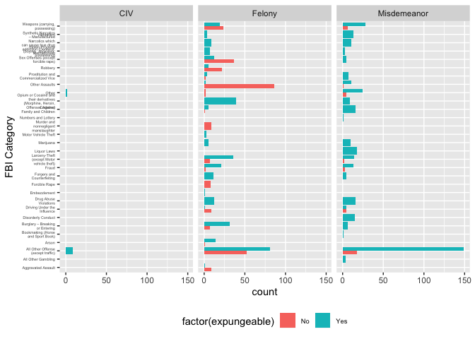<!-- -->

Felony vs Misdemeanor

``` r
ma_crimes %>% group_by(penalty_type) %>% summarise(n())
```

    ## # A tibble: 3 x 2
    ##   penalty_type `n()`
    ##   <chr>        <int>
    ## 1 CIV             11
    ## 2 Felony         601
    ## 3 Misdemeanor    425

``` r
fbi_exp %>% adorn_ns()
```

    ##                                                                                            fbi_category
    ##                                                                                     Aggravated Assault 
    ##                                                                                      All Other Gambling
    ##                                                                      All Other Offense (except traffic)
    ##                                                                                                   Arson
    ##                                                                       Bookmaking (Horse and Sport Book)
    ##                                                                         Burglary – Breaking or Entering
    ##                                                                                      Disorderly Conduct
    ##                                                                             Driving Under the Influence
    ##                                                                                   Drug Abuse Violations
    ##                                                                                            Embezzlement
    ##                                                                                           Forcible Rape
    ##                                                                              Forgery and Counterfeiting
    ##                                                                                                   Fraud
    ##                                                              Larceny-Theft (except Motor vehicle theft)
    ##                                                                                             Liquor Laws
    ##                                                                                               Marijuana
    ##                                                                                     Motor Vehicle Theft
    ##                                                                    Murder and nonnegligent manslaughter
    ##                                                                                     Numbers and Lottery
    ##                                                                    Offenses Against Family and Children
    ##                                      Opium or Cocaine and their derivatives (Morphine, Heroin, Codeine)
    ##                                                                                                   Other
    ##                                                                                          Other Assaults
    ##                                                                    Prostitution and Commercialized Vice
    ##                                                                                                 Robbery
    ##                                                                     Sex Offenses (except forcible rape)
    ##                                                        Stolen Property (buying , receiving, possessing)
    ##  Synthetic Narcotics – Manufactured Narcotics which can cause true drug addiction (Demerol, Methadones)
    ##                                                                                               Vandalism
    ##                                                                          Weapons (carrying, possessing)
    ##                                                                                                   Total
    ##         No       Yes       Total
    ##    9   (9)   1   (1)   10   (10)
    ##    0   (0)   4   (4)    4    (4)
    ##   70  (70) 239 (239)  309  (309)
    ##    1   (1)  14  (14)   15   (15)
    ##    0   (0)   1   (1)    1    (1)
    ##    7   (7)  37  (37)   44   (44)
    ##    0   (0)  15  (15)   15   (15)
    ##   14  (14)   6   (6)   20   (20)
    ##    0   (0)  28  (28)   28   (28)
    ##    0   (0)   1   (1)    1    (1)
    ##    8   (8)   0   (0)    8    (8)
    ##    0   (0)  16  (16)   16   (16)
    ##    5   (5)  34  (34)   39   (39)
    ##    9   (9)  50  (50)   59   (59)
    ##    0   (0)  18  (18)   18   (18)
    ##    0   (0)  15  (15)   15   (15)
    ##    0   (0)   3   (3)    3    (3)
    ##    9   (9)   0   (0)    9    (9)
    ##    0   (0)   1   (1)    1    (1)
    ##    1   (1)  21  (21)   22   (22)
    ##    0   (0)  48  (48)   48   (48)
    ##    7   (7)  27  (27)   34   (34)
    ##   87  (87)  13  (13)  100  (100)
    ##    2   (2)  11  (11)   13   (13)
    ##   22  (22)   5   (5)   27   (27)
    ##   37  (37)  17  (17)   54   (54)
    ##    0   (0)  10  (10)   10   (10)
    ##    0   (0)  20  (20)   20   (20)
    ##    0   (0)  17  (17)   17   (17)
    ##   30  (30)  47  (47)   77   (77)
    ##  318 (318) 719 (719) 1037 (1037)
